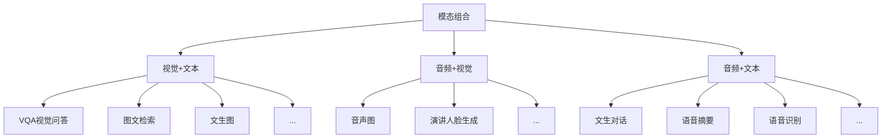
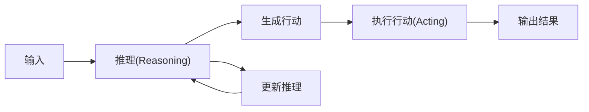

# 1. 大模型的演变

## 1.1. 人工智能的定义和子领域

人工智能按照技术实现的不同可被划分为多个子领域，各个子领域之间往往相互关联和影响。

- **人工智能**：人工智能是一个广泛涉及计算机科学、数据分析、统计学、机器工程、语言学、神经科学、哲学和心理学等多个学科的领域。

- **机器学习**：机器学习可以分为监督学习、无监督学习与强化学习

- **深度学习**：深度学习是机器学习的一个分支，主要使用神经网络模型（由多个隐藏层组成）对数据进行学习和表示。

- **生成式人工智能**：生成式人工智能又是深度学习中快速增长的子集，它们使用了大模型提供支持，在大量原始、未标记的数据基础上对深度学习模型进行预训练，使得机器能够“理解”语言甚至图像，并能够根据需要自动生成内容。

## 1.2. 机器学习

机器学习可以分为监督学习，无监督学习与强化学习，以教一个孩子区分不同的水果为例：

- **监督学习**的工作模式为：你拿着一个苹果和一个香蕉，告诉孩子：“这是苹果，它的形状是圆的，颜色通常是红色或绿色；这是香蕉，它的形状是长条形，颜色通常是黄色。”孩子会学习到特征与类别的对应关系，预测出新拿出的水果是苹果还是香蕉。

- **无监督学习**的工作模式为：你让孩子观察一堆水果，没有直接告诉他每一个水果的名称，而是鼓励他自己找出如何根据形状，颜色等属性将这些水果进行分组。

  > 在机器学习中，监督学习需要我们明确地告诉机器（或者说孩子）数据的特征（形状与颜色）是什么，监督学习需要在机器进行学习时人为提供数据对象的类别（如苹果或香蕉）。而无监督学习一般没有预设的类别标识，通过机器自动学习数据的分布并将相似的数据对象归为同类（如红色圆形是苹果）。

- **强化学习**的工作模式为：你不会直接教孩子苹果和香蕉的区别，而是每次展示一个水果让他进行判断。如果他判断正确，就给他一个奖励（比如一块糖果）；如果判断错误，则不给奖励。通过反复尝试和反馈，孩子会通过这种奖励机制逐渐学习到如何更准确地判断苹果和香蕉。这种学习过程中的关键在于孩子**需要在探索新的判断方法和利用已有经验之间找到平衡，以最大化获得奖励的次数**。

## 1.3. 深度学习

深度学习算法试图模拟人类大脑的工作方式，其灵感来源于神经生物学，它通过对大量数据的学习，自动提取出数据的高层次特征和模式，从而实现图像识别、语音识别、自然语言处理等任务。按照架构的不同，神经网络可以分为：卷积神经网络（CNNs）、循环神经网络（RNNs）、Transformer网络等等。同样是区分不同水果，这次你带着孩子去了超市，那里有各种不同的水果，你没有解释每种水果的特点，只是给孩子指出了哪些是苹果哪些是香蕉，他通过观察和比较，慢慢学会了辨认各种水果。在这个过程中，孩子的大脑（在这里比喻为深度学习模型）自动从复杂的视觉、嗅觉等信号中提取层次化的特征。比如圆形、条纹、颜色深浅、气味等，从而达到识别水果的目的。

## 1.4. LLM

<div align=center>
    </br><center></center>
</div>

# 2. 大模型的使用与训练

## 2.1. 大模型的使用

大模型的使用方法非常简单，我们可以将问题直接向大模型提出需求，就能获得生动翔实的答复。例如：请从技术领先、稳定可靠、安全合规这三点来介绍我们为什么要使用大模型（查询专业知识可以启用知识库检索功能，提升知识问答准确率）

> 🔔在大模型的使用中，一个非常重要的点是提示工程（prompt engineering）。如何优化prompt使得LLM的回答更加有效是一个非常重要的点。

## 2.2. 大模型的训练

大模型的训练整体上分为三个阶段：

1. 预训练（Pre-training）
2. SFT（Supervised Fine-Tuning，监督微调）
3. RLHF（Reinforcement Learning from Human Feedback，基于人类反馈的强化学习）

<div align=center>
    </br><center></center>
</div>

### 2.2.1. 预训练

预训练的过程类似于从婴儿成长为中学生的阶段，在这个阶段我们会学习各种各样的知识，我们的语言习惯、知识体系等重要部分都会形成。对于大语言模型来说，在这个阶段，它会通过大规模语料学习语言的<font color='red'><b>统计模式和共现关系</b></font>，并**间接获取大量的常识性知识**。

然而，预训练模型的主要目标是通过预测下一个词或填充缺失的词，来学习文本的结构和分布规律，而不是理解人类的意图。例如，如果我们向一个仅经过预训练的模型提问：“埃菲尔铁塔在哪个国家？”，它可能会生成一个类似语料中出现过的高概率文本，而不一定严格按照提问作答。因此，我们需要进一步训练模型，使其能够更好地遵循人类指令进行回答，这个步骤就是 SFT（监督微调）。

> 😐预训练（Pre-training）的主要目的是让模型学习语言的通用规律和结构。

**预训练的核心目标**：

- **学习语言模式**：预训练模型通过在大规模文本数据上进行训练，学习语言的语法、语义和上下文关系。例如，它会学习到“猫”和“老鼠”之间的关系，或者“喜欢”和“讨厌”是反义词。
- **生成自然语言**：预训练模型能够生成符合语言习惯的文本，比如回答问题、写文章、生成对话等。
- **提供通用语言能力**：预训练模型为后续的微调（如SFT）或强化学习（如RLHF）提供了一个强大的语言基础。

### 2.2.2. SFT（Supervised Fine-Tuning，监督微调）

#### 2.2.2.1. SFT 的作用

SFT（Supervised Fine-Tuning，监督微调）的过程类似于一个学生在掌握基础知识后，进一步接受系统的考试训练，使其不仅能够学习知识，还能按照标准答案回答问题。在这个阶段，我们会学习如何更符合考试要求进行作答，而不仅仅是掌握知识本身。  

对于大语言模型来说，SFT 主要是通过 **带有人工标注的高质量数据** 来优化模型，使其学会 **按照人类的指令进行回答**，而不是仅仅根据语料生成高概率的文本。例如，在预训练阶段，模型可能会根据概率补全文本，但经过 SFT 之后，它更倾向于直接回答问题。  

在监督微调完成后，模型通常能按照人类意图回答问题。例如，当我们问 SFT 过的模型 **“埃菲尔铁塔在哪个国家？”** 时，它大概率会直接回答 **“法国”**，而不会像预训练阶段那样倾向于生成一个类似的句子（如“东方明珠在哪个城市？”）。这意味着模型已经具备了基本的**指令跟随能力**，可以进行更符合人类预期的对话。  

然而，**SFT 主要解决的是“指令跟随”问题，而不是“价值对齐”问题**。经过 SFT 的模型虽然能按照指令回答，但仍然可能输出 **不符合人类价值观的内容**，比如涉黄、涉政、涉暴或种族歧视性言论。这时候，我们需要进一步通过 **RLHF（基于人类反馈的强化学习）** 来优化模型，使其不仅能正确回答问题，还能符合人类的伦理和价值观。  

#### 2.2.2.2. **SFT 的主要作用和优势**

##### 2.2.2.2.1. 提高任务性能

- **指令跟随能力**：SFT 使模型能够按照人类的指令进行准确回答，而不是简单地预测高概率文本。  
- **针对性优化**：预训练模型虽然具备强大的语言能力，但其通用性可能无法满足特定任务的高精度需求。SFT 通过带有标注的训练数据，使模型更好地理解任务细节，提高回答的精准度。  
- **减少错误**：通过监督学习，模型可以学习到更符合人类期望的答案，从而减少错误率。  

##### 2.2.2.2.2. 适应特定领域

- **领域适应性**：不同领域（如医疗、法律、金融等）的语言风格和术语有所不同。SFT 可以使用特定领域的标注数据对模型进行微调，使其更好地理解和生成该领域的语言。  
- **行业特定任务**：例如，在医疗领域，模型可以通过 SFT 学习医学术语和诊断逻辑；在金融领域，模型可以学习金融报告的格式和分析方法。  

##### 2.2.2.2.3. 优化模型输出

- **增强可控性**：通过标注数据，可以引导模型按照特定的方式进行回答，例如更正式、更简洁或更口语化。  
- **减少有害内容（部分）**：虽然 SFT 可以在一定程度上减少有害内容（例如通过过滤数据），但它 **不能完全解决安全性问题**，这需要进一步的 RLHF 训练。  

##### 2.2.2.2.4. 提高效率

- **减少训练成本**：与从头训练一个新模型相比，SFT 只需要在预训练模型的基础上进行微调，大幅减少计算资源和时间成本。  
- **快速迭代**：SFT 使得模型能够快速适应新的任务需求，便于持续优化和迭代。  

##### 2.2.2.2.5. 增强模型的可解释性

- **明确学习目标**：通过带有人工标注的数据，使模型的学习目标更加明确，有助于理解其决策过程。  
- **便于调试**：SFT 训练过程中可以更容易发现模型的错误，并进行针对性的优化。  

##### 2.2.2.2.6. 具体应用场景

- **文本分类**：对标注的文本数据进行训练，使模型能够进行情感分析、主题分类等任务。  
- **问答系统**：使用问答对（QA 数据）进行训练，使模型能够更准确地回答问题。  
- **文本生成**：通过特定风格的标注数据训练模型，使其生成符合要求的文本（如新闻报道、摘要生成、创意写作等）。  

#### 2.2.2.3. 总结

SFT 的主要作用是 **让预训练模型更好地遵循人类指令**，使其适应特定任务，提高回答的准确性，并优化模型的输出风格。虽然 SFT 可以在一定程度上减少有害内容，但它 **并不能完全解决安全性和价值对齐问题**，因此通常需要结合 **RLHF（基于人类反馈的强化学习）** 进行进一步优化。

### 2.2.3. RLHF（Reinforcement Learning from Human Feedback，基于人类反馈的强化学习）

#### 2.2.3.1. RLHF 的作用

RLHF（Reinforcement Learning from Human Feedback，基于人类反馈的强化学习）的过程类似于一个大学生步入职场的阶段。在这个阶段，我们不仅仅是完成工作，还会不断根据 **领导、客户和同事的反馈** 来优化自己的工作方法，以便在职场上获得更好的评价和机会。  

对于大模型来说，RLHF 也是一个**基于反馈不断优化的过程**。在这一阶段，模型会针对同一个问题生成多个回答，而**人类标注者会对这些回答进行评分**，然后模型会使用强化学习算法（如 **PPO，近端策略优化**）来调整自身策略，以最大化未来的奖励。这使得模型不仅能回答问题，还能更加符合 **人类的价值观和偏好**，减少潜在的偏见和有害内容。  

##### 2.2.3.1.1. 优化模型输出

- **提高内容质量**：通过人类对模型生成内容的评分或排序，RLHF 使模型能够产生更高质量、更符合人类期望的文本。  
- **增强语境理解**：RLHF 可以帮助模型更好地捕捉语言的细微差别，包括情感色彩、文化背景等，从而提升其对复杂语境的理解能力。  

##### 2.2.3.1.2. 提升用户体验

- **改善交互体验**：在对话系统、智能客服等应用中，RLHF 使模型能够生成更自然、更贴近用户需求的回复，从而提升用户的满意度。  
- **个性化服务**：通过人类反馈，模型可以学习不同用户的偏好，从而提供更个性化的回答或建议。  

##### 2.2.3.1.3. 减少偏见和有害内容

- **纠正潜在偏见**：人类反馈可以帮助模型识别和减少生成内容中的偏见，提高模型的公平性和安全性。  
- **避免有害信息**：通过强化学习，模型可以被训练成避免生成有害、误导性或攻击性的内容，从而提升其安全性。  

##### 2.2.3.1.4. 提升模型的灵活性和多样性

- **增加生成内容的多样性**：RLHF 通过不断引入新的反馈信息，使模型能够探索不同的表达方式，避免千篇一律的回答。  
- **适应不同场景**：RLHF 使模型更好地适应多种应用场景，如文本生成、对话系统、图像生成、机器人控制等。  

##### 2.2.3.1.5. 实现价值观对齐

- **对齐人类价值观**：RLHF 通过奖励模型学习人类的偏好，使模型的行为与人类的伦理标准保持一致，从而更好地服务于人类。  
- **持续优化**：RLHF 形成了**闭环反馈系统**，模型可以根据人类的持续反馈不断优化，使其在长期使用中更符合用户的需求和道德标准。  

##### 2.2.3.1.6. 应用场景广泛

- **自然语言处理**：包括对话系统、文本生成、文本摘要等任务。  
- **智能决策**：如机器人控制、自动驾驶、资源管理等。  
- **推荐系统**：通过用户反馈优化推荐内容，提高推荐的准确性和个性化程度。  
- **图像与多媒体**：优化图像生成和编辑，使其更符合人类审美。  

### 2.2.4. 总结

RLHF 通过**引入人类反馈作为奖励信号**，结合**强化学习算法**，能够显著提升模型的性能，使其更加符合人类的期望和价值观。尽管 RLHF 在实施过程中可能面临一些挑战，例如 **依赖大量人工标注、难以平衡不同价值观以及强化学习的稳定性问题**，但它仍然是当前**提升 AI 交互质量和价值观对齐的关键技术之一**。  

# 3. 大模型的特点和分类

## 3.1. 基础大模型的特点

1. **规模和参数量大**：大模型通过其庞大的规模（拥有从数亿到数千亿级别的参数数量）来捕获复杂的数据模式，使得它们能够理解和生成极其丰富的信息。
2. **广泛数据集的预训练**：大模型使用大量多样化的数据进行预训练，以学习广泛的知识表示，能够掌握语言、图像等数据的通用特征。
3. **适应性和灵活性强**：模型具有很强的适应性和灵活性，能够通过微调（fine-tune）或少样本学习高效地迁移到各种下游任务，有很强的跨域能力。
4. **计算资源需求大**：巨大的模型规模带来了高昂的计算和资源需求，包括但不限于数据存储、训练时间、能量消耗和硬件设施。

## 3.2. 大模型的分类

按照应用场景，大模型可以大致分为：
1. 大语言模型(LLM)
2. 多模态模型
   1. 计算机视觉模型
   2. 音频处理模型
   3. 视频处理模型
   4. ...

### 3.2.1. 大语言模型（Large Language Model）

这类大模型专注于自然语言处理（NLP），旨在处理语言、文章、对话等自然语言文本。它们通常基于深度学习架构（如Transformer模型），经过大规模文本数据集训练而成，能够捕捉语言的复杂性，包括语法、语义、语境以及蕴含的文化和社会知识。语言大模型典型应用包括文本生成、问答系统、文本分类、机器翻译、对话系统等。示例包括：

1. **GPT系列（OpenAI）**：如GPT-3、GPT-3.5、GPT-4等。
2. **Bard（Google）**：谷歌推出的大型语言模型用于提供信息丰富的、有创意的文本输出。
3. **通义千问（阿里云）**：阿里云自主研发的超大规模的语言模型。

### 3.2.2. 多模态模型

多模态大模型能够同时处理和理解来自不同感知通道（如文本、图像、音频、视频等）的数据，并在这些模态之间建立关联和交互。它们能够整合不同类型的输入信息，进行跨模态推理、生成和理解任务。多模态大模型的应用涵盖视觉问答、图像描述生成、跨模态检索、多媒体内容理解等领域。



# 4. 大模型的工作流程

## 4.1. 分词化（Tokenization）与词表映射

分词化（Tokenization）是自然语言处理（NLP）中的重要概念，它是将段落和句子分割成更小的分词（token）的过程。

举一个实际的例子，以下是一个英文句子：

```
I want to study ACA.
```

为了让机器理解这个句子，对字符串执行分词化，将其分解为独立的单元。使用分词化，我们会得到这样的结果：

```
['I', 'want', to', study”, 'ACA', '.']
```

将一个句子分解成更小的、独立的部分可以帮助计算机理解句子的各个部分，以及它们在上下文中的作用，这对于进行大量上下文的分析尤其重要。分词化有不同的粒度分类：

- **词粒度（Word-Level Tokenization）分词化**：如上文中例子所示，适用于大多数西方语言，如英语、法语。
- **字符粒度（Character-Level）分词化**：是中文最直接的分词方法，它是以单个汉字为单位进行分词化。
- **子词粒度（Subword-Level）分词化**：它将单词分解成更小的单位，比如词根、词缀等。这种方法对于处理新词（比如专有名词、网络用语等）特别有效，因为即使是新词，它的组成部分（子词）很可能已经存在于词表中了。

不管是哪种分词方法，得到的每一个结果我们都称之为`token`，每一个`token`都会通过预先设置好的词表，映射为一个`tokenid`，这是`token`的“身份证”，一句话最终会被表示为一个元素为`tokenid`的列表，供计算机进行下一步处理。

> 😎**在线Token展示网站**：[GPT tokenizer playground](https://gptforwork.com/tools/tokenizer)

<div align=center>
    </br><center></center>
</div>
## 4.2. 文本生成

### 4.2.1. 运行原理

大语言模型的工作概括来说是根据给定的文本预测下一个`token`。对我们来说，看似像在对大模型提问，但实际上是给了大模型一串提示文本（prompt），让它可以对后续的文本进行推理。大模型的推理过程不是一步到位的，当大模型进行推理时，它会基于现有的`token`，根据**概率最大原则**预测出下一个最有可能的`token`，然后将该预测的token加入到输入序列中，并将更新后的输入序列继续输入大模型预测下一个`token`，这个过程叫做自回归。直到输出特殊`token`（如`<EOS>`，`end of sentence`，专门用来控制推理何时结束）或输出长度达到阈值。

<div align=center>
    </br><center></center>
</div>  

### 4.2.2. 文本生成常见特殊符号表

| 符号          | 代表名称（全称）          | 作用                                                         |
| ------------- | ------------------------- | ------------------------------------------------------------ |
| `<BOS>`       | **Beginning of Sequence** | **序列开始符号**，用于指示文本序列的起始。某些模型（如 GPT）可能不使用此符号，而是隐式地假设开头。 |
| `<EOS>`       | **End of Sequence**       | **序列结束符号**，用于指示文本序列的结尾，模型在遇到该符号时可能会停止生成。 |
| `<PAD>`       | **Padding Token**         | **填充符号**，用于对齐不同长度的输入，使它们具有相同的长度（特别是在批量处理时）。 |
| `<UNK>`       | **Unknown Token**         | **未知词符号**，用于替代词汇表中未包含的单词或子词。         |
| `<SEP>`       | **Separator Token**       | **分隔符**，用于区分不同的段落、句子或对话轮次（如 BERT 在 NSP 任务中使用）。 |
| `<CLS>`       | **Classification Token**  | **分类符号**，BERT 等模型用于文本分类任务，通常位于序列的开头，最终的隐藏状态可用于分类任务。 |
| `<MASK>`      | **Mask Token**            | **掩码符号**，在 BERT 训练中用于“掩盖”部分单词，让模型预测原始单词。 |
| `<EOT>`       | **End of Turn**           | **对话轮次结束符**，用于多轮对话，指示当前对话轮次的结束。   |
| `<EOD>`       | **End of Document**       | **文档结束符**，用于区分不同的文档，特别是在多文档处理任务中。 |
| `<S>`         | **Start Token**           | **起始符号**，类似于 `<BOS>`，但在某些模型（如 T5）中使用。  |
| `</s>`        | **End Token**             | **结束符号**，在某些 Transformer 模型（如 T5、BART）中用于标记输入或输出的结束。 |
| `<USER>`      | **User Token**            | **用户标识符**，用于区分用户输入，常用于对话模型。           |
| `<ASSISTANT>` | **Assistant Token**       | **助手标识符**，用于区分 AI 生成的回答，常用于 AI 对话模型（如 ChatGPT）。 |
| `<SYSTEM>`    | **System Token**          | **系统指令符**，用于提供特定的系统指令或控制 AI 行为（如 OpenAI API 的 system prompt）。 |

### 4.2.3. 不同 LLM 的特殊符号示例

不同的 **LLM（大语言模型）** 可能会使用不同的特殊符号。例如：
- **GPT 系列（如 GPT-3.5、GPT-4）** 可能不会使用 `<BOS>`，但可能使用 `</s>` 作为结束符。
- **BERT** 使用 `<CLS>` 进行分类任务，使用 `<SEP>` 作为句子分隔符。
- **T5** 使用 `<S>` 作为开始符，`</s>` 作为结束符。
- **对话模型（如 ChatGPT）** 可能会使用 `<USER>` 和 `<ASSISTANT>` 来标记不同的角色。

# 5. Agents

> ⚠️虽然Agent被翻译为智能体，但如果我们想要更好的理解Agent，我们最好是将其翻译为：<font color='red'><b>基于LLM的代理(人)</b></font>

## 5.1. Agents的定义

在 **大语言模型（LLM, Large Language Model）** 相关的应用中，**Agent（智能体）** 指的是一个基于 LLM 驱动的 **自主决策系统**，它能够根据 **环境输入** 进行推理、规划，并采取适当的行动来解决任务。  

换句话说，**Agent 就是一个利用 LLM 作为核心推理引擎，并结合工具（Tools）、记忆（Memory）、规划（Planning）等能力的智能系统**，它不仅可以回答问题，还可以 **调用 API、执行代码、查询数据库、与外部环境交互**，甚至可以自主拆解复杂任务并逐步完成。  

---

🔥 **LLM Agent = 大语言模型（LLM）+ 记忆（Memory）+ 工具调用（Tools）+ 规划（Planning）+ 执行动作（Actions）**。  

LLM 本身擅长 **语言理解和生成**，但 **Agent 让 LLM 具备了真正的“行动力”**，可以执行复杂任务、调用 API、自动化工作流，成为一个真正的智能助手！  

### 5.1.1. LLM 与普通 Agent 的区别

| **类别**             | **LLM**（大语言模型）              | **Agent**（智能体）                            |
| -------------------- | ---------------------------------- | ---------------------------------------------- |
| **核心功能**         | 生成和理解自然语言                 | 自主决策，执行任务                             |
| **是否有记忆**       | 通常无长期记忆（但可使用外部存储） | 可结合记忆组件，存储和检索信息                 |
| **是否调用工具**     | 仅基于内部知识回答                 | 可调用 API、数据库、计算器、搜索引擎等外部工具 |
| **是否具备规划能力** | 仅基于单步推理                     | 可进行多步推理、拆解任务、规划执行             |
| **应用场景**         | 问答、翻译、文本生成               | 自动化任务、数据采集、智能决策                 |

### 5.1.2. LLM Agent 的核心组成

一个完整的 **LLM Agent** 通常由以下几个部分组成：

### 5.1.3. LLM（大语言模型）

- 充当 **智能体的核心大脑**，负责理解问题、推理、生成响应。  
- 例如：GPT-4、Claude、Gemini、Mistral 等。  

### 5.1.4. 记忆（Memory）

- **短期记忆**（Session Memory）：存储当前对话上下文，便于连贯对话。  
- **长期记忆**（Long-term Memory）：存储跨会话的信息，如用户偏好、历史记录等（可结合向量数据库，如 ChromaDB、FAISS）。  

### 5.1.5. 工具（Tools / Plugins / API）

- 使 **Agent 具备超越 LLM 本身的能力**，例如：  
  - 🔍 **搜索引擎**（Google、Bing） → 获取最新信息  
  - 📊 **计算器** → 进行数学计算  
  - 📅 **日历 & 任务管理** → 安排日程  
  - 🖥️ **代码执行** → 运行 Python 代码  
  - 🏦 **数据库查询** → 查询企业内部数据  

### 5.1.6. 规划（Planning / Multi-step Reasoning）

- **单步推理（Single-step Reasoning）**：普通 LLM 直接回答问题。  
- **多步推理（Multi-step Reasoning）**：Agent 可以**拆解复杂任务**，逐步执行。  
- **自我反思（Self-reflection）**：Agent 可以检测自己的错误，并调整策略。  

### 5.1.7. 执行动作（Action Execution）

- Agent **不仅仅是回答问题**，还可以执行任务，比如：  
  - 预订航班、发送邮件、生成报表、批量处理数据等。  

## 5.2. LLM Agent 的应用场景

| **应用领域**            | **Agent 作用**                             |
| ----------------------- | ------------------------------------------ |
| **智能客服**            | 处理客户咨询、自动回复、升级问题到人工客服 |
| **自动化研究助手**      | 读取论文、总结内容、搜索最新研究成果       |
| **代码助手（AI 编程）** | 生成代码、调试代码、执行代码并优化         |
| **金融分析**            | 解析市场趋势、生成投资报告、自动化交易     |
| **业务流程自动化**      | 处理订单、管理库存、自动化 CRM 操作        |
| **个人助理**            | 安排日程、预订餐厅、提醒任务               |

## 5.3. Agents流程图

<div align=center>
    </br><center></center>
</div>


- **规划（Planning）**：
	- 智能体会把大型任务**分解为子任务**，并规划执行任务的流程
	- 智能体会对任务执行的过程进行**思考（Reflection）和反思（Self-Critics）**，从而决定是继续执行任务，或判断任务完结并终止运行
- **记忆（Memory）**：
	- 短期记忆，是指在执行任务的过程中的上下文，会在子任务的执行过程产生和暂存，在任务完结后被清空。
	- 长期记忆是长时间保留的信息，一般是指外部知识库，通常用向量数据库来存储和检索。
- **工具使用（Tools）**：为智能体配备工具API，比如：计算器、搜索工具、代码执行器、数据库查询工具等。有了这些工具API，智能体就可以是物理世界交互，解决实际的问题。
- **执行（Action）**：根据规划和记忆来实施具体行动，这可能会涉及到与外部世界的互动或通过工具来完成任务。

## 5.4. FAQ

### 5.4.1. ChatGPT3.5是否为Agent

🤔 𝑸𝒖𝒆𝒔𝒕𝒊𝒐𝒏：我记得在2023年1月份的时候，ChatGPT3.5出来了，那么ChatGPT3.5是LLM还是Agent？

🥳 𝑨𝒏𝒔𝒘𝒆𝒓：ChatGPT-3.5 本质上是一个 LLM（大语言模型），而不是一个完整的 Agent（智能体）。

 ChatGPT-3.5 **基于 GPT-3.5**，它的主要能力是 **自然语言理解（NLU）和自然语言生成（NLG）**，本质上是一个 **纯 LLM**，并没有额外的工具调用、长期记忆、多步规划等 Agent 级别的能力。  换句话说，**ChatGPT-3.5** 只是 **一个 LLM 的封装产品**，它可以进行对话，但其本质仍是 **一个大规模 Transformer 语言模型**。  证据如下：

1. ChatGPT-3.5 没有工具调用（Tools）：**LLM 只能基于内部知识回答问题**，而 **Agent 能够调用外部工具（API、数据库、搜索引擎等）** 来扩展能力。  
	- ChatGPT-3.5 **在 2023 年 1 月时** 不能联网搜索、不能执行代码、不能调用 API。  
	- 但后来 OpenAI **在 2023 年 9 月推出了支持联网搜索、代码执行和插件的 GPT-4 Turbo**，这才让 ChatGPT 具备了一定的 Agent 能力。  

2. ChatGPT-3.5 没有长期记忆（Memory）：

	- 纯 LLM **没有记忆能力**，每次对话都是独立的，只能依赖 **上下文窗口（Context Window）** 维持短期记忆。  

	- **Agent 通常具备长期记忆**，可以存储和检索历史信息，而 OpenAI **直到 2024 年才逐步给 ChatGPT 增加长期记忆功能**。  

3. ChatGPT-3.5 不能自主规划任务（Planning）

	- **LLM 只能进行单步推理（One-step reasoning）**，它是基于**概率生成**文本，而不是主动拆解任务。  

	- **Agent 具备多步推理和任务规划能力**，可以拆解复杂问题，并逐步执行。  

### 5.4.2. ChatGPT3.5和ChatGPT3.5-Turbo的区别

🤔 𝑸𝒖𝒆𝒔𝒕𝒊𝒐𝒏：ChatGPT3.5和ChatGPT3.5-Turbo有什么区别？为什么要有Turbo？

🥳 𝑨𝒏𝒔𝒘𝒆𝒓： ChatGPT-3.5 和 ChatGPT-3.5-Turbo **都是基于 GPT-3.5 架构的模型**，但 **Turbo 版本进行了优化，使其更加高效和低成本**。  

| **对比项**     | **ChatGPT-3.5** | **ChatGPT-3.5-Turbo**                    |
| -------------- | --------------- | ---------------------------------------- |
| **模型架构**   | GPT-3.5         | GPT-3.5（优化版）                        |
| **推理速度**   | 较慢            | 🚀 **更快**（Turbo 代表优化后的高效推理） |
| **计算成本**   | 高              | 💰 **更便宜**（OpenAI 优化了计算消耗）    |
| **API 价格**   | 更贵            | 💲 **更低成本**（API 使用时更便宜）       |
| **上下文长度** | **4096 tokens** | **16,385 tokens**（更长的上下文）        |
| **生成质量**   | 标准            | ⚡ **可能稍有不同，但质量相近**           |
| **可用性**     | 可能更稳定      | ✅ **更适合大规模 API 调用**              |

### 5.4.3. ChatGPT变为Agent

🤔 𝑸𝒖𝒆𝒔𝒕𝒊𝒐𝒏：什么时候 ChatGPT 具备 Agent 能力？

🥳 𝑨𝒏𝒔𝒘𝒆𝒓：ChatGPT **从 GPT-3.5 到 GPT-4 逐步增加了 Agent-like（智能体化）的能力**。  

| **时间**    | **版本**        | **是否是 LLM？** | **是否是 Agent？** | **关键特性**                           |
| ----------- | --------------- | ---------------- | ------------------ | -------------------------------------- |
| **2023.01** | ChatGPT-3.5     | ✅ 纯 LLM         | ❌ 不是 Agent       | 只能对话，无工具调用、无长期记忆       |
| **2023.09** | ChatGPT-4 Turbo | ✅ LLM            | ⚠️ 部分 Agent       | 支持联网、代码执行、插件               |
| **2024.01** | ChatGPT-4 Turbo | ✅ LLM            | ⚠️ 更像 Agent       | 增加长期记忆（Memory）                 |
| **2024.02** | ChatGPT-4 Turbo | ✅ LLM            | ✅ 具备 Agent 能力  | 具备多工具调用、长期记忆、任务规划能力 |

在 **2023 年 1 月的 ChatGPT-3.5 还是 LLM**，但到了 **2024 年，ChatGPT-4 Turbo 逐步具备了 Agent 的特性**，尤其是 **多工具调用、长期记忆、任务规划** 这些关键能力的引入，使得它越来越像一个真正的智能体（Agent）。

## 5.5. 典型的 LLM Agent 框架

### 5.5.1. LangChain

- **LangChain** 是目前最流行的 **LLM Agent 框架**，它可以帮助开发者快速构建智能体，支持：
  - **Memory（记忆）**
  - **Tools（工具调用，如搜索引擎、API 集成）**
  - **Chains（多步推理）**
  - **Agents（智能体，可自主决策）**

### 5.5.2. AutoGPT & BabyAGI

- **AutoGPT**：允许 LLM **自主制定计划、执行任务**，无需人工干预。  
- **BabyAGI**：一个轻量级的 **AI 任务执行框架**，可以持续迭代任务，适用于自动化研究、数据采集等。  

## 5.6. Agents决策

### 5.6.1. 流程图

<div align=center>
    </br><center></center>
</div>
- **Perception（感知）**：对 **prompt**（输入）进行解析，提取关键信息，并将处理后的输入传递给 **Agent**。  
- **Planning（规划）**：Agent 根据感知到的信息，对任务进行拆解，制定执行步骤。  
- **Action（执行）**：按照规划的步骤，执行具体的子任务。  
- **Observation（观察）**：评估执行结果，如果结果符合预期，则继续循环；否则，调整规划并重新执行。  

---

### 5.6.2. **生活示例：智能家居系统**

假设我们有一个智能家居系统，它的任务是根据家庭成员的需求调节室内环境，比如 **温度和灯光**。  

#### 5.6.2.1. **1. 感知（Perception）**

- 家庭成员通过语音助手说：“我感觉有点冷，能不能把温度调高一些？”  
- 智能家居系统通过 **语音识别和情感分析** 解析用户的需求，识别出关键词 **“冷”**、**“调高温度”**。  
- 通过感知，系统确定用户希望 **提高室温**。  

#### 5.6.2.2. **2. 规划（Planning）**  
- 系统根据当前环境数据和用户需求，制定操作计划：  
  - **检查当前室温**（例如 20℃）。  
  - **参考用户偏好**（例如用户习惯的温度范围 22℃-24℃）。  
  - **决定调整温度的幅度**（例如升高至 23℃）。  
  - **执行温度调整，并向用户反馈**。  

#### 5.6.2.3. **3. 执行（Action）**  
- 系统执行规划的任务：  
  - 读取当前温度，发现室温为 20℃。  
  - 调整智能空调，将温度设定为 23℃。  
  - 通过语音助手反馈用户：“已将温度调高至 23℃，请稍等，温度正在上升。”  

#### 5.6.2.4. **4. 观察（Observation）**  
- **持续监测室内温度和用户反馈**：  
  - **如果用户在几分钟后表示“现在温度刚刚好”**，系统确认环境调整成功，并记录该用户的温度偏好。  
  - **如果用户仍然觉得冷**，系统会重新规划，例如：  
    - 进一步升温至 24℃。  
    - 检查是否需要调整空调模式（如切换到暖风模式）。  
    - 询问用户是否需要额外的调节措施（如开启智能电暖器）。    

## 5.7. 规划

规划可以理解为**观察、思考和决策的过程**。如果用人类的思维模式类比，当我们接到一个任务时，通常会经历以下几个阶段：  

1. 先思考如何完成这个任务，分析其核心目标和关键步骤。  
2. 审视手头拥有的工具，并思考如何**高效地**使用这些工具来达成目标。  
3. 将任务拆解为更小的子任务，使其更易执行，就像创建思维导图一样。  
4. 在执行过程中，不断**反思和优化**，吸取经验以完善后续步骤。  
5. 评估任务的执行情况，并思考何时可以终止任务。  

这种**规划能力**是人类智慧的重要组成部分，我们希望智能体（Agent）也具备类似的思维模式。为了赋予智能体这种能力，可以利用**LLM 提示工程（Prompt Engineering）**，引导其按照上述方式思考。

### 5.7.1. 子任务分解

通过 LLM，使智能体能够**将大型任务拆解为更小、更可控的子任务**，从而更高效地完成复杂任务。这种方法可以降低任务的复杂度，减少错误累积，并提高执行效率。例如，在编写代码、数据分析或决策优化等任务中，子任务分解可以帮助 LLM 更系统地处理问题。 

### 5.7.2. 思维链（Chain of Thought, CoT）

思维链是一种**标准的提示技术（Prompting Technique）**，能够显著提升 LLM 解决复杂问题的能力。通过鼓励 LLM **“逐步思考”（Think Step by Step）**，它可以将复杂问题拆解成多个步骤，按照逻辑推理一步步解决，从而提高最终答案的准确性。这种方法通常用于数学推理、逻辑分析和文本推理任务。  

### 5.7.3. 思维树（Tree of Thought, ToT）

思维树是对思维链（CoT）的进一步扩展。在 CoT 中，LLM 采用**线性推理方式**，即按照固定顺序逐步推导答案。而在 ToT 中，LLM 在每个推理步骤中可以**生成多个可能的推理分支**，形成类似树状结构的探索路径。  

为了优化推理结果，ToT 采用**启发式搜索算法**，例如：  
- **广度优先搜索（BFS）**：探索多个可能的推理路径，确保找到最优解。  
- **深度优先搜索（DFS）**：深入探索某条推理路径，适用于复杂但目标明确的问题。  
- **蒙特卡洛树搜索（MCTS）**：用于决策优化，广泛应用于 AI 博弈任务（如 AlphaGo）。  

**ToT 的核心优势在于：**

- 它允许 LLM **并行探索多个解决方案**，而不是局限于单一推理路径。  
- 通过启发式评估，智能体可以**选择最优分支**，提高推理的鲁棒性和准确性。  
- 适用于需要多角度分析、创造性思考或多步优化的问题，如**自动编程、决策优化、科学研究等**。  

### 5.7.4. 提示技术对比

<div align=center>
    </br><center></center>
</div> 

不同的提示技术在 LLM 任务执行中有不同的优势和限制，以下是它们的对比：  

| **方法**                              | **描述**                                       | **优点**                                           | **缺点**                                   |
| ------------------------------------- | ---------------------------------------------- | -------------------------------------------------- | ------------------------------------------ |
| **(a) 输入-输出提示（IO Prompting）** | 单纯的输入-输出模式，LLM 不进行中间推理        | 直接、易实现，适用于简单任务                       | 处理复杂任务时容易出错，缺乏推理能力       |
| **(b) 思维链提示（CoT）**             | 让 LLM 按照**线性逻辑**拆解问题，逐步推理      | 提高模型的逻辑推理能力，适用于数学、逻辑推理等任务 | 仍然是**单一路径**推理，无法探索多种可能性 |
| **(c) 自一致性思维链（CoT-SC）**      | 生成**多条思维链**，最终选择最一致的答案       | 通过多个推理路径提高答案的可靠性                   | 计算成本更高，需要多次推理                 |
| **(d) 思维树（ToT）**                 | 生成**多个推理分支**，并采用搜索算法选择最优解 | 适用于复杂决策任务，能够探索多个可能的解决方案     | 计算资源消耗大，搜索算法设计较复杂         |

### 5.7.5. 反思与改进

Agent 需要对过去的行动进行**自我反思和改进**，通过识别错误、调整策略，从而提升任务执行的质量。  

在实际任务中，试错是不可避免的，而**自我反思**在这个过程中起到了关键作用。它允许 Agent **从过去的经验中学习，优化未来的决策**，从而不断提升能力。  

反思是一种**更高层次的认知过程**，它通常是**周期性触发**的。当 Agent 感知到的重要事件积累到一定程度时，它会触发反思机制。这类似于人类在做重大决策前的**深思熟虑**，确保行动的合理性和优化程度。  

---

🤔 𝑸𝒖𝒆𝒔𝒕𝒊𝒐𝒏：反思与改进与Agent运行过程的“Thought”和“Observation”有什么联系？

🥳 𝑨𝒏𝒔𝒘𝒆𝒓：反思与改进（Reflection & Improvement）与 **Agent 运行过程中的 “Thought” 和 “Observation”** 关系密切，主要体现在以下几个方面：  

<font color='blue'><b>【“Thought” 反映了 Agent 的思考过程】</b></font>

在 **Agent 运行流程**（如 ReAct 框架）中，**“Thought”** 代表智能体的推理过程，即它在采取行动之前如何分析问题、制定策略。  

- **“Thought” 是智能体的即时思考（即短期推理）**：它基于当前的上下文、知识和工具，决定下一步行动。  

- 在 ReAct 框架中，Thought 可能表现为：
  - **分析当前任务**（例如：“我需要搜索什么关键词？”）。
  - **思考下一步行动**（例如：“应该调用哪个 API？”）。
  - **预测可能的结果**（例如：“如果搜索这个关键词，我可能会得到什么信息？”）。  

但是，**“Thought” 不是深度的自我反思**，它通常是**局部的、短期的、面向当前任务的思考**。  

<font color='blue'><b>【“Observation” 反馈任务执行的结果】</b></font>

在智能体执行某个 **Action（行动）** 之后，它会收到外部环境的反馈，这个反馈被称为 **“Observation”**。  

- **“Observation” 是 Agent 获取的环境反馈**，它可以来自：
  - 工具调用的返回信息（如搜索引擎的查询结果）。  
  - 代码执行的输出（如计算或 API 响应）。  
  - 用户的直接反馈（如用户的文本回复）。  


- **Observation 的作用**
  - **评估当前行动是否成功**（例如：“搜索到的内容是否足够？”）。  
  - **决定下一步思考或行动**（例如：“如果搜索无效，我是否需要换个关键词？”）。  

**但 Observation 只是一个即时反馈，它不会自动触发深层次的反思和长期优化**。因此，仅靠 Observation，Agent 可能会在相似的错误模式中不断循环，而无法真正改进。  

<font color='blue'><b>【反思（Reflection）是基于 Thought + Observation 的长期优化】</b></font>

反思（Reflection）是对 **多个 Thought 和 Observation 进行更高层次的总结和改进**，它超越了单次任务的执行，而是用于**优化 Agent 的整体行为模式**。  

- **反思的触发条件**
  
  - 当 Agent **多次失败**，或者任务执行效果不理想时，它会**回顾过去的 Thought 和 Observation**，总结经验。  
  
  - 例如，在 ReAct 框架中，如果 Agent 反复搜索但找不到正确答案，它可能会认识到：
    - “我搜索的关键词可能不够准确。”
    - “我需要先理解问题，而不是直接搜索。”  
    
    这时，Agent 可能会调整自己的推理逻辑，比如：
    - **改变搜索策略**（例如，先检索概念定义，再查找具体信息）。  
    - **优化问题拆解方式**（例如，先分析问题，再决定是否搜索）。  
  
- **反思的作用**
  - **改进未来的 Thought 逻辑**（思考方式更高效）。  
  - **优化 Observation 的利用方式**（更好地分析反馈，提高决策质量）。  
  - **减少重复错误，提高任务完成率**。  

<font color='red'><b>【Thought、Observation、Reflection的总结对比】</b></font>

| **概念**                | **定义**                                     | **作用**               | **时间跨度**                            |
| ----------------------- | -------------------------------------------- | ---------------------- | --------------------------------------- |
| **Thought（思考）**     | Agent 在当前任务中的推理过程                 | 决定下一步行动         | 短期（任务执行中的即时思考）            |
| **Observation（观察）** | Agent 从环境中获取的反馈                     | 评估行动效果           | 短期（每次行动后的即时反馈）            |
| **Reflection（反思）**  | 对多个 Thought 和 Observation 进行总结和优化 | 纠正错误，改进未来决策 | 长期（跨任务优化，提升 Agent 整体能力） |

<font color='red'><b>【具体示例】</b></font>

假设一个智能体的任务是**回答一个复杂的问题**，它可以调用搜索引擎来获取信息。  

1. **Thought（思考）**：
   - “这个问题涉及专业术语，我应该搜索相关定义。”  
   - “我应该先寻找官方来源，例如维基百科。”  

2. **Action（行动）**：
   - Agent 进行搜索，查询 “某个技术概念的定义”。  

3. **Observation（观察）**：
   - 搜索结果返回了一些相关信息，但不够详细。  
   - Agent 发现结果不符合预期，意识到搜索策略可能有问题。  

4. **反思（Reflection）**（如果任务失败或效果不佳）：
   - “我应该先理解问题，而不是直接搜索。”  
   - “我应该搜索多个来源，并结合已有知识进行推理。”  
   - “下次遇到类似问题，我应该先拆解任务，再搜索。”  

<font color='red'><b>【结论】</b></font>

- **Thought 是即时思考**，决定下一步怎么做。  
- **Observation 是即时反馈**，告诉 Agent 当前行动是否有效。  
- **Reflection 是长期优化**，基于多个 Thought 和 Observation 进行总结，使 Agent 在未来类似任务中表现得更好。  

通过引入反思机制，智能体可以**在经验中学习，减少错误，提高执行效率**，从而变得更加智能和自主。

### 5.7.6. ReAct 框架

> ⚠️**注意**：这里的 ReAct 与前端框架 React 无关。  

《ReAct: Synergizing Reasoning and Acting in Language Models》这篇论文提出了一种增强大型语言模型的方法。**ReAct 结合了推理（Reasoning）和行动（Acting）**，从而显著提升 LLM 的推理能力和决策能力。  

> **参考**：[ReAct 论文主页](https://react-lm.github.io/)  

<div align=center>
    </br><center></center>
</div>
#### 5.7.6.1. 不同方法对比

- **标准方法（Standard）**：直接给出答案（如 iPod），但**没有推理过程，也没有与外部环境交互**。  
- **仅推理（Reason Only）**：通过逐步推理尝试解决问题，但**没有利用外部信息进行验证**，可能导致错误的推断（如误认为答案是 iPhone、iPad、iPod Touch）。  
- **仅行动（Act Only）**：通过搜索引擎或数据库等外部工具获取信息，但**缺乏推理能力**，无法有效综合信息，可能提前终止搜索。  
- **ReAct 方法（Reason + Act）**：结合推理和行动，首先推理出可能的搜索方向（如 Apple Remote），然后利用外部信息进行验证，并在多次交互后得出最终正确答案（如“键盘功能键”）。  

> **注意**：ReAct 框架并不能完全消除 LLM 的幻觉现象，但相比于单纯的推理或行动方法，它能够显著提高模型的准确性。  

#### 5.7.6.2. 为什么结合推理（Reasoning）和行动（Acting）能提升 LLM 的能力？

推理提供方向，行动提供验证。两者结合，使 LLM **不仅“想明白”，还能“做出来”**，从而更高效地完成任务。  

1. **推理（Reasoning）**：帮助 LLM 分析问题逻辑，制定解决方案。  
2. **行动（Acting）**：使 LLM 执行具体操作，如查询数据库、搜索资料或调用 API，以验证推理的正确性。  

<div align=center>
    </br><center></center>
</div>

#### 5.7.6.3. 三种方法的对比

- **仅推理（Reasoning Only）**：LLM 仅基于已有知识推理答案。如果知识库中没有相关信息，可能会出现幻觉，导致错误回答。  
- **仅行动（Acting Only）**：LLM 仅使用工具（如搜索引擎）查找信息，但不会进行推理，可能会获取大量无关信息，无法直接得出答案。  
- **推理 + 行动（Reasoning + Acting）**：LLM 先进行推理，分析问题逻辑，并审视可用工具。当发现已有知识不足时，它会调用工具（如搜索、计算等）获取新信息，并基于新信息重复推理和行动，直到完成任务。  

---

### 5.7.7. 记忆（Memory）

### 5.7.8. 生活中的记忆机制

人类的记忆通常分为以下几种类型：  

- **感觉记忆（Sensory Memory）**：用于存储短暂的感官信息（如视觉、听觉），持续时间一般只有几秒。  
- **短期记忆（Short-term Memory）**：用于临时存储和处理信息，例如记住一个电话号码直到拨打完毕。  
- **长期记忆（Long-term Memory）**：用于存储持久的信息，包括以下两种：  
  - **显性记忆（Explicit Memory）**：可主动回忆的信息，如个人经历（情景记忆）或一般知识（语义记忆）。  
  - **隐性记忆（Implicit Memory）**：无意识形成的记忆，如骑自行车、打字等技能性记忆。  

### 5.7.9. 智能体中的记忆机制

在 LLM 驱动的智能体（Agent）中，记忆机制通常包括以下几部分：  

- **记忆形成**：LLM 通过在大规模数据集上预训练，学习世界知识。这一过程类似于长期记忆的形成，模型通过调整神经网络权重存储知识。  
- **短期记忆（Short-term Memory）**：用于存储任务执行过程中的临时信息，例如工具调用结果、当前对话内容等。**短期记忆在任务完成后通常会被清空**。  
- **长期记忆（Long-term Memory）**：用于存储长期重要信息，例如用户偏好、历史交互记录等。**长期记忆通常存储在外部向量数据库中，可随时检索**。  

### 5.7.10. 工具使用（Tools/Toolkits）

智能体可以通过调用外部 API 来获取额外信息，例如**实时数据、代码执行能力、访问专有信息源等**。这对于已经训练好的 LLM 来说非常重要，因为 LLM 的模型权重难以更新，而工具可以动态扩展其能力。  

> **简单来说，基础模型（Base Model）训练成本高，更新困难。因此，我们可以通过集成工具来增强 LLM 的能力，而无需重新训练整个模型。**  

掌握工具使用是人类智能的重要特征之一。人类通过创造和利用工具突破自身的生理和认知限制。同样地，我们也可以为 LLM 提供外部工具，使其更强大、更高效。

<div align=center>
    </br><center></center>
</div>
## 5.8. 名词、术语说明

### 5.8.1. LLM 相关术语表

| **术语**                   | **含义**                        | **作用/特点**                                                | **相关概念**                       |
| -------------------------- | ------------------------------- | ------------------------------------------------------------ | ---------------------------------- |
| **Token**                  | 语言模型处理的最小单位          | 可能是一个字母、单词或子词，例如 "ChatGPT" 可能被拆成 "Chat" 和 "GPT" 两个 Token | Tokenizer                          |
| **Tokenizer**              | 将文本拆分为 Token 的工具       | 影响 LLM 处理文本的方式，不同 Tokenizer 会有不同的拆分规则   | Token                              |
| **Prompt**                 | 用户输入给 LLM 的文本指令       | 影响 LLM 生成的内容，Prompt 设计（Prompt Engineering）是优化 LLM 表现的重要方法 | Chain of Thought（CoT）、Reasoning |
| **Response**               | LLM 生成的输出文本              | 受 Prompt、上下文和模型训练数据影响                          | Prompt、Reasoning                  |
| **Transformer**            | LLM 的核心架构                  | 由 **Encoder-Decoder 结构** 组成，基于 **自注意力机制（Self-Attention）** 进行文本处理 | Encoder、Decoder                   |
| **Encoder**                | Transformer 结构的一部分        | **用于编码输入文本**，擅长理解和处理文本（如 BERT）          | Decoder                            |
| **Decoder**                | Transformer 结构的一部分        | **用于生成文本**，擅长文本生成任务（如 GPT 系列）            | Encoder                            |
| **Chain of Thought (CoT)** | 让 LLM 按步骤推理的一种提示方式 | 通过 "Think step by step" 引导 LLM 逐步拆解问题，提高推理能力 | Reasoning、Prompt                  |
| **Tree of Thoughts (ToT)** | CoT 的扩展，使用树结构进行推理  | 允许 LLM 在每个推理步骤生成多个分支，并选择最佳路径          | Chain of Thought（CoT）、Reasoning |
| **Perception（感知）**     | Agent 解析输入信息的过程        | 负责理解任务需求，提取关键信息                               | Observation、Prompt                |
| **Planning（规划）**       | Agent 规划如何完成任务的过程    | 任务拆解、策略制定                                           | Plan、Reasoning                    |
| **Plan（计划）**           | 规划的具体执行方案              | 可能包含多个子任务                                           | Planning、Action                   |
| **Action（行动）**         | Agent 执行具体任务的过程        | 执行模型推理、调用 API、运行代码等                           | Acting、Observation                |
| **Acting（执行）**         | Agent 在环境中采取的具体行动    | 可能涉及外部操作，如搜索信息、执行计算                       | Action                             |
| **Observation（观察）**    | Agent 获取的环境反馈            | LLM 评估行动是否有效，决定是否调整策略                       | Perception、Reflection             |
| **Thought（思考）**        | LLM 在任务中的推理过程          | 依赖已有知识进行分析和思考                                   | Reasoning、Reflection              |
| **Reasoning（推理）**      | 逻辑分析过程，用于解决复杂问题  | LLM 通过推理逐步得出答案，提高回答准确性                     | Chain of Thought（CoT）、Thought   |
| **Act（行为）**            | Agent 执行的具体步骤            | 可能包括搜索、计算、数据查询等                               | Action、Acting                     |
| **Reflection（反思）**     | Agent 进行经验总结和优化的过程  | 通过回顾 Thought 和 Observation，改进未来决策                | Thought、Observation               |

### 5.8.2. 概念之间的关系

1. **Transformer 模型** 由 **Encoder**（理解文本）和 **Decoder**（生成文本）组成。  

2. **Token** 是 LLM 处理的最小单位，由 **Tokenizer** 解析输入文本得到。  

3. **Prompt** 影响 LLM 的推理方式，例如 **Chain of Thought（CoT）** 让模型逐步推理，而 **Tree of Thought（ToT）** 让模型探索多个可能的推理路径。  

4. **Response** 是 LLM 生成的答案，取决于 Prompt 设计、上下文信息以及推理方式（如 CoT、ReAct）。它是 LLM 经过推理和计算后，返回给用户的文本内容。  

	> ⚠️**Response** 可能是一个单步生成的答案，也可能是多轮对话中的一部分。

5. **Agent 运行过程**：  
   - **Perception（感知）**：解析输入，理解任务。  
   - **Planning（规划）**：制定执行方案（Plan）。  
   - **Action（行动）**：执行任务（Acting）。  
   - **Observation（观察）**：获取反馈，判断执行是否成功。  
   - **Reflection（反思）**：总结经验，优化未来决策。  

6. **Reasoning（推理）** 贯穿整个过程，LLM 在 **Thought（思考）** 阶段进行推理，决定下一步行动（Act）。  

### 5.8.3. 总结

- **LLM 相关概念**（Token、Tokenizer、Transformer、Encoder、Decoder）属于 **底层架构**。  
- **Prompt 工程**（Prompt、CoT、ToT）决定 **LLM 如何思考和回答问题**。  
- **Agent 运行流程**（Perception、Planning、Action、Observation、Reflection）描述了 **LLM 在执行任务时的决策过程**。  
- **Response 是 LLM 的最终输出答案，而 Reasoning（推理）贯穿整个任务执行过程，提高 LLM 的逻辑分析能力**。

## 5.9. Agent代码示例

### 5.9.1. 创建Agent

> ⚠️下面的代码为`langchain-v0.1`版本

```python
from langchain_openai import ChatOpenAI
from langchain.agents import initialize_agent
from langchain.agents import AgentType
from langchain_community.agent_toolkits.load_tools import load_tools
from dotenv import load_dotenv
load_dotenv()


# 定义llm
llm = ChatOpenAI(
    temperature=0,
    model="gpt-3.5-turbo",
)

# 加载工具
tools = load_tools(
  [
    "serpapi",  # Google搜索工具（需要自行申请key）
    "llm-math"  # 预制的数据计算工具
  ], 
  llm=llm
)

# 创建Agent
agent = initialize_agent(
    tools,
    llm,
    agent=AgentType.ZERO_SHOT_REACT_DESCRIPTION,  # 这里有不同的类型
    verbose=True,  # 是否打印日志
)

# 执行智能体
print(agent.run("请问现任的中国主席是谁？他的年龄的平方是多少? 请用中文告诉我这两个问题的答案"))
```

```
> Entering new AgentExecutor chain...
我需要使用搜索引擎来找到中国现任主席的名字，然后使用计算器来计算他的年龄的平方。
Action: Search
Action Input: "中国现任主席"
Observation: Xi Jinping
Thought:现任中国主席是习近平
Action: Calculator
Action Input: 68^2
Observation: Answer: 4624
Thought:我现在知道了中国现任主席是习近平，他的年龄的平方是4624。
Final Answer: 中国现任主席是习近平，他的年龄的平方是4624。

> Finished chain.
中国现任主席是习近平，他的年龄的平方是4624。
```

其中：

- `ChatOpenAI()`函数中的`temperature`是温度的意思，参数用于控制生成文本的随机性和多样性（输出的语义相似度）。它的取值范围是 [0, 2]，具体含义如下：

	- `temperature=0`: 生成最确定、最保守的文本，适合需要稳定输出的场景。

	- `temperature=1`: 生成平衡的文本，适合大多数通用场景。

	- `temperature=2`: 生成最随机、最多样化的文本，适合需要创新和探索的场景。

- `initialize_agent()`函数中的`verbose=True`会显示结果中的工作流，如果不想显示只想看最后的答案，可以将`verbose`设置为`False`。

---

>  ⚠️下面的代码为`langchain-v0.2`版本

参考文档：[LangChain的Agent使用文档](https://python.langchain.com/v0.2/docs/how_to/agent_executor/#create-the-agent)

#### 5.9.1.1. 创建提示词

```python
from langchain import hub

# Get the prompt to use - you can modify this!
prompt = hub.pull("hwchase17/openai-functions-agent")
prompt.messages
```

```
[SystemMessagePromptTemplate(prompt=PromptTemplate(input_variables=[], template='You are a helpful assistant')),
 MessagesPlaceholder(variable_name='chat_history', optional=True),
 HumanMessagePromptTemplate(prompt=PromptTemplate(input_variables=['input'], template='{input}')),
 MessagesPlaceholder(variable_name='agent_scratchpad')]
```

#### 5.9.1.2. 创建agent

```python
from langchain.agents import create_tool_calling_agent

agent = create_tool_calling_agent(model, tools, prompt)
```

#### 5.9.1.3. 创建Agent的执行器

```python
from langchain.agents import AgentExecutor

agent_executor = AgentExecutor(agent=agent, tools=tools)
```

#### 5.9.1.4. 运行Agent

```python
agent_executor.invoke({"input": "hi!"})
```

```
{'input': 'hi!', 'output': 'Hello! How can I assist you today?'}
```

```python
agent_executor.invoke({"input": "how can langsmith help with testing?"})
```

```
{'input': 'how can langsmith help with testing?',
 'output': 'LangSmith is a platform that aids in building production-grade Language Learning Model (LLM) applications. It can assist with testing in several ways:\n\n1. **Monitoring and Evaluation**: LangSmith allows close monitoring and evaluation of your application. This helps you to ensure the quality of your application and deploy it with confidence.\n\n2. **Tracing**: LangSmith has tracing capabilities that can be beneficial for debugging and understanding the behavior of your application.\n\n3. **Evaluation Capabilities**: LangSmith has built-in tools for evaluating the performance of your LLM. \n\n4. **Prompt Hub**: This is a prompt management tool built into LangSmith that can help in testing different prompts and their responses.\n\nPlease note that to use LangSmith, you would need to install it and create an API key. The platform offers Python and Typescript SDKs for utilization. It works independently and does not require the use of LangChain.'}
```

### 5.9.2. 创建工具

> 🚀参考文档：[LangChain的工具文档](https://python.langchain.com/v0.2/docs/integrations/tools/)

#### 5.9.2.1. LangChain搜索工具

|  工具/工具集   | 免费/付费           | 返回数据                                  | 主要作用及擅长领域                         |
| :------------: | :------------------ | :---------------------------------------- | :----------------------------------------- |
|    Bing搜索    | 付费                | URL, 摘要, 标题                           | 提供基于位置的搜索服务，适合商业和广告投放 |
|   Brave搜索    | 免费                | URL, 摘要, 标题                           | 保护用户隐私的搜索服务，适合注重隐私的用户 |
| DuckDuckgo搜索 | 免费                | URL, 摘要, 标题                           | 不追踪用户信息的搜索服务，适合所有用户     |
|    Exa搜索     | 每月1000次免费搜索  | URL, 作者, 标题, 发布日期                 | 提供丰富的搜索结果信息，适合学术研究       |
|   Google搜索   | 付费                | URL, 摘要, 标题                           | 广泛的搜索服务，适合大多数日常搜索需求     |
| Google Serper  | 免费                | URL, 摘要, 标题, 搜索排名, 站点链接       | 提供搜索排名信息，适合SEO优化分析          |
|    Jina搜索    | 100万响应令牌免费   | URL, 摘要, 标题, 页面内容                 | 基于深度学习的搜索服务，适合特定领域搜索   |
|   Mojeek搜索   | 付费                | URL, 摘要, 标题                           | 独立搜索引擎，适合追求独立搜索结果的用户   |
|   SearchApi    | 注册时100次免费搜索 | URL, 摘要, 标题, 搜索排名, 站点链接, 作者 | 提供详细的搜索分析，适合专业搜索需求       |
|  SearxNG搜索   | 免费                | URL, 摘要, 标题, 分类                     | 聚合多个搜索引擎结果，适合综合搜索         |
|    SerpAPI     | 每月100次免费搜索   | 答案                                      | 提供搜索结果API，适合开发者集成            |
|   Tavily搜索   | 每月1000次免费搜索  | URL, 内容, 标题, 图片, 答案               | 提供多媒体搜索结果，适合内容创作者         |
|  You.com搜索   | 前60天免费          | URL, 标题, 页面内容                       | 结合AI的搜索服务，适合探索和创新搜索       |

#### 5.9.2.2. LangChain代码解释器工具

| 工具/工具集           | 支持的语言                          | 沙盒生命周期 | 支持文件上传 | 返回类型         | 支持自托管 | 主要作用及擅长领域           |
| :-------------------- | :---------------------------------- | :----------: | :----------: | :--------------- | :--------: | :--------------------------- |
| Azure容器应用动态会话 | Python                              |    1小时     |      是      | 文本, 图片       |     否     | 提供安全的Python运行环境     |
| Bearly代码解释器      | Python                              |  执行时重置  |      是      | 文本             |     否     | 远程执行Python代码           |
| E2B数据分析           | Python(测试中): JavaScript, R, Java |    24小时    |      是      | 文本, 图片, 视频 |     是     | 多语言数据分析和可视化       |
| Riza代码解释器        | Python, JavaScript, PHP, Ruby       |  执行时重置  |      否      | 文本             |     是     | 支持多种语言的代码执行和测试 |

#### 5.9.2.3. LangChain生产效率工具

|    工具/工具集    |    免费/付费     |                                主要作用及擅长领域                                |
| :---------------: | :--------------: | :------------------------------------------------------------------------------: |
|  Github Toolkit   |       免费       |             用于自动化GitHub上的版本控制和代码管理任务，适合开发者。             |
|  Gitlab Toolkit   |   个人项目免费   | 类似于GitHub Toolkit，但用于GitLab，适合希望自动化版本控制和CI/CD流程的开发者。  |
|   Gmail Toolkit   | 免费，有配额限制 |        自动化Gmail邮件发送、接收和管理，适合需要处理大量电子邮件的用户。         |
|   Infobip Tool    |  免费试用后付费  | 提供短信发送、语音消息和即时通讯的自动化服务，适合需要大规模通讯解决方案的企业。 |
|   Jira Toolkit    | 免费，有速率限制 |      自动化Jira软件中的项目管理任务，如创建问题、跟踪进度等，适合敏捷团队。      |
| Office365 Toolkit | 随Office365免费  |   自动化Office 365中的各种服务，如Outlook邮件、Excel数据处理等，适合企业用户。   |
|   Slack Toolkit   |       免费       |   自动化Slack的消息发送、频道管理和其他任务，适合希望提高团队沟通效率的用户。    |

#### 5.9.2.4. LangChain网络浏览

以下表格展示了可用于自动化网络浏览器任务的工具：

| 工具/工具集                | 定价             | 支持与浏览器交互 | 主要作用及擅长领域                                 |
| :------------------------- | :--------------- | :--------------: | :------------------------------------------------- |
| MultiOn Toolkit            | 每天免费40次请求 |        ✅         | 用于自动化跨多个在线服务的任务，适合多平台数据抓取 |
| PlayWright Browser Toolkit | 免费             |        ✅         | 用于自动化浏览器操作，适合端到端的网页功能测试     |
| Requests Toolkit           | 免费             |        ❌         | 用于发送HTTP请求，适合API自动化和网页内容抓取      |

#### 5.9.2.5. LangChain数据库

以下表格展示了可用于自动化数据库任务的工具：

| 工具/工具集                | 允许的操作       | 主要作用及擅长领域                               |
| :------------------------- | :--------------- | :----------------------------------------------- |
| Cassandra Database Toolkit | SELECT和架构内省 | 用于自动化Cassandra数据库的查询，适合大数据处理  |
| SQLDatabase Toolkit        | 任何SQL操作      | 用于执行SQL数据库操作，适合关系型数据库管理      |
| Spark SQL Toolkit          | 任何SQL操作      | 用于在Spark集群上执行SQL查询，适合大规模数据处理 |

#### 5.9.2.6. LangChain所有工具

以下表格展示了所有工具的名称和描述：

| 名称                                  | 描述                                                  | 主要作用及擅长领域                             |
| :------------------------------------ | :---------------------------------------------------- | :--------------------------------------------- |
| AINetwork Toolkit                     | AI Network是一个旨在容纳大规模...的 layer 1 区块链    | 用于区块链交互，适合加密货币和去中心化应用开发 |
| Alpha Vantage                         | Alpha Vantage 提供实时和历史金融数据                  | 提供金融数据，适合金融分析和投资决策           |
| Amadeus Toolkit                       | 这个笔记本指导您如何将LangChain连接到Amadeus工具      | 用于旅游行业数据交互，适合旅游服务自动化       |
| ArXiv                                 | 这个笔记本介绍了如何使用arxiv工具与代理一起使用       | 用于获取学术论文，适合学术研究和文献检索       |
| AskNews                               | AskNews将最新的全球新闻（或历史新闻）注入任何LLM      | 提供新闻数据，适合新闻分析和内容创作           |
| AWS Lambda                            | Amazon AWS Lambda是亚马逊提供的服务器less计算服务     | 用于无服务器计算，适合云服务和应用开发         |
| Azure AI Services Toolkit             | 这个工具集用于与Azure AI Services API交互             | 用于AI服务交互，适合构建智能应用和解决方案     |
| Azure Cognitive Services Toolkit      | 这个工具集用于与Azure Cognitive Services API交互      | 用于认知服务交互，适合增强应用智能             |
| Azure Container Apps dynamic sessions | Azure Container Apps动态会话提供安全可扩展的环境      | 用于容器化应用部署，适合云原生应用开发         |
| Shell (bash)                          | 给代理访问shell权限很强大（但在沙盒外有风险）         | 用于执行shell命令，适合系统管理和脚本编写      |
| Bearly Code Interpreter               | Bearly代码解释器允许远程执行代码                      | 用于代码执行，适合远程开发和调试               |
| Bing Search                           | Bing搜索是Azure服务，支持安全、无广告、基于位置的搜索 | 提供搜索服务，适合内容发现和关键词分析         |
| Brave Search                          | 这个笔记本介绍了如何使用Brave Search工具              | 提供隐私友好的搜索服务，适合注重隐私的用户     |
| ...                                   | ...                                                   | ...                                            |

#### 5.9.2.7. 使用Dall-E文生图的示例

> 参考文档：[Run as a chain](https://python.langchain.com/v0.2/docs/integrations/tools/dalle_image_generator/#run-as-a-chain)

```python
from langchain_community.chat_models import ChatOpenAI
from dotenv import load_dotenv
load_dotenv()


# 创建LLM
llm = ChatOpenAI(
    temperature=0,
    model="gpt-4",
)

# 导入工具和Agent
from langchain_community.agent_toolkits.load_tools import load_tools
from langchain.agents import initialize_agent

# 创建工具
tools = load_tools(["dalle-image-generator"])

# 创建Agent
agent = initialize_agent(
    tools,
    llm,
    agent="zero-shot-react-description",
    verbose=True
)

output = agent.run("A close-up portrait of an adorable British Shorthair kitten with a round face, big expressive eyes, and a fluffy, golden-brown fur coat with a lighter underbelly. The kitten has small, rounded ears, a pink nose, and black paw pads. It is lying down on a soft, textured surface, with a curious and slightly tilted head, gazing upwards. The background is slightly blurred, drawing focus to the kitten's cute features, and the overall atmosphere is warm and cozy.")
```

> 💡因为Dall-E模型是国外的，因此使用英文的效果会比直接使用中文要好。
>
> 💡Prompt翻译：这是一只可爱的英国短毛小猫的特写，圆脸，大眼睛，蓬松的金棕色皮毛，腹部较浅。小猫有小而圆的耳朵，粉红色的鼻子和黑色的爪垫。它躺在柔软的、有纹理的表面上，好奇地微微倾斜着头，向上凝视着。背景稍微模糊，将焦点集中在小猫可爱的特征上，整体氛围温暖舒适。

<div align=center>
    </br><center></center>
</div>

> 这里我使用的是智谱清言生成的，它使用的AI绘图工具是CogView4

#### 5.9.2.8. 使用Json Toolkit的示例

> 参考资料：[JSON Toolkit](https://python.langchain.com/v0.2/docs/integrations/tools/json/)

```python
import yaml
from langchain_community.agent_toolkits import JsonToolkit, create_json_agent
from langchain_community.tools.json.tool import JsonSpec
from langchain_openai import OpenAI
from dotenv import load_dotenv
load_dotenv()


with open("/home/data/xxx.yaml") as f:
    data = yaml.load(f, Loader=yaml.FullLoader)
json_spec = JsonSpec(dict_=data, max_value_length=4000)
json_toolkit = JsonToolkit(spec=json_spec)

json_agent_executor = create_json_agent(
    llm=OpenAI(temperature=0), toolkit=json_toolkit, verbose=True
)


json_agent_executor.run(
    "What are the required parameters in the request body to the /completions endpoint?"
)
```

```
> Entering new AgentExecutor chain...
Action: json_spec_list_keys
Action Input: data
Observation: ['openapi', 'info', 'servers', 'tags', 'paths', 'components', 'security', 'x-oaiMeta']
Thought: I should look at the keys in the paths key to see what paths are available
Thought: 我应该查看"paths"键中的键，以了解有哪些路径可用。
Action: json_spec_list_keys
Action Input: data["paths"]
Observation: ['/chat/completions', '/completions', '/images/generations', '/images/edits', '/images/variations', '/embeddings', '/audio/speech', '/audio/transcriptions', '/audio/translations', '/files', '/files/{file_id}', '/files/{file_id}/content', '/uploads', '/uploads/{upload_id}/parts', '/uploads/{upload_id}/complete', '/uploads/{upload_id}/cancel', '/fine_tuning/jobs', '/fine_tuning/jobs/{fine_tuning_job_id}', '/fine_tuning/jobs/{fine_tuning_job_id}/events', '/fine_tuning/jobs/{fine_tuning_job_id}/cancel', '/fine_tuning/jobs/{fine_tuning_job_id}/checkpoints', '/models', '/models/{model}', '/moderations', '/assistants', '/assistants/{assistant_id}', '/threads', '/threads/{thread_id}', '/threads/{thread_id}/messages', '/threads/{thread_id}/messages/{message_id}', '/threads/runs', '/threads/{thread_id}/runs', '/threads/{thread_id}/runs/{run_id}', '/threads/{thread_id}/runs/{run_id}/submit_tool_outputs', '/threads/{thread_id}/runs/{run_id}/cancel', '/threads/{thread_id}/runs/{run_id}/steps', '/threads/{thread_id}/runs/{run_id}/steps/{step_id}', '/vector_stores', '/vector_stores/{vector_store_id}', '/vector_stores/{vector_store_id}/files', '/vector_stores/{vector_store_id}/files/{file_id}', '/vector_stores/{vector_store_id}/file_batches', '/vector_stores/{vector_store_id}/file_batches/{batch_id}', '/vector_stores/{vector_store_id}/file_batches/{batch_id}/cancel', '/vector_stores/{vector_store_id}/file_batches/{batch_id}/files', '/batches', '/batches/{batch_id}', '/batches/{batch_id}/cancel', '/organization/audit_logs', '/organization/invites', '/organization/invites/{invite_id}', '/organization/users', '/organization/users/{user_id}', '/organization/projects', '/organization/projects/{project_id}', '/organization/projects/{project_id}/archive', '/organization/projects/{project_id}/users', '/organization/projects/{project_id}/users/{user_id}', '/organization/projects/{project_id}/service_accounts', '/organization/projects/{project_id}/service_accounts/{service_account_id}', '/organization/projects/{project_id}/api_keys', '/organization/projects/{project_id}/api_keys/{key_id}']
Thought: I should look at the keys in the /completions path to see what parameters are required
Thought: 我应该查看"/completions"路径中的键，以了解需要哪些参数。
Action: json_spec_list_keys
Action Input: data["paths"]["/completions"]
Observation: ['post']
Thought: I should look at the keys in the post key to see what parameters are required
Thought: 我应该查看“post”键中的键，以了解需要哪些参数。
Action: json_spec_list_keys
Action Input: data["paths"]["/completions"]["post"]
Observation: ['operationId', 'tags', 'summary', 'requestBody', 'responses', 'x-oaiMeta']
Thought: I should look at the keys in the requestBody key to see what parameters are required
Thought: 我应该查看"requestBody"键中的键，以了解需要哪些参数。
Action: json_spec_list_keys
Action Input: data["paths"]["/completions"]["post"]["requestBody"]
Observation: ['required', 'content']
Thought: I should look at the keys in the content key to see what parameters are required
Thought: 我应该查看"content"键中的键，以了解需要哪些参数。
Action: json_spec_list_keys
Action Input: data["paths"]["/completions"]["post"]["requestBody"]["content"]
...
Thought: I now know the final answer
Thought: 我现在知道最终答案了。
Final Answer: ['model', 'prompt']

> Finished chain.
Output is truncated. View as a scrollable element or open in a text editor. Adjust cell output settings...
```

真正的输出答案：

```
"['model', 'prompt']"
```

> 我们可以看到，在回答问题之前，Agent经过了多次的观察（Observation）思考（Thoughts）

### 5.9.3. 创建记忆

```python
from langchain.agents import Tool  # 导入工具类
from langchain.agents import AgentType  # 导入Agent类型
from langchain.memory import ConversationBufferMemory  # 导入会话Buffer记忆
from langchain_community.chat_models import ChatOpenAI  # 导入ChatOpenAI模型类
from langchain_community.utilities import SerpAPIWrapper  # 导入SerpAPI包装器
from langchain.agents import initialize_agent  # 导入初始化Agent类（通过这个类可以构建一个Agent）
from langchain.chains import LLMMathChain  # 导入LLM的数学链
from langchain.prompts import MessagesPlaceholder  # 导入消息占位符
from dotenv import load_dotenv  # 导入环境变量加载模块

# 加载环境变量
load_dotenv()

# 创建ChatGPT4的LLM
llm = ChatOpenAI(
    temperature=0,  # 非常保守
    model="gpt-4-1106-preview",
)

# 构建一个搜索引擎工具
search = SerpAPIWrapper()

# 创建一个数学计算工具
llm_math_chain = LLMMathChain(
    llm=llm,
    verbose=True
)

# 定义toolkits
tools = [
    Tool(
        name="Search",
        func=search.run,
        description="useful for when you need to answer questions about current events or the current state of the world"
    ),
    Tool(
        name="Calculator",
        func=llm_math_chain.run,
        description="useful for when you need to answer questions about math"
    ),
]

# 创建记忆组件
memory = ConversationBufferMemory(
    memory_key="chat_history",
    return_messages=True
)

# 创建Agent
# 💡Agent通常指的是一个代理类，而agent_chain通常是一个实例化的代理链
agent_chain = initialize_agent(
    tools=tools,
    llm=llm,
    agent=AgentType.OPENAI_FUNCTIONS,
    verbose=True,
    handle_parsing_errors=True,  # 处理解析错误
    agent_kwargs={  # 用于配置和定制代理的行为
        "extra_prompt_messages": [  # 用于在代理的提示中插入额外的信息
          MessagesPlaceholder(variable_name="chat_history"),  # 对话历史的上下文
          MessagesPlaceholder(variable_name="agent_scratchpad")  # 用于存储代理在执行任务时的临时笔记或计算
        ],
    },
    memory=memory  # 记忆组件
)

# 开始运行Agent
agent_chain.run("我叫什么名字？")
agent_chain.run("好厉害，刚才我们都聊了什么？")
```

**执行的verbose信息**：

```
> Entering new AgentExecutor chain...
作为一个AI，我没有访问您个人信息的权限，所以我不知道您的名字。如果您愿意告诉我，我可以称呼您。

> Finished chain.


> Entering new AgentExecutor chain...
作为AI，我可以回顾我们的对话记录。到目前为止，我们的对话内容如下：

1. 您问我：“我叫什么名字？”
2. 我回答说，作为AI，我没有访问您个人信息的权限，所以我不知道您的名字，并提出如果您愿意告诉我，我可以称呼您。
3. 您接着问：“好厉害，刚才我们都聊了什么？”

这就是我们目前为止的对话内容。如果您有其他问题或需要帮助，请随时告诉我！

> Finished chain.
```

**最终输出：**

```
'作为AI，我可以回顾我们的对话记录。到目前为止，我们的对话内容如下：\n\n1. 您问我：“我叫什么名字？”\n2. 我回答说，作为AI，我没有访问您个人信息的权限，所以我不知道您的名字，并提出如果您愿意告诉我，我可以称呼您。\n3. 您接着问：“好厉害，刚才我们都聊了什么？”\n\n这就是我们目前为止的对话内容。如果您有其他问题或需要帮助，请随时告诉我！'
```

**手动转义后的最终输出**：

```
作为AI，我可以回顾我们的对话记录。到目前为止，我们的对话内容如下：

1. 您问我：“我叫什么名字？”
2. 我回答说，作为AI，我没有访问您个人信息的权限，所以我不知道您的名字，并提出如果您愿意告诉我，我可以称呼您。
3. 您接着问：“好厉害，刚才我们都聊了什么？”

这就是我们目前为止的对话内容。如果您有其他问题或需要帮助，请随时告诉我！
```

## 5.10. Agent框架与策略分析

### 5.10.1. ReAct框架

ReAct的核心思想是将推理（Reasoning）和行动（Acting）结合起来，以提高模型在问答和决策任务中的表现。

ReAct方法受到人类行为的启发。在执行需要多个步骤的任务时，**人类在各个步骤之间通常会有一个推理过程**。例如：

- 在烹饪时，切好菜和打开煤气之间会有一个推理过程，如“现在我切好菜了，接下来要煮菜，所以我需要打开煤气。”
	- 如果过程中出现意外，比如发现没有盐，就会有一个新的推理过程，“没有盐了，今天我就用胡椒粉调味。”

基于这种洞察，ReAct方法让LLM模拟这种“内心独白”，然后根据独白执行相应的动作，以提高答案的准确性和可解释性。



1. **输入**：任务开始时的输入数据。
2. **推理**：模型基于输入进行推理。
3. **生成行动**：根据推理结果生成相应的行动。
4. **执行行动**：执行生成的行动。
5. **输出结果**：任务的最终输出。
6. **更新推理**：执行行动后，可能需要更新推理以适应新的情况。

这种方法解决了LLM的一些问题，比如生成的文本可能不准确或不一致。通过结合推理（Reasoning）和行动（Acting），ReAct提高了LLM的可解释性和可信度。尽管在处理复杂任务时仍有限制，但ReAct在现有基准上展示了显著的进步和潜力。

---

ReAct框架在以下几种具体任务中表现尤为出色：

1. **知识密集型推理任务**：这类任务需要模型具备对大量知识的深入理解并能进行复杂推理。ReAct通过生成推理轨迹和特定于任务的动作，能够更好地处理这类任务，例如回答需要多跳推理的问题。
2. **决策制定任务**：在需要做出一系列决策的任务中，ReAct能够通过推理来指导行动，例如在模拟环境中进行导航或解决问题。
3. **交互式任务**：这些任务涉及与外部环境的交互，例如在执行任务时需要搜索外部信息或与用户进行对话。ReAct能够生成与外部环境交互的动作，从而更有效地完成任务。
4. **异常处理**：在遇到预料之外的情境或错误时，ReAct能够通过推理来调整行动策略，这使得模型在处理这类情况时更为灵活和有效。
5. **需要行动计划的任务**：对于需要详细规划和执行步骤的任务，ReAct通过生成详细的推理轨迹来帮助模型制定和调整行动计划。

### 5.10.2. Plan-and-Execute（计划与执行）框架

> 参考论文：[Plan-and-Solve Prompting: Improving Zero-Shot Chain-of-Thought Reasoning by Large Language Models](https://arxiv.org/abs/2305.04091)

计划与执行（Plan-and-Execute）框架侧重于先规划一系列的行动（Plan），然后执行（Execute）。这个框架可以使大模型能够先综合考虑任务的多个方面，然后按照计划进行行动。应用在比较复杂的项目管理中或者需要<font color='red'><b>多步决策</b></font>的场景下会比较合适。

如果只是计划（Plan）然后执行（Execute），那么LLM肯定缺少了反馈的过程。Plan-and-Execute框架为了解决这个问题，添加了Re-Plan和Re-Execute的环节。这样就可以让LLM可以综合考虑，从而提高输出可信度。

<div align=center>
    </br><center></center>
</div>

> ⚠️虽然Agent被翻译为智能体，但如果我们想要更好的理解Agent，我们最好是将其翻译为：<font color='red'><b>基于LLM的代理(人)</b></font>

下面我们展示一下LangChain封装好的：

```python
from langchain_openai import ChatOpenAI
from langchain_experimental.plan_and_execute import (PlanAndExecute,  # Plan-and-Execute的Agent类
                                                     load_agent_executor,  # 加载执行器
                                                     load_chat_planner  # 加载规划器
                                                     )
from langchain import SerpAPIWrapper
from langchain.agents.tools import Tool
from langchain import LLMMathChain
from dotenv import load_dotenv
load_dotenv()

# 创建LLM
llm = ChatOpenAI()

# 创建工具
search = SerpAPIWrapper()
llm_math_chain = LLMMathChain(
    llm=llm, 
    verbose=True
)

# 定义工具列表
tools = [
    Tool(
        name="Search",
        func=search.run,
        description="用于回答关于当前事件的问题"
    ),
    Tool(
        name="Calculator",
        func=llm_math_chain.run,
        description="用于计算或解决问题"
    )
]

# 加载规划器和执行器
planner = load_chat_planner(llm=llm)
executor = load_agent_executor(
    llm=llm,
    tools=tools,
    verbose=True
)

# 创建Plan-and-Execute代理
agent = PlanAndExecute(
    planner=planner,
    executor=executor,
    verbose=True
)

# 运行代理解决实际问题
print(agent.run("在纽约，100美元能买几束玫瑰？"))
```

**执行过程细节展示**：

````
> Entering new PlanAndExecute chain...
steps=[Step(value='确定玫瑰的价格：查找纽约地区的玫瑰花价格。'), Step(value='确定玫瑰的束数：计算100美元可以购买多少束玫瑰花。'), Step(value="给出回答：将计算结果回答给用户。\nGiven the above steps taken, please respond to the user's original question.\n")]

> Entering new AgentExecutor chain...
Thought: I need to search for the current objective to find the price of roses in the New York area.
Action:
```
{
  "action": "Search",
  "action_input": "Find the price of roses in New York area"
}
```
Observation: ['We have the best roses that you will find. When you combine our quality and dependability, you get the very best for a great value!', 'Celebrate any occasion with beautiful and fresh roses, hand-delivered in NYC and NJ by PlantShed, your local Manhattan florist.', 'Ravishing Dozen Rose Arrangement in New York, NY | FLOWERS BY RICHARD NYC Ravishing Dozen Rose Arrangement Shown at $100.00 Buy Now', 'Pink Roses Gift Box - Long Stemmed Roses · From $85 · $95 ; Wildflowers · From $89 · $99 ; Sunflowers · From $59 · $69 ; Red Roses Gift Box - Long Stemmed Roses · From ...', 'Same day flower delivery in NYC. We deliver exquisite bouquets and floral gifts to most New York City neighborhoods. Shop now.', "... Roses $119.99 Buy Now >. Teleflora's Winter ... We can help you find the perfect flowers and deliver them throughout New York and the surrounding area.", 'A dozen roses in New York City can cost a customer from $10 from a street vendor to more than $120 from a high-end florist.', 'Discover timeless elegance with fresh roses from Starbright Floral Design. Order from our family-owned flower shop today with same-day NYC delivery!', 'We offer an enormous selection of flowers, gift baskets, and live plants for delivery in New York City. Congratulate a friend, say "Happy Birthday," or simply ...', 'UrbanStems makes it easy to send fresh flowers in New York City. Our modern bouquets are available for same-day and next-day flower delivery throughout NYC.']
Thought:

> Finished chain.
*****

Step: 确定玫瑰的价格：查找纽约地区的玫瑰花价格。

Response: 

> Entering new AgentExecutor chain...
Thought: I can use the calculator tool to determine how many bouquets of roses can be purchased with $100.

Action:
```
{
  "action": "Calculator",
  "action_input": "100 / 20"
}
```

> Entering new LLMMathChain chain...
100 / 20```text
100 / 20
```
...numexpr.evaluate("100 / 20")...

Answer: 5.0
> Finished chain.

Observation: Answer: 5.0
Thought:I have calculated that with $100, you can purchase 5 bouquets of roses. How may I assist you further with this information?

> Finished chain.
*****

Step: 确定玫瑰的束数：计算100美元可以购买多少束玫瑰花。

Response: I have calculated that with $100, you can purchase 5 bouquets of roses. How may I assist you further with this information?

> Entering new AgentExecutor chain...
Thought: The user is seeking a response based on the calculated information about the price and quantity of roses.

Action:
```
{
  "action": "Final Answer",
  "action_input": "With $100, you can purchase 5 bouquets of roses."
}
```


> Finished chain.
*****

Step: 给出回答：将计算结果回答给用户。
Given the above steps taken, please respond to the user's original question.


Response: With $100, you can purchase 5 bouquets of roses.
> Finished chain.
With $100, you can purchase 5 bouquets of roses.
````

**经过翻译后的**：

````
> Entering new PlanAndExecute chain...
【> 进入新的 PlanAndExecute 链...】
steps=[
	Step(value='确定玫瑰的价格：查找纽约地区的玫瑰花价格。'), 
	Step(value='确定玫瑰的束数：计算100美元可以购买多少束玫瑰花。'),
	Step(value="给出回答：将计算结果回答给用户。\nGiven the above steps taken, please respond to the user's original question.\n")
]

> Entering new AgentExecutor chain...
【> 进入新的 AgentExecutor 链...】
Thought: I need to search for the current objective to find the price of roses in the New York area.
【想法：我需要搜索当前目标，找到纽约地区的玫瑰价格。】
Action:
```
{
  "action": "Search",
  "action_input": "Find the price of roses in New York area"
}
```
Observation: [
    'We have the best roses that you will find. When you combine our quality and dependability, you get the very best for a great value!', 
    'Celebrate any occasion with beautiful and fresh roses, hand-delivered in NYC and NJ by PlantShed, your local Manhattan florist.', 
    'Ravishing Dozen Rose Arrangement in New York, NY | FLOWERS BY RICHARD NYC Ravishing Dozen Rose Arrangement Shown at $100.00 Buy Now', 
    'Pink Roses Gift Box - Long Stemmed Roses · From $85 · $95 ; Wildflowers · From $89 · $99 ; Sunflowers · From $59 · $69 ; Red Roses Gift Box - Long Stemmed Roses · From ...', 
    'Same day flower delivery in NYC. We deliver exquisite bouquets and floral gifts to most New York City neighborhoods. Shop now.', 
    "... Roses $119.99 Buy Now >. Teleflora's Winter ... We can help you find the perfect flowers and deliver them throughout New York and the surrounding area.", 
    'A dozen roses in New York City can cost a customer from $10 from a street vendor to more than $120 from a high-end florist.', 
    'Discover timeless elegance with fresh roses from Starbright Floral Design. Order from our family-owned flower shop today with same-day NYC delivery!', 
    'We offer an enormous selection of flowers, gift baskets, and live plants for delivery in New York City. Congratulate a friend, say "Happy Birthday," or simply ...', 
    'UrbanStems makes it easy to send fresh flowers in New York City. Our modern bouquets are available for same-day and next-day flower delivery throughout NYC.'
]
【观察】
	“我们拥有您能找到的最好的玫瑰。当您将我们的质量和可靠性结合起来时，您将获得物超所值的最佳产品！”，
	“用美丽而新鲜的玫瑰来庆祝任何场合，由您当地的曼哈顿花店 PlantShed 在纽约和新泽西州亲手递送。”，
	“纽约的迷人十几朵玫瑰花束 | RICHARD NYC 的鲜花 迷人十几朵玫瑰花束 售价 100.00 美元 立即购买”，
	“粉红玫瑰礼盒 - 长茎玫瑰 · 85 美元起 · 95 美元；野花 · 89 美元起 · 99 美元；向日葵 · 59 美元起 · 69 美元；红玫瑰礼盒 - 长茎玫瑰 · ......”，
	“纽约当天送花。我们向纽约市大多数社区提供精美的花束和鲜花礼品。立即购买。',
	“... 玫瑰 119.99 美元 立即购买 >​​。Teleflora 的冬季...我们可以帮助您找到完美的鲜花，并将它们送到纽约及周边地区。",
	“纽约市一打玫瑰的价格从街头小贩的 10 美元到高端花店的 120 多美元不等。',
	“Starbright Floral Design 的新鲜玫瑰让您发现永恒的优雅。今天就从我们的家族花店订购，纽约市当天即可送货上门！',
	“我们提供大量鲜花、礼品篮和活体植物供纽约市送货。祝贺朋友，说“生日快乐”，或者简单地...',
	“UrbanStems 让您可以轻松地在纽约市送鲜花。我们的现代花束可在纽约市当天和次日送达。'
【思考】
Thought:

> Finished chain.
*****

Step: 确定玫瑰的价格：查找纽约地区的玫瑰花价格。

Response: 

> Entering new AgentExecutor chain...
【思考】我可以使用计算器工具来确定 100 美元可以购买多少束玫瑰花。
Thought: I can use the calculator tool to determine how many bouquets of roses can be purchased with $100.

Action:
```
{
  "action": "Calculator",
  "action_input": "100 / 20"
}
```

> Entering new LLMMathChain chain...
100 / 20```text
100 / 20
```
...numexpr.evaluate("100 / 20")...

Answer: 5.0
> Finished chain.

【Observation，观测】
Observation: Answer: 5.0
【思考】我计算了一下，100 美元可以买 5 束玫瑰。我可以如何利用这些信息为您提供进一步的帮助？
Thought:I have calculated that with $100, you can purchase 5 bouquets of roses. How may I assist you further with this information?

> Finished chain.
*****

Step: 确定玫瑰的束数：计算100美元可以购买多少束玫瑰花。

【响应】我计算了一下，100 美元可以买 5 束玫瑰。我可以如何利用这些信息为您提供进一步的帮助？
Response: I have calculated that with $100, you can purchase 5 bouquets of roses. How may I assist you further with this information?

> Entering new AgentExecutor chain...
【思考】用户正在根据计算出的玫瑰价格和数量信息寻求答复。
Thought: The user is seeking a response based on the calculated information about the price and quantity of roses.

Action:
```
{
  "action": "Final Answer",
  "action_input": "With $100, you can purchase 5 bouquets of roses."
}
```


> Finished chain.
*****

Step: 给出回答：将计算结果回答给用户。
Given the above steps taken, please respond to the user's original question.
（鉴于已采取上述步骤，请回答用户原始问题。）

【响应-->最终的输出】
Response: With $100, you can purchase 5 bouquets of roses.
> Finished chain.
With $100, you can purchase 5 bouquets of roses.
````

**输出结果展示**：

```
With $100, you can purchase 5 bouquets of roses.
```

**流程图**：

> 😐画了好久

<div align=center>
    </br><center></center>
</div>


# 6. 知识来源

- [https://www.bilibili.com/video/BV1uNk1YxEJQ](https://www.bilibili.com/video/BV1uNk1YxEJQ)