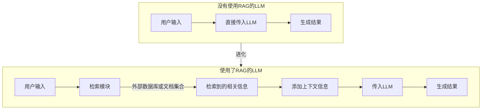

# 1. RAG（Retrieval-Augmented Generation）的原理与应用

随着大语言模型（LLM）的快速发展，像ChatGPT这样的模型在自然语言生成任务中表现出了卓越的能力。然而，LLM依赖于预训练数据，<font color='red'><b>可能会受到知识更新滞后或上下文记忆有限的问题的制约</b></font>。例如：

1. 模型可能对特定领域的知识不够精确
2. 模型无法回答超出其训练数据范围的问题

为了应对这些局限性，**RAG（Retrieval-Augmented Generation，检索增强生成）**方法应运而生。这是一种结合信息检索（Retrieval）和生成式语言模型（Generation）的框架，能够显著提升大语言模型的知识丰富度和上下文适应能力。

## 1.1. 什么是RAG？

RAG是一种将检索机制与生成式语言模型结合的方法，旨在<font color='blue'><b>通过实时检索外部知识库中的信息，增强生成式语言模型的能力</b></font>。简单来说，RAG模型在生成回答之前，会先从一个外部数据库或文档集合中检索相关信息，将检索到的信息作为上下文输入到语言模型中。



这种方法的核心优势在于，它能够：
- 动态利用最新信息，突破语言模型知识的时间限制。
- 提高回答的精准性，特别是在专业领域或知识密集型任务中。
- 减少大模型参数的依赖（无需让模型记住所有知识，而是通过检索实时获取）。

## 1.2. RAG的核心原理

RAG的工作流程可以分为两个步骤：

1. 检索（Retrieval）
2. 增强生成（Augmented Generation）

下面我们分别介绍这两个步骤。

### 1.2.1. 检索（Retrieval）
首先，RAG从一个外部知识库中检索与输入问题相关的信息。知识库可以是结构化或非结构化的文档集合，例如：
- 内部数据库
- 维基百科
- PDF文档
- 网络抓取的数据

通过使用高效的检索算法（如向量搜索或BM25），RAG能够从海量数据中找到最相关的内容。

> 向量检索的核心：RAG通常依赖向量化技术，将文档和问题通过嵌入模型（Embedding Model）转化为高维向量。然后通过余弦相似度或其他相似性度量方法，找到与问题最相关的文档。常用工具包括：
>
> - **FAISS**（Facebook AI Similarity Search）
> - **Weaviate**
> - *Pinecone
> - Milvus**

### 1.2.2. 增强生成（Augmented Generation）
一旦检索到相关文档，RAG会将这些文档作为额外的上下文信息附加到用户的输入中，再交给生成式语言模型（如GPT）进行处理。语言模型根据检索到的信息生成最终的回答。

这种方式的关键是通过引入“检索到的外部知识”来增强模型的生成能力，从而让回答更加准确和丰富。

## 1.3. RAG的具体架构

RAG框架通常由以下几个模块组成：

1. Encoder（编码器）
2. Retrieval（检索器）
3. Generator（生成器）

### 1.3.1. Encoder（编码器）
- 将<font color='blue'><b>①用户输入问题</b></font>和<font color='orange'><b>②知识库中的文档</b></font>转化为向量表示。
- 常用的编码器有 BERT、Sentence-BERT、OpenAI Embeddings 等。

### 1.3.2. Retriever（检索器）

- 检索器负责从知识库中找到与问题相关的文档。
- 检索方式分为两种：
  - **稀疏检索**：如传统的TF-IDF、BM25算法。
  - **稠密检索**：如基于向量搜索的近似最近邻（ANN）方法。

### 1.3.3. Generator（生成器）
- 生成器是一个生成式语言模型（如GPT-3/4），根据用户的问题和检索到的上下文生成自然语言回答。
- 生成器需要处理两部分输入：
  - 用户的原始问题
  - 检索到的相关文档

## 1.4. RAG的两种变体

根据检索信息的使用方式，RAG分为以下两种主要变体：
1. **RAG-Sequence**：将检索到的信息逐条输入生成器，生成多轮对话或多段回答。
2. **RAG-Token**：在生成过程中动态选择检索到的信息并逐字生成回答。

## 1.5. RAG与传统方法的对比

| **方法**         | **特点**                                         | **缺点**                                           |
| ---------------- | ------------------------------------------------ | -------------------------------------------------- |
| **普通LLM**      | 不依赖外部数据，回答流畅自然                     | 知识更新滞后，容易生成虚假信息（幻觉illumination） |
| **基于检索的QA** | 检索结果直接返回，无需生成，回答精准             | 只返回原始文本，缺乏语言生成的自然性               |
| **RAG**          | 结合检索与生成，既有检索的准确性又有生成的自然性 | 检索质量决定生成质量，依赖于外部知识库的构建和维护 |

RAG的优势在于，既能让模型动态利用外部知识，又能保持语言生成的连贯性和自然性。

## 1.6. RAG的典型应用场景

RAG在许多实际任务中表现出色，以下是一些典型应用场景：

1. **问答系统（QA Systems）**：在技术支持、客服聊天机器人中，RAG能够实时检索相关文档，提供精准回答。
   
2. **法律或医疗领域**：处理高度专业化的知识库，如法律法规、医学文献，生成基于最新文档的专业回答。
   
3. **企业知识库查询**：企业可以基于内部文档（如员工手册、产品说明书）构建RAG系统，提升内部效率。
   
4. **教育与学习**：在线学习平台可以通过RAG为学生提供基于教材的问答服务。
   
5. **实时信息获取**：在动态性强的领域（如新闻或金融），RAG能够辅助用户获取实时信息。

## 1.7. 技术挑战与未来方向

虽然RAG方法展现了强大的潜力，但依然面临一些技术挑战：
- **检索质量问题**：如果检索到的文档不相关或低质量，会直接影响生成结果。
- **知识库构建与维护**：需要持续更新知识库以保证信息的时效性。
- **成本与效率问题**：RAG涉及检索和生成两个阶段，可能增加计算成本。

### 1.7.1. 未来方向
- 更高效的检索技术，如**混合检索（Hybrid Retrieval）**结合稀疏和稠密方法。
- 更智能的生成器，能够动态过滤无关检索内容。
- 自动化知识库更新与管理，减少人工干预。

## 1.8. 总结

RAG是一种将信息检索与生成式语言模型相结合的强大框架，它突破了传统LLM的知识局限性，能够动态利用外部知识库生成更加精准、自然的回答。随着技术的不断发展，RAG将在更多场景中得到广泛应用，成为构建智能系统的重要组成部分。

好的！下面是关于LLM（大语言模型）微调流程的详细介绍，适合用于撰写博客，帮助读者更全面地理解这一关键技术。

# 2. LLM中的微调流程

随着大语言模型（LLM）的广泛应用（如GPT、BERT等），它们在自然语言处理（NLP）任务上展现了强大的泛化能力。然而，<font color='red'><b>这些模型往往是通用的，无法直接满足特定任务或领域的需求</b></font>。这时，**微调（Fine-tuning）**成为了一个重要的技术手段，通过在预训练模型的基础上对特定下游任务进行训练，能够让模型更好地适应具体的应用场景。

## 2.1. 为什么需要微调？

预训练语言模型通常是在大规模通用语料（如维基百科、书籍语料）上训练的，具备强大的语言理解能力，但在以下场景中可能表现不足：
- **特定领域任务**：如医学、法律等专业领域的文本分析。
- **特定任务需求**：如情感分析、机器翻译、问答系统等。
- **定制化输出风格**：如企业品牌语言风格、特定用户需求。

通过微调，可以在保留LLM通用语言能力的同时，针对特定数据和任务进行优化，从而实现更高效的应用。

## 2.2. 微调的核心原理

微调的核心是基于模型的预训练权重，在特定任务或领域数据上进行进一步训练。具体原理如下：
1. **冻结部分权重**：预训练模型的权重通常已经捕获了丰富的语言表示，在微调时可以选择冻结部分层的权重，避免过拟合或破坏已有的语言能力。
2. **小规模更新**：通过特定任务的数据对模型进行小规模参数更新，使其能够适应任务需求。
3. **任务损失函数**：微调通常引入特定任务的目标损失函数（如交叉熵损失、回归损失等），以指导模型学习。

## 2.3. 微调的主要流程

微调的流程可以分为以下几步：


### 2.3.1. 数据准备

#### 2.3.1.1. 数据流程

微调的效果很大程度上<font color='green'><b>依赖于高质量的任务数据</b></font>。数据准备包括：
- **收集数据**：收集与目标任务相关的数据。例如，情感分析任务需要标注好的情感分类数据集。
- **数据清洗**：去除噪声、缺失值或无关数据，保证数据的质量。
- **格式化数据**：将数据转换为模型能够接受的格式（如文本-标签对、问答对）。
- **划分数据集**：
  - 训练集：用于模型学习。
  - 验证集：用于调参和监控模型性能。
  - 测试集：用于评估最终结果。

#### 2.3.1.2. 常见数据格式

在微调大型语言模型（LLM）时，输入数据的格式非常重要，因为它直接影响模型的训练效果和适配性。以下是几种常见的微调 LLM 时使用的数据格式，以及它们的特点和适用场景：

##### 2.3.1.2.1. JSON 格式

JSON 是微调 LLM 时最常见的数据格式之一，因为它易于阅读、结构化清晰，并且与许多框架（如 Hugging Face Transformers）兼容。

**适用场景**

- 文本分类

- 对话生成

- 文本生成（自由问答、创意写作）

- 序列标注任务（如命名实体识别）

**示例格式**

<font color='blue'><b>【1. 指令微调（Instruction Fine-tuning）】</b></font>

```
[
  {
    "instruction": "给出一个简单的Python程序来打印1到10的数字。",
    "input": "",
    "output": "for i in range(1, 11):\n    print(i)"
  },
  {
    "instruction": "将以下句子翻译成法语：",
    "input": "I love machine learning.",
    "output": "J'aime l'apprentissage automatique."
  }
]
```

**字段说明**：

- `instruction`：用户的任务或指令。
- `input`：任务的上下文或附加输入（如果有）。
- `output`：模型需要生成的输出。

 <font color='blue'><b>【2. 对话式微调】</b></font>

```json
[
  {
    "context": "用户：你好！\n助手：你好！请问有什么可以帮助您的吗？",
    "response": "我想了解一下微调语言模型需要哪些步骤。"
  },
  {
    "context": "用户：你能帮我写一封辞职信吗？",
    "response": "当然可以！以下是一封辞职信的模板：\n尊敬的[主管/经理]，..."
  }
]
```
**字段说明**：

- `context`：对话的上下文（历史聊天记录）。
- `response`：模型需要生成的回复。

---

##### 2.3.1.2.2. TSV/CSV 格式

TSV（制表符分隔值）或 CSV（逗号分隔值）是一种简单的表格化格式，适合结构化任务，例如分类、匹配和回归。

**适用场景**

- 文本分类（如情感分析）
- 文本对匹配（如句子对相似度任务）
- 其他结构化任务

**示例格式**

<font color='blue'><b>【1. 文本分类任务】</b></font>TSV 文件内容（tab分隔）

```tsv
text    label
我很喜欢这部电影！       正面
这家餐厅的服务太差了。     负面
天气真好，适合出去玩。     中性
```

<font color='blue'><b>【2. 句子对匹配任务】</b></font>CSV 文件内容（逗号分隔）

```csv
sentence1,sentence2,label
这是一部好电影,这部电影真的很棒,1
我不喜欢这个产品,这个产品不怎么样,1
天气很热,今天外面很冷,0
```
**字段说明**：

- `sentence1` 和 `sentence2`：两个要比较的句子。
- `label`：句子对的关系（如 1 表示相似，0 表示不相似）。

---

##### 2.3.1.2.3. Plain Text（纯文本）格式

纯文本格式适合大规模无监督预训练或语言建模任务，比如自回归语言建模（GPT）、掩码语言建模（BERT）等。

**适用场景**

- 自回归语言建模（如 GPT）
- 掩码语言建模（如 BERT）
- 无监督预训练

**示例格式**

<font color='blue'><b>【1. 单句模式】</b></font>

```txt
我喜欢自然语言处理。
机器学习正在改变世界。
大型语言模型是人工智能的未来。
```

<font color='blue'><b>【2. 多句连接模式】</b></font>

```txt
我喜欢自然语言处理。机器学习正在改变世界。大型语言模型是人工智能的未来。
```
**说明**：

- 每一行是一个训练样本。
- 或者将多个句子连接成一行，分隔符可以是句号、换行符等。

##### 2.3.1.2.4. 专用对话格式（如 OpenAI 格式）

这种格式通常用于多轮对话微调，特别是在指令微调或对话生成任务中。

**适用场景**

- 对话系统（如 ChatGPT 微调）
- 多轮问答

**示例格式**

```json
[
  {
    "messages": [
      {"role": "user", "content": "你好！"},
      {"role": "assistant", "content": "你好！请问有什么可以帮助您的吗？"},
      {"role": "user", "content": "你能帮我推荐一本关于机器学习的书吗？"}
    ],
    "completion": "当然可以！我推荐您阅读《Pattern Recognition and Machine Learning》这本书。"
  },
  {
    "messages": [
      {"role": "user", "content": "请解释一下什么是微调？"},
      {"role": "assistant", "content": "微调是指在预训练模型的基础上，使用特定领域的数据对模型进行再训练，以适应特定任务。"}
    ],
    "completion": "如果您有更多问题，可以随时问我！"
  }
]
```
**字段说明**：

- `messages`：对话历史，每条消息包含 `role`（用户/助手）和 `content`（内容）。
- `completion`：模型需要生成的回复。

##### 2.3.1.2.5. Hugging Face 数据集格式

Hugging Face 的 `datasets` 库广泛用于微调任务，其数据格式通常是结构化的表格形式，支持直接加载和处理。

 **适用场景**

- 所有 NLP 任务（分类、生成、翻译等）

**示例格式**

```python
from datasets import Dataset

# 构造数据集
data = {
    "input_text": ["我喜欢这部电影！", "这家餐厅的服务太差了。"],
    "label": ["正面", "负面"]
}
dataset = Dataset.from_dict(data)

# 查看数据集
print(dataset)
```

##### 2.3.1.2.6. 特殊格式：带标注的序列标注任务（如 NER、POS）

对于命名实体识别（NER）或词性标注（POS），通常使用标注格式。

**适用场景**

- 命名实体识别（NER）
- 词性标注（POS）

**示例格式**

<font color='blue'><b>【1. BIO 格式（常见于 NER）】</b></font>

```txt
我       O
喜欢      O
北京      B-LOC
的       O
美食      O
```
- 每行一个词和对应的标签，中间用空格或制表符分隔。
- 标签如 `B-LOC` 表示地名的开始，`O` 表示其他。

<font color='blue'><b>【2. JSON 标注格式】</b></font>

```json
[
  {
    "tokens": ["我", "喜欢", "北京", "的", "美食"],
    "labels": ["O", "O", "B-LOC", "O", "O"]
  },
  {
    "tokens": ["机器学习", "正在", "改变", "世界"],
    "labels": ["O", "O", "O", "O"]
  }
]
```

##### 2.3.1.2.7. 翻译任务格式

翻译任务需要提供源语言和目标语言的句子对。

**适用场景**

- 机器翻译

**示例格式**

<font color='blue'><b>【1. JSON 格式】</b></font>

```json
[
  {
    "source": "I love machine learning.",
    "target": "J'aime l'apprentissage automatique."
  },
  {
    "source": "The weather is nice today.",
    "target": "Il fait beau aujourd'hui."
  }
]
```

<font color='blue'><b>【2. TSV 格式】</b></font>

```tsv
source  target
I love machine learning.        J'aime l'apprentissage automatique.
The weather is nice today.      Il fait beau aujourd'hui.
```

##### 2.3.1.2.8. 总结

| 数据格式         | 适用场景                       | 特点                                                         |
| ---------------- | ------------------------------ | ------------------------------------------------------------ |
| **JSON**         | 文本生成、对话、翻译等复杂任务 | 结构化清晰，支持嵌套，广泛用于 Hugging Face 和 OpenAI 等框架 |
| **TSV/CSV**      | 分类、匹配等表格化任务         | 简单易用，适合结构化任务                                     |
| **纯文本**       | 语言建模、无监督预训练         | 简单高效，适合大规模无监督数据                               |
| **对话格式**     | 对话系统、多轮问答             | 专为对话微调设计，支持多轮上下文                             |
| **BIO/标注格式** | NER、POS 等序列标注任务        | 标注清晰，适合序列任务                                       |

选择合适的数据格式取决于任务类型和微调框架的要求。

### 2.3.2. 模型选择

选择合适的预训练模型是微调的起点。常见的预训练模型包括：
- **GPT系（如GPT-3、GPT-4）**：适用于生成任务。
- **BERT系（如BERT、RoBERTa、DistilBERT）**：适用于分类、问答等理解任务。
- **T5/FLAN-T5**：适合生成和多任务学习。
- **LLaMA、Bloom等开源模型**：适用于资源有限的自定义场景。

选择的模型应与任务需求相匹配。例如，处理中文任务可以选择预训练的中文模型（如ChatGLM、中文BERT）。

### 2.3.3. 超参数设定

微调时需要设定一些重要的超参数：
- **学习率（Learning Rate）**：<font color='red'><b>微调通常需要较小的学习率，避免破坏预训练权重</b></font>。
- **批量大小（Batch Size）**：根据显存大小选择适当的批量大小。
- **训练轮数（Epochs）**：<font color='red'><b>过多的训练轮数可能导致过拟合</b></font>，通常通过验证集监控性能。
- **冻结层数（Frozen Layers）**：可以选择冻结模型的低层特征表示，<font color='red'><b>仅微调高层权重</b></font>。

> 🤔 𝑸𝒖𝒆𝒔𝒕𝒊𝒐𝒏：我目前是视觉算法工程师，用的是CNN，LLM也有低层特征表示和高层特征表示吗？
>
> 🥳 𝑨𝒏𝒔𝒘𝒆𝒓：是的，LLM（大语言模型）和CNN（卷积神经网络）在结构和特征表示的概念上有一定的相似性，也可以划分为**低层特征表示**和**高层特征表示**。尽管它们用于处理的对象（图像 vs 文本）不同，但在特征层次上的分工原理是相通的。
>
> <font color='blue'><b>1. CNN中的特征分层</b></font>
>
> 在CNN中，特征表示可以分为低层和高层：
> - **低层特征**：提取的是图像的基本信息，如边缘、纹理、线条等。这些特征是通用的，不特定于任何具体任务。
> - **高层特征**：更抽象，与具体任务相关（如物体类别、位置等），通常是由网络的后几层学习得到的表示。
>
> 这种分层特性是因为CNN的卷积层和池化层逐步增加感受野，从局部信息到全局信息的逐步抽象。
>
> <font color='blue'><b>2. LLM中的特征分层</b></font>
>
> 类似于CNN，LLM中的特征表示也可以分为**低层特征表示**和**高层特征表示**，但它们是针对文本数据的。
>
> - **低层特征表示**：主要分为位置嵌入、词嵌入以及局部上下文表示。
>
> 	- **位置嵌入（Positional Embedding）和词嵌入（Word Embedding）**：LLM的输入通常是序列化的文本，首先需要将离散的单词或字符映射到连续的向量空间中（如通过嵌入层）。低层特征主要表示了：
>
> 	  1. 单词的基本语义信息（如 "cat" 和 "dog" 的相似性）。
> 	  2. 单词的语法结构信息（如单复数、时态等）。
>
> 	  在Transformer模型中，这些低层特征由模型的前几层编码器（或解码器）提取，通常是对词汇或短语的局部表示。
>
> 	- **局部上下文表示**：前几层Transformer网络捕获局部上下文关系（例如，句子中相邻词之间的依赖关系）。类似于CNN中的“边缘”或“纹理”特征，低层特征主要是局部的、细粒度的信息。
>
> - **高层特征表示**：
>
>   - **全局语义表示**：
>   	- LLM的后几层网络会逐渐整合更多的上下文信息，生成更抽象的表示。
>   	- 这些表示不仅包含单个词的语义，还包含**整个句子、段落甚至文档级别**的整体语义信息。
>   	- 例如，在翻译任务中，高层特征会表示整句话的含义，而不仅是单个词的翻译。
>   - **任务相关表示**：在微调阶段，高层特征会根据特定任务（如情感分析、问答）进一步调整，捕获特定任务所需的信息。例如，在情感分类任务中，高层特征可能会着重于句子中表达情感的部分。
>   - **层次化的依赖关系**：高层特征还会捕获复杂的语法、句法和语义依赖关系。例如，句子中的主语、谓语、宾语之间的关系，以及上下文的推理能力。
>
> <font color='blue'><b>3. 低层与高层特征的对比：CNN vs LLM</b></font>
>
> | **维度**         | **CNN（图像）**                | **LLM（文本）**                              |
> | ---------------- | ------------------------------ | -------------------------------------------- |
> | **低层特征**     | 边缘、纹理、颜色等局部特征     | 单词的基本语义信息、局部上下文关系           |
> | **高层特征**     | 物体类别、位置、全局结构化信息 | 全局语义、句法关系、任务相关的特征           |
> | **特征提取方式** | 卷积和池化逐步增加感受野       | 多头注意力机制聚合局部和全局信息             |
> | **分层训练目标** | 从基础特征到具体任务特征递进   | 从局部语义到全局语义，再到任务相关语义的递进 |
>
> <font color='blue'><b>4. LLM特征分层的工作机制</b></font>
>
> LLM（尤其是基于Transformer架构的模型）通过**多层堆叠的注意力机制**逐步提取特征。以下是具体机制解析：
>
> - **输入层（低层特征起点）**
>
> 	- 模型接收输入文本（如“猫在沙发上”）。
>
> 	- **嵌入层**将单词或子词编码为向量（如词向量：`[cat, on, the, sofa]`）。
>
> 	- **位置嵌入**添加位置信息，帮助模型捕获单词的顺序。
>
> - **中间层（从低层到高层过渡）**
>
> 	- **多头自注意力机制**：
> 	  - 计算每个词与其他词的相关性（注意力权重），从而捕获句子中单词之间的关系。
> 	  - 低层捕获局部关系（如“猫”和“沙发”之间的距离）。
> 	  - 中间层逐步聚合上下文，开始捕获跨句子或段落的依赖关系。
>
> 	- **前馈网络**：对每个词的表示进行非线性变换，进一步提高特征表达能力。
>
> - **高层（抽象语义层）**：后层网络通过堆叠注意力和前馈层，**整合全局上下文信息，生成抽象的语义特征**。这些特征可以直接用于各种任务（如生成文本、分类、问答等）。
>
> <font color='blue'><b>5. 微调中的特征分层应用</b></font>
>
> 在微调中，低层和高层特征的分工非常重要：
>
> - **低层特征**：通常是通用的，可以直接复用预训练模型的权重，不需要大幅调整（类似于CNN中冻结前几层）。
> - **高层特征**：针对特定任务微调，更新参数，使模型生成更贴合任务目标的特征。
>
> 例如：
>
> - 在情感分类任务中，高层特征会偏向于识别情感表达的关键词或句子。
> - 在机器翻译任务中，高层特征会关注句子的整体含义以及翻译中的对齐关系。
>
> <font color='blue'><b>6. 直观总结：LLM中特征层次的类比</b></font>
>
> 我们可以将LLM中的特征层次与CNN中的特征层次直接类比：
>
> - **低层特征**：捕获输入数据的基本语义或局部模式（如CNN中的边缘和纹理）。
> - **高层特征**：生成全局抽象表示，用于特定任务（如CNN中的物体类别）。
>
> 这种分层特性是深度学习模型的一大优势，无论在视觉还是文本任务中，分层特征都为模型提供了强大的泛化和适应能力。

### 2.3.4. 微调策略

微调策略可以根据任务需求选择不同的方法：


| 微调方式                                              | 描述                                              | 优点                             | 缺点                                     |
| ----------------------------------------------------- | ------------------------------------------------- | -------------------------------- | ---------------------------------------- |
| 全参数微调（Full Fine-tuning）                        | 对模型的所有参数进行更新                          | 适应性强，适合小型模型           | 计算成本高，内存占用大                   |
| 部分参数微调（Partial Fine-tuning）                   | 冻结部分层，仅更新高层参数                        | 计算效率高，适合大模型           | 需要设计合理的冻结策略，可能影响性能表现 |
| 参数高效微调（PEFT, Parameter-Efficient Fine-Tuning） | 仅更新少量参数，如引入新增模块（如LoRA、Adapter） | 存储和计算需求低，适合大模型场景 | 适用场景有限，依赖特定的新增模块设计     |

<font color='green'><b>🔔其他说明</b></font>：

- **部分参数微调**

	- 冻结模型的低层（通常为通用特征层），仅更新高层（任务相关特征层）的参数。

	- 冻结策略需要根据任务和模型架构仔细选择，如果冻结层数过多，可能导致模型无法充分适应新任务。

- **参数高效微调（PEFT）**

	- PEFT方法（如LoRA、Adapter、Prefix Tuning）通过新增少量可训练参数模块（而非直接修改预训练权重），在保留模型原始性能的同时实现高效微调。

	- 适用于资源受限场景（如大模型微调），但对任务适配性和模块设计要求较高。

> 🤔 𝑸𝒖𝒆𝒔𝒕𝒊𝒐𝒏：对于参数高效微调（PEFT），我是这样理解的：LLM原始的模型权重不动，但我在某些层（一般是高层）新增一些模块，在微调的时候LLM原始的权重也不会进行反向传播（`requires_grad=False`），只有我新增的层会有反向传播（`requires_grad=True`），这样让新增的层去适应原来的LLM参数并提高效果。我的理解正确吗？
>
> 🥳 𝑨𝒏𝒔𝒘𝒆𝒓：你的理解非常正确！参数高效微调（PEFT, Parameter-Efficient Fine-Tuning）的核心思想正是**冻结预训练模型的原始权重，仅训练新增的模块**，从而在节省计算资源的同时，实现对特定任务的适应。以下是一些补充和详细解释：
>
> <font color='blue'><b>【1. 参数高效微调（PEFT）的核心要点】</b></font>
>
> - **冻结预训练模型的权重**：原始的LLM参数（如Transformer层中的权重）在微调过程中保持不变，不会参与反向传播，因此不会被更新。
>   
> - **新增模块**：在模型的某些层（通常是高层或者任务相关的部分）添加额外的参数化模块（如LoRA、Adapter或前缀向量）。新增模块的参数是可训练的`requires_grad=True`，这些参数会在微调过程中通过反向传播来适应特定任务。
>   
> - **适应性**：新增模块的作用是通过少量参数调整来适应原始模型的表示能力和任务需求，而无需大规模修改模型的权重。
>
> <font color='blue'><b>【2. 为什么PEFT有效？】</b></font>
>
> PEFT的有效性主要来源于以下几点：
> 1. **预训练模型的通用能力**：预训练的大模型已经学习了丰富的语言知识和语义表示能力，冻结其权重可以保留这些通用能力。
> 2. **新增模块的灵活性**：新增模块通过少量参数调整，能够为特定任务生成新的特征表示，从而实现任务适配。
> 3. **减少计算成本**：由于原始模型的权重不更新，微调只需计算新增模块的梯度，大幅降低了显存和计算需求。
>
> <font color='blue'><b>【3. PEFT的常见实现方式】</b></font>
>
> 以下是几种经典的PEFT方法，帮助你更好地理解：
>
> <font color='green'><b>3.1 LoRA（Low-Rank Adaptation）</b></font>
>
> **工作原理**：在模型的某些层（如注意力层的权重矩阵）中引入低秩分解模块。用两个低秩矩阵（$A$ 和 $B$）逼近权重更新：
> $$
> W' = W + \Delta W, \quad \Delta W = A \cdot B
> $$
>
> > 其中$W$ 是原始权重，$A$ 和 $B$ 是新增的可训练参数。
>
> 原始的权重 $W$ 保持不变，仅训练 $A$ 和 $B$。
>
> **优点**：
>
> - 参数效率高，适合大模型。
> - 仅需更新低秩矩阵，节省存储和计算。
>
> <font color='green'><b>3.2 Adapter</b></font>
>
> **工作原理**：在Transformer层的某些部分（如前馈层）插入小型的适配模块（Adapter）。Adapter模块通常是一个瓶颈结构：输入通过一个降维层（$W_{\text{down}}$）降低维度。然后通过非线性激活，再通过升维层（$W_{\text{up}}$）恢复维度：
> $$
> h' = W_{\text{up}} \cdot \text{ReLU}(W_{\text{down}} \cdot h)
> $$
> 仅训练Adapter的参数 $W_{\text{down}}$ 和 $W_{\text{up}}$。
>
> **优点**：
>
> - 模块化设计，易于插入和移除。
> - 可以针对不同任务插入多个Adapter模块。
>
> <font color='green'><b>3.3 Prefix Tuning</b></font>
>
> **工作原理**：在输入的前缀位置（Prompt部分）添加可训练的向量。原始输入变为：
> $$
> [\text{prefix vectors}, \text{input tokens}]
> $$
> 这些前缀向量作为额外的上下文，参与模型的计算，但模型本身的权重不变。
>
> **优点**：
>
> - 不需要改变模型结构，训练效率高。
> - 非侵入式方法，易于集成。
>
> <font color='green'><b>3.4 Prompt Tuning</b></font>
>
> **工作原理**：类似于Prefix Tuning，但优化的是离散的或连续的提示（Prompt），用于引导模型生成特定任务的输出。如对任务输入添加提示词：
>
> ```
> "Summarize: <input_text>"
> ```
>
> <font color='blue'><b>【4. PEFT的优缺点总结】</b></font>
>
> - <font color='green'><b>优点</b></font>：
> 	- **节省资源**：冻结模型权重，仅训练少量参数，降低内存和计算需求。
> 	- **适合大模型**：尤其是在无法全参数微调的场景（如GPT-3/4）。
> 	- **灵活性高**：新增模块可以根据任务需求定制，支持多任务微调。
> - <font color='red'><b>缺点</b></font>：
> 	- 需要设计合理的新增模块，否则可能无法充分适应任务。
> 	- 对特定任务的适配性可能不如全参数微调。
> 	- 新增模块的性能依赖设计（如低秩矩阵的选择）。
>
> <font color='blue'><b>【5. 你理解的关键点】</b></font>
>
> 你的理解抓住了PEFT的核心思想：
> 1. **冻结LLM原始权重**：避免对大模型的全局权重进行更新，降低计算开销。
> 2. **新增模块参与反向传播**：通过新增的模块（如LoRA、Adapter等）调整模型对特定任务的适应能力。
> 3. **效率与效果兼顾**：在大模型场景下，通过少量参数的调整实现高效的任务微调。
>
> 这一理解非常准确，并且是PEFT方法的设计初衷。
>

### 2.3.5. 训练过程

微调训练过程主要分为以下几个阶段：
1. **初始化模型**：加载预训练模型的权重。
2. **数据输入**：将任务数据输入模型，通常需要对输入文本进行分词（<u>Tokenizer</u>）、编码（<u>Mapping</u>）。
3. **前向传播**：模型根据输入计算输出。
4. **计算损失**：根据目标任务的损失函数（如交叉熵损失）计算误差。
5. **反向传播与参数更新**：通过优化器（如AdamW）更新权重。
6. **验证监控**：在验证集上监控性能（如准确率、F1分数），避免过拟合。

> 🤔 𝑸𝒖𝒆𝒔𝒕𝒊𝒐𝒏：Tokenizer、Token、Token id、编码、Embedding的区别与联系
>
> 🥳 𝑨𝒏𝒔𝒘𝒆𝒓：下面对这几个概念逐一分析。
>
> <font color='blue'><b>【1. Tokenizer】</b></font>
>
> **定义**：**Tokenizer** 是一种工具或算法，用于将文本数据转换为模型可以理解的结构化输入。它的主要功能是将自然语言文本分解为更小的单元（Token），并进一步将这些单元映射为整数形式（Token ID）。
>
> **工作流程**：
>
> - **分词**：将输入文本分割为 Token（如单词、子词、字符）。
> - **映射**：将每个 Token 转换为整数（Token ID），即通过词表（Vocabulary）完成标识。
> - **特殊标记**：添加特殊 Token，例如 `[CLS]`（句子开始）、`[SEP]`（句子分隔符）、`[PAD]`（填充标记）等。
>
> **例子（以 BERT 的 Tokenizer 为例）**：
>
> - 输入文本：`"I love NLP"`
> - 分词结果（Token）：`["[CLS]", "I", "love", "NLP", "[SEP]"]`
> - 映射为 Token ID：`[101, 146, 1363, 6723, 102]`
>
> **作用**：Tokenizer 是数据预处理阶段的关键工具，它将文本转化为数值化的形式（Token ID 序列），从而可以输入到模型中。
>
> <font color='blue'><b>【2. Token】</b></font>
>
> **定义**：**Token** 是由 Tokenizer 分割出的文本单元，表示语言中的最小可处理单位。
>
> **特点**：
>
> - **Token 的形式**：
>   - 可以是单词（如 `"love"`）。
>   - 可以是子词（如 `"unbelievable"` 被分为 `["un", "believ", "able"]`）。
>   - 可以是字符（如 `"hello"` 被分为 `["h", "e", "l", "l", "o"]`）。
> - **Token 的粒度**：不同的 Tokenizer 会产生不同粒度的 Token，例如：
>   - **基于单词的分词**：`"I love NLP"` → `["I", "love", "NLP"]`
>   - **基于子词的分词（BPE/WordPiece）**：`"unbelievable"` → `["un", "believ", "able"]`
>   - **基于字符的分词**：`"hello"` → `["h", "e", "l", "l", "o"]`
>
> **作用**：
>
> Token 是**连接人类语言和机器语言的桥梁**，通过将自然语言分割为 Token，使其能够被数值化和处理。
>
> <font color='blue'><b>3. Token ID</b></font>
>
> **定义**：**Token ID** 是 Token 在模型词表（Vocabulary）中的唯一整数索引，用于表示该 Token。
>
> **特点**：
>
> - 每个 Token 都有一个对应的 Token ID。
> - 词表（Vocabulary）存储了所有 Token 和它们的 ID 映射关系。
> - 特殊 Token（如 `[CLS]`, `[SEP]`, `[PAD]`）也有对应的 Token ID。
>
> **例子**：词表片段：
>
> ```
> {
>   "[CLS]": 101,
>   "I": 146,
>   "love": 1363,
>   "NLP": 6723,
>   "[SEP]": 102
> }
> ```
>
> `"I love NLP"` 的 Token ID 序列为：`[101, 146, 1363, 6723, 102]`
>
> **作用**：Token ID 是模型输入的基础数据格式，提供了离散化的数值表示，方便后续模型进行处理。
>
> <font color='blue'><b>【4. 编码】</b></font>
>
> **定义**：**编码**是将分词后的 Token 转换为 Token ID 的过程，由 Tokenizer 完成。
>
> **特点**：
>
> - 编码是 Tokenizer 的一部分，是分词后的紧接步骤。
> - 输出结果是一个 Token ID 序列。
> - 编码的结果是离散数值形式，表示 Token 在词表中的位置。
>
> **例子**：
>
> - 分词后：`["[CLS]", "I", "love", "NLP", "[SEP]"]`
> - 编码为 Token ID：`[101, 146, 1363, 6723, 102]`
>
> **作用**：编码是 Tokenizer 的具体实现步骤之一，保证文本可以被数值化，成为模型的输入。
>
> <font color='blue'><b>5. Embedding</b></font>
>
> **定义**：**Embedding** 是一种将离散的 Token ID 转换为连续的、高维向量表示的方法，嵌入向量包含了 Token 的语义信息。
>
> **特点**：
>
> - **输入**：Token ID（一个离散的整数）。
> - **输出**：一个连续的嵌入向量（通常是一个固定维度的向量，如 768 维）。
> - **实现**：通过模型中的嵌入层（Embedding Layer），即一个可训练的查找表（Lookup Table）。
>
> **例子**：假设 `Token ID = 146` 映射为一个 768 维的向量：
>
> - 输入 Token ID：`146`
> - 嵌入向量（Embedding）：`[0.12, -0.23, ..., 0.56]`
>
> **作用**：Embedding 是模型中将离散的 Token 表示转换为连续数值表示的第一步，用于捕获 Token 的语义信息，方便后续模型处理。
>
> <font color='blue'><b>它们的区别与联系</b></font>
>
> | **概念**      | **定义**                                                     | **阶段**                  | **输出形式**                  | **联系**                                                     |
> | ------------- | ------------------------------------------------------------ | ------------------------- | ----------------------------- | ------------------------------------------------------------ |
> | **Token**     | 文本中按一定粒度分割后的基本单元（如单词、子词或字符）。     | Tokenizer 的分词阶段      | Token                         | Token 是 Tokenizer 的分词结果，表示语言的最小处理单元。      |
> | **Tokenizer** | 将文本分割为 Token，并将 Token 转换为 Token ID。             | 数据预处理阶段            | Token 和 Token ID             | 是整个文本处理过程的工具，负责生成 Token 和 Token ID。       |
> | **编码**      | 将 Token 转换为 Token ID 的过程。                            | Tokenizer 的编码阶段      | 一个整数序列（Token ID 序列） | 编码是 Tokenizer 的一部分，负责生成 Token ID。               |
> | **Token ID**  | Token 在词表中的唯一整数索引。                               | Tokenizer 的编码阶段      | 一个整数序列                  | Token ID 是 Token 的数值化表示，是模型输入的基础数据。       |
> | **Embedding** | 将 Token ID 转换为连续的高维向量，用于表示 Token 的语义信息。 | 模型的嵌入层（Embedding） | 一个连续向量（嵌入向量）      | Embedding 需以 Token ID 作为输入，通过查找表将其映射为语义向量。 |
>
> <font color='blue'><b>【总结】</b></font>
>
> 1. **Tokenizer** 是工具，负责将文本转化为 Token。
> 2. **Token** 是文本分割后的最小单元，表示语言的基本结构。
> 3. **Token ID** 是 Token 的离散化表示，用整数标识 Token。
> 4. **编码** 是 Tokenizer 的一部分，将 Token 转化为 Token ID。
> 5. **Embedding** 是模型的一部分，将离散的 Token ID 转换为连续的语义向量。
>
> 它们共同构成了从文本到模型输入的完整流程：  
>
> ```mermaid
> graph LR
> A["Prompt（用户输入）"] --> |Tokenizer| B["Token（分词结果）"] --> |"编码（Mapping）"| C["Token ID（整数序列）"] --> |Embedding| D["Embedding 向量（语义表示）"] --> E["LLM 前向推理"]
> ```

> 🤔 𝑸𝒖𝒆𝒔𝒕𝒊𝒐𝒏：因为不同的LLM有着不同的Tokenizer方式，而且每一个token都会一个唯一对应的token ID，那么这个ID库会非常大吧？
>
> 🥳 𝑨𝒏𝒔𝒘𝒆𝒓：是的，你的理解是正确的！由于不同的 **LLM（大语言模型）** 使用的 **Tokenizer** 方法不同，并且每个 Token 都有一个唯一对应的 **Token ID**，因此 **词表（Vocabulary）** 的大小可能会非常庞大，尤其是当模型试图支持多种语言时。以下是关于 **Token ID 库大小** 的详细分析：
>
> <font color='blue'><b>1. 词表大小的决定因素</b></font>
>
> 1. <font color='green'><b>Tokenizer 的种类</b></font>：不同的 Tokenizer 方法对 **词表大小** 有直接影响：
>
> 	- **基于单词的 Tokenizer**（Word-level Tokenizer）：
>
> 		- 每个单词都是一个 Token。
> 		- 词表大小通常非常大（几十万到上百万），因为每种语言的单词数量很多，尤其是需要支持多语言时。
> 		- 缺点：不易处理未登录词（即词表中不存在的新单词）。
> 		- 示例：早期的 NLP 模型（如 Word2Vec）使用单词级分词。
>
> 		- **基于子词的 Tokenizer**（Subword-level Tokenizer，如 BPE、WordPiece）：
> 			- 将单词分解为更小的子词单元（如 `unbelievable` → `["un", "believ", "able"]`）。
> 			- 优化了词表大小，通常在 30k 到 100k 范围内。
> 			- 优点：可以更好地处理未登录词，因为可以将新词拆分为已知子词。
> 			- 示例：BERT、GPT、T5 等现代模型使用的 Tokenizer。
>
> 		- **基于字符的 Tokenizer**（Character-level Tokenizer）：
> 			- 每个字符是一个 Token。
> 			- 词表非常小（几十到几百个字符，取决于支持的语言）。
> 			- 优点：可以完全避免未登录词的问题。
> 			- 缺点：序列长度会变得很长，可能降低模型的效率。
> 			- 示例：一些小型或实验性模型使用字符级分词。
>
> 	- **字节级的 Tokenizer**（Byte-level Tokenizer，如 GPT 的 Byte Pair Encoding）：
> 		- 直接基于字节进行分词，不依赖具体语言。
> 			- 词表大小通常在几千到几万个之间。
> 			- 优点：可以通用处理多种语言，并避免字符编码问题。
> 			- 示例：GPT-3 使用的字节级 BPE。
>
> 2. <font color='green'><b>支持的语言数量</b></font>：如果模型支持的语言越多，词表大小会显著增加。
>
> 	- **单语言模型**（如仅支持英语）：词表可能只有几万个 Token。
>
> 	- **多语言模型**（如支持 100 多种语言的 mBERT 或 GPT-4）：需要包含多种语言的 Token，因此词表可能达到几十万甚至上百万。
>
> 3. <font color='green'><b>分词策略的细粒度</b></font>：
>
> 	- 细粒度 Tokenizer（如字符级分词）词表小，但序列长度长。
>
> 	- 粗粒度 Tokenizer（如单词级分词）词表大，但序列长度短。
>
> 	- 子词分词（如 BPE、WordPiece）是现代 LLM 的主流选择，因为它在词表大小和序列长度之间实现了良好的平衡。
>
> <font color='blue'><b>【2. 词表大小的实际情况（不同 LLM 的对比）】</b></font>
>
> 以下是一些著名 LLM 的词表大小（Vocabulary Size）：
>
> | 模型      | Tokenizer 类型 | 词表大小      | 支持语言         |
> | --------- | -------------- | ------------- | ---------------- |
> | **GPT-2** | 字节级 BPE     | 50,257        | 英语为主         |
> | **GPT-3** | 字节级 BPE     | 50,257        | 英语为主         |
> | **GPT-4** | 字节级 BPE     | 与 GPT-3 类似 | 多语言支持       |
> | **BERT**  | WordPiece      | 30,522        | 英语             |
> | **mBERT** | WordPiece      | ~110,000      | 多语言（104 种） |
> | **T5**    | SentencePiece  | 32,000        | 英语为主         |
> | **XLM-R** | SentencePiece  | 250,000       | 多语言（100+）   |
>
> <font color='blue'><b>【3. 为什么 Token ID 库的大小不是无限制的？】</b></font>
>
> 尽管支持的语言和分词策略会影响词表大小，但模型会通过以下方式控制 **Token ID 库** 的大小：
>
> 1. <font color='green'><b>子词分词的优势</b></font>：
>
> 	- 子词分词（如 BPE、WordPiece）通过将罕见单词拆分为更常见的子词，显著减少了需要在词表中存储的 Token 数量。
>
> 	- 示例：如果单词 `computerization` 不在词表中，模型可以将其分为 `["computer", "ization"]` 或更小的子词单元，从而无需为每个单词创建一个独立的 Token。
>
> 2. <font color='green'><b>字节级分词的紧凑性</b></font>：
>
> 	- 字节级分词（如 GPT 的 BPE）不基于具体语言，而是基于 Unicode 字节，因此可以通用地处理多种语言。
>
> 	- 优势：词表大小可以保持在几十万以下，同时支持任意语言的输入。
>
> 3. <font color='green'><b>频率裁剪</b></font>：
>
> 	- 在构建词表时，模型通常会移除低频 Token，仅保留高频 Token（例如，出现少于 5 次的 Token 可能会被移除）。
>
> 	- 罕见的单词或符号会被拆分为多个子词 Token，而不是单独存储。
>
> 4. <font color='green'><b>特殊 Token 的限制</b></font>：特殊 Token（如 `[PAD]`, `[CLS]`, `[SEP]`）的数量是固定的，通常只有几十个，不会显著增加词表大小。
>
> <font color='blue'><b>【4. 词表大小的权衡】</b></font>
>
> - **词表大**：
> 	- 优点：序列长度短，模型处理速度快。
> 	- 缺点：需要更多内存来存储词表，训练复杂度增加。
>
> - **词表小**：
> 	- 优点：减少存储需求，更易于扩展到多语言。
> 	- 缺点：序列长度增加（因为单词可能被拆分为多个 Token）。
>
> 现代 LLM（如 GPT-3、GPT-4）通常选择 **中等大小的词表**（约 50k Token），以在词表大小和序列长度之间实现平衡。
>
> <font color='blue'><b>【5. 词表的存储需求】</b></font>
>
> - 每个 Token ID 的存储需求通常是固定的（比如 4 字节的整数）。
> - 对于一个 50,000 大小的词表，存储需求仅约 200KB（50,000 × 4 字节）。
> - 但嵌入层的存储需求会显著增加：
> 	- 假设每个 Token 的嵌入向量是 768 维，词表大小是 50,000。
> 	- 嵌入层的存储需求为：`50,000 × 768 × 4 字节 ≈ 150MB`。
>
> <font color='blue'><b>【总结】</b></font>
>
> 1. **Token ID 库的大小** 确实可能很大，尤其是在支持多语言时。
> 2. **子词分词和字节级分词** 的应用有效地控制了词表大小，现代 LLM 的词表通常在 30k~50k 左右。
> 3. 实际存储需求主要体现在 **嵌入层**，而不是 Token ID 本身。
> 4. 通过合理的分词策略和频率裁剪，LLM 在支持多语言和高效训练之间实现了良好的平衡。

> 🤔 𝑸𝒖𝒆𝒔𝒕𝒊𝒐𝒏：那假如用户的输入经过Tokenizer后发现没有对应的token id，LLM会怎么处理？
>
> 🥳 𝑨𝒏𝒔𝒘𝒆𝒓：如果用户的输入经过 **Tokenizer** 处理后，发现某些输入没有对应的 **Token ID**（即 **未登录词** 或 **OOV（Out-Of-Vocabulary）词**），现代 **LLM（大语言模型）** 会通过特定的机制处理这种情况，以确保模型仍然能够正常运行。
>
> 以下是处理未登录词的主要方法：
>
> <font color='blue'><b>【1. 子词分词方法的优势：尽量避免未登录词】</b></font>
>
> 现代语言模型（如 GPT、BERT 等）使用 **子词分词（Subword Tokenization）** 方法（如 BPE、WordPiece、SentencePiece），能够有效减少未登录词的出现。
>
> **如何避免未登录词**：
>
> - 子词分词将一个罕见的单词拆分为更小的、已知的子词。
> - 即使整个单词不在词表中，模型仍然可以通过子词组合来处理输入。
>
> **示例**：
>
> - 输入：`unbelievability`（不在词表中）。
> - 子词分词：`["un", "believ", "abil", "ity"]`。
> - 每个子词都有对应的 Token ID，因此整个单词可以被分解并处理。
>
> <font color='blue'><b>【2. 如果仍然没有对应的 Token ID】</b></font>
>
> 虽然子词分词很强大，但仍可能会遇到极少数特殊情况，例如：
> - 用户输入了某个完全未知的符号或字符（例如乱码、罕见的 Unicode 字符）。
> - 用户输入的内容超出了模型的分词能力（例如完全未知的语言）。
>
> 在这种情况下，模型会按照以下策略处理：
>
> <font color='green'><b>【2.1 使用特殊的 [UNK] Token（Unknown Token）】</b></font>
>
> **[UNK] Token** 是词表中专门用于表示未知词的特殊标记。如果某个输入无法被分词为已知的 Token 或子词，Tokenizer 会将其替换为 `[UNK]`，并使用 `[UNK]` 的 Token ID。
>
> **示例**：
>
> - 输入：`𪚥`（罕见的汉字，词表中没有）。
> - 处理：直接将该字符替换为 `[UNK]`。
> - Tokenizer 输出：`[CLS]`, `[UNK]`, `[SEP]`.
> - 模型会将 `[UNK]` 作为一种通用的“未知”表示处理，但它无法捕获具体的语义。
>
> **缺点**：
> - `[UNK]` 的使用可能导致语义信息丢失，因为它无法表示具体的未知输入。
>
> **现代模型的改进**：
> - 现代模型（如 GPT 系列）通常不使用 `[UNK]`，而是采用字节级分词（Byte-Level Tokenization）或其他机制，尽可能避免完全未知的 Token。
>
> <font color='green'><b>【2.2 字节级分词（Byte-Level Tokenization）】</b></font>
>
> 现代模型（如 GPT-3、GPT-4）使用 **字节级分词（Byte Pair Encoding, BPE）** 或类似的机制，可以处理任意输入字符，因为它们基于字节而不是具体的词或语言。
>
> **如何处理未知输入**：即使一个字符或单词不在词表中，字节级分词器会将其分解为多个字节（或字符）进行编码。
>
> **示例**：
>
> - 输入：`𪚥`（罕见的汉字，词表中没有）。
> - 字节级分词：将其分解为 UTF-8 字节序列，例如 `[197, 141, 228, 185]`。
> - 每个字节都有对应的 Token ID，模型可以通过这些字节序列来处理未知字符。
>
> **优点**：
>
> - 避免了完全未知的 Token。
> - 可以处理任意输入，包括乱码、罕见符号、多种语言等。
>
> <font color='green'><b>【2.3 默认跳过或忽略不可解析的输入】</b></font>
>
> 在极少数情况下（例如用户输入了一串完全无意义的乱码），某些模型可能设计为直接跳过这些不可解析的部分，输出空结果或提示错误。
>
> > 🔔这种方式通常用于更严格的 Tokenizer 场景，但较少见。
>
> <font color='blue'><b>【3. 总结：未登录词的处理方法和优先级】</b></font>
>
> 现代 LLM 通过多种机制尽量避免未登录词，并在极端情况下通过特殊处理机制来解决问题。处理优先级如下：
>
> - **优先级 1：子词分词**
>
> 	- 子词分词（如 BPE、WordPiece）是最常用的机制，即使单词不在词表中，也可以拆分为子词或字符。
>
> 	- 几乎所有现代 LLM（如 BERT、GPT）都使用这一方法。
>
> - **优先级 2：字节级分词**
>
> 	- 对于完全未知或罕见的字符，字节级分词器会将它们分解为字节序列，从而避免完全无法解析的情况。
>
> 	- GPT 系列模型（如 GPT-3、GPT-4）使用这一机制，支持任意输入。
>
> - **优先级 3：使用 [UNK] Token**
>
> 	- 如果模型不支持字节级分词，则会使用 `[UNK]` Token 替代未知输入。
>
> 	- 这种方法可能导致语义丢失，因此现代模型更倾向于避免使用。
>
> - **优先级 4：跳过或忽略**
>
> 	- 在极少数情况下，模型可能直接跳过无法解析的输入，但这种设计不常见。
>
>
> <font color='blue'><b>【4. 实际表现：现代 LLM 的处理能力】</b></font>
>
> 得益于子词分词和字节级分词，现代 LLM（如 GPT-4、ChatGPT 等）几乎可以处理任何形式的用户输入，即使是：
> - 未知的单词。
> - 罕见的符号或字符。
> - 不常见的语言。
>
> 即使无法精准捕获语义信息，模型仍能通过字节分解的方式生成合理的语义表示，从而最大程度地应对未知输入。

### 2.3.6. 评估与测试

微调完成后，需要对模型进行评估和测试：
- **在测试集上评估性能**：通过准确率、F1分数、BLEU等指标量化模型表现。
- **错误分析**：分析模型在测试集上的错误，判断优化方向。
- **对比基线模型（Baseline）**：与未微调的预训练模型或其他方法进行对比，验证微调效果。

#### 2.3.6.1. 评估（Validation）

在对大型语言模型（LLM）进行微调时，验证（**validation**，简称 val）是评估模型在训练过程中表现的重要步骤，其目的是监控模型在验证集上的性能，防止过拟合，并帮助选择最佳模型的超参数或权重。

以下是微调 LLM 时进行验证的常见方法和步骤：

##### 2.3.6.1.1. 验证的核心目标

- **评估模型性能**：衡量模型在验证集上的表现，了解模型是否正确学习了任务。
- **检测过拟合**：通过观察训练集和验证集的性能差异，判断模型是否过拟合训练数据。
- **选择最佳模型权重**：在训练过程中保存验证集性能最好的模型权重，用于后续测试或实际应用。

##### 2.3.6.1.2. 验证的常见方法

验证的方法和度量指标取决于微调的任务类型，以下是针对不同任务的验证方法：

<font color='blue'><b>【1. 生成任务（如文本生成、翻译）】</b></font>

对于生成任务，验证通常评估模型生成的文本与目标文本之间的相似性或质量。

**常用验证指标**

- **BLEU（Bilingual Evaluation Understudy）**：
  - 用于评估生成文本与目标文本的 n-gram 精确匹配程度。
  - 常用于机器翻译任务。
- **ROUGE（Recall-Oriented Understudy for Gisting Evaluation）**：
  - 用于评估生成文本和目标文本之间的重叠程度（如词或短语）。
  - 常用于文本摘要任务。
- **Perplexity（困惑度）**：
  - 衡量模型输出的概率分布是否与目标文本一致。
  - 值越低，模型越好。
- **人类评价**：
  - 在某些生成任务中（如开放式对话），会让人类评估生成文本的质量。

**验证步骤**

1. 将验证集输入模型，生成输出文本。
2. 将生成的文本与目标文本进行对比，计算指标（如 BLEU、ROUGE）。
3. 记录每轮验证的指标值，选择表现最好的模型。

<font color='blue'><b>【2. 分类任务（如情感分析、意图分类）】</b></font>

分类任务验证模型在目标类别上的预测准确性。

**常用验证指标**

- **Accuracy（准确率）**：正确分类的样本占总样本的比例。
- **F1-Score**：精确率（Precision）和召回率（Recall）的调和平均值，适合类别不均衡的场景。
- **AUC-ROC**：衡量分类模型的判别能力。
- **Cross-Entropy Loss（交叉熵损失）**：验证集上的损失值也是常用的验证指标。

**验证步骤**

1. 将验证集中的输入数据传入微调后的模型。
2. 比较模型预测的类别与真实标签，计算验证指标（如 Accuracy、F1-Score）。
3. 记录每轮验证的指标值，选择表现最好的模型。

<font color='blue'><b>【3. 回归任务（如评分预测）】</b></font>

回归任务需要预测连续值（如评分、概率等）。

**常用验证指标**

- **MSE（Mean Squared Error，均方误差）**：预测值与真实值之间的平方差的平均值。
- **MAE（Mean Absolute Error，平均绝对误差）**：预测值与真实值之间差值的绝对值平均值。
- **R²（决定系数）**：衡量模型对数据的解释能力。

**验证步骤**

1. 将验证集输入到模型中，得到预测值。
2. 计算预测值与真实值之间的误差（如 MSE）。
3. 记录每轮验证的误差值，选择误差最小的模型。

<font color='blue'><b>【4. 序列标注任务（如命名实体识别、POS 标注）】</b></font>

序列标注任务验证模型是否正确预测了每个 Token 的标签。

**常用验证指标**

- **Token-level Accuracy**：逐个 Token 的预测准确率。
- **F1-Score（Token-level 或 Entity-level）**：对每个实体的预测进行评估，计算精确率和召回率的调和平均值。
- **Span-level Metrics**：评估模型预测的实体边界是否正确，是否捕获了完整的实体。

**验证步骤**

1. 将验证集输入模型，预测每个 Token 的标签。
2. 比较预测标签与真实标签，计算验证指标（如 F1-Score）。
3. 记录每轮验证的指标值，选择最优模型。

<font color='blue'><b>【5. 开放式对话任务】</b></font>

对话任务的验证评估生成的回复是否符合上下文。

**常用验证指标**

- **BLEU/ROUGE**：评估模型生成回复与参考回复之间的相似性。
- **Perplexity**：评估模型生成回复的语言流畅性。
- **人类评价**：让人类评估生成回复的相关性、流畅性和上下文一致性。

**验证步骤**

1. 输入验证集中的对话上下文，生成回复。
2. 使用自动指标（如 BLEU、ROUGE）或人工评估生成回复的质量。
3. 记录每轮验证的指标值，选择生成质量最高的模型。

##### 2.3.6.1.3. 验证的具体实现流程

以下是验证的通用流程（以 Hugging Face 的 Transformers 框架为例）：

<font color='blue'><b>【分割数据集】</b></font>

- 将数据集分为 **训练集** 和 **验证集**（例如 80% 训练 + 20% 验证）。
- 验证集应尽可能与实际应用场景一致。

<font color='blue'><b>定义验证指标</b></font>

- 根据任务定义验证指标，例如 Accuracy、F1-Score、BLEU 等。

<font color='blue'><b>训练过程中进行验证</b></font>

- 在每个训练 **epoch** 结束后，使用验证集评估模型性能。
- 验证流程示例（伪代码）：

```python
from transformers import Trainer, TrainingArguments

# 定义训练参数
training_args = TrainingArguments(
    evaluation_strategy="epoch",  # 每个 epoch 进行一次验证
    save_strategy="epoch",        # 保存每个 epoch 的模型权重
    logging_dir="./logs",         # 日志保存路径
)

# 定义 Trainer
trainer = Trainer(
    model=model,
    args=training_args,
    train_dataset=train_dataset,
    eval_dataset=val_dataset,
    compute_metrics=compute_metrics,  # 自定义验证指标
)

# 开始训练
trainer.train()
```

<font color='blue'><b>【保存最佳模型】</b></font>

- 在每轮验证后，记录验证集上的指标值（如 Accuracy 或 BLEU）。
- 如果当前 epoch 的验证集性能优于之前的最佳性能，保存当前模型权重。

##### 2.3.6.1.4. 验证过程中的注意事项

1. **验证集不能参与训练**：
   - 验证集用于评估模型性能，而非用于优化模型权重。
   - 确保验证集与训练集完全分离。

2. **定期验证**：
   - 通常在每个训练 **epoch** 或每隔若干个 **steps** 进行一次验证。

3. **选择合适的验证指标**：
   - 验证指标应与实际任务目标一致。例如，文本生成任务用 BLEU/ROUGE，分类任务用 Accuracy/F1-Score。

4. **对验证结果的观察**：
   - 如果训练集性能持续提升，但验证集性能下降，可能是过拟合。
   - 如果验证集性能没有提升，可以调整超参数（如学习率、batch size 等）。

##### 2.3.6.1.5. 验证的意义

- 通过验证，开发者可以实时了解模型的表现，以便调整训练策略（例如早停、调整超参数）。
- 验证集性能是选择最终模型的依据，只有验证集性能优秀的模型才会用于测试或实际应用。

#### 2.3.6.2. 测试（Testing）

在对大语言模型（LLM）进行微调后，验证（validation）和测试（testing）是评估模型性能的重要步骤。尽管这两个步骤都是为了评估模型的表现，但它们的目的和性质有所不同。

1. **验证集（Validation Set）**：
   - 验证集用于在训练过程中调整模型的超参数和进行模型选择。通过在验证集上的性能表现来决定最佳的模型配置，例如学习率、模型架构等。
   - 验证集的数据不参与模型的训练，只用于中间评估，以避免过拟合。
   - 验证集的评估结果通常用来选择最终模型版本，尤其是在训练过程中以某种策略（如早停法）停止训练。

2. **测试集（Test Set）**：
   - 测试集用于在模型训练完成后，进行最终的性能评估。它提供了一个客观的评估标准，以衡量模型在未见过的数据上的表现。
   - 测试集的评估不得用于调试或调整模型参数，确保评估结果的公正性和可靠性。
   - 测试集的结果通常代表模型在实际应用中的预期表现。

总的来说，验证集用于训练过程中的模型优化，而测试集用于最终的性能评估。两者的划分有助于防止模型在训练数据上过拟合，并确保模型在新数据上的泛化能力。

### 2.3.7. 部署与应用

微调完成的模型可以部署到实际应用中：
- **API接口部署**：如通过REST API或gRPC提供服务。
- **嵌入式部署**：将模型嵌入到微服务或客户端应用中。
- **边缘设备部署**：通过模型量化或蒸馏，将模型部署到资源受限的设备（如手机）。

## 2.4. 微调的关键技术细节

### 2.4.1. 优化器

微调通常使用优化器如Adam或AdamW，并结合学习率调度器（如线性衰减、余弦退火）以提高训练效率。

> 😐优化器的作用其实就是如何根据反向传播的结果对模型内部的参数进行调整

> 关于优化器的说明可以参考博文：[卷积神经网络基础知识](https://blog.csdn.net/weixin_44878336/article/details/125014969)中的「9. 优化器（optimizer）」。

### 2.4.2. 参数高效微调（PEFT）

对于大模型，完全微调的成本较高，可以使用高效微调技术：
- **LoRA（Low-Rank Adaptation）**：通过低秩矩阵分解，仅微调新增的参数。
- **Adapter**：在模型中引入小型适配模块，冻结原始权重。
- **Prefix Tuning**：仅微调输入部分的前缀嵌入。

### 2.4.3. 数据增强

在数据有限的场景下，可以通过数据增强（Data Augmentation）提升微调效果：
- 同义词替换、数据模糊化。
- 生成式增强（利用预训练模型生成额外数据）。

## 2.5. 微调的注意事项

1. **过拟合问题**：数据量小的任务容易过拟合，可以通过数据增强、正则化或冻结权重缓解。
2. **模型大小与硬件限制**：大型模型（如GPT-4）微调需要高性能硬件，可以考虑使用PEFT方法或云服务。
3. **任务目标明确**：确保微调目标与数据匹配，避免任务定义模糊导致的无效训练。

## 2.6. 微调的典型应用场景

- **文本分类**：情感分析、垃圾邮件检测。
- **文本生成**：个性化写作、对话生成。
- **问答系统**：基于知识库的问答。
- **实体识别**：医学、法律等领域的命名实体识别。
- **翻译与摘要**：机器翻译、自动摘要生成。

## 2.7. 总结

微调是LLM落地应用中的关键步骤，它能够将通用的预训练模型转化为特定任务的专家模型。通过合理的数据准备、模型选择和微调策略，我们可以在各种实际场景中快速构建高效的NLP系统。

# 3. SFT v.s. RAG

🤔 𝑸𝒖𝒆𝒔𝒕𝒊𝒐𝒏：既然可以对LLM进行SFP（Supervised Fine-Tuning），从而让LLM可以学习相关的知识。而RAG也是可以让LLM查询向量知识库从而回答更加专业的知识，那二者不是重复（冲突）了吗？

🥳 𝑨𝒏𝒔𝒘𝒆𝒓：下面我们来解释一下这个问题。

## 3.1. **Supervised Fine-Tuning（SFT）**

**定义和目的：**

- SFT 是在有标注的数据集上对预训练模型进行微调的过程。其目的是让模型学习特定任务或领域的知识，从而提高在这些任务上的表现。
- 例如，可以通过 SFT 让模型更好地执行客户支持对话、医学文本分析或法律文档处理。

**特点：**

- **任务专注**：通过在特定任务的数据集上微调，<font color='red'><b>模型可以精细地了解该任务的细节</b></font>。
- **静态知识**：SFT 提供的知识在训练后是固定的，模型对新信息的响应能力依赖于微调时的数据。
- **知识内化**：模型通过参数调整内化了特定领域的知识。

## 3.2. **Retrieval-Augmented Generation（RAG）**

**定义和目的：**

- RAG 是一种增强生成的方法，通过将信息检索与生成结合，使模型能够从外部知识库中检索相关信息，并将其用于生成响应。
- 它特别适用于需要实时访问大量外部信息的场景，如最新新闻、科学研究或动态变化的领域。

**特点：**

- **动态知识**：通过查询外部知识库，RAG 可以实时获取最新的信息，适应变化。
- **广泛覆盖**：通过检索机制，可以访问比模型参数内化的知识更广泛的领域。
- **灵活性**：模型可以基于检索到的信息调整其生成的内容，适应性更强。

## 3.3. **互补性与应用场景**

**互补性：**

- **SFT** 和 **RAG** 并不冲突，而是互补的。SFT 让模型在特定任务上表现更佳，而 RAG 提供了实时、动态的知识支持。
- SFT 适用于需要高度专业化的任务，而 RAG 则适合那些需要实时更新或广泛知识的任务。

**应用场景：**

- **SFT** 可用于对模型进行定制，使其在特定领域的执行上更加精准，如法律咨询或医学诊断。
- **RAG** 则非常适合需要访问大量外部信息的任务，如实时新闻分析或科学研究查询。

## 3.4. **总结**

通过结合 SFT 和 RAG，模型可以既有深度又有广度：<font color='green'><b>SFT 提供了深度和专注性，RAG 提供了广度和实时性</b></font>。这种结合使得大语言模型能够在特定任务上表现优异的同时，也能有效应对信息不断变化的场景。这种组合策略充分利用了两者的优势，能够更好地满足不同应用场景的需求。

# 4. Prompt的翻译和作用

🤔 𝑸𝒖𝒆𝒔𝒕𝒊𝒐𝒏：对于LLM而言，用户的输入为什么称之为Prompt而不是叫其他名字，比如说Input之类的？

🥳 𝑨𝒏𝒔𝒘𝒆𝒓：“Prompt”这个术语在语言模型（LLM）的领域中使用，反映了它在与模型交互中的特殊角色和功能。虽然“Input”也是一个合理的称谓，但“Prompt”更强调了以下几个方面：

1. **引导作用**：  
   - **Prompt** 一词本身含有提示和引导的意思。在与LLM互动时，用户并不仅仅是输入信息，而是在引导模型生成特定的响应。通过精心设计的prompt，用户可以引导模型生成符合预期的输出，这种引导性是“Input”所不能充分表达的。

<div align=center>
    </br><center></center>
</div>


> 简单理解，这里的prompt可以即为“提词、提示”，我们给LLM一个提示让它可以继续工作。

2. **互动性和动态性**：  
   - **Prompt** 强调了一种互动的过程。它不仅仅是静态的数据输入，而是动态地与模型进行交流。Prompt可以包含问题、指令、甚至是设定场景，这些都需要模型理解和生成相应的回复。

3. **上下文和背景信息**：  
   - 在许多情况下，prompt不仅仅是一个简单的问题或指令，而是包含了上下文信息。这些信息帮助模型理解用户的意图和期望的输出。例如，一个好的prompt可能包含背景描述、具体问题以及期望的回答格式。这种复杂的输入结构超出了“Input”的简单含义。

4. **生成式任务的起点**：  
   - 对于生成式模型，prompt是生成任务的起点。它是触发模型开始生成文本的信号。不同的prompt可以导致完全不同的输出。因此，prompt的设计对生成结果有直接影响。

5. **用户控制**：  
   - 使用“Prompt”这个词也体现了用户通过输入的设计和内容来控制模型输出的能力。通过调整prompt的内容和形式，用户可以在一定程度上控制模型的行为和输出质量。

综上所述，使用“Prompt”这个词更准确地反映了用户输入在与语言模型交互中的多重功能和重要性，而不仅仅是简单的信息输入。它强调了引导、互动、生成起点以及用户控制等多个层面。

# 5. 基座大模型后缀说明

https://www.datalearner.com/ai-models/pretrained-models这个网站有很多AI大模型列表，里面很多的大模型都会有后缀，比如Reasoning Beta、instruct、mini，我们解释一下其中的含义。

|      后缀      | 含义                                                                           |
| :------------: | ------------------------------------------------------------------------------ |
| Reasoning Beta | 专注于推理能力，适用于逻辑推理、问题解决等任务。Beta表示模型可能处于测试阶段。 |
|    Instruct    | 经过指令优化，能够更好地理解和执行人类的指令，适用于任务驱动的场景。           |
|      Mini      | 原模型的缩小版本，在参数规模或计算资源需求上进行了优化，适合资源受限环境。     |
|      Chat      | 主要用于聊天或对话场景，经过优化以生成自然流畅的对话内容。                     |
|      Base      | 基础版本，通常未经过特定任务的优化，但可以作为其他任务的起点。                 |
|   Flash-Lite   | 轻量级版本，可能在速度或响应时间上有优化，适合快速部署和轻量级任务。           |
|  Experimental  | 处于实验阶段，可能包含新的技术或功能，但尚未完全稳定。                         |
|      Pro       | 专业版本，可能在性能、功能或特定任务上进行了增强。                             |
|      Max       | 最大或最强版本，通常在参数规模、性能或功能上达到该系列的最高水平。             |
|     Vision     | 包含多模态能力，特别是视觉相关的任务，如图像识别、视觉问答等。                 |
|    Distill     | 通过知识蒸馏技术从更大的模型中提取关键信息生成，通常更高效。                   |
|     Flash      | 经过优化，能够快速生成响应，适合实时任务。                                     |
|      Zero      | 可能采用零样本学习技术，能够在没有特定任务数据的情况下进行推理。               |
|      Lite      | 轻量级版本，通常在资源消耗和速度上进行了优化。                                 |

