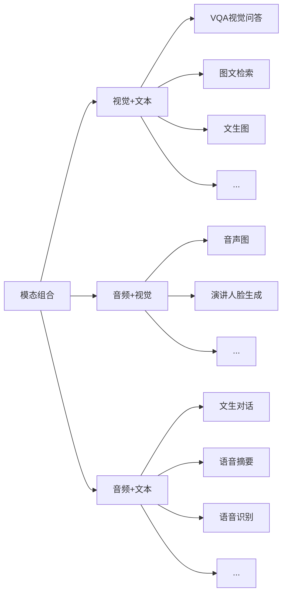

# 1. 大模型的演变

## 1.1. 人工智能的定义和子领域

人工智能按照技术实现的不同可被划分为多个子领域，各个子领域之间往往相互关联和影响。

- **人工智能**：人工智能是一个广泛涉及计算机科学、数据分析、统计学、机器工程、语言学、神经科学、哲学和心理学等多个学科的领域。

- **机器学习**：机器学习可以分为监督学习、无监督学习与强化学习

- **深度学习**：深度学习是机器学习的一个分支，主要使用神经网络模型（由多个隐藏层组成）对数据进行学习和表示。

- **生成式人工智能**：生成式人工智能又是深度学习中快速增长的子集，它们使用了大模型提供支持，在大量原始、未标记的数据基础上对深度学习模型进行预训练，使得机器能够“理解”语言甚至图像，并能够根据需要自动生成内容。

## 1.2. 机器学习

机器学习可以分为监督学习，无监督学习与强化学习，以教一个孩子区分不同的水果为例：

- **监督学习**的工作模式为：你拿着一个苹果和一个香蕉，告诉孩子：“这是苹果，它的形状是圆的，颜色通常是红色或绿色；这是香蕉，它的形状是长条形，颜色通常是黄色。”孩子会学习到特征与类别的对应关系，预测出新拿出的水果是苹果还是香蕉。

- **无监督学习**的工作模式为：你让孩子观察一堆水果，没有直接告诉他每一个水果的名称，而是鼓励他自己找出如何根
据形状，颜色等属性将这些水果分组的方法。

在机器学习中，监督学习与无监督学习都需要你明确地告诉机器（或者说孩子）数据的特征（形状与颜色）是什么，监督学习需要在机器进行学习时人为提供数据对象的类别（如苹果或香蕉），而无监督学习一般没有预设的类别标识，通过机器自动学习数据的分布并将相似的数据对象归为同类（如红色圆形是苹果）。

- **强化学习**的工作模式为：你不会直接教孩子苹果和香蕉的区别，而是每次展示一个水果让他进行判断。如果他判断正确，就给他一个奖励（比如一块糖果）；如果判断错误，则不给奖励。通过反复尝试和反馈，孩子会通过这种奖励机制逐渐学习到如何更准确地判断苹果和香蕉。这种学习过程中的关键在于孩子**需要在探索新的判断方法和利用已有经验之间找到平衡，以最大化获得奖励的次数**。

## 1.3. 深度学习

深度学习算法试图模拟人类大脑的工作方式，其灵感来源于神经生物学，它通过对大量数据的学习，自动提取出数据的高层次特征和模式，从而实现图像识别、语音识别、自然语言处理等任务。按照架构的不同，神经网络可以分为：卷积神经网络（CNNs）、循环神经网络（RNNs）、Transformer网络等等。同样是区分不同水果，这次你带着孩子去了超市，那里有各种不同的水果，你没有解释每种水果的特点，只是给孩子指出了哪些是苹果哪些是香蕉，他通过观察和比较，慢慢学会了辨认各种水果。在这个过程中，孩子的大脑（在这里比喻为深度学习模型）自动从复杂的视觉、嗅觉等信号中提取层次化的特征。比如圆形、条纹、颜色深浅、气味等，从而达到识别水果的目的。

<div align=center>
    </br><center></center>
</div>

# 2. 大模型的使用与训练

## 2.1. 大模型的使用

大模型的使用方法非常简单，我们可以将问题直接向大模型提出需求，就能获得生动翔实的答复。例如：请从技术领先、稳定可靠、安全合规这三点来介绍我们为什么要使用大模型（查询专业知识可以启用知识库检索功能，提升知识问答准确率）

> 🔔在大模型的使用中，一个非常重要的点是提示工程（prompt engineering）。如何优化prompt使得LLM的回答更加有效是一个非常重要的点。

## 2.2. 大模型的训练

大模型的训练整体上分为三个阶段：

1. 预训练（Pre-training）
2. SFT（Supervised Fine-Tuning，监督微调）
3. RLHF（Reinforcement Learning from Human Feedback，基于人类反馈的强化学习）

<div align=center>
    </br><center></center>
</div>

### 2.2.1. 预训练

预训练的过程类似于从婴儿成长为中学生的阶段，在这个阶段我们会学习各种各样的知识，我们的语言习惯、知识体系等重要部分都会形成；对于大模型来说，在这个阶段它会学习各种不同种类的语料，学习到语言的<font color='red'><b>统计规律和一般知识</b></font>。但是大模型在这个阶段只是学会了补全句子，却没有学会怎么样去领会人类的意图，假设我们向预训练的模型提问：“埃菲尔铁塔在哪个国家？”模型有可能不会回答“法国”，而是根据它看到过的语料进行输出：“东方明珠在哪个城市？”这显然不是一个好的答案，因此我们需要让它能够去遵循人类的指示进行回答，这个步骤就是SFT（监督微调）。

预训练（Pre-training）的主要目的是让模型学习语言的通用规律和结构，而不是专门为了实现特定功能如“成语接龙”。

- **预训练的核心目标**：
  - **学习语言模式**：预训练模型通过在大规模文本数据上进行训练，学习语言的语法、语义和上下文关系。例如，它会学习到“猫”和“老鼠”之间的关系，或者“喜欢”和“讨厌”是反义词。
  - **生成自然语言**：预训练模型能够生成符合语言习惯的文本，比如回答问题、写文章、生成对话等。
  - **提供通用语言能力**：预训练模型为后续的微调（如SFT）或强化学习（如RLHF）提供了一个强大的语言基础。

- **成语接龙的功能**：成语接龙是一种特定的语言游戏，需要模型能够：
    - **识别成语**：知道什么是成语，以及成语的结构。
    - **生成成语**：能够根据上一个成语的最后一个字，生成下一个合适的成语。
    - **符合规则**：成语接龙有特定的规则，比如必须是四字成语，且后一个成语的首字必须与前一个成语的尾字相同。

虽然预训练模型在学习语言的过程中，可能会接触到一些成语，但它本身并不是专门为成语接龙设计的。如果要让模型具备成语接龙的功能，通常需要进行以下步骤：

- 数据增强：在预训练阶段，可以增加包含成语的数据，让模型更多地接触成语。
- 监督微调（SFT）：通过标注好的成语接龙数据，对模型进行微调，使其能够更好地完成成语接龙任务。
- 强化学习（RLHF）：通过人类反馈，进一步优化模型的成语接龙能力，比如奖励模型生成更符合规则的成语。

所以，预训练本身并不直接让模型拥有成语接龙的功能，但它为实现这一功能提供了必要的语言基础。

### 2.2.2. SFT（Supervised Fine-Tuning，监督微调）

SFT的过程类似于从中学生成长为大学生的阶段，在这个阶段我们会学习到专业知识，比如金融、法律等领域，我们的头脑会更专注于特定领域。对于大模型来说，在这个阶段它可以学习各种人类的对话语料，甚至是非常专业的垂直领域知识，在监督微调过程之后，它可以按照人类的意图去回答专业领域的问题。这时候我们向经过SFT的模型提问：“埃菲尔铁塔在哪个国家？”模型大概率会回答“法国”，而不是去补全后边的句子。这时候的模型已经可以按照人类的意图去完成基本的对话功能了，但是模型的回答有时候可能并不符合人类的偏好，它可能会输出一些涉黄、涉政、涉暴或者种族歧视等言论，这时候我们就需要对模型进行RLHF（基于人类反馈的强化学习）。

SFT（Supervised Fine-Tuning，监督微调）的主要作用是通过特定的标注数据对预训练模型进行进一步优化，使其更好地适应特定任务或领域的需求。以下是SFT的主要作用和优势：

#### 2.2.2.1. 提高任务性能

- **针对性优化**：预训练模型虽然具备强大的语言能力，但其通用性可能无法满足特定任务的高精度需求。SFT通过在特定任务的标注数据上进行训练，能够使模型更好地理解任务的细节和要求，从而提高任务的性能。
- **减少错误**：通过监督学习，模型可以学习到标注数据中的正确答案，从而减少在该任务上的错误率。

#### 2.2.2.2. 适应特定领域

- **领域适应性**：不同领域（如医疗、法律、金融等）的语言风格和术语有所不同。SFT可以使用特定领域的标注数据对模型进行微调，使其更好地理解和生成该领域的语言。
- **行业特定任务**：例如，在医疗领域，模型可以通过SFT学习医学术语和诊断逻辑；在金融领域，模型可以学习金融报告的格式和分析方法。

#### 2.2.2.3. 优化模型输出

- **控制输出风格**：通过标注数据，可以引导模型生成符合特定风格或要求的文本。例如，可以训练模型生成更正式、更口语化或更简洁的文本。
- **减少有害内容**：通过标注数据，可以训练模型避免生成有害或不当的内容，例如歧视性语言或误导性信息。

#### 2.2.2.4. 提高效率

- **减少训练成本**：与从头开始训练模型相比，SFT只需要在预训练模型的基础上进行少量的训练，大大减少了计算资源和时间成本。
- **快速迭代**：SFT可以快速调整模型以适应新的任务或数据，便于模型的持续优化和迭代。

#### 2.2.2.5. 增强模型的可解释性

- **明确学习目标**：通过标注数据，模型的学习目标更加明确，这有助于理解模型在特定任务上的决策过程。
- **便于调试**：在监督微调过程中，可以更容易地发现模型的不足之处，并针对性地进行调整。

#### 2.2.2.6. 具体应用场景

- **文本分类**：通过标注的文本数据，训练模型对文本进行分类（如情感分析、主题分类等）。
- **问答系统**：使用问答对数据对模型进行微调，使其能够更准确地回答特定领域的问题。
- **文本生成**：通过特定风格的文本数据对模型进行微调，使其生成符合要求的文本（如新闻报道、创意写作等）。

#### 2.2.2.7. 总结

SFT的主要作用是通过标注数据对预训练模型进行针对性优化，使其更好地适应特定任务或领域的需求，提高任务性能，优化输出风格，并增强模型的可解释性和效率。

### 2.2.3. RLHF（Reinforcement Learning from Human Feedback，基于人类反馈的强化学习）

RLHF的过程类似于从大学生步入职场的阶段，在这个阶段我们会开始进行工作，但是我们的工作可能会受到领导和客户的表扬，也有可能会受到批评，我们会根据反馈调整自己的工作方法，争取在职场获得更多的正面反馈。对于大模型来说，在这个阶段它会针对同一问题进行多次回答，人类会对这些回答打分，大模型会在此阶段学习到如何输出分数最高的回答，使得回答更符合人类的偏好。

RLHF（Reinforcement Learning from Human Feedback，基于人类反馈的强化学习）的主要作用是通过人类的直接反馈来优化人工智能模型的行为和输出，使其更符合人类的偏好和价值观。以下是RLHF的主要作用和优势：

#### 2.2.3.1. 优化模型输出

- **提高内容质量**：通过人类对模型生成内容的评分或排序，RLHF能够指导模型生成更高质量、更符合人类期望的文本。
- **增强语境理解**：RLHF可以帮助模型更好地捕捉语言的细微差别，包括情感色彩、文化背景等，从而提升其对复杂语境的理解能力。

#### 2.2.3.2. 提升用户体验

- **改善交互体验**：在对话系统、智能客服等领域，RLHF使模型能够生成更自然、更符合用户期望的回复，提升用户的满意度。
- **个性化服务**：通过人类反馈，模型可以学习到不同用户的偏好，从而提供更个性化的服务。

#### 2.2.3.3. 减少偏见和有害内容

- **纠正潜在偏见**：人类反馈可以帮助模型识别和纠正生成内容中的偏见，提高模型的公平性和安全性。
- **避免有害信息**：在训练过程中，可以通过引导模型避免生成有害或误导性的信息，从而提升其安全性。

#### 2.2.3.4. 提升模型的灵活性和多样性

- **增加生成内容的多样性**：RLHF通过不断引入新的反馈信息，促使模型探索不同的表达路径，增加生成内容的丰富性和趣味性。
- **适应不同场景**：RLHF能够使模型更好地适应多种应用场景，如文本生成、图像生成、机器人控制等。

#### 2.2.3.5. 实现价值观对齐

- **对齐人类价值观**：RLHF通过奖励模型学习人类的偏好，使模型的行为与人类的价值观保持一致，从而更好地服务于人类。
- **持续优化**：RLHF构建了一个闭环反馈系统，模型可以根据人类的动态评价持续优化，实现与人类价值观的深度对齐。

#### 2.2.3.6. 应用场景广泛

- **自然语言处理**：包括对话系统、文本生成、文本摘要等。
- **智能决策**：如机器人控制、自动驾驶、资源管理等。
- **推荐系统**：通过用户反馈优化推荐内容，提高推荐的准确性和个性化。
- **图像与多媒体**：优化图像生成和编辑，使其更符合人类审美。

#### 2.2.3.7. 总结

RLHF通过引入人类反馈作为奖励信号，结合强化学习算法，能够显著提升模型的性能和用户体验，使其更符合人类的期望和价值观。尽管RLHF在实施过程中可能面临一些挑战，如依赖人工标注和处理复杂价值观等问题，但它无疑是提高AI交互质量的关键技术之一。

# 3. 大模型的特点和分类

## 3.1. 大模型的特点

基础大模型（Base Model）主要有以下四个特点：

1. **规模和参数量大**：大模型通过其庞大的规模（拥有从数亿到数千亿级别的参数数量）来捕获复杂的数据模式，使得它们能够理解和生成极其丰富的信息。
2. **广泛数据集的预训练**：大模型使用大量多样化的数据进行预训练，以学习广泛的知识表示，能够掌握语言、图像等数据的通用特征。
3. **适应性和灵活性强**：模型具有很强的适应性和灵活性，能够通过微调（fine-tune）或少样本学习高效地迁移到各种下游任务，有很强的跨域能力。
4. **计算资源需求大**：巨大的模型规模带来了高昂的计算和资源需求，包括但不限于数据存储、训练时间、能量消耗和硬件设施。

## 3.2. 大模型的分类

按照应用场景，大模型可以大致分为：
1. 大语言模型(LLM)
2. 多模态模型
   1. 计算机视觉模型
   2. 音频处理模型
   3. 视频处理模型
   4. ...

### 3.2.1. 大语言模型（Large Language Model）

这类大模型专注于自然语言处理（NLP），旨在处理语言、文章、对话等自然语言文本。它们通常基于深度学习架构（如Transformer模型），经过大规模文本数据集训练而成，能够捕捉语言的复杂性，包括语法、语义、语境以及蕴含的文化和社会知识。语言大模型典型应用包括文本生成、问答系统、文本分类、机器翻译、对话系统等。示例包括：

1. **GPT系列（OpenAI）**：如GPT-3、GPT-3.5、GPT-4等。
2. **Bard（Google）**：谷歌推出的大型语言模型用于提供信息丰富的、有创意的文本输出。
3. **通义千问（阿里云）**：阿里云自主研发的超大规模的语言模型。

### 3.2.2. 多模态模型

多模态大模型能够同时处理和理解来自不同感知通道（如文本、图像、音频、视频等）的数据，并在这些模态之间建立关联和交互。它们能够整合不同类型的输入信息，进行跨模态推理、生成和理解任务。多模态大模型的应用涵盖视觉问答、图像描述生成、跨模态检索、多媒体内容理解等领域。



# 4. 大模型的工作流程

## 4.1. 分词化（Tokenization）与词表映射

分词化（Tokenization）是自然语言处理（NLP）中的重要概念，它是将段落和句子分割成更小的分词（token）的过程。

举一个实际的例子，以下是一个英文句子：

```
I want to study ACA.
```

为了让机器理解这个句子，对字符串执行分词化，将其分解为独立的单元。使用分词化，我们会得到这样的结果：

```
['I', 'want', to', study”, 'ACA', '.']
```

将一个句子分解成更小的、独立的部分可以帮助计算机理解句子的各个部分，以及它们在上下文中的作用，这对于进行大量上下文的分析尤其重要。分词化有不同的粒度分类：

- **词粒度（Word-LevelTokenization）分词化**：如上文中例子所示，适用于大多数西方语言，如英语、法语。
- **字符粒度（Character-Level）分词化**：是中文最直接的分词方法，它是以单个汉字为单位进行分词化。
- **子词粒度（Subword-Level）分词化**：它将单词分解成更小的单位，比如词根、词缀等。这种方法对于处理新词（比如专有名词、网络用语等）特别有效，因为即使是新词，它的组成部分（子词）很可能已经存在于词表中了。

不管是哪种分词方法，得到的每一个结果我们都称之为`token`，每一个`token`都会通过预先设置好的词表，映射为一个`tokenid`，这是`token`的“身份证”，一句话最终会被表示为一个元素为`tokenid`的列表，供计算机进行下一步处理。

<div align=center>
    </br><center></center>
</div>

## 4.2. 文本生成过程

大语言模型的工作概括来说是根据给定的文本预测下一个`token`。对我们来说，看似像在对大模型提问，但实际上是给了大模型一串提示文本，让它可以对后续的文本进行推理。大模型的推理过程不是一步到位的，当大模型进行推理时，它会基于现有的`token`，根据**概率最大原则**预测出下一个最有可能的`token`，然后将该预测的token加入到输入序列中，并将更新后的输入序列继续输入大模型预测下一个`token`，这个过程叫做自回归。直到输出特殊`token`（如`<EOS>`，`end of sentence`，专门用来控制推理何时结束）或输出长度达到阀值。

<div align=center>
    </br><center></center>
</div>

# 5. Agent

## 5.1. Agents是什么?

大语言模型可以接受输入，可以分析&推理、可以输出文字、代码、媒体。然而，其无法像人类一样，拥有规划思考能力、运用各种工具与物理世界互动，以及拥有人类的记忆能力。Al Agents是基于LLM的能够自主理解、自主规划决策、执行复杂任务的智能体。==Agent的设计目的是为了处理那些简单的语言模型可能无法直接解决的问题，尤其是当这些任务涉及到多个步骤或者需要外部数据源的情况==。

- **LLM**：接受输入、思考、输出
- **人类**：LLM（接受输入、思考、输出）+ <font color='red'><b>记忆 + 工具 + 规划</b></font> → Agents

## 5.2. Agents流程图

<div align=center>
    </br><center></center>
</div>

- **规划（Planning）**：
  - 智能体会把大型任务**分解为子任务**，并规划执行任务的流程
  - 智能体会对任务执行的过程进行**思考（Reflection）和反思（Self-Critics）**，从而决定是继续执行任务，或判断任务完结并终止运行
- **记忆（Memory）**：
  - 短期记忆，是指在执行任务的过程中的上下文，会在子任务的执行过程产生和暂存，在任务完结后被清空。
  - 长期记忆是长时间保留的信息，一般是指外部知识库，通常用向量数据库来存储和检索。
- **工具使用（Tools）**：为智能体配备工具API，比如：计算器、搜索工具、代码执行器、数据库查询工具等。有了这些工具API，智能体就可以是物理世界交互，解决实际的问题。
- **执行（Action）**：根据规划和记忆来实施具体行动，这可能会涉及到与外部世界的互动或通过工具来完成任务。

## 5.3. Agents决策流程图

<div align=center>
    </br><center></center>
</div>

- **Perception**：对prompt进行处理后再将输入给LLM
- **Planning**：LLM对任务进行拆解
- **Action**：执行拆解后的子任务
- **Observation**：看一下是不是一个好的结果，如果是则继续循环，否则需要思考下一个Task的Planning是否需要调整

---

**场景**：假设我们有一个智能家居系统，它的任务是根据家庭成员的需求调节室内环境，比如温度和灯光。

1. **感知(Perception)**:
   - 家庭成员通过语音助手说：“我感觉有点冷，能不能把温度调高一些？”
   - 智能家居系统通过语音识别和情感分析技术"感知"到用户觉得房间温度太低，需要提高温度。

2. **规划(Planning)**：
    - 系统根据用户的需求，规划出下一步的行动，决定如何调节房间温度。
    - 系统可能会制定以下计划：
        - 检查当前的室内温度。
        - 根据用户的偏好和当前温度决定升高几度合适。
        - 调整温度设置，并告知用户。

3. **行动（Action）**：
   - 系统执行计划的行动，首先检查当前温度，例如发现室温是20℃。
   - 根据用户的偏好，将温度调高到23℃，并通过语音助手反馈给用户：“我已经将温度调高到23℃，请您稍等，温度将逐渐上升。

4. **观察(Observation)**：
   - 系统观察房间温度的变化，以及用户的反馈。如果用户在几分钟后再次说“现在温度刚刚好”，系统会感知到环境调节成功。
   - 如果用户还觉得冷，系统可能会调整计划，进一步调高温度。

在每个阶段，智能家居系统都可能根据环境变化和用户反馈调整操作。例如，如果调高温度后用户依然觉得冷，系统会重新规划，进一步调整温度设置。通过这一系列的感知、规划、行动和观察，智能家居系统能够动态响应家庭成员的需求，不断调整室内环境，直到用户感觉舒适为止。

## 5.4. 规划

规划，可以为理解观察和思考。如如果用人类来类比当我们接到一个任务，我们的思维模式可能会像下面这样：

1. 首先会思考怎么完成这个任务。
2. 然后会审视手头上所拥有的工具，以及如何使用这些工具高效地达成目的。
3. 再会把任务拆分成子任务。（就像咱们做思维导图一样）
4. 在执行任务的时候，我们会对执行过程进行反思和完善，吸取教训以完善未来的步骤。
5. 执行过程中思考任务何时可以终止。

这是人类的规划能力，我们希望智能体也拥有这样的思维模式，因此可以通过LLM提示工程，为智能体赋予这样的思维模式。在智能体中，最重要的是让LLM具备这以下两个能力：

### 5.4.1. 子任务分解

通过LLM使得智能体可以把大型任务分解为更小的、更可控的子任务，从而能够有效完成复杂的任务。

### 5.4.2. 思维链（Chain of Thoughts, CoT）

思维链已经是一种比较标准的提示技术，能显著提升LLM完成复杂任务的效果。当我们对LLM这样要求「think step by stepJ，会发现LLM会把问题分解成多个步骤，一步一步思考和解决，能使得输出的结果更加准确。这是一种线性的思维方式。

### 5.4.3. 思维树（Tree-of-thought,ToT）

对CoT的进一步扩展，在思维链的每一步，推理出多个分支，拓扑展开成一棵思维树。使用启发式方法评估每个推理分支对问题解决的贡献。选择搜索算法，使用广度优先搜索（BFS）或深度优先搜索（DFS等算法来探索思维树，并进行前瞻和回溯。

<div align=center>
    </br><center></center>
</div>


- **(a) Input-Output Prompting (IO) → 输入-输出提示**：单纯的IO流，中间经过了LLM。
  - **优点**:
    - 简单直观，易于实现和理解。
    - 对于直接的问题和答案匹配非常有效，特别是在封闭式问题场景中。
  - **缺点**:
    - 缺乏灵活性，对于复杂或多步骤的问题处理能力有限。
    - 可能需要大量的示例来覆盖各种情况，增加了数据需求。

-  **(b) Chain of Thought Prompting (CoT) → 思维链提示（或简称CoT）**：对Input进行拆解，以一种线性的思维去解决问题。
   - **优点**:
     - 提高了模型解决复杂问题的能力，通过逐步推理接近解决方案。
     - 能够更好地理解和处理需要逻辑推理的任务。
   - **缺点**:
     - 需要更复杂的提示设计和更高的计算资源。
     - 在某些情况下，可能会因为中间步骤的误差导致最终结果不准确。

- **(c) Self Consistency with CoT (CoT-SC) → 带有自我一致性的思维链提示（或简称CoT-SC）**：拥有多条CoT，最后取方差最小的值。
  - **优点**:
    - 通过生成多个推理路径并选择最一致的答案，提高了答案的准确性。
    - 特别适合处理那些存在多种解法或解释的问题。
  - **缺点**:
    - 计算成本更高，因为需要为同一问题生成多个推理路径。
    - 设计良好的自一致性评估机制是一个挑战。

- **(d) Tree of Thoughts (ToT) → 思维树（或简称ToT）**：
  - **优点**:
    - 允许探索不同的解决问题分支，找到最优解或创意性解决方案。
    - 对于开放性问题和创新性思考特别有用。
  - **缺点**:
    - 实现起来比其他方法更为复杂，要求对问题有深刻的理解才能有效地构建思维树。
    - 计算资源消耗大，尤其是当思维树变得庞大时。
