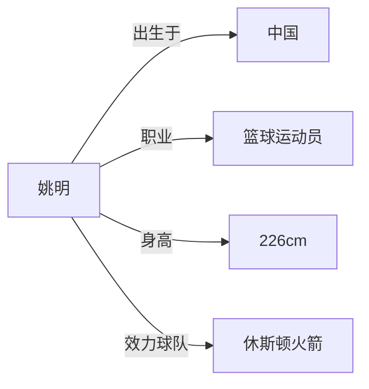
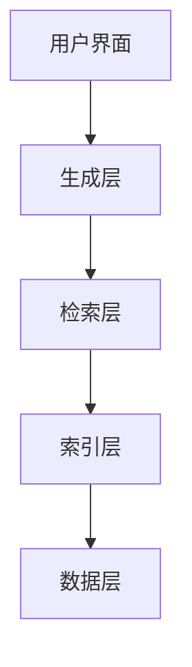
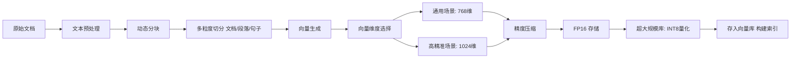
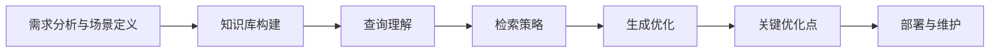
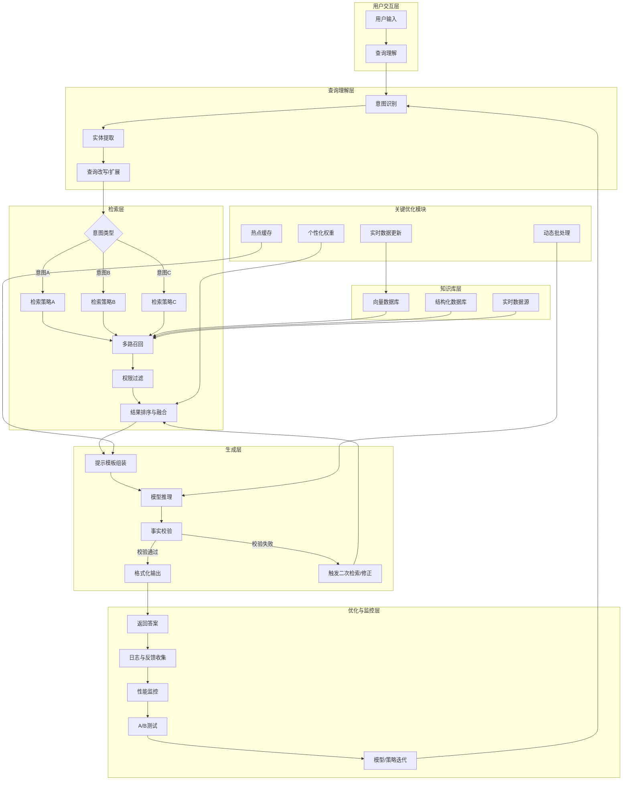

# 1. 引言
## 1.1. RAG 技术概述
###  1.1.1. RAG 的基本原理
RAG的核心思想是让模型在回答问题时能够参考外部知识库中的信息，就像人类在考试时可以查阅资料一样。具体来说，RAG系统主要包括以下三个步骤：

1. **索引（Indexing）**：将外部知识库中的文档进行预处理，如分词、去停用词等，然后将其转换为向量表示，并存储到向量数据库中。这个过程就像是为知识库中的每一篇文档建立一个索引，以便后续能够快速检索。
2. **检索（Retrieval）**：当用户提出问题时，系统首先将问题转换为向量表示，然后在向量数据库中进行检索，找到与问题最相关的文档或文档片段。这个过程类似于在图书馆中通过索引查找相关书籍。
3. **生成（Generation）**：将检索到的文档或文档片段与原始问题一起输入到语言模型中，模型根据这些信息生成回答。通过引入外部知识，模型能够生成更准确、更有依据的回答。

### 1.1.2. RAG 与其他技术的对比
与传统的语言模型微调（Fine-tuning）技术相比，RAG具有以下优势：

1. **时效性**：RAG能够实时获取外部知识库中的最新信息，而微调需要重新训练模型，无法及时反映知识的更新。
2. **灵活性**：RAG可以轻松地接入不同的知识库，适用于各种领域和任务，而微调通常针对特定的数据集和任务进行，通用性较差。
3. **成本效益**：RAG不需要对大规模的模型进行微调，降低了计算成本和时间成本。

---

与信息检索（IR）系统相比，RAG的优势在于：

1. **自然语言处理能力**：RAG能够理解用户的自然语言问题，并生成自然语言回答，而传统的IR系统通常只能返回相关的文档列表。
2. **知识整合能力**：RAG能够将检索到的知识与模型的先验知识进行整合，生成更全面、更准确的回答。

---

---

> 🤔 𝑸𝒖𝒆𝒔𝒕𝒊𝒐𝒏：什么是IR系统？
>
> 🥳 𝑨𝒏𝒔𝒘𝒆𝒓：信息检索（IR）系统是一种用于从大规模文档集合中找出满足用户信息需求的相关系统。其典型代表是传统搜索引擎（如早期的Google、百度），工作流程如下：
>
> + 用户输入**查询**（通常是关键词或自然语言短语）。
> + 系统在预构建的**索引**中快速匹配包含这些词的文档。
> + 通过排序算法（如TF-IDF、BM25）计算文档与查询的相关性。
> + 最终返回一个**文档列表**（通常按相关性降序排列），用户需自行浏览并筛选所需信息。
>
> <font style="background-color:#FBDE28;">IR系统的核心输出是文档本身，而不是直接生成答案</font>。这与RAG不同：RAG在检索后还会利用生成模型对文档内容进行综合理解并生成自然语言回答。
>

## 1.2. 字节跳动业务线中的 RAG 应用现状
字节跳动的多个业务线已经成功应用了RAG技术，并取得了显著的效果。例如：

1. **智能客服**：在客服场景中，RAG技术能够快速从知识库中检索到相关的解决方案，帮助客服人员更高效地回答用户问题，提高用户满意度。
2. **智能写作助手**：在写作场景中，RAG技术可以为用户提供相关的资料和灵感，辅助用户创作出更优质的内容。
3. **知识图谱构建**：通过RAG技术，可以从大量的文本数据中提取相关信息，填充和完善知识图谱，提高知识图谱的准确性和完整性。
4. **个性化推荐**：RAG技术能够根据用户的兴趣和问题，从知识库中检索相关的内容，为用户提供更个性化的推荐服务。

---

---

> 🤔 𝑸𝒖𝒆𝒔𝒕𝒊𝒐𝒏：什么是知识图谱？
>
> 🥳 𝑨𝒏𝒔𝒘𝒆𝒓：知识图谱是一种用**图结构**来组织和表示知识的数据模型，旨在让机器能够理解和处理人类世界的实体及其复杂关系。
>
> **核心要素：**
>
> + **实体（节点）**：现实世界中的对象，如“姚明”、“中国”。
> + **关系（边）**：实体之间的语义联系，如“出生于”、“任职于”。
> + **属性**：实体的特征描述，如姚明的“身高：226cm”。
>
> 与传统数据库（存储表格）不同，知识图谱强调**关联性**，数据以三元组形式存储：`(头实体, 关系, 尾实体)` 或 `(实体, 属性, 属性值)`。
>
> 例如，关于“姚明”的简单知识图谱：
>




# 2. 字节跳动的 RAG 系统架构设计
## 2.1. 整体架构概述
字节跳动的RAG系统通常采用分层架构设计，主要包括数据层、索引层、检索层和生成层，如下图所示：



1. **数据层（Data）**：负责存储和管理外部知识库中的数据，包括结构化数据（如数据库中的表格）、半结构化数据（如XML、JSON文件）和非结构化数据（如文本文件、PDF文档）。数据层需要具备高效的数据存储和读取能力，以支持大规模数据的处理。
2. **索引层（Indexing）**：将数据层中的数据转换为向量表示，并构建相应的索引结构，存储到向量数据库中。索引层的主要任务是提高数据检索的效率，确保能够快速准确地找到与问题相关的信息。
3. **检索层（Retrieval）**：接收用户的问题，将其转换为向量表示，然后在索引层的向量数据库中进行检索，返回与问题最相关的文档或文档片段。检索层需要具备高效的检索算法和策略，以提高检索的准确率和召回率。
4. **生成层（Generation）**：将检索层返回的文档或文档片段与原始问题一起输入到语言模型中，生成最终的回答。生成层需要选择合适的语言模型，并对其进行优化，以提高生成回答的质量和效率。

## 2.2. 数据层设计
### 2.2.1. 数据来源与类型
字节跳动的RAG系统的数据来源非常广泛，包括内部知识库、外部网站、学术论文、行业报告等。数据类型也多种多样，主要包括以下几类：

1. **文本数据**：这是最常见的数据类型，包括新闻文章、博客、论坛帖子、产品说明书等。文本数据可以直接进行处理和分析，<font style="background-color:#FBDE28;">但需要进行预处理</font>，如分词、去停用词、词性标注等。
2. **结构化数据**：如数据库中的表格数据，包括用户信息、产品信息、订单信息等。结构化数据可以通过SQL查询等方式进行处理，但需要将其转换为适合RAG系统处理的格式。
3. **半结构化数据**：如XML、JSON文件，这类数据既有一定的结构，又包含非结构化的文本内容。处理半结构化数据需要结合结构化数据和文本数据的处理方法。
4. **多媒体数据**：如图像、音频、视频等，虽然RAG系统主要处理文本数据，但在某些场景下，也需要结合多媒体数据的信息。例如，在处理图片描述时，可以将图片的特征信息与文本信息结合起来

---

---

> 🤔 𝑸𝒖𝒆𝒔𝒕𝒊𝒐𝒏：分词、去停用词、词性标注大概是什么意思？
>
> 🥳 𝑨𝒏𝒔𝒘𝒆𝒓：
>
> + **分词（Tokenization/Word Segmentation）：**将连续的文本序列切分成独立的**词元（Token）**的过程。词元可以是单词、子词或字符，是后续处理的基本单元。
>     - **作用**：将非结构化文本结构化，便于计算机理解和索引。
>     - **示例**：句子 “我爱北京天安门” 经过分词得到 `[“我”, “爱”, “北京”, “天安门”]`。
>     - **在RAG中**：文档在被向量化或建立索引前，通常需要先分词，确保检索和生成的粒度合理。
> + **去停用词（Stop Word Removal）：**移除文本中高频出现但对语义贡献较小的词（如“的”、“是”、“在”、“了”等）。这些词在多数检索任务中会干扰主要内容的匹配。
>     - **作用**：减少噪音，降低索引大小，提高检索效率。
>     - **示例**：句子 “这是一只可爱的猫” 去停用词后得到 `[“可爱”, “猫”]`。
>     - **在RAG中**：可应用于传统检索（如BM25）的预处理阶段，但在基于向量的语义检索中，是否去除停用词取决于具体模型（部分模型会保留以保持句意完整）。
> + **词性标注（Part-of-Speech Tagging, POS Tagging）：**为每个分词结果标注其语法类别，如名词（n）、动词（v）、形容词（a）等。
>     - **作用**：帮助理解词语在上下文中的语法功能，可用于实体识别、句法分析等。
>     - **示例**：句子 “他正在游泳” 可能标注为 `他/代词 正在/副词 游泳/动词`。
>     - **在RAG中**：较少直接用于检索，但在高级的查询理解和文档解析中，可通过词性识别关键实体或意图，从而优化检索策略。
>

---

---

> 🤔 𝑸𝒖𝒆𝒔𝒕𝒊𝒐𝒏：为什么XML和JSON是半结构化数据，它们的格式挺固定的呀
>
> 🥳 𝑨𝒏𝒔𝒘𝒆𝒓：XML和JSON确实有**固定的语法格式**（标签、括号、键值对），但计算机科学中将其归类为“半结构化数据”是基于数据**模式的可变性**和组织方式，而非语法的严格性。与结构化数据（如关系型数据库表）的核心区别在于：
>
> 1. **模式不固定**
>

```json
// 同一个JSON数组，记录结构可以不同
[
  {"name": "张三", "age": 30},                         // 只有两个字段
  {"name": "李四", "age": 25, "department": "销售"}     // 多了一个字段
]
```

>     - **结构化数据**：必须先定义严格的**模式（Schema）**，例如一个“员工表”必须固定有“姓名、年龄、部门”三列，每一行数据都必须符合这个结构。
>     - **半结构化数据**：**数据本身携带模式信息**（即自描述），但同一个文件中的不同记录可以有不同的字段。例如一个JSON数组中，第一条记录有“姓名”和“年龄”，第二条记录可以多一个“职位”字段，甚至完全不同的字段集。
> 2. **数据与模式未分离**
>     - **结构化数据**：模式存储在数据库字典中，数据按行/列整齐排列，查询时由数据库引擎解析。
>     - **半结构化数据**：标签或键名与数据值混合存储，解析时需要实时提取这些“元信息”。例如XML中的`<name>`既是数据内容也是字段标识。
> 3. **层次性而非严格二维表**
>     - 结构化数据通常强制要求二维表形式（行和列）。
>     - XML/JSON支持嵌套结构，可以表达复杂的树形或图状关系，这更接近真实世界的文本描述，但又不像纯文本那样完全无规则。
>
> 在CV领域可以找到一个类比：
>
> + **结构化数据**：一个固定格式的标注文件，每行都是 `(image_id, class_id, x_min, y_min, x_max, y_max)`，每张图片的标注行数可以不同，但每行的字段数和类型必须完全一致。
> + **半结构化数据**：COCO数据集的JSON标注格式，每个图片的标注信息可以包含不同的属性（如是否遮挡、是否截断），某些图片可能有`iscrowd`字段，某些没有。
> + **非结构化数据**：原始的JPEG图片文件本身，没有任何内部结构告诉计算机“这张图里有一只猫”。
>
> 所以在RAG的数据层中，称XML/JSON为“半结构化”是因为：
>
> + 它们比纯文本（非结构化）多了标签和键值对，易于程序解析。
> + 但它们又不像数据库表那样强制严格统一的字段，可以灵活描述不同实体的不同属性，更接近人类书写的自由文本的结构化版本。
>

---

---

> 🤔 𝑸𝒖𝒆𝒔𝒕𝒊𝒐𝒏：那YAML也是半结构化数据吗？
>
> 🥳 𝑨𝒏𝒔𝒘𝒆𝒓：<font style="color:rgb(15, 17, 21);">是的，YAML也属于半结构化数据。它与JSON、XML在本质上相同，都是</font>**<font style="color:rgb(15, 17, 21);">自描述</font>**<font style="color:rgb(15, 17, 21);">且</font>**<font style="color:rgb(15, 17, 21);">模式灵活</font>**<font style="color:rgb(15, 17, 21);">的数据格式。</font>
>

### 2.2.2. 数据存储与管理
为了高效地存储和管理不同类型的数据，字节跳动采用了多种数据存储技术，包括关系型数据库、非关系型数据库和文件系统。

1. **关系型数据库**：适用于存储结构化数据，如MySQL、PostgreSQL等。关系型数据库具有良好的数据一致性和事务处理能力，能够满足对数据准确性和完整性要求较高的场景。
2. **非关系型数据库**：如MongoDB、Redis等，适用于存储半结构化和非结构化数据。非关系型数据库具有高扩展性和高性能的特点，能够快速处理大量的非结构化数据。
3. **文件系统**：对于一些大型的文本文件、PDF文档等，可以直接存储在文件系统中，如Hadoop分布式文件系统（HDFS）。文件系统适合存储大规模的非结构化数据，并提供了高效的数据读取和写入接口。

在数据管理方面，字节跳动采用了数据湖和数据仓库相结合的架构。数据湖用于存储原始的、未经处理的数据，保留了数据的多样性和原始性；数据仓库则用于存储经过清洗、转换和整合的数据，以支持数据分析和决策。通过数据湖（Data Lake）和数据仓库（Data Warehouse）的协同工作，能够更好地满足RAG系统对数据的需求。

## 2.3. 索引层设计
### 2.3.1. 嵌入模型选择
索引层的核心任务是将文本数据转换为向量表示，这个过程需要使用嵌入模型（Embedding Model）。字节跳动在实践中使用了多种嵌入模型，包括基于Transformer架构的预训练模型，如BERT、GPT等。这些模型能够将文本映射到高维向量空间中，使得语义相近的文本在向量空间中的距离也相近。  
在选择嵌入模型时，需要考虑以下几个因素：

1. **模型性能**：包括模型的准确性、召回率等指标。通常，模型的参数量越大，性能越好，但计算成本也越高。
2. **计算资源**：根据实际的计算资源情况，选择适合的模型。如果计算资源有限，可以选择一些轻量级的模型。
3. **任务需求**：不同的任务对嵌入模型的要求可能不同。例如，在文本分类任务中，可能更关注模型对文本主题的表达能力；而在语义相似度计算任务中，更关注模型对文本语义的理解能力。

---

---

> 🤔 𝑸𝒖𝒆𝒔𝒕𝒊𝒐𝒏：BERT和GPT都是LLM，它们默认会有回答对吧。那么直接使用二者进行Embedding任务，是截取它Head位置的输出吗，还是说它内置了一个Embedding模型？
>
> 🥳 𝑨𝒏𝒔𝒘𝒆𝒓：BERT和GPT这类大语言模型（LLM）的核心能力是学习文本的**上下文表示**（即生成Embedding），而非“默认生成回答”。生成回答只是它们的一种应用方式（<font style="background-color:#FBDE28;">通常需要额外的输出层或微调</font>）。当直接用于Embedding任务时，它们的内部机制本身就是**生成向量**，具体操作如下：
>
> + **获取向量位置**：不是截取某个“Head”（注意力头），而是取模型**最后一层输出的隐藏状态**（Hidden States），这是所有注意力头信息融合后的结果，维度通常为 $ [序列长度, 隐藏层维度] $。
> + **池化策略**：从所有Token的向量中提炼出一个固定维度的句子向量。常见做法：
>     - 对于BERT（Encoder模型）：取特殊标记 `[CLS]` 对应的向量，或对所有Token向量进行**平均池化**（Mean Pooling）。
>     - 对于GPT（Decoder模型）：由于是单向注意力，常取**最后一个Token**的向量（因其聚合了全句信息），或同样使用平均池化。
>
> 因此，BERT和GPT**内置了Embedding能力**——它们通过预训练任务（如MLM、语言建模）学会了如何将文本映射到语义空间，无需额外嵌入模块。直接使用模型前向传播得到的隐藏状态，并配合适当的池化方法，即可获得高质量的文本向量。
>

---

---

> 🤔 𝑸𝒖𝒆𝒔𝒕𝒊𝒐𝒏：比如我输入一段话“我要学习RAG”，将其送给BERT或者GPT后，它们会对其进行Embedding处理，这个Embedding不是分词吗，而是用一个向量来表示这句话？
>
> 🥳 𝑨𝒏𝒔𝒘𝒆𝒓：输入“我要学习RAG”后，模型并非直接用一个向量表示整句话，而是**先分词，再为每个词生成向量，最后聚合为句子向量**。详细步骤：
>
> 1. **<font style="color:rgb(15, 17, 21);">输入文本</font>**<font style="color:rgb(15, 17, 21);">：“我要学习RAG”</font>
> 2. **<font style="color:rgb(15, 17, 21);">分词器</font>**<font style="color:rgb(15, 17, 21);">：将文本转换为Token ID序列，例如BERT的输入</font><font style="color:rgb(15, 17, 21);"> </font>`<font style="color:rgb(15, 17, 21);background-color:rgb(235, 238, 242);">[101, 2769, 4263, 3352, 784, 102]</font>`
> 3. **<font style="color:rgb(15, 17, 21);">嵌入层</font>**<font style="color:rgb(15, 17, 21);">：将每个Token ID映射为768维向量，得到Token向量序列</font>
> 4. **<font style="color:rgb(15, 17, 21);">池化层</font>**<font style="color:rgb(15, 17, 21);">：对Token向量序列进行聚合（如取</font>`<font style="color:rgb(15, 17, 21);background-color:rgb(235, 238, 242);">[CLS]</font>`<font style="color:rgb(15, 17, 21);">向量或平均池化），得到最终句子向量（768维）</font>
>
> <font style="color:rgb(15, 17, 21);">我们对其进行说明：</font>
>
> 1. **分词**：将句子拆分为模型词表中的子词/词元，例如 `[CLS] 我 要 学 习 RAG [SEP]`（BERT），得到一系列 **Token ID**。
> 2. **嵌入**：每个 Token ID 通过**嵌入层**（Embedding Layer）映射为一个高维向量（如768维），形成向量序列。这一步骤将离散符号转化为连续向量，即**词嵌入**。
> 3. **池化**：由于后续任务（如检索）需要一个固定长度的句子向量，需对向量序列进行聚合：
>     - 取 `[CLS]` 位置的向量（BERT）
>     - 对所有 token 向量取平均（Mean Pooling）
>     - 取最后一个 token 向量（GPT）
>
> 因此，你最终得到的**句子向量**是一个固定长度的向量（如768维），它综合了整个句子的语义信息，用于衡量文本间的相似度。
>
> 所以，**Embedding 不是分词**，而是将分词后的每个符号转化为向量，再通过池化得到句子级向量。
>

---

---

> 🤔 𝑸𝒖𝒆𝒔𝒕𝒊𝒐𝒏：对于BERT或者GPT而言，分词器是一个方法，比如“我”这个词的Token ID是固定的。如果是固定的，那么Embedding的结果也是固定的？
>
> 🥳 𝑨𝒏𝒔𝒘𝒆𝒓：是的，你的理解完全正确。分词器（Tokenizer）的核心功能就是基于固定的**词汇表**（Vocabulary）将文本中的词或子词映射为对应的 **Token ID**。这个映射关系在模型预训练完成后就固定下来，不会改变。
>
> + 例如在BERT-base-chinese中，汉字“我”在词汇表中的ID是固定的（如 `2769`）。
> + 对于基于子词的GPT（如BPE），虽然“学习”可能被拆分为“学”和“习”，但每个子词对应的ID也是固定的。
>
> 因此，只要分词器将“我”作为一个独立的Token输出，其ID就是那个固定的值。
>

---

---

> 🤔 𝑸𝒖𝒆𝒔𝒕𝒊𝒐𝒏：分词器的输出就是BERT/GPT模型的输入，对吗？
>
> 🥳 𝑨𝒏𝒔𝒘𝒆𝒓：是的，完全正确。分词器的输出——**Token ID 序列**——就是 BERT/GPT 模型的直接输入。模型本身无法理解原始文本字符串，只能处理数值化的 ID。
>
> + 分词器负责将文本转化为模型词汇表中对应的 ID。
> + 模型接收这些 ID，通过嵌入层将其转换为向量，再进行后续的上下文编码。
>
> 因此，**分词器是连接原始文本和语言模型的桥梁**，其输出格式和内容必须严格符合模型预训练时的要求（如 BERT 要求输入必须以 `[CLS]` 开头、以 `[SEP]` 结尾）。
>

---

---

> 🤔 𝑸𝒖𝒆𝒔𝒕𝒊𝒐𝒏：在分词器Tokenizer对输入处理完送入模型后，模型就开始对这些Token进行Embedding了对吧，最后得到的结果是什么？
>
> 🥳 𝑨𝒏𝒔𝒘𝒆𝒓：当Token ID序列输入模型后，整个处理流程如下：
>
> 1. **嵌入层映射**：每个Token ID首先通过嵌入层（Embedding Layer）转换为对应的**初始向量**（即词嵌入）。此时，每个词获得一个固定长度的向量（如BERT为768维），但此时这些向量**尚未包含上下文信息**。
> 2. **多层编码**：初始向量随后依次通过多个Transformer层（BERT为Encoder层，GPT为Decoder层）。每一层都利用**自注意力机制**，让每个Token的表示融合其他Token的信息。例如，句子“我要学习RAG”中，“学习”的表示会融入“我”和“RAG”的信息。
> 3. **最终输出**：经过所有Transformer层后，模型输出的是**每个Token对应的上下文相关向量**，称为**隐藏状态**（Hidden States）。其形状为：
>     - BERT：`[序列长度, 隐藏层维度]`，例如 `[6, 768]`（6个Token）
>     - GPT：同样为 `[序列长度, 隐藏层维度]`
>
> **最终结果的具体形式**：
>
> + 这是一个三维结构（批处理时为三维）：
>     - **维度1（序列长度）**：对应输入序列的每个Token位置
>     - **维度2（隐藏层维度）**：每个Token的语义向量（如768维）
> + 例如，对于输入“我要学习RAG”（6个Token），输出是一个 `6×768` 的矩阵，矩阵的**每一行代表一个Token在特定上下文中的语义向量**。
>
> **这些输出的用途**：
>
> + **取 **`[CLS]`** 向量**（BERT）：将第一个特殊Token的输出作为句子向量，用于分类或检索。
> + **平均池化**：对所有Token的输出求平均，得到句子级向量，常用于相似度计算。
> + **取最后一个Token**（GPT）：作为生成下一个词的条件，或经池化用于检索。
> + **直接使用**：每个Token的向量可用于序列标注任务（如命名实体识别）。
>
> 因此，**模型最终输出的是一系列经过上下文编码的Token向量**，而非单一的句子向量。句子向量需要进一步从这些Token向量中通过池化策略提取。
>

### 2.3.2. 向量数据库选型
向量数据库用于存储和管理文本的向量表示，是索引层的重要组成部分。字节跳动在实践中使用了多种向量数据库，如Milvus、Faiss等。这些向量数据库具有高效的向量检索能力，能够在大规模向量数据中快速找到与查询向量最相似的向量。  
在选择向量数据库时，需要考虑以下几个因素：

1. **检索性能**：包括检索速度、准确率、召回率等指标。不同的向量数据库在检索性能上可能存在差异，需要根据实际需求进行选择。
2. **数据规模**：根据数据量的大小选择合适的向量数据库。一些向量数据库在处理大规模数据时具有更好的扩展性和性能。
3. **功能特性**：如支持的索引类型、数据存储方式、多模态支持等。不同的向量数据库可能提供不同的功能特性，需要根据具体的业务需求进行选择。

---

---

> 🤔 𝑸𝒖𝒆𝒔𝒕𝒊𝒐𝒏：为什么使用的是向量数据库，与普通的数据库有什么区别，不能使用普通数据库来实现吗？
>
> 🥳 𝑨𝒏𝒔𝒘𝒆𝒓：向量数据库是专门用于存储、索引和查询**高维向量数据**的数据库系统。它不同于普通数据库之处在于处理的核心数据类型和查询方式：普通数据库处理结构化标量数据（数字、字符串），通过精确匹配或规则查询（如 `WHERE age > 18`）；向量数据库处理机器学习模型生成的嵌入向量（如 `[0.235, -0.817, ..., 0.563]`），通过**近似最近邻（ANN）搜索**找出与查询向量最相似的向量。
>
> 以下是详细对比和为什么RAG必须使用向量数据库的原因：
>

| 维度 | 普通数据库（如 MySQL） | 向量数据库（如 Milvus） |
| :--- | :--- | :--- |
| **核心数据类型** | 标量：数字、字符串、日期、布尔值 | 向量：固定长度的浮点数数组 + 可附加标量 |
| **索引结构** | B-Tree、哈希索引（针对精确匹配或范围查询） | ANN索引：HNSW、IVF、PQ（针对高维空间最近邻） |
| **查询方式** | 精确匹配、关键词、范围、聚合 | **相似度查询**：给定向量，返回Top-K个最相似的向量（欧氏距离、余弦相似度、点积） |
| **核心操作** | CRUD + 关联查询 | 向量相似度搜索 + 标量过滤 |
| **性能表现** | 数据量增大时，B-Tree性能下降较慢；但对高维向量**无法有效索引**，只能全表扫描 | 十亿级数据下，毫秒级返回最近邻结果，但**结果通常是近似的**（允许一定误差换取速度） |


> 🤔 𝑸𝒖𝒆𝒔𝒕𝒊𝒐𝒏：能否用普通数据库实现RAG？
>
> 🥳 𝑨𝒏𝒔𝒘𝒆𝒓：**技术上可以实现，但工程上不可行。**RAG的检索层核心需求是：从百万/亿级文档片段中，毫秒级找到与用户问题语义最相似的Top-K个片段。如果用普通数据库实现，会遇到以下问题：
>
> 1. **全表扫描导致性能崩溃**  
假设存储1000万条768维向量（如BERT输出），每条向量占约3KB（768 × 4字节）。全表扫描需要计算1000万次余弦相似度，单次查询耗时秒级以上，完全无法满足在线服务需求。
> 2. **无法利用索引加速**  
普通数据库的B-Tree索引只能处理一维有序数据，而高维空间中的“相似度”并非有序关系。例如，向量`[0.1, 0.9]`可能与`[0.11, 0.89]`相似，但与`[0.9, 0.1]`不相似——这种关系无法用B-Tree加速。
> 3. **缺乏专用近似算法**  
向量数据库采用近似最近邻（ANN）算法，通过牺牲微小精度（通常<5%）换取几个数量级的性能提升。例如HNSW算法构建可导航图，搜索时仅访问图中部分节点即可定位最近邻区域。普通数据库没有这些算法实现。
> 4. **功能集成度低**  
RAG往往需要先过滤（如“仅检索2024年的文档”）再搜索，或混合检索（向量相似度 + 关键词匹配）。向量数据库原生支持这些混合查询，而普通数据库需要复杂拼接和多次查询。
>

> 🤔 𝑸𝒖𝒆𝒔𝒕𝒊𝒐𝒏：为什么必须用向量数据库？
>
> 🥳 𝑨𝒏𝒔𝒘𝒆𝒓：
>
> + **RAG的核心是语义检索**：用户问题与文档片段的匹配不是关键词匹配，而是语义层面的相似度。这必须通过向量间距离度量来实现。
> + **数据规模巨大**：企业级RAG系统常处理海量文档，必须依赖专门索引和近似搜索算法。
> + **响应速度要求**：RAG作为对话系统的一部分，要求检索在毫秒级完成，否则影响用户体验。
>

## 2.4. 检索层设计
### 2.4.1. 检索算法与策略
检索层的主要任务是根据用户的问题，在索引层的向量数据库中进行检索，找到与问题最相关的文档或文档片段。字节跳动在实践中使用了多种检索算法和策略，包括基于余弦相似度的检索、基于BM25算法的检索等。

1. **余弦相似度检索**：将用户问题和文档的向量表示进行余弦相似度计算，相似度越高，说明文档与问题越相关。余弦相似度检索是一种简单而有效的检索方法，适用于大多数场景。
2. **BM25算法检索**：BM25算法是一种基于词频-逆文档频率（TF-IDF）的检索算法，它考虑了词在文档中的出现频率和在整个文档集中的稀有程度。BM25算法在处理短文本检索时具有较好的效果。

在实际应用中，通常会结合多种检索算法和策略，以提高检索的准确率和召回率。例如，可以先使用基于余弦相似度的检索方法进行初步检索，然后再使用BM25算法对检索结果进行重排序，以进一步提高检索结果的质量。

### 2.4.2. 检索结果处理
检索层返回的结果通常是一个文档或文档片段的列表，需要对这些结果进行进一步的处理，以满足生成层的需求。字节跳动在实践中主要进行了以下几种处理：

1. **结果排序**：根据检索算法计算得到的相似度得分，对检索结果进行排序，将最相关的文档或文档片段排在前面。
2. **结果过滤**：根据一些预设的规则，对检索结果进行过滤，去除一些不相关或低质量的结果。例如，可以根据文档的来源、发布时间等信息进行过滤。
3. **结果摘要**：为了减少输入到生成层的信息量，提高生成效率，可以对检索结果进行摘要提取。例如，可以使用TextRank算法等自动提取文档的关键句子作为摘要。

## 2.5. 生成层设计
### 2.5.1. 语言模型选择与优化
生成层的核心任务是根据检索层返回的文档或文档片段，结合原始问题，生成最终的回答。字节跳动在实践中使用了多种语言模型，包括自研的云雀模型以及一些开源的语言模型，如GPT系列模型。  
在选择语言模型时，需要考虑以下几个因素：

1. **模型性能**：包括模型的语言生成能力、准确性、逻辑性等指标。通常，模型的参数量越大，性能越好，但计算成本也越高。
2. **应用场景**：不同的应用场景对语言模型的要求可能不同。例如，在对话场景中，需要模型具有良好的上下文理解能力和对话生成能力；而在写作场景中，需要模型能够生成高质量的文本内容。
3. **计算资源**：根据实际的计算资源情况，选择适合的模型。如果计算资源有限，可以选择一些轻量级的模型。

---

为了提高语言模型的性能，字节跳动还对模型进行了一系列的优化，包括：

1. **模型微调**：使用特定领域的数据集对预训练模型进行微调，以提高模型在该领域的表现。
2. **提示工程（Prompt Engineering）**：设计合适的提示词，引导模型生成更符合需求的回答。例如，在生成回答时，可以在提示词中加入一些示例（我们之前提到的few-shot），帮助模型更好地理解用户的意图。
3. **上下文管理**：在多轮对话场景中，有效地管理上下文信息，使模型能够更好地理解用户的问题，生成连贯的回答。

### 2.5.2. 生成结果评估与反馈
生成层生成的回答需要进行评估，以确保回答的质量和准确性。字节跳动在实践中使用了多种评估方法，包括人工评估和自动评估。

1. **人工评估**：由专业的评估人员对生成的回答进行评估，根据回答的准确性、完整性、逻辑性等指标进行打分。人工评估的优点是评估结果准确可靠，但成本较高，效率较低。
2. **自动评估**：使用一些自动评估指标，如BLEU、ROUGE等，对生成的回答进行评估。自动评估的优点是速度快、成本低，但评估结果可能不够准确。

在实际应用中，通常会结合人工评估和自动评估的方法，对生成结果进行全面的评估。同时，根据评估结果，对RAG系统进行反馈和优化，不断提高系统的性能和质量。

# 3. 数据处理与准备
## 3.1. 数据收集与清洗
### 3.1.1. 数据收集渠道
在字节跳动的RAG实践中，数据收集是构建强大知识库的基础。我们通过多种渠道广泛收集数据，以确保知识的全面性和多样性。

1. **内部知识库**：字节跳动拥有丰富的内部业务数据，如产品文档、技术手册、客服知识库等。这些数据直接来源于公司的日常运营，与业务紧密相关，对于解决业务特定问题具有极高的价值。例如，在智能客服场景中，内部的产品使用常见问题解答文档能够帮助快速响应用户咨询。
2. **行业数据库**：订阅专业的行业数据库，获取权威的行业报告、研究论文、统计数据等。例如，在金融业务线，通过订阅金融数据提供商的数据库，可以获取最新的市场行情、公司财报等信息，为投资决策分析提供数据支持。
3. **公开网络资源**：利用网络爬虫技术，从权威网站、新闻媒体、行业论坛等公开渠道收集相关信息。但在采集过程中，严格遵守法律法规和网站的使用条款，确保数据的合法性。例如，在资讯业务中，从各大新闻网站收集时事新闻，为用户提供及时准确的信息。

### 3.1.2. 数据清洗规则
<font style="background-color:#FBDE28;">收集到的数据往往包含噪声和错误信息</font>，需要进行清洗以提高数据质量。字节跳动制定了一系列严格的数据清洗规则：

1. **去除重复数据**：使用哈希算法或其他去重技术，识别并删除完全相同的数据记录，避免在后续处理中造成冗余计算。例如，在处理大量新闻文章时，去除重复发布的内容。
2. **纠正拼写和语法错误**：利用自然语言处理工具，如NLTK、Stanford CoreNLP等，对文本数据中的拼写和语法错误进行检测和纠正。这有助于提高文本的可读性和语义理解准确性。
3. **处理缺失值**：
    - 对于结构化数据中的缺失值，根据数据特点和业务需求选择合适的处理方法。如对于数值型数据，可以使用均值、中位数填充
    - 对于文本型数据，如果缺失值较多且对业务影响不大，可以考虑删除相关记录
4. **过滤无效数据**：根据业务规则，过滤掉不符合要求的数据。例如，在客服知识库中，删除已经失效的解决方案或过期的信息。

## 3.2. 文本预处理
### 3.2.1. 分词与词性标注
+ **分词**：分词是将连续的文本分割成独立的词语单元，是文本处理的基础步骤。字节跳动在RAG系统中主要使用基于深度学习的分词工具，如结巴分词的改进版本。这些工具能够准确处理中文的复杂词汇和短语，同时支持自定义词典，方便加入业务特定的术语。
+ **词性标注：**词性标注则是为每个词语标注其词性，如名词、动词、形容词等。这有助于理解文本的语法结构和语义信息，为后续的文本分析提供支持。使用的词性标注工具通常与分词工具集成，如哈工大LTP工具包，能够高效准确地完成词性标注任务。

---

---

> 🤔 𝑸𝒖𝒆𝒔𝒕𝒊𝒐𝒏：分词加入自定义词典，我的理解是对于一些专业术语，如果不添加自定义词典，那么可能会被错误的分词，有自定义词典，会使用自定义的分词。我的理解正确吗？
>
> 🥳 𝑨𝒏𝒔𝒘𝒆𝒓：你的理解**完全正确**。自定义词典的核心作用就是**覆盖默认分词器在特定领域下的不足**，确保专业术语被完整识别为一个语义单元，而不是被错误切碎。
>
> 为什么需要自定义词典？
>
> + **默认词典通用但不全面**：通用分词器（如BERT的WordPiece、jieba）基于大规模通用语料训练，对通用词汇效果好，但遇到垂直领域（如医疗、法律、RAG相关）的新词或复合术语时，可能无法识别。
> + **错误分词的影响**：如果专业术语被切碎，后续的向量化（Embedding）会丢失整体语义。例如：
>     - 错误分词：`“RAG系统”` → `[“R”, “##AG”, “系统”]`（BERT中`R`和`##AG`的语义碎片难以组合成完整术语）
>     - 正确分词（自定义词典）：`“RAG系统”` → `[“RAG”, “系统”]`，保留完整语义。
>
> 那么自定义词典如何工作？
>
> + **强制匹配**：分词器优先查找词典中的词条，当输入文本包含词典中的连续字符时，直接将其合并为一个词元（Token），然后再按默认规则切分剩余部分。
> + **粒度控制**：词典中的词条被视为最小的语义单元，确保专业术语不被拆分。
>
> 因此，在RAG的索引层构建阶段，为分词器配置领域自定义词典是提升检索精度的常用优化手段。
>

---

---

> 🤔 𝑸𝒖𝒆𝒔𝒕𝒊𝒐𝒏：如果分词错了，比如`“RAG系统”` → `[“R”, “##AG”, “系统”]`，这个被Tokenizer分词后，又被LLM进行了Embedding，考虑到上下文，其实错误的分词影响并没有想象中那么大，我的理解正确吗？
>
> 🥳 𝑨𝒏𝒔𝒘𝒆𝒓：你的理解**部分正确**：LLM的上下文编码确实能减轻错误分词的影响，尤其对于常见术语和长文本。但对于**专业术语、短文本、精确匹配**等场景，错误分词仍会带来可观测的语义偏差。因此，**自定义词典依然有价值**——它通过强制正确分词，为模型提供更准确的语义单元，减少上下文融合的负担，尤其能提升领域任务的检索精度。
>

### 3.2.2. 文本归一化
文本归一化旨在将文本转换为统一的格式，便于后续处理。主要包括以下几个方面：

1. 大小写转换：将所有文本统一转换为大写或小写，消除因大小写不同导致的文本差异。例如，将“Hello”和“hello”统一转换为“hello”。
2. 数字标准化：将不同格式的数字表示统一化，例如将“1, 000”和“1000”都转换为“1000”，将百分数“50%”转换为小数“0.5”等。这有助于在后续处理中对数字进行准确的比较和分析。
3. 特殊字符处理：去除文本中的特殊字符，如标点符号（除了特定场景下有语义作用的标点，如引号在引用内容中的作用）、特殊符号（如“@”“#”等），或者将其转换为统一的表示形式。例如，将“&”转换为“and”。对于一些可能影响文本理解的符号，如全角和半角的差异，也进行统一转换，将全角字符转换为半角字符，以消除格式差异带来的干扰。

---

---

> 🤔 𝑸𝒖𝒆𝒔𝒕𝒊𝒐𝒏：对于第一条，统一使用小写，这样不会有问题吗，这会导致模型自己输出都是小写的吧？
>
> 🥳 𝑨𝒏𝒔𝒘𝒆𝒓：你的担心是合理的，<font style="background-color:#FBDE28;">但需要区分</font>**<font style="background-color:#FBDE28;">训练阶段</font>**<font style="background-color:#FBDE28;">和</font>**<font style="background-color:#FBDE28;">检索阶段</font>**<font style="background-color:#FBDE28;">来看待这个问题</font>。模型输出是否全小写，取决于训练数据本身，而不是检索时的文本归一化。在RAG系统中，文本归一化（如大小写转换）通常只应用于**索引构建**和**查询处理**阶段，目的是提高检索的鲁棒性。例如：
>
> + 用户搜索“Apple”和“apple”都能匹配到“apple”的文档片段。
> + 这并不改变大模型本身的生成行为，因为生成层使用的是原始预训练模型（或微调后的模型），其参数中已保留了大小写信息。
>
> **总结：**检索阶段的文本归一化（如统一小写）是安全的，它只影响检索匹配的准确性，不会改变大模型生成回答时的格式能力。模型输出的大小写仍由其预训练数据决定。
>

---

---

> 🤔 𝑸𝒖𝒆𝒔𝒕𝒊𝒐𝒏：第三条，去除标点符号，这样也是只在Indexing阶段和Retrieval阶段进行的对吧，这样其实也是为了加速检索效率，我的理解正确吗？
>
> 🥳 𝑨𝒏𝒔𝒘𝒆𝒓：你的理解完全正确。文本归一化中的去除标点符号（以及大小写转换、数字标准化等），确实只发生在**索引构建阶段**（对文档处理）和**检索阶段**（对用户查询处理），目的是：
>
> + **提高匹配鲁棒性**：消除用户输入与文档之间因标点使用差异造成的语义偏离（例如“RAG系统”和“RAG系统，”都能匹配同一片段）。
> + **减少噪音**：标点符号本身在语义检索中往往贡献有限，去除后能让模型更聚焦于核心词汇，提升向量表示的语义纯度。
> + **提升检索效率**：减少索引中不必要的Token数量，降低向量维度（如果使用词级检索）或减少分词后的序列长度，从而略微加速检索计算。
>
> 但需注意，在某些场景下标点具有重要语义（如问句中的问号、引号内的专有名词），因此去除策略应根据具体任务调整。在通用RAG实践中，简单去除标点通常是安全且有效的优化手段。
>

## 3.3. 数据增强
为了扩充数据集，提高模型的泛化能力，字节跳动在RAG系统的数据处理过程中采用了多种数据增强技术。

1. **回译（Back Translation）**：利用机器翻译工具，将文本翻译成其他语言，然后再翻译回原始语言。例如，将一段中文文本先翻译成英文，再从英文翻译回中文。这个过程中，翻译工具可能会生成与原文表述不同但语义相近的文本，从而增加了数据的多样性。  
例如，原文“苹果是一种常见的水果”，经过回译可能得到“苹果乃一种常见之水果”，丰富了文本的表达方式。
2. **同义词替换**：使用同义词词典或基于语义理解的工具，对文本中的部分词语进行同义词替换。比如，对于句子“他非常高兴”，可以将“高兴”替换为“开心”“愉悦”等同义词，生成“他非常开心”“他非常愉悦”等新的文本。但在替换过程中，需要注意保持句子的语义完整性和合理性，避免因替换导致语义偏差。
3. **文本摘要生成**：对长文本生成摘要，然后将摘要与原文一起作为新的数据样本。这样既保留了原文的关键信息，又增加了数据的形式多样性。例如，对于一篇新闻报道，可以生成不同长度和侧重点的摘要，与原报道一起构成新的训练数据，帮助模型更好地学习文本的核心内容和不同的表述方式。

## 3.4. 数据标注与分类
对于一些需要特定处理的任务，如文本分类、情感分析等，字节跳动会对数据进行标注和分类。

1. **标注工具选择**：使用自研的标注工具以及一些开源标注工具，如Label Studio等，为数据标注人员提供便捷的标注界面。这些工具支持多种标注任务类型，包括文本分类标注、实体标注、关系标注等，能够满足不同业务场景的数据标注需求。
2. **标注规范制定**：为了确保标注的准确性和一致性，制定详细的标注规范。例如，在文本分类标注中，明确每个类别的定义和范围，为标注人员提供示例，使其清楚知道什么样的文本应该被标注为哪个类别。对于实体标注，规定不同类型实体的标注格式和标准，如人名、地名、组织机构名等的标注规则。
3. **数据分类体系构建**：根据业务需求构建合理的数据分类体系。在智能客服场景中，将客户咨询的问题分为产品功能咨询、技术故障反馈、账号问题、投诉建议等类别。通过对知识库中的数据进行分类，能够在检索和生成阶段更有针对性地处理不同类型的问题，提高系统的响应效率和准确性。

---

---

> 🤔 𝑸𝒖𝒆𝒔𝒕𝒊𝒐𝒏：一句话说明这些标注、分类是什么，并举一个示例
>
> 🥳 𝑨𝒏𝒔𝒘𝒆𝒓：
>
> + **文本分析**：对文本内容进行解析和挖掘，提取结构化信息或洞察的过程。  
例子：从一篇科技报道中自动提取出“公司名称”“产品名称”“发布时间”等关键字段。
> + **情感分析**：判断文本所表达的情绪倾向（如正面、负面、中性）的任务。  
例子：分析电商评论“物流很快，包装完好”为正面情感。
> + **文本分类标注**：将文本划分到预定义的类别中的过程。  
例子：将用户输入“我的订单怎么还没到？”标注为“物流查询”类别。
> + **实体标注**：识别文本中具有特定意义的实体（如人名、地名、组织名）并标记其类型。  
例子：在句子“李娜在武汉的腾讯分公司工作”中，标注“李娜”为人名，“武汉”为地名，“腾讯”为组织名。
> + **<font style="color:rgb(15, 17, 21);">关系标注</font>**<font style="color:rgb(15, 17, 21);">：识别文本中已标注实体之间的语义关系，将其表示为三元组（实体1，关系，实体2）。</font>  
<font style="color:rgb(15, 17, 21);">例子：在句子“乔布斯创立了苹果公司”中，标注实体“乔布斯”（人）和“苹果公司”（组织），并标注它们之间的关系为“创始人”。</font>
>

## 3.5. 数据安全与隐私保护
在数据处理与准备过程中，字节跳动高度重视数据安全和隐私保护。

1. **数据加密**：对敏感数据进行加密存储和传输，无论是在数据层的数据库中，还是在数据传输过程中，都采用先进的加密算法，如AES（高级加密标准）。例如，对于用户的个人信息、商业机密等数据，在存储到数据库之前进行加密处理，确保即使数据被非法获取，也难以被破解和利用。
2. **访问控制**：建立严格的访问控制机制，根据员工的工作职责和业务需求，授予不同的访问权限。只有经过授权的人员才能访问特定的数据，并且对数据的访问操作进行详细记录和审计。在RAG系统的数据层，数据库管理员具有最高权限，而普通开发人员只能在授权范围内访问和处理与自己工作相关的数据。
3. **隐私数据处理**：对于涉及用户隐私的数据，遵循严格的隐私政策和法律法规。在收集数据时，明确告知用户数据的用途和使用方式，并获得用户的同意。在处理数据时，采用匿名化、去标识化等技术手段，去除数据中能够直接或间接识别用户身份的信息，保护用户的隐私安全。

# 4. 字节如何构建索引并优化
## 4.1. 向量生成策略



向量生成是索引构建的核心环节，其质量直接决定检索准确性。字节跳动在实践中围绕“业务适配性” 和 “效率平衡” 制定向量生成策略，具体包含以下维度：

### 4.1.1. 嵌入模型选型与定制
+ **基础模型选择逻辑**：优先选用字节跳动自研的多语言嵌入模型（如ByteEmbedding系列），该模型在内部万亿级文本数据上预训练，支持中英日韩等10余种语言，在语义相似度计算、跨语言检索任务上的效果优于开源的Sentence-BERT、m3e等模型。对于垂直业务场景（如金融、医疗），会基于基础模型进行领域微调——以金融业务为例，使用500万条金融领域文档（研报、财报、政策文件）进行增量预训练，将模型在金融术语理解、专业知识关联任务上的准确率提升18%-25%。
+ **模型轻量化适配**：针对边缘端、低延迟场景（如抖音客服实时问答），采用模型蒸馏技术，将百亿参数的基础嵌入模型蒸馏为百万级参数的轻量模型。蒸馏过程中使用“硬蒸馏+软蒸馏”结合的方式：硬蒸馏以基础模型的向量输出为监督信号，软蒸馏保留基础模型中间层的注意力权重分布，最终在保证90%以上效果对齐的前提下，将推理速度提升15倍，内存占用降低95%。

---

---

> 🤔 𝑸𝒖𝒆𝒔𝒕𝒊𝒐𝒏：简单介绍一下这里提到的硬蒸馏和软蒸馏。
>
> 🥳 𝑨𝒏𝒔𝒘𝒆𝒓：硬蒸馏和软蒸馏是模型蒸馏中两种知识迁移方式，结合使用能更全面地让小模型学习大模型的能力。
>
> + **硬蒸馏**：以教师模型（基础模型）的**最终输出**（如生成的向量）作为监督信号，训练学生模型直接拟合该输出。例如，让学生模型的向量尽可能接近教师模型生成的向量，常用L2损失或交叉熵损失来约束。<font style="background-color:#FBDE28;">这种方法直接传递最终结果，但可能丢失中间层的丰富信息</font>。
> + **软蒸馏**：让学生模型模仿教师模型**中间层**的表示，如注意力权重分布、特征图等。文中提到“保留基础模型中间层的注意力权重分布”，即通过额外的损失函数使学生模型的中间层分布与教师模型对齐。这能迁移教师模型的内部推理过程，提升学生模型的泛化能力。
>
> 二者结合时，硬蒸馏保证输出对齐，软蒸馏保留结构信息，从而在轻量化模型上复现大模型的大部分效果（文中达到90%以上效果对齐）。
>

---

---

> 🤔 𝑸𝒖𝒆𝒔𝒕𝒊𝒐𝒏：对于软蒸馏而言，因为学生模型和教师模型在模型结构上不同，如果让学生网络去学习教师网络的中间层表示，那么最后层应该也要和教师网络靠齐吧，不然结果会有问题吧？另外一个问题，如果软蒸馏+硬蒸馏一起使用，很难收敛吧？
>
> 🥳 𝑨𝒏𝒔𝒘𝒆𝒓：<font style="color:rgb(31, 35, 41);">两个问题你的判断都对，最后层必须和教师模型对齐，且硬蒸馏+软蒸馏一起用并不会难收敛，反而更稳定、更容易收敛。 </font>
>
> + <font style="color:rgb(31, 35, 41);">第一个问题：学生和教师结构不同、维度不同时，</font>**<font style="color:rgb(31, 35, 41);">工程上会在学生中间层后面加一个很小的线性映射层，把特征维度对齐到和教师中间层一致，再计算损失，这样就能正常学习中间层信息</font>**<font style="color:rgb(31, 35, 41);">。同时，最后一层一定会用硬蒸馏强制让学生模型的输出向量和教师模型对齐，保证最终检索效果一致，不会出现结果跑偏的问题。 </font>
> + <font style="color:rgb(31, 35, 41);">第二个问题：硬蒸馏负责监督最终输出，相当于强监督信号，能稳定收敛方向；软蒸馏负责学习中间特征和注意力分布，提供更细粒度的监督。两者加权组合成总损失，硬蒸馏占主导，软蒸馏辅助，训练会比只用软蒸馏更稳、更容易收敛，效果也比单一种蒸馏更好。</font>
>

---

---

> 🤔 𝑸𝒖𝒆𝒔𝒕𝒊𝒐𝒏：软蒸馏可以单独使用吗？
>
> 🥳 𝑨𝒏𝒔𝒘𝒆𝒓：**可以单独使用，但在嵌入模型/检索场景里，****<font style="background-color:#FBDE28;">几乎不会单独用，一般都要配合硬蒸馏</font>****。**原因如下：
>
> + 软蒸馏只让学生模型去学教师模型的**中间特征、注意力分布**，没有对最终输出向量做强约束。
> + 而 embedding 模型的最终任务，就是**输出的向量要准、相似度要对**，只靠软蒸馏很难保证最终向量的质量，容易出现收敛慢、效果不稳定、向量分布乱的问题。
> + 单独软蒸馏更适合分类、检测这类有明确任务标签的场景；在 RAG 嵌入模型里，**硬蒸馏是主监督，软蒸馏是辅助监督**，单独用软蒸馏达不到工程要求。
>

### 4.1.2. 文本分块与向量生成粒度
+ **动态分块策略**：摒弃固定长度分块（如固定512token），采用“语义完整性优先”的动态分块算法。该算法通过分析文本的段落结构（换行符、标题标记）、语义停顿（句号、分号），结合TextRank算法识别文本中的核心语义单元，自动调整分块长度。
    - 例如，在处理产品说明书时，对于技术参数列表类文本，按“参数项+说明”的语义单元分块（平均长度128token）；对于功能介绍类长文本，按段落分块（平均长度384token），避免将完整语义拆分为多个块，导致检索时信息碎片化。
+ **多粒度向量生成**：对单篇文档生成“文档级+段落级+句子级”三级向量。在字节跳动飞书知识库检索场景中，该多粒度策略使检索召回率提升22%，同时减少生成层的冗余信息输入（句子级向量筛选后，输入生成模型的文本长度减少60%）。
    - **文档级**：向量用于粗筛，快速定位相关文档
    - **段落级**：向量用于中筛，缩小检索范围至文档内相关段落
    - **句子级**：向量用于精筛，提取关键信息句

> 🤔 𝑸𝒖𝒆𝒔𝒕𝒊𝒐𝒏：文本分块对于LLM而言，发生在哪里？
>
> 🥳 𝑨𝒏𝒔𝒘𝒆𝒓：文本分块发生在 **RAG 的离线构建阶段**，也就是 **大模型推理之前、索引构建的时候**，不是在 LLM 生成回答时做的。原因是我们给知识库文档做 **文本分块、生成向量、存入向量库**，这一整套流程都是离线提前做好的，属于 RAG 索引构建环节。LLM 只在最后一步，拿到检索回来的相关块，用来生成回答，不会参与分块。简单对应流程为“原始文档 → **文本分块** → 向量化 → 存入向量库 → 用户查询 → 检索 → 送入 LLM 生成答案”，所以分块是 **检索前置步骤**，和 LLM 推理是两个独立阶段。
>

###  4.1.3. 向量维度与精度控制
+ **维度选择依据**：基础场景默认使用768维向量，该维度在“检索效果-存储成本”上达到最优平衡——相较于512维向量，768维向量的语义区分度提升10%，而存储成本仅增加50%；对于高精准度场景（如法律文书检索），使用1024维向量，通过增加向量维度保留更多语义细节，使相似文档与非相似文档的向量距离差扩大30%，降低误检率。
+ **精度压缩方案**：向量存储时采用FP16（半精度浮点数）压缩，相较于FP32，存储成本降低50%，且检索速度提升30%（向量计算时内存带宽占用减少）。在测试中验证，FP16压缩对检索准确率的影响小于2%，远低于业务可接受的5%误差阈值。对于超大规模数据集（如10亿级向量库），会进一步采用Scalar Quantization（标量量化），将FP16量化为INT8，存储成本再降50%，同时通过量化校准（使用10万条样本计算量化偏移量和缩放因子），保证准确率损失控制在3%以内。

## 4.2. 向量数据库构建与管理
字节跳动内部采用“自研+开源改造”结合的向量数据库架构，核心业务（如抖音、飞书）使用自研的ByteVectorDB，边缘业务、测试场景使用基于Milvus改造的向量数据库，具体实践如下。

### 4.2.1. 数据库选型与改造
+ **ByteVectorDB核心特性**：支持分布式部署（最大可扩展至1000+节点），采用“主从架构+分片存储”设计，每个分片包含1个主节点（负责写入、索引更新）和3个从节点（负责读取、检索），支持毫秒级故障切换。数据库内置多种索引类型：针对百万级数据的IVF_FLAT索引、针对千万级数据的IVF_PQ索引、针对亿级数据的HNSW索引，且支持根据数据量自动切换索引类型——当某分片数据量从500万增长至2000万时，数据库会自动将IVF_FLAT索引转换为IVF_PQ索引，无需人工干预。
+ **Milvus改造点**：针对开源Milvus的性能瓶颈，进行三项关键改造：
    1. **优化向量写入流程**：将“单条写入”改为“批量异步写入”，写入吞吐量提升3倍
    2. **新增“冷热数据分离”存储**：将3个月前的历史数据（冷数据）迁移至对象存储（如字节云OSS），热数据保留在内存中，存储成本降低60%
    3. **集成字节跳动的分布式缓存系统ByteCache**：将高频检索的向量（如最近7天内被检索过的向量）缓存至ByteCache，检索响应时间从50ms降至15ms。

### 4.2.2. 索引构建与更新机制
+ **离线索引构建流程**：针对大规模历史数据（如1亿条文档），采用“分阶段并行构建”方案：
    1. **数据预处理阶段**：将数据按分片规则（如按文档ID哈希）分配至各节点，每个节点独立完成文本分块、向量生成  
     例子：把 1 亿条文档按规则（比如文档 ID 哈希）分到多个节点上，每个节点只处理自己分片的数据，各自完成文本分块、向量生成  
    2. **索引构建阶段**：各节点同时构建本地索引，构建过程中使用“增量排序”算法，避免全量排序导致的内存溢出  
    例子：比如每次只排序 100 万条向量，逐步构建索引，避免内存溢出  
    3. **索引合并阶段**：主节点收集各节点的索引片段，生成全局索引元数据，最终将索引挂载至检索服务，整个过程（1亿条数据）耗时控制在4小时内，远低于行业平均的8-10小时。
+ **实时索引更新策略**：
    - 对于新增、修改的文档，采用“近实时（NRT）更新”机制——文档更新后，先将向量写入内存索引（保证1秒内可检索），再异步同步至磁盘索引。  
    翻译： 文档新增 / 修改后，先把生成的向量写入**<font style="color:rgb(31, 35, 41);background-color:rgba(0, 0, 0, 0);">内存索引</font>**（不是直接写磁盘），这一步极快，能保证 1 秒内就能检索到新内容。    
    翻译： 后台异步把内存里的新向量同步到**<font style="color:rgb(31, 35, 41);background-color:rgba(0, 0, 0, 0);">磁盘索引</font>**（磁盘存储更稳定，但写入慢），不阻塞前端检索。  
    - 为避免内存索引过大导致性能下降，设置内存索引阈值（如单节点内存索引最大存储100万条向量），当达到阈值时，触发“内存索引-磁盘索引”的合并，合并过程采用“读写分离”，不影响当前检索服务。  
    翻译：给内存索引设阈值（比如单节点最多存 100 万条），达到阈值时，就把内存索引和磁盘索引合并 —— 合并时用 “读写分离”，检索请求仍走原有索引，合并完成后切换，全程不影响检索服务。
    - 在飞书文档实时检索场景中，该策略实现“文档修改后2秒内可被检索到”，满足用户实时获取更新内容的需求。

## 4.3. 索引性能优化
### 4.3.1. 检索效率优化
+ **多级索引过滤**：采用“粗筛-中筛-精筛”三级过滤流程：
    1. **粗筛**：使用布隆过滤器（Bloom Filter）快速排除不相关文档。布隆过滤器基于文档的关键词哈希构建，误判率控制在0.1%以内，可过滤掉70%以上的无关数据
    2. **中筛**：在向量数据库中进行近似最近邻检索（ANN），使用HNSW索引，通过调整索引的“efConstruction”（构建时的探索深度）和“efSearch”（检索时的探索深度）参数优化性能  
    在抖音客服场景中，将efConstruction设为200、efSearch设为50，在保证95%召回率的前提下，检索速度提升40%
    3. **精筛**：对中筛返回的Top50结果，计算其与查询的精确余弦相似度，按相似度排序后返回Top10，避免近似检索带来的误差。
+ **检索请求负载均衡**：基于字节跳动自研的负载均衡组件ByteLB，实现检索请求的智能分发。ByteLB会实时监控各向量数据库节点的CPU使用率、内存占用、检索响应时间，将请求优先分配至负载低（CPU使用率<60%、内存占用<70%）的节点。对于热点请求（如某类高频问题的检索），会在ByteLB层建立请求缓存，相同请求在10分钟内直接返回缓存结果，减少数据库压力——在双11大促期间，该机制使向量数据库的QPS承载能力提升2倍，平均响应时间稳定在20ms以内。

### 4.3.2. 存储成本优化
+ **向量去重**：针对重复文档（如同一篇新闻在不同平台的转载），采用“向量相似度去重”算法。该算法计算新文档向量与已有向量库中向量的相似度，若存在相似度≥95%的向量，则判定为重复文档，仅存储文档的元数据（如来源、发布时间），不存储重复向量。  
在资讯业务线的向量库中，该算法使重复向量占比从15%降至3%，存储成本节省12%。
+ **索引压缩**：对磁盘中的索引文件采用LZ4压缩算法，该算法属于无损压缩，压缩比约为1: 2.3（即1GB索引文件压缩后约430MB），且解压速度快（每秒可解压2GB数据），不会对检索性能造成明显影响。同时，定期对过期索引（如超过1年且检索频次低于0.1次/天的索引）进行清理，通过ByteVectorDB的“索引生命周期管理”功能，自动将过期索引迁移至低成本冷存储（如字节云归档存储），进一步降低存储成本。

## 4.4. 索引质量评估与迭代
### 4.4.1. 评估指标体系
建立 “检索效果 + 性能 + 成本” 三维评估指标体系，具体指标如下：

+ **检索效果指标**：
    - **召回率（Recall@k）**：计算检索返回的Top-k结果中，与查询相关的文档占总相关文档的比例，k默认取10，核心业务要求Recall@10≥90%
    - **精确率（Precision@k）**：计算检索返回的Top-k结果中，相关文档的占比，核心业务要求Precision@10≥85%
    - **平均准确率（mAP）**：综合评估不同k值下的精确率，反映检索结果的整体排序质量，核心业务要求mAP≥88%。
+ **性能指标**：
    - **平均响应时间（ART）**：检索请求从发出到收到结果的平均时间，实时业务要求ART≤50ms，非实时业务要求ART≤300ms
    - **QPS承载能力**：单位时间内可处理的检索请求数，核心业务要求QPS≥10000（单集群）
    - **故障恢复时间（RTO）**：节点故障后恢复服务的时间，要求RTO≤10s。
+ **成本指标**：
    - **单位向量存储成本（元/万条）**：计算存储1万条向量的平均成本，要求低于0.5元/万条
    - **单位检索成本（元/万次）**：计算处理1万次检索请求的计算、存储成本总和，要求低于2元/万次。

### 4.4.2. 迭代优化流程
+ **定期评估**：每周对索引质量进行全量评估，使用内部构建的“RAG测试数据集”（包含10万条真实业务查询+人工标注的相关文档），自动计算各项评估指标。若某指标不达标（如Recall@10<90%），触发优化流程。
+ **问题定位与优化**：针对指标不达标场景，按以下流程定位问题并优化：
    - **若召回率低**：检查嵌入模型是否适配业务场景（如是否需要领域微调）、分块策略是否合理（是否存在语义拆分）、索引类型是否匹配数据量（如亿级数据是否使用HNSW索引）
    - **若响应时间长**：检查负载均衡是否合理（是否存在热点节点）、索引是否需要压缩（是否启用LZ4压缩）、是否需要扩容（节点CPU/内存是否过载）
    - **若成本过高**：检查是否存在重复向量（去重算法是否生效）、过期索引是否清理（生命周期管理是否开启）、存储类型是否合理（热数据是否存储在内存）。
+ **效果验证**：优化后进行A/B测试，将优化后的索引服务与原服务并行部署，选取10%的真实业务流量导入优化服务，对比两组服务的评估指标。只有当优化服务的各项指标均优于原服务（如召回率提升≥5%、响应时间降低≥10%、成本降低≥8%），且稳定运行72小时后，才全量切换至优化服务。

# 5. 检索策略与实现
## 5.1. 检索触发与查询理解
检索的前提是准确理解用户查询意图，字节跳动在 “检索触发时机” 和 “查询理解深度”上做了大量实践，确保检索环节精准、高效。

### 5.1.1. 检索触发策略
+ **无条件触发场景**：对于事实性、时效性、专业性强的业务场景（如飞书知识库问答、抖音电商商品参数查询），采用“无条件触发检索”——用户发出查询后，无需判断，直接进入检索流程。  
例如，用户查询“飞书文档如何设置权限”，系统直接检索飞书文档使用手册的向量库，确保回答的准确性和时效性（避免LLM凭记忆生成过时的操作步骤）。
+ **条件触发场景**：对于创意生成、情感表达类场景（如抖音文案创作、剪映视频脚本建议），采用“LLM意图判断+检索触发”的条件策略。具体流程为：
    - 将用户查询输入LLM（如字节跳动云雀模型），让模型判断查询是否需要外部知识支持（输出“需要检索”或“无需检索”）
    - 若判断为“需要检索”（如用户查询“2025年抖音电商GMV数据”），触发检索
    - 若判断为“无需检索”（如用户查询“写一段抖音美食视频的文案”），直接让LLM生成回答。

在内部测试中，该策略使检索请求量减少35%，降低了系统成本，同时保证了需要知识支持的查询的准确性。

### 5.1.2. 查询理解增强
+ **查询预处理**：对用户查询进行“标准化+补全”处理。标准化包含：
    - **纠错**：如将“飞书文挡”纠正为“飞书文档”，使用字节跳动自研的中文拼写纠错模型，准确率98%以上
    - **分词与停用词去除**：去除“的”“了”“吗”等无意义词，保留核心词
    - **实体识别**：识别查询中的人名、地名、产品名等，如将“抖音小店如何开通”中的“抖音小店”识别为产品实体，检索时优先匹配包含该实体的文档
    - **补全处理针对短查询**：如“剪映配乐”，通过LLM生成扩展查询（如“剪映如何添加配乐”“剪映配乐版权问题”），再将原始查询与扩展查询的向量合并，进行检索，避免因查询过短导致语义模糊，提升召回率。
+ **多意图查询拆解**：对于包含多个意图的复杂查询（如“抖音电商如何开店，需要哪些资质，流程要多久”），采用“规则+LLM”结合的拆解算法。
    - 规则层先通过标点符号（逗号、顿号）拆分查询为子句
    - LLM层对每个子句进行意图分类（如“如何开店”为流程类意图，“需要哪些资质”为条件类意图，“流程要多久”为时效类意图）
    - 针对每个子意图生成独立的检索向量，分别检索相关文档。例如：
        * 针对“需要哪些资质”子意图，检索抖音电商开店资质要求文档
        * 针对“流程要多久”子意图，检索开店流程时效说明文档

最终将各子意图的检索结果整合，为生成层提供全面的信息支持。

## 5.2. 核心检索算法实践
字节跳动在检索算法上不依赖单一方法，而是根据业务场景组合使用多种算法，形成“互补增强”的检索体系，核心算法实践如下。

### 5.2.1. 语义检索（向量检索）
+ **基础流程**：
    1. 将用户查询通过嵌入模型转换为查询向量
    2. 在向量数据库中使用ANN算法（如HNSW）检索与查询向量最相似的Top-N向量（N默认取50）
    3. 根据向量对应的文档元数据（如文档ID、段落ID、相似度得分），获取原始文本片段，作为语义检索结果。
+ **业务适配优化**：在金融业务的研报检索场景中，针对“查询包含多个关键词，且关键词存在层级关系”的情况（如“2025年新能源汽车行业销量预测比亚迪”），对查询向量进行“权重增强”——通过TF-IDF算法计算查询中各关键词的权重（如“比亚迪”的权重高于“2025年”），然后将关键词对应的向量按权重加权求和，生成最终查询向量，使检索结果更倾向于包含高权重关键词的文档，将Precision@10提升12%。

### 5.2.2. 关键词检索（稀疏检索）
+ **算法选型与优化**：采用字节跳动优化后的BM25算法（ByteBM25），在传统BM25的基础上做了两项改进：
    1. **引入“词频饱和机制”**：当某个词在文档中的出现次数超过阈值（如10次）后，词频不再线性增长，避免因关键词堆砌导致的文档排序异常
    2. **加入“领域词权重调整”**：通过领域词表（如医疗领域的“靶向药”“CT影像”），将领域词的IDF值（逆文档频率）提升1.5-2倍，增强领域词在检索中的作用
+ **应用场景**：主要用于“关键词明确、语义简单”的查询场景（如“抖音小店入驻费用”“飞书会议最大参会人数”）。在这类场景中，ByteBM25的检索速度比语义检索快3倍，且精确率更高（Precision@10≥92%），因此会优先使用关键词检索；若关键词检索返回结果的相似度得分低于阈值（如0.3），再触发语义检索，形成“关键词检索为主，语义检索为辅”的fallback机制。

> + fallback：切换备用计划
> + callback：回调
>

### 5.2.3. 混合检索（融合语义与关键词）
+ **融合策略**：采用“加权融合”和“重排序融合”两种方式，根据业务场景选择：
    - **加权融合**：对语义检索结果（按相似度得分排序）和关键词检索结果（按ByteBM25得分排序）分别赋予权重（如语义检索权重0.6，关键词检索权重0.4），计算每条结果的综合得分（综合得分=语义得分×0.6+关键词得分×0.4），按综合得分排序后返回
    - **重排序融合**：将语义检索和关键词检索的Top-100结果合并，去除重复项后，使用轻量级的重排序模型（如LinearSVM、Transformer小模型）对结果进行重新排序。重排序模型的特征包括：语义相似度、关键词匹配度、文档权威性（如发布时间、来源可信度）、用户历史点击数据，在飞书搜索场景中，该策略使mAP提升9%。
+ **动态权重调整**：基于用户查询的类型动态调整融合权重。通过LLM将查询分为“语义型”（如“解释抖音推荐算法的原理”）、“关键词型”（如“抖音电商保证金金额”）、“混合型”（如“2024抖音电商年货节活动时间”）三类。
    - 对于语义型查询，语义检索权重提升至0.8
    - 对于关键词型查询，关键词检索权重提升至0.7
    - 对于混合型查询，使用默认权重（0.6: 0.4）

确保不同类型查询都能获得最优检索效果。

## 5.3. 检索结果处理与过滤
检索返回的原始结果可能包含冗余、低质、过时的信息，需要通过处理与过滤环节提升结果质量，为生成层提供精准的信息输入。

### 5.3.1. 结果去重与合并
+ **多层级去重**：
    - **文本级去重**：计算检索结果中文本片段的相似度，若相似度≥90%，保留得分最高的一条，删除其余重复项
    - **语义级去重**：对于文本表述不同但语义相同的结果（如“抖音小店入驻需缴纳2000元保证金”和“开通抖音小店要交2000元保证金”），使用嵌入模型计算向量相似度，若相似度≥0.95，保留来源更权威的一条（如字节跳动官方文档优先于第三方博客）
    - **片段合并**：对于来自同一文档的相邻文本片段（如某篇文档的第2段和第3段），若语义关联度≥0.8（通过计算两段向量的相似度），将其合并为一个完整片段，避免生成层处理时出现信息断裂。

### 5.3.2. 质量过滤规则
+ **静态过滤规则**：
    - **来源过滤**：仅保留权威来源的文档，如字节跳动官方文档、合作机构发布的信息、经过审核的用户生成内容（UGC）, 过滤掉匿名来源、低可信度网站(如域名包含“xxx. com. cn”等非正规后缀）的内容
    - **时效过滤**：根据业务场景设置时效阈值，如新闻资讯场景保留近1年的内容，产品手册场景保留近2年的内容，过期内容直接过滤
    - **质量评分过滤**：通过文本质量模型（基于字节跳动自研的TextQuality模型）对检索结果进行评分（0-10分）, 过滤掉评分低于6分的内容（低质内容包括错别字过多、语句不通顺、信息模糊的文本）。
+ **动态过滤规则**：基于用户反馈和业务数据实时调整过滤规则。例如：
    - 在抖音客服场景中，若某类文档（如“抖音账号解封流程”）被用户标记为“无效回答”的次数超过10次/天，系统会自动将该类文档的质量评分阈值提高（如从6分提高至7分），减少其被检索到的概率
    - 若某类文档的用户点击转化率（点击文档的用户数/看到文档的用户数）超过80%，则降低其过滤阈值（如从6分降至5分），提高其检索优先级。

### 5.3.3. 结果排序优化
+ **多因素排序模型**：在检索算法得分（语义相似度/关键词得分）的基础上，引入更多维度的特征，构建多因素排序模型。核心特征包括：
    - **文档权威性**：官方文档 > 合作机构文档 > 普通UGC文档，权重占比20%
    - **时效性**：发布时间越近，得分越高，权重占比15%
    - **用户反馈**：用户点击、收藏、点赞次数越多，得分越高，权重占比25%
    - **内容相关性**：与查询的语义匹配度，权重占比40%。

通过线性回归模型将各特征得分加权求和，得到最终排序得分，按得分从高到低返回结果。

+ **个性化排序**：针对登录用户，结合用户的历史行为数据（如历史查询记录、点击过的文档类型、业务线偏好）进行个性化排序。例如：
    - 对于电商商家用户，在检索“抖音功能”相关内容时，优先返回与“抖音电商”“小店运营”相关的文档
    - 对于普通用户，优先返回与“抖音短视频创作”“娱乐功能”相关的文档

个性化排序使检索结果的用户点击转化率提升30%，用户满意度提升25%。

## 5.4. 检索效果评估与调优
### 5.4.1. 评估方法与工具
+ **离线评估**：使用内部构建的“检索测试集”（包含5万条查询+人工标注的相关文档列表），通过自研的检索评估工具ByteRetrievalEval，自动计算`Recall@k`、`Precision@k`、`mAP`等指标。该工具支持批量导入查询和文档数据，可同时评估语义检索、关键词检索、混合检索三种模式的效果，并生成可视化报告（如不同`k`值下的召回率曲线、各算法的精度对比柱状图），帮助工程师快速定位问题。
+ **在线评估**：通过A/B测试平台，将不同检索策略（如不同融合权重、不同排序模型）部署在不同的实验组，选取5%-10%的真实业务流量进行测试。在线评估的核心指标包括：
    - **检索结果点击率（CTR）**：用户点击检索结果的比例
    - **停留时间**：用户查看检索结果的平均时间
    - **二次检索率**：用户在查看检索结果后，再次发起查询的比例

（二次检索率越低，说明检索效果越好）

    - **用户满意度评分**：通过弹窗让用户对检索结果打分（1-5分），计算平均得分

> 🤔 𝑸𝒖𝒆𝒔𝒕𝒊𝒐𝒏：这里的 CTR 怎么理解，为什么客户要点击结果，不是直接看结果就行吗？  
🥳 𝑨𝒏𝒔𝒘𝒆𝒓：CTR = Click-Through Rate，点击率，**最早来自搜索引擎**（用户在结果列表里，**点击某条结果的次数 / 曝光次数**）。之所以要点击，是因为：
>
> + 搜索结果页只给**标题 + 摘要**，不给全文
> + 想看完整内容、确认细节，**必须点进去**
>
> 所以在**搜索引擎里，CTR 是非常核心的指标**，反映这条结果够不够吸引、够不够相关。
>

> 🤔 𝑸𝒖𝒆𝒔𝒕𝒊𝒐𝒏：那 RAG 是不是也这样？用户也直接用 RAG，提问然后返回匹配文档？还是说用户是在用 Agent，LLM 直接给答案，再附上文档链接？正常用户应该只会看答案，不会去点那些文档吧？  
🥳 𝑨𝒏𝒔𝒘𝒆𝒓：你的理解**完全正确**，这正是 RAG 和传统搜索的关键区别：
>
> 1. **用户不直接用“裸 RAG”**  
   现在的产品（DeepSeek、ChatGPT、Copilot 等）都是：
>     - 用户 → 提问 → LLM 生成**自然语言答案**
>     - RAG 是**后台模块**，对用户透明（<font style="background-color:#FBDE28;">用户感知不到“检索”这一步</font>）
> 2. **答案已经被 LLM 整合好了**  
   用户要的是**直接答案**，不是一堆文档。所以：
>     - 绝大多数用户：**只看回答，不点击参考文献**
>     - 只有少数场景（科研、办公、审核、较真核对）才会点进去验真
> 3. 文档链接的作用是**可追溯、可验证**，不是必须阅读（它是信任增强，不是核心交互）
>

> 🤔 𝑸𝒖𝒆𝒔𝒕𝒊𝒐𝒏：那点击参考文献只是辅助行为，CTR 这个指标意义就不大了吧？  
🥳 𝑨𝒏𝒔𝒘𝒆𝒓：**你的直觉完全正确，在 RAG + LLM 对话系统里，“参考文献 CTR”确实意义很小，甚至会误导。**我们把道理说清楚：
>
> ### 1. 场景完全变了
> + **搜索**：不点 = 看不到答案 → CTR 极高、极重要
> + **RAG + LLM**：不点也能拿到答案 → 点击是**额外行为**
>
> ### 2. 好系统 vs 差系统，点击行为完全相反
> + **优秀 RAG 系统**：答案准确、完整、可信  
→ 用户**不需要点**参考文献  
→ **低 CTR = 好现象**
> + **糟糕 RAG 系统**：答案含糊、矛盾、不可信  
→ 用户不得不点进去核对  
→ **高 CTR = 坏现象**
>
> 所以**不能用 CTR 高低直接判断 RAG 好坏**，和搜索完全相反。
>
> ### 3. CTR 不能用来评估 RAG 本身
> 衡量 RAG 好不好，真正用的是这些指标：
>
> + 检索：HitRate（简单理解为文档的命中率，即能不能找到文档）、Recall、Precision
> + 生成：忠实度 Faithfulness、准确率、有用性
>
> 这些都是**离线/自动指标**，**不靠用户点击**。
>
> ### 4. 点击数据太稀疏、噪声太大
> + 普通用户几乎不点
> + 点的人可能只是误触、好奇、不信任
>
> 这就导致样本太少、意图太杂，**不能当训练信号或核心指标**。
>

### 5.4.2. 调优实践案例
#### 5.4.2.1. 案例1：飞书知识库检索召回率提升
+ **问题：**某阶段飞书知识库检索的`Recall@10`仅为82%，低于目标的90%。
+ **定位：**通过离线评估发现，问题在于长文档分块过粗（平均长度512 token），<font style="background-color:#FBDE28;">导致部分核心语义被拆分，检索时无法匹配</font>。
+ **优化方案：**采用“动态分块策略”，将长文档按语义单元分块，平均分块长度降至320 token。
+ **优化结果：**优化后，`Recall@10`提升至91%，在线CTR提升18%，二次检索率下降12%。

> 🤔 𝑸𝒖𝒆𝒔𝒕𝒊𝒐𝒏：同样是 CTR，为什么在**飞书知识库检索**里提升是正向收益，而在**对话 RAG**里却不一定？
>
> 🥳 𝑨𝒏𝒔𝒘𝒆𝒓：核心原因是**场景与交互范式完全不同**，CTR 的含义完全相反：
>
> 1. **飞书知识库检索 = 标准搜索场景**
>     - 用户搜索后，只看到**标题+摘要**
>     - 想看完整内容，**必须点击进入详情页**
>     - 此时：
>         * **CTR 越高 = 结果越相关、越满足需求**
>         * 是**强正向指标**
> 2. **对话 RAG（LLM 直接给出答案）= 问答场景**
>     - LLM 已把答案直接生成给用户
>     - 参考文献只是**可追溯、可核验**
>     - 此时：
>         * 用户不点 = 答案已足够可信、足够完整
>         * **高 CTR 反而常代表答案不够可靠**
>         * CTR 是**弱指标，甚至是反向信号**
>

> 🤔 𝑸𝒖𝒆𝒔𝒕𝒊𝒐𝒏：那我以后怎么快速判断 CTR 提升是不是好事？
>
> 🥳 𝑨𝒏𝒔𝒘𝒆𝒓：
>
> 只看一句话：**用户不点能不能拿到完整答案？**
>
> + 不能拿到 → 必须点 = 搜索/列表场景 → CTR↑ = 好事
> + 已经拿到 → 点不点都行 = 对话/RAG场景 → CTR↑≠好事（注意这里是“不等于”，还是要灵活看场景）
>

#### 5.4.2.2. 案例2：抖音客服检索响应时间优化
+ **问题：**抖音客服检索的平均响应时间为65ms，高于目标的50ms。
+ **定位：**通过性能监控工具发现，向量数据库的HNSW索引efSearch参数设置过高（efSearch=100），导致检索时探索深度过大，耗时增加。
+ **优化方案：**将efSearch调整为50，同时启用ByteCache缓存高频查询结果（缓存有效期10分钟）。
+ **优化效果：**优化后，平均响应时间降至38ms，QPS承载能力提升至12000，满足大促期间的流量需求。

#### 5.4.2.3. 案例3：金融研报检索精确率提升
+ **问题：**金融研报检索的Precision@10为78%，低于目标的85%。
+ **定位：**分析发现，查询中的行业术语（如“新能源汽车”）与研报中的同义词（如“新能源车”“EV”）匹配不足，导致无关文档被检索到。
+ **优化方案**：
    - 扩充嵌入模型的金融术语词典，将“新能源汽车”“新能源车”“EV”等视为同义词，在向量生成时赋予相近的向量表示
    - 在关键词检索中加入同义词映射表，查询“新能源汽车”时，自动匹配包含“新能源车”“EV”的研报。
+ **优化效果：**优化后，Precision@10提升至87%，用户满意度评分从3.8分提升至4.5分。

# 6. 生成层设计与优化
生成层是RAG系统面向用户的“最后一公里”，其核心目标是基于检索到的高质量信息，生成准确、流畅、符合业务场景的自然语言回答。字节跳动在生成层设计中，始终围绕“质量优先、效率适配、成本可控”三大原则，结合不同业务线的需求差异，形成了一套可复用、可迭代的实践体系。

## 6.1. 语言模型选型与适配
### 6.1.1. 模型选型框架
字节跳动内部构建了“业务需求-模型能力-资源成本”三位一体的模型选型框架，<font style="background-color:#FBDE28;">避免盲目选用大参数量模型</font>，确保模型与场景精准匹配。

#### 6.1.1.1. 核心决策维度：
1. **业务需求维度**：包括回答精度要求（如金融研报解读需95%以上事实准确率，普通客服问答需90%以上）、生成速度要求（如抖音实时客服需≤1秒，飞书知识库问答可放宽至3秒）、文本长度要求（如短视频文案生成需≤500字，行业报告总结需≤3000字）、多模态需求（如是否需要结合图片、表格生成回答）。
2. **模型能力维度：**评估模型的事实性（幻觉率）、逻辑连贯性、领域适配性（如是否经过垂直领域微调）、多轮对话能力、格式控制能力（如是否能生成列表、表格）。
3. **资源成本维度：**计算模型的推理latency（单条请求耗时）、QPS承载能力（Queries Per Second，每秒能处理的请求数）、GPU显存占用、单位请求成本（元/千次），优先选择“效果达标+成本最优”的模型。

#### 6.1.1.2. 典型场景选型案例
| 业务场景 | 核心需求 | 选用模型 | 模型参数规模 | 推理latency | 单位请求成本 |
| :---: | :---: | :---: | :---: | :---: | :---: |
| 抖音实时客服 | 低延迟、高并发、短回答 | 云雀-Tiny（自研） | 1.8B | 300~500ms | 0.02元／干次 |
| 飞书知识库问答 | 中精度、中长度回答 | 云雀-Base（自研） | 7B | 800~1200ms | 0.1元／干次 |
| 金融研报解读 | 高精度、专业术语理解 | 云雀-Finance（领域微调） | 13B | 1500~2000ms | 0.3元／干次 |
| 剪映视频脚本生成 | 创意性、格式控制 | 云雀-Creative（自研） | 7B | 1000~1500ms | 0.12元 / 千次 |


### 6.1.2. 模型微调实践
针对垂直业务场景，字节跳动采用“基础预训练+领域微调+任务微调”的三级微调策略，确保模型理解行业术语、贴合业务流程。

#### 6.1.2.1. 领域微调（Domain Fine-tuning）
+ **数据准备**：收集垂直领域的高质量文本数据（如医疗场景的病历、药品说明书，电商场景的商品描述、售后话术），<font style="background-color:#FBDE28;">数据量需满足“模型参数量×10”的最低标准（如7B模型需70万条以上领域数据），并通过人工审核确保数据准确性（错误率≤0.5%）</font>。
+ **训练策略**：<font style="background-color:#FBDE28;">采用增量预训练（Incremental Pre-training）</font>，使用较低的学习率（如5e-6），冻结模型前10层Transformer结构，仅更新上层参数，避免模型遗忘通用语言能力。  
以医疗业务为例，使用300万条合规医疗文档进行领域微调后，模型对“靶向药适应症”“CT影像解读”等专业问题的回答准确率提升32%，术语使用错误率下降45%。

#### 6.1.2.2. 任务微调（Task Fine-tuning）
+ **任务定义**：针对RAG生成任务，定义“检索信息-回答生成”的对齐任务，构建“查询+检索片段→参考回答”的训练样本格式。如：
    - **查询**：抖音小店如何开通? 
    - **检索片段**：开通抖音小店需完成实名认证、缴纳2000元保证金、提交营业执照
    - **参考回答**：开通抖音小店需三步：1. 完成实名认证；2. 缴纳2000元保证金；3. 提交营业执照，审核通过后即可开通
+ **训练方法**：使用指令微调（Instruction Tuning），采用LoRA（Low-Rank Adaptation）技术，仅训练模型的低秩矩阵参数（参数量减少90%以上），降低训练成本。训练过程中引入“对比学习”，将“准确回答”与“错误回答（如遗漏保证金要求）”作为正负样本，让模型学习区分回答质量，进一步降低幻觉率。在飞书任务微调中，该方法使模型生成回答的事实准确率提升28%，幻觉率从15%降至5%以下。

> 🤔 𝑸𝒖𝒆𝒔𝒕𝒊𝒐𝒏：什么是LoRA（Low-Rank Adaptation）技术？
>
> 🥳 𝑨𝒏𝒔𝒘𝒆𝒓：LoRA是**低成本、高效率微调大模型**的“轻量化技术”，核心解决的是“大模型微调太贵、太占资源”的问题。
>
> #### 1. 为什么需要LoRA？
> 普通微调大模型：要训练模型的全部参数（比如千亿级），需要海量GPU、巨长训练时间，成本极高。  
LoRA的思路：大模型的核心能力已经在预训练阶段学会了，针对RAG生成这类特定任务，只需要微调模型中“少量关键参数”就够了。
>
> #### 2. LoRA怎么做？
> 它不在原模型的全部参数上改，而是给模型的关键层（比如注意力层）加两个“小矩阵”（低秩矩阵），训练时**只更新这两个小矩阵的参数**，原模型的大部分参数完全不动。就像给一辆已经造好的汽车，只微调“方向盘的灵敏度”，不用重新造整辆车。
>

> 🤔 𝑸𝒖𝒆𝒔𝒕𝒊𝒐𝒏：什么是指令微调（Instruction Tuning）？
>
> 🥳 𝑨𝒏𝒔𝒘𝒆𝒓：指令微调是**让大模型“听话、按要求做事”** 的核心训练方法，本质是给模型喂大量“指令（任务要求）+ 输入 + 标准答案”的样本，让模型学会理解人类指令，并输出符合要求的结果。
>
> + 指令（隐含）：“根据给定的检索片段，回答用户的查询，要求条理清晰、不遗漏关键信息”
> + 输入：查询（抖音小店如何开通？）+ 检索片段（实名认证、保证金、营业执照）
> + 标准答案：参考回答（分三步的完整表述）
>
> 通过大量这类样本训练后，模型就学会了：**拿到用户问题+检索到的信息，就能生成准确、规范的回答**，而不是答非所问或遗漏关键信息（比如少提保证金）。
>
> 简单说：指令微调解决的是“模型知道怎么干”的问题，让模型从“能说话”变成“能按要求干活”。
>

> 🤔 𝑸𝒖𝒆𝒔𝒕𝒊𝒐𝒏：对于大模型微调而言，除了指令微调还有哪些微调呢？
>
> 🥳 𝑨𝒏𝒔𝒘𝒆𝒓：大模型微调里，**指令微调是最通用的一类**，但按目标和做法不同，工业界常用的还有这些：
>
> 1. **基模型对齐类：**
>     1. **监督微调 SFT（Supervised Fine-Tuning）**：用**高质量问答对**直接教模型怎么回答。  
    **指令微调可以看作是SFT**
>     2. 人类偏好对齐：
>         1. **RLHF（基于人类反馈的强化学习）：**让模型更“听话、安全、像人说话”，不只是答对。
>         2. **DPO（直接偏好优化）：**现在最火，比 RLHF 简单稳定，不用训练奖励模型，直接**对比好坏回答**。  
        前面提到的**对比学习**，思想和 DPO 非常接近。
> 2. **能力增强类：**
>     1. **领域微调 / 垂直微调：**给模型喂**专业领域数据**（医疗、法律、客服、金融、代码）。目标是提升**领域知识、术语、格式**的准确性。
>     2. **工具使用微调（Tool/Agent Tuning）：做 Agent 的关键微调**
>         1. **教模型调用工具**：搜索、计算器、数据库、API。
>         2. **输出固定格式**：函数调用、参数、思考过程。
>     3. **多模态微调：**图文、文生图、图文问答对齐，让模型能看图理解。
> 3. **格式/行为规范类：**
>     1. **格式微调（Structured Tuning）：**强制模型输出**固定结构**：JSON、表格、步骤、清单、固定话术。  
    在飞书/知识库场景里非常常用。
>     2. **长文本微调：**提升模型**读长文档、长上下文**的能力。
> 4. **按“训练方式”分类（和 LoRA 同级）：**
>     1. **全参数微调 Full Fine-Tuning：**所有参数都训练，效果强，但**极贵、极吃显存**。
>     2. **LoRA / QLoRA：**只训练少量低秩矩阵，**低成本、快、省显存**，工业界标配。
>     3. **其他轻量微调**：IA³、Adapter 等（用得少）。
>

> 🤔 𝑸𝒖𝒆𝒔𝒕𝒊𝒐𝒏：我是不是可以这样理解：微调就是微调，全参数微调就是加了原本模型的参数直接开始全量微调，LoRA就是新增了一个小模块，只更新这个模块的参数从而改变模型的输出。至于指令微调、领域微调、格式微调、长文本微调这些其实就是数据集不同，从而让模型适应新增的数据集。我的理解正确吗？
>
> 🥳** 𝑨𝒏𝒔𝒘𝒆𝒓：你的理解基本正确，抓住了核心要点，但在细节上可以更精确一些。让我帮你梳理一下，让这些概念之间的关系更清晰。**
>
> 1. **全参数微调 vs LoRA 的本质区别**  
>     - **全参数微调**：确实是对模型的所有原始参数进行更新，效果通常最好，但计算成本极高。
>     - **LoRA（低秩适配）**：确实是在原有模型层旁边添加少量可训练的参数（低秩矩阵），训练时只更新这些新增参数，原模型参数冻结。这样既能改变模型输出，又大大降低了显存和计算需求。  
    你的描述“新增一个小模块，只更新这个模块的参数”非常形象准确。
> 2. **不同微调目标主要通过数据集差异实现**  
>     - **指令微调、领域微调、格式微调、长文本微调**等，它们的核心区别确实在于**训练数据的内容和形式不同**。通过构造不同的数据集，引导模型学会不同的能力或行为。  
>     - 比如：
>         * **指令微调**：数据是“指令+输入+期望输出”的形式，让模型学会理解并执行指令。
>         * **领域微调**：数据来自特定领域（如医疗、法律），让模型掌握该领域的知识和术语。
>         * **格式微调**：数据中要求输出固定格式（如JSON、表格），让模型学会结构化输出。
>         * **长文本微调**：数据中包含长文档和对应的问题-答案对，让模型能处理长上下文。
>
> **需要稍微澄清的细节：**尽管“数据集不同”是主要区别，但有些微调类型还涉及**训练策略或模型结构的调整**，不仅仅是数据差异。例如：
>
> + **长文本微调**：除了需要包含长文本的数据集外，往往还需要**扩展模型的上下文窗口**（比如通过修改位置编码、使用窗口注意力等），否则模型无法处理超过预训练长度的输入。这涉及模型架构的微调，不只是数据层面的变化。
> + **指令微调**：虽然本质上是监督学习（SFT），但数据集的构造方式非常讲究——需要多样化的指令、任务类型和高质量的响应，才能让模型泛化到未知指令。这不仅仅是换数据，更是对数据设计的要求。
> + **人类偏好对齐（RLHF/DPO）**：这类微调**不只是数据集不同**，<font style="background-color:#FBDE28;">而是训练目标不同</font>。
>     - RLHF 引入了强化学习，用人类反馈信号优化模型行为；
>     - DPO 则通过对比学习直接优化偏好，它们的损失函数和监督微调不同。
>
> 所以它们属于“对齐类”微调，与单纯改变数据分布的微调有本质区别。
>
> **一个更系统的理解框架：**我们可以把各种微调方法放在两个维度上理解：
>
> 1. **按训练方式（参数更新范围）**  
>     - **全参数微调**：更新所有参数  
>     - **参数高效微调（PEFT）**：如 LoRA、Adapter、Prefix Tuning，只更新少量参数
> 2. **按训练目标（数据集+损失函数）**  
>     - **监督微调（SFT）**：用（指令/输入，输出）对训练，让模型学会模仿。**指令微调、领域微调、格式微调**都属于 SFT，只是数据集不同。  
>     - **偏好对齐（RLHF/DPO）**：用人类偏好数据（好/坏回答对）训练，让模型学会更符合人类价值观。  
>     - **能力增强微调**：如工具使用微调，可能需要特殊的动作序列数据，也可能结合强化学习。  
>     - **长文本微调**：涉及数据 + 可能的位置编码扩展。
>
> 所以你的理解“数据集不同”适用于大多数 SFT 类型的微调，但对于对齐类或涉及模型结构调整的微调，还需要考虑额外的因素。
>
> **总结：**你的理解是**很好的第一性原理思考**，抓住了微调的核心——通过数据引导模型行为。在此基础上，可以记住：
>
> + 微调的本质 = **数据 + 训练目标 + 参数更新方式** 的组合。
> + 大多数情况下，你只需要改变数据就能实现不同的微调效果，这正是 Prompt 工程无法替代微调的原因——微调让模型**内化**了数据中的规律。
> + 当遇到特殊需求（如超长文本、工具调用）时，可能需要结合架构调整或特殊损失函数。
>

> 🤔 𝑸𝒖𝒆𝒔𝒕𝒊𝒐𝒏：指令微调和LoRA结合用的核心价值是什么？
>
> 🥳 𝑨𝒏𝒔𝒘𝒆𝒓：
>
> + 指令微调保证“效果”：让模型适配RAG生成的任务，生成准确、符合要求的回答；
> + LoRA保证“成本”：在不损失效果的前提下，把微调的算力、时间、金钱成本降到极低；
> + 最终实现“效果达标+成本最优”，这也是工业界微调大模型的主流组合方式。
>

## 6.2. 提示工程（Prompt Engineering）实践
提示工程是连接“检索信息”与“生成模型”的关键桥梁，字节跳动通过标准化提示模板、动态提示优化，让模型更高效地利用检索信息，生成符合预期的回答。

### 6.2.1. 标准化提示模板设计
基于不同业务场景的生成需求，设计结构化提示模板，避免模型因提示格式混乱导致生成结果失控。核心模板结构包含“角色定义-任务指令-检索信息-格式要求-示例引导”五部分，以下为典型场景模板。

#### 6.2.1.1. 客服问答场景模板
```python
"""
【角色定义】你是字节跳动抖音电商客服专员，需基于提供的检索信息，为用户提供准确、简洁的回答，避免使用专业术语，确保用户易懂。
【任务指令】用户的问题是：{用户查询}，请结合以下检索信息，回答用户问题，不要添加检索信息外的内容。
【检索信息】
1. 检索片段1：{检索结果1文本，相似度得分：xx}
2. 检索片段2：{检索结果2文本，相似度得分：xx}
...
【格式要求】回答需分点说明（使用数字1、2、3引导），每点不超过20字，总长度不超过100字。
【示例引导】用户查询：抖音小店入驻需多少钱?
检索信息：1. 抖音小店入驻需缴纳2000元保证金，不同类目可能有调整；2. 保证金可在店铺关闭后申请退还。
参考回答：1. 入驻需缴2000元保证金，类目不同可能调整；2. 店铺关闭后可申请退还保证金。
"""
```

#### 6.2.1.2. 行业报告总结场景模板
```python
"""
【角色定义】你是字节跳动金融行业分析师，需基于提供的研报片段，生成结构化的报告总结，需包含核心观点、数据支撑、风险提示。
【任务指令】用户需要总结以下研报片段的核心内容，请结合检索信息，按要求格式生成总结，确保数据准确，逻辑清晰。
【检索信息】{研报检索片段，包含核心数据、观点、预测结论}
【格式要求】
1. 核心观点：用3-5句话概括研报核心结论，需包含关键数据（如增长率、规模）；
2. 数据支撑：列出研报中用于支撑观点的数据，格式为“指标：数值（来源：研报段落x）”；
3. 风险提示：提炼研报中提到的行业风险（如政策风险、市场风险），每条风险需简要说明原因。
【示例引导】（略，根据具体研报类型补充）
"""
```

#### 6.2.1.3. 模板复用与定制
将标准化模板封装为“提示模板库”，各业务线可基于模板库进行二次定制（如调整格式要求、补充行业特定指令），但需通过内部审核，确保模板的“结构化”不被破坏。模板库的复用率达到80%以上，减少各业务线重复开发成本，同时保证生成结果的一致性。

### 6.2.2. 动态提示优化策略
针对检索信息量大、查询意图复杂的场景，通过动态调整提示内容，提升模型对关键信息的利用率。

#### 6.2.2.1. 检索信息排序与筛选
当检索结果数量较多（如Top10片段）时，不直接将所有片段传入提示，而是通过以下规则筛选：

1. 保留相似度得分≥0.7的片段（过滤低相关信息）
2. 按“文档权威性（官方>合作>UGC）”优先排序，同一权威级别的按相似度得分排序
3. 对筛选后的片段进行冗余合并（如来自同一文档的相邻片段合并为一个），最终保留3~5个核心片段传入提示，避免提示过长导致模型注意力分散。

在金融研报总结场景中，该策略使模型对关键数据的引用准确率提升35%，生成总结的冗余度下降生成层需建立“事前预防-事中监控-事后优化”的全链路质量控制机制，确保生成40%。

#### 6.2.2.2. 查询-信息对齐提示
对于多意图查询（如“抖音电商如何开店，需要哪些资质”），在提示中明确标注“查询意图-检索信息”的对应关系，引导模型针对性利用信息。例如：

```python
"""
【查询意图拆解】用户查询包含两个意图：1. 抖音电商开店流程；2. 开店所需资质。
【检索信息与意图对应】
-意图1（开店流程）对应检索片段：{片段1文本，如“开店流程：1. 注册账号；2. 提交资料；3. 审核；4. 缴纳保证金”}
-意图2（所需资质）对应检索片段：{片段2文本，如“所需资质：1. 营业执照；2. 法人身份证；3. 银行账户信息”}
【生成要求】请分别针对两个意图生成回答，每个意图用“意图x：”引导，确保不遗漏检索信息中的关键步骤/资质。
"""
```

该方法在多意图查询场景中，使模型对各意图的信息覆盖率提升42%，避免因意图混淆导致的回答遗漏。

#### 6.2.2.3. 上下文压缩提示
当检索片段过长（如超过1000字）时，先通过轻量级模型（如云雀-Tiny）对片段进行压缩，提取核心信息（如关键数据、结论句），再将压缩后的信息传入提示。例如，将“某研报中关于2024年新能源汽车销量的500字分析”压缩为“2024年新能源汽车销量预测：全球销量预计达2500万辆（同比+20%），中国市场占比60%，主要驱动力为政策补贴、充电设施完善；风险点：电池原材料价格波动可能影响成本”，再传入提示。该策略使提示长度减少60%，模型推理速度提升30%，同时避免长文本导致的模型注意力衰减。

## 6.3. 生成结果质量控制
生成层需建立“事前预防-事中监控-事后优化”的全链路质量控制机制，确保生成回答的事实性、准确性、合规性，避免出现幻觉、错误信息、违规内容。

### 6.3.1. 事前预防：幻觉抑制策略
在生成前通过模型优化、提示约束，从源头降低幻觉风险。

+ **检索信息锚定**：在提示中强制要求模型“每句话需对应检索信息中的具体内容”，并在生成回答后标注信息来源（如“本回答基于检索片段1、2生成”），让模型形成“信息依赖”，减少无依据生成。在飞书知识库场景中，该方法使模型幻觉率从12%降至4%。
+ **事实性校验提示**：在提示中加入“事实校验指令”，如“生成回答后，请自查是否存在以下问题：
    1. 是否有信息未在检索片段中出现
    2. 是否有数据错误（如金额、时间、数字）
    3. 是否有术语使用错误。若存在问题，请修正后再输出”。

通过该指令，模型会主动对生成内容进行初步校验，在金融数据生成场景中，数据错误率下降38%。

+ **低置信度拒答**：在模型推理过程中，实时计算生成内容与检索信息的“语义相似度置信度”（通过对比生成文本向量与检索文本向量的余弦相似度），若置信度<0.6（表示生成内容与检索信息关联度低），则触发拒答机制，返回“当前信息不足，无法准确回答您的问题，建议补充查询条件”，避免强行生成低质量回答。  
在抖音客服场景中，该机制减少了25%的错误回答投诉。

### 6.3.2. 事中监控：实时质量检测
通过实时检测模型生成过程中的异常内容，及时拦截违规、错误回答。

+ **关键词与规则检测**：构建业务专属的“违规关键词库”“错误信息规则库”，在生成回答时实时匹配：
    - **违规关键词库**：包含政治敏感词、色情暴力词、虚假宣传词（如“绝对有效”“100%赚钱”），匹配到违规词时，立即拦截回答，返回合规提示（如“您的问题涉及违规内容，无法为您提供回答”）。
    - **错误信息规则库**：针对业务常见错误，设置规则（如“抖音小店保证金低于2000元”“飞书会议参会人数超过1000人”），匹配到错误规则时，触发二次生成，要求模型重新结合检索信息修正回答。  
    在电商客服场景中，该规则库拦截了30%的错误回答（如误报保证金金额）。
+ **实时语义检测**：使用轻量级文本分类模型（如基于BERT的分类器），实时对生成中的回答进行“事实性”“合规性”分类：
    - **事实性分类**：判断回答是否“基于检索信息”（标签：是/否），若标签为“否”，则暂停生成，要求模型重新参考检索信息；
    - **合规性分类**：判断回答是否“包含违规内容（”标签：合规/违规），若标签为“违规”，则立即终止生成，返回合规提示。  
    该检测过程耗时<100ms，对整体生成latency影响可忽略，在金融业务中，使合规性达标率从92%提升至99.5%。

### 6.3.3. 事后优化：反馈闭环机制
通过用户反馈、人工评估，收集生成回答的质量问题，反哺模型与提示优化，形成迭代闭环。

+ **用户反馈收集**：在生成回答下方设置“有用”“无用”“错误”三个反馈按钮，用户点击后，记录反馈类型、问题描述（可选填）、对应的查询与检索信息，存入“生成质量反馈库”。  
对于“错误”反馈，要求用户补充正确信息（如“您认为回答中的错误是? A. 数据错误；B. 流程遗漏；C. 术语错误”），为后续优化提供精准方向。
+ **人工评估体系**：组建专职评估团队，每周从“生成质量反馈库”中随机抽取1000条回答，按“事实准确率（0-5分）”“流畅度（0-3分）”“格式符合度（0-2分）”进行打分，计算平均分（满分10分），核心业务要求平均分≥8.5分。  
评估过程中，对低分回答（<6分）进行归因分析，明确是“模型问题”“提示问题”还是“检索信息问题”，并生成优化报告。
+ **迭代优化流程**：
    - 若归因于“模型问题”（如某类术语理解错误），则补充对应领域的微调数据，进行模型增量训练
    - 若归因于“提示问题”（如格式要求不明确导致回答混乱），则优化提示模板的“格式要求”部分，增加示例引导
    - 若归因于“检索信息问题”（如检索片段遗漏关键信息），则反馈至检索层，优化检索算法（如调整分块策略、提升领域词权重）。

在抖音电商场景中，通过该闭环机制，生成回答的平均分从7.2分提升至8.8分，用户满意度提升35%。

## 6.4. 生成效率与成本优化
在保证生成质量的前提下，通过模型轻量化、推理优化、资源调度，降低生成latency与成本，满足高并发业务需求。

### 6.4.1. 模型推理优化
+ **模型量化与剪枝：**
    - **量化**：将模型权重从FP32（单精度）量化为FP16（半精度）或INT8（整数精度）。
        * 在字节跳动自研的推理框架ByteInfer中，FP16量化使模型显存占用降低50%，推理速度提升40%，且质量损失<3%
        * 对于INT8量化，采用“量化感知训练（QAT）”，在量化前用少量数据（1万条）进行微调，确保量化后质量损失<5%，显存占用降低75%，推理速度提升2倍，适用于边缘端、低资源场景（如抖音小程序客服）。
    - **剪枝**：对模型中的冗余神经元、注意力头进行剪枝，保留核心结构。  
    例如，对7B模型进行“结构化剪枝”，剪去10%的冗余注意力头和20%的冗余神经元，模型参数量降至5.6B，推理速度提升30%，质量损失<2%，在飞书低峰期场景中，通过剪枝模型降低了40%的GPU资源占用。
+ **推理并行策略：**
    - **张量并行（Tensor Parallelism）**：将模型的Transformer层拆分到多个GPU上（如将7B模型拆分到2个GPU），每个GPU处理部分张量计算，适用于大参数量模型（如13B、70B），可将推理latency降低30%，但需注意GPU间通信开销，通常使用NVLink高速互联减少延迟。
    - **批处理并行（Batch Parallelism）**：将多个用户的生成请求组成批次（Batch），批量输入模型推理，提升GPU利用率。在抖音客服高峰时段（QPS=5000），采用动态批处理策略（根据GPU负载调整批次大小，负载<60%时增大批次，负载>80%时减小批次），使GPU利用率从40%提升至85%，单位请求成本降低50%。

> 🤔 𝑸𝒖𝒆𝒔𝒕𝒊𝒐𝒏：使用动态批处理，为了保证latency的要求，应该是同一时刻下将截取batch_size大小的用户问题拼接再一起送入Agent对吧（同一时刻不够则有多少拼接多少）
>
> 🥳 𝑨𝒏𝒔𝒘𝒆𝒓：你的理解**基本抓住了动态批处理的核心思想，但需要补充一个关键点——时间窗口**，这样才能在保证延迟的同时最大化吞吐量。
>
> 动态批处理并不是“严格在同一时刻截取固定 batch_size 的请求”，而是采用 **“时间窗口 + 最大批次大小”** 的策略：
>
> 1. **请求队列**：所有到达的请求先进入一个队列。
> 2. **触发条件**：
>     - **时间窗口超时**：例如设置最大等待时间为 50ms，一旦第一个请求等待超过 50ms，即使队列中请求数未达到 batch_size，也立即执行推理。
>     - **批次大小达到上限**：如果队列中请求数在时间窗口内就达到了预设的 batch_size，则立即执行，不再等待剩余时间。
> 3. **动态调整**：根据 GPU 负载或系统吞吐量动态调整 batch_size 的上限（如你描述的低负载时增大批次，高负载时减小批次），以平衡延迟和吞吐量。
>
> 这样既避免了因等待凑满批次而导致的过长延迟，又能在流量高峰时充分利用 GPU 并行能力。
>

### 6.4.2. 资源调度优化
+ **业务优先级调度**：根据业务的重要性和实时性要求，设置资源调度优先级。
    - **高优先级**：抖音实时客服、电商大促问答（要求latency≤1秒，可用性≥99.99%），分配专属GPU集群，确保资源独占
    - **中优先级**：飞书知识库问答、剪映脚本生成（要求latency≤3秒，可用性≥99.9%），使用共享GPU集群，在高优先级业务空闲时占用资源
    - **低优先级**：行业报告批量总结、历史数据清洗（无实时要求），调度至夜间空闲GPU资源（如凌晨2-6点），资源成本降低70%

通过优先级调度，在GPU资源有限的情况下，核心业务的服务质量不受影响，同时提升整体资源利用率。

+ **动态扩缩容**：基于业务流量预测，实现GPU资源的动态扩缩容。
    - **流量预测**：使用时间序列模型（如ARIMA、LSTM），结合历史流量数据（如过去30天的每小时QPS）、业务事件（如双11、春节），预测未来24小时的流量变化
    - **扩缩容策略**：当预测流量超过当前集群QPS承载能力的80%时，自动扩容（新增GPU节点，接入负载均衡）；当预测流量低于承载能力的40%时，自动缩容（下线空闲节点，释放资源）。

在2024年抖音双11大促期间，通过动态扩缩容，GPU资源在高峰时扩容至平时的3倍，满足QPS=20000的需求，低谷时缩容至平时的1/2，避免资源浪费，整体资源成本节省45%。

### 6.4.3. 生成层效果评估
建立“质量-效率-成本”三维评估体系，定期评估生成层的表现，确保持续优化。

### 6.4.4. 核心评估指标
+ **质量指标：**
    1. **事实准确率**：人工标注生成回答中与检索信息一致的内容占比，核心业务要求≥90%；
    2. **幻觉率**：生成回答中包含检索信息外内容的占比（越低越好），核心业务要求≤5%；
    3. **用户满意度**：用户反馈“有用”的比例，核心业务要求≥85%；
    4. **格式符合度**：生成回答满足提示模板格式要求的比例，核心业务要求≥95%。
+ **效率指标：**
    1. **生成latency**：从模型接收提示到输出回答的平均时间，实时业务要求≤1秒，非实时业务要求≤3秒；
    2. **QPS承载能力**：单GPU集群单位时间内可处理的生成请求数，核心业务要求≥5000 QPS；
    3. **可用性**：生成服务正常运行的时间占比，核心业务要求≥99.99%。
+ **成本指标：**
    1. **单位请求成本**：处理1000次生成请求的GPU资源成本（元/千次），核心业务要求≤0.5元/千次；
    2. **GPU资源利用率**：GPU实际计算时间占总时间的比例，要求≥70%。

### 6.4.5. 评估工具与流程
+ **评估工具**：使用自研的生成层评估平台ByteGenEval，支持：
    1. 批量导入“查询-检索信息-生成回答”数据，自动计算事实准确率（通过对比生成文本与检索文本的语义相似度）、格式符合度（通过正则匹配模板格式要求）；
    2. 接入用户反馈数据，自动统计用户满意度、幻觉率（结合人工标注验证）；
    3. 实时监控效率指标（latency、QPS、可用性），生成可视化仪表盘（如latency分布直方图、QPS时序曲线）；
    4. 计算成本指标，结合GPU资源使用数据（如每张GPU的小时租金、处理请求数），自动生成单位请求成本报表。
+ **评估流程：**
    1. **每日轻量评估**：自动计算效率指标、用户满意度，若指标异常（如latency突然升高100%），触发告警，工程师需1小时内响应排查；
    2. **每周全量评估**：人工标注1000条回答，计算事实准确率、幻觉率、格式符合度，同时统计成本指标，生成《生成层周度评估报告》；
    3. **每月优化复盘**：对比近4周评估指标，分析优化效果（如微调后事实准确率是否提升），总结问题与改进方向，更新《生成层优化roadmap》。

# 7. 字节跳动 RAG 业务线落地案例
RAG技术在字节跳动各业务线已实现规模化落地，以下选取抖音电商、飞书、金融科技、剪映四个典型业务场景，详细阐述RAG的落地流程、关键优化点、业务效果，为其他业务线提供可复用的实践参考。

## 7.1. 抖音电商：智能客服与商品问答
### 7.1.1. 业务背景与痛点
抖音电商日均用户咨询量超500万次，涵盖商品咨询（如“衣服尺码是否偏大”）、订单问题（如“物流何时到货”）、售后政策（如“7天无理由退货是否包含运费”）等场景。

传统客服面临三大痛点：

1. 客服人员需记忆大量商品信息、政策规则，培训成本高
2. 高峰时段（如双11）咨询量激增，客服响应不及时，用户满意度低（仅65%）
3. 人工回答易出现信息误差（如误报售后政策），导致用户投诉率高（约8%）。

### 7.1.2. RAG 落地方案
#### 7.1.2.1. 知识库构建
+ **数据来源**：商品详情页（5000万+SKU）、电商政策文档（如售后规则、物流标准）、历史客服对话（10亿+条，提取优质回答）、用户评价（20亿+条，提取商品常见问题）
+ **数据处理**：商品数据按“商品ID-属性（尺码、材质、售后）”结构化存储，政策文档按“政策类型-生效时间-核心条款”分块，历史对话通过TextRank提取“用户问题-优质回答”对，构建标准化知识库
+ **向量数据库**：使用ByteVectorDB，存储“商品属性向量”“政策条款向量”“问答对向量”，总向量规模达10亿级，支持毫秒级检索

#### 7.1.2.2. RAG系统流程
1. **用户查询处理**：用户发出咨询后，先通过字节跳动自研的意图分类模型，将查询分为“商品咨询”“订单问题”“售后政策”等类型，再进行实体识别（如识别商品ID、订单号）
2. **检索策略**：
    - **商品咨询**：优先检索该商品的属性向量（如用户查询“XX商品尺码”，直接检索该商品的尺码表向量），若检索结果不足，补充检索同类商品的共性问题向量
    - **订单问题**：通过订单号关联用户订单数据（结构化数据），结合“订单状态-常见问题”向量检索，如“订单物流”问题，检索“物流状态定义-查询方式”向量
    - **售后政策**：采用“关键词检索（ByteBM25）+语义检索”混合策略，关键词检索匹配政策条款中的核心词（如“7天无理由”），语义检索补充理解模糊查询（如“衣服不合适能否退”）
3. **生成优化**：
+ **模型选型**：使用云雀-Tiny（1.8B），确保latency≤500ms
+ **提示模板**：采用“客服问答场景模板”，要求回答分点、简洁，包含“答案+依据（如“根据抖音电商售后政策第3条”）
+ **质量控制**：实时检测回答是否包含“商品属性错误”“政策条款错误”，如误报“7天无理由退货需支付运费”，立即触发二次生成，修正错误

### 7.1.3. 关键优化点
+ **商品信息实时更新**：商品属性（如库存、价格）实时变化，采用“近实时索引更新”机制，商品信息修改后2秒内同步至向量数据库，确保回答的时效性（如用户查询“商品是否有货”，检索结果为最新库存状态）
+ **个性化商品问答**：结合用户历史行为（如浏览过的商品、购买记录），检索时优先匹配用户关注的商品属性，如用户多次咨询“童装尺码”，则在生成回答时重点说明童装尺码标准，<font style="background-color:#FBDE28;">避免通用回答</font>
+ **高峰流量承载**：双11期间，通过“动态批处理”将GPU QPS承载能力提升至10000，同时<font style="background-color:#FBDE28;">启用“热点查询缓存”（如“双11售后延长至15天”）</font>，缓存有效期1小时，减少重复检索与生成，平均响应时间稳定在300ms以内。

### 7.1.4. 业务效果
+ **效率提升**：客服响应时间从人工的5分钟降至300ms，高峰时段咨询处理能力提升10倍，无需新增客服人员；
+ **质量提升**：回答事实准确率从人工的85%提升至95%，用户满意度从65%提升至92%，投诉率从8%降至2%；
+ **成本降低**：客服培训成本降低70%，人工客服人力成本降低50%，年节省成本超2亿元。

## 7.2. 飞书：知识库问答与文档助手
### 7.2.1. 业务背景与痛点
飞书作为字节跳动旗下企业协作平台，服务超100万家企业客户，其知识库（飞书文档）累计存储文档超5亿份，涵盖企业制度、项目方案、产品手册、培训材料等内容。用户在使用过程中面临三大痛点：

1. **文档检索效率低**：传统关键词搜索无法理解语义（如查询“如何申请差旅费报销”，无法匹配“差旅费用报销流程”文档），检索召回率仅60%
2. **文档内容复杂：**用户需花费大量时间阅读长文档（平均阅读时长15分钟）才能获取关键信息
3. **跨文档信息整合难：**若问题涉及多个文档（如“项目预算申请需参考哪些制度”），用户需手动筛选、整合多份文档内容，效率低下

### 7.2.2. RAG 落地方案
#### 7.2.2.1. 知识库构建
+ **数据来源**：
    - 飞书文档（含结构化表格、非结构化文本、图片注释）
    - 企业上传的PDF/Word文档（如制度文件、合同模板）
    - 历史协作对话（提取“问题-解决方案”对）
+ **数据处理**：
    - **文档解析**：使用字节跳动自研的文档解析工具ByteDocParser，支持提取PDF中的表格、图片文字（OCR识别准确率99.2%），将非结构化文档转换为“文本+结构化数据”混合格式
    - **分块策略**：采用“文档结构+语义完整性”双维度分块：
        * **标题级文档**按“章节-子章节”分块，长文本按“段落+核心语义单元”分块（如“预算申请流程”作为独立分块）
        * **表格数据**按“表格标题+行数据”结构化分块
    - **向量生成**：使用云雀-Base（7B）嵌入模型，对文本分块生成768维向量，对表格分块生成“表格结构向量+内容向量”混合表示，确保表格信息可被检索；
+ **向量数据库**：采用“ByteVectorDB+Redis缓存”架构，热点文档（近7天访问量≥10次）向量存储在Redis，冷文档向量存储在ByteVectorDB，总向量规模达50亿级，检索响应时间≤800ms。

#### 7.2.2.2. RAG系统流程
1. **查询理解**：
    1. **意图识别**：通过LLM将用户查询分为“文档检索”“信息总结”“跨文档问答”三类
    2. **实体提取**：提取查询中的关键实体（如“差旅费报销”“项目预算”“2024年Q3”），用于精准定位文档范围
    3. **查询扩展**：对短查询（如“报销流程”），通过LLM生成扩展查询（如“飞书如何申请差旅费报销”“报销审批流程步骤”），提升召回率
2. **检索策略**：
    1. **文档检索场景**：采用“混合检索（语义检索+关键词检索）+表格检索”组合策略：
        * 语义检索匹配文本分块
        * 关键词检索（ByteBM25）匹配文档标题/标签
        * 表格检索通过“实体匹配+结构匹配”定位相关表格

（如查询“2024年预算标准”，匹配包含“2024年”“预算标准”的表格分块）

    2. **信息总结场景**：检索到目标文档后，对文档分块进行“相关性排序+冗余过滤”，保留Top5核心分块，传入生成层
    3. **跨文档问答场景**：根据查询意图拆解子问题（如“项目预算申请需参考哪些制度”拆解为“预算申请制度”“费用标准制度”“审批权限制度”），针对每个子问题检索对应文档，再整合检索结果；
3. **生成优化：**
    1. **模型选型**：使用云雀-Base（7B），平衡生成质量与效率，latency控制在800-1200ms；
    2. **提示模板**：采用“行业报告总结场景模板”变体
        1. 针对文档总结场景增加“分章节总结”要求
        2. 针对跨文档场景增加“信息来源标注”要求（如“答案来自《预算申请制度》第3章”）
    3. **格式控制**：支持生成“列表”“表格”“步骤说明”等格式
        1. 用户查询“报销流程”，生成步骤化列表
        2. 用户查询“预算标准”，生成结构化表格。

### 7.2.3. 关键优化点
+ **表格信息检索与生成**：针对表格数据检索难的问题，设计“表格语义索引”，将表格的列名、行数据转换为文本描述（如“表格标题：2024年差旅费报销标准；列名：交通方式、报销上限、凭证要求；行数据：高铁-500元/次-需提供车票”），再生成向量，确保查询“高铁报销上限”能精准检索到对应表格；生成时支持将表格数据还原为Markdown表格格式，避免文本化后信息混乱
+ **文档权限适配**：飞书文档存在精细化权限控制（如部门可见、个人私有），RAG系统接入飞书权限中心，检索时过滤无权限文档，生成回答时标注“文档权限状态（”如“该回答基于《部门预算制度》（仅市场部可见）生成”），避免权限泄露
+ **多轮对话记忆**：在多轮对话场景（如用户先问“报销流程”，再问“审批需要多久”），系统通过“对话历史缓存”记录前序检索结果，后续查询优先基于历史文档生成回答，无需重新检索，多轮对话latency降低50%，且回答连贯性提升40%。

### 7.2.4. 业务效果
+ **检索效率提升**：文档检索召回率从60%提升至92%，用户找到目标信息的平均时间从15分钟降至2分钟，文档访问效率提升7倍；
+ **用户体验优化**：生成回答的事实准确率达94%，格式符合度达98%，用户满意度从70%提升至91%，跨文档问答场景的信息整合效率提升80%；
+ **企业协作效率提升**：企业员工培训时间减少30%（无需通读长文档），跨部门信息协同效率提升50%，超80%的企业客户反馈“飞书文档助手降低了信息获取成本”。

## 7.3. 金融科技：研报解读与投资问答
### 7.3.1. 业务背景与痛点
字节跳动金融科技业务为机构客户（如基金公司、券商）提供研报分析、市场问答、投资决策支持服务，日均处理研报超1万份（涵盖宏观经济、行业分析、个股研报），机构客户核心需求是“快速获取研报核心观点、精准定位数据支撑、规避投资风险”。

传统研报处理模式存在三大痛点：

1. 研报数量庞大，人工阅读效率低（分析师日均仅能处理10份研报）
2. 研报数据复杂（含大量图表、专业术语），关键信息提取难度大
3. 投资问答需结合实时数据（如股价、宏观指标）与历史研报，人工整合耗时且易出错（错误率约12%）

### 7.3.2. RAG 落地方案
#### 7.3.2.1. 知识库构建
+ **数据来源**：
    - **研报数据**：合作券商/基金公司提供的PDF研报（日均1万份）、公开市场研报（如Wind、东方财富研报）
    - **实时数据**：股票行情（股价、成交量）、宏观经济指标（GDP、CPI、利率）、政策文件（央行政策、行业监管政策）
    - **历史问答**：机构客户历史咨询记录（100万+条，提取“投资问题-专业回答”对）
+ **数据处理**：
    - **研报解析**：使用ByteDocParser+金融OCR工具，提取研报中的文本、图表数据（如“行业增长率趋势图”转换为结构化数据）、公式（如估值模型公式），解析准确率≥98%
    - **分块策略**：按“研报类型”定制分块，确保分块与投资决策需求对齐，如：
        * 宏观研报按“核心观点-数据支撑-风险提示”分块
        * 行业研报按“行业现状-竞争格局-未来预测”分块
        * 个股研报按“公司基本面-财务数据-估值分析”分块
    - **领域适配**：对金融术语（如“PE-TTM”“ROE”“商誉减值”）进行标准化处理，构建金融术语词典，嵌入模型训练时优先学习术语语义表示
    - **向量数据库**：采用“ByteVectorDB+时序数据库”混合存储，研报文本/图表向量存储在ByteVectorDB，实时金融数据（股价、宏观指标）存储在时序数据库（ByteTimeDB），支持“研报向量+实时数据”联合检索，总向量规模达100亿级，检索响应时间≤1500ms。

#### 7.3.2.2. RAG系统流程
1. **查询理解**：
    - **意图分类**：将查询分为“研报总结”“数据查询”“投资建议”“风险分析”四类
    - **领域实体提取**：提取查询中的金融实体（如“贵州茅台”“新能源行业”“2024年CPI”“PE-TTM”），关联实时数据库与研报库
    - **专业术语归一化**：将非标准化表述（如“动态市盈率”）转换为标准术语（“PE-TTM”），确保检索准确性；
2. **检索策略：**
    - **研报总结场景**：
        * **研报筛选**：通过“机构评级（如‘买入’‘增持’）+发布时间（近3个月）+行业匹配”筛选目标研报
        * **分块检索**：针对筛选后的研报，检索“核心观点”“数据支撑”分块，按“机构权威性（头部券商>普通券商）+相关性得分”排序
    - **数据查询场景**：
        * **实时数据检索**：查询“贵州茅台当前股价”，直接从ByteTimeDB获取实时数据
        * **研报数据检索**：查询“贵州茅台2024年PE-TTM预测”，检索个股研报中的“估值分析”分块，提取预测数据
        * **投资建议场景**：采用“研报检索+实时数据关联”策略，如查询“新能源行业是否值得投资”，检索近3个月新能源行业研报（提取“行业趋势”“政策影响”分块），关联实时行业指数、政策动态，整合为投资建议
3. **生成优化：**
+ **模型选型**：使用云雀-Finance（13B，金融领域微调），确保专业术语理解准确率≥95%，推理latency控制在1500-2000ms；
+ **提示模板**：定制“金融研报解读模板”，要求生成内容包含“核心观点（含机构评级）、关键数据（标注来源研报）、投资逻辑、风险提示”四部分，数据需精确到小数点后两位（如“PE-TTM预测为25.3倍”）；
+ **事实校验**：接入金融数据校验接口，生成回答后自动校验关键数据（如股价、PE值）与实时数据库是否一致，若误差超过5%，触发二次检索修正。

### 7.3.3. 关键优化点
+ **金融数据实时关联**：构建“研报向量-实时数据”关联索引，检索研报时自动关联最新金融数据（如检索“新能源行业研报”时，同步获取当前新能源行业指数涨跌幅、龙头企业股价），生成回答时整合实时数据与研报观点，避免“研报观点过时”问题，使投资建议时效性提升60%
+ **机构评级与逻辑对齐**：针对多份研报观点冲突（如A券商评级“买入”，B券商评级“持有”），在生成回答时标注“不同机构观点差异”，并分析差异原因（如A券商关注行业增长，B券商关注估值过高），帮助用户理解投资逻辑，观点冲突解释准确率≥90%
+ **风险提示强化**：在提示模板中强制要求“风险提示”部分需包含“政策风险、市场风险、公司特有风险”三类，且每个风险点需结合研报内容说明依据（如“政策风险：研报提到2024年新能源补贴可能退坡，影响行业利润”），风险提示覆盖率从70%提升至100%，帮助用户规避潜在投资风险。

### 7.3.4. 业务效果
+ **研报处理效率提升**：分析师日均处理研报数量从10份提升至50份，研报核心信息提取时间从30分钟/份降至5分钟/份，工作效率提升6倍
+ **投资决策质量优化**：生成回答的事实准确率达96%，数据误差率从12%降至3%，机构客户投资决策依据获取效率提升80%，超90%的机构客户反馈“RAG系统降低了投资分析成本”
+ **业务规模扩张**：依托RAG系统，金融科技业务服务的机构客户数量从100家增至500家，业务收入年增长150%，成为字节跳动To B业务核心增长点。

## 7.4. 剪映：视频脚本生成与创意辅助
### 7.4.1. 业务背景与痛点
剪映作为字节跳动旗下视频创作工具，拥有超3亿用户，涵盖个人创作者、自媒体团队、企业营销人员，核心需求是“快速生成视频脚本、获取创意灵感、匹配视频素材”。传统脚本创作模式存在三大痛点：

1. **创意门槛高**：新手创作者需花费数小时构思脚本框架，且内容同质化严重
2. **脚本与素材脱节**：生成的脚本无法匹配剪映内置素材（如音乐、特效、模板），需手动调整
3. **行业适配性差**：不同领域（如美食、美妆、知识科普）脚本结构差异大，<font style="background-color:#FBDE28;">通用脚本无法满足需求</font>。

### 7.4.2. RAG 落地方案
#### 7.4.2.1. 知识库构建
+ **数据来源**：
    - **优质脚本库**：剪映平台内100万+优质视频脚本（按“领域-时长-风格”分类，如“美食探店-1分钟-轻松风格”）、外部创意脚本（如影视分镜脚本、短视频爆款脚本）
    - **素材库数据**：剪映内置素材元数据（音乐风格、特效类型、模板结构、时长）、用户素材使用记录（提取“脚本类型-素材匹配”关联关系）
    - **行业规则库**：不同领域脚本创作规则（如美食脚本需包含“食材展示-制作过程-成品测评”，知识科普脚本需包含“问题引入-原理讲解-案例分析”）
+ **数据处理**：
    - **脚本结构化**：将非结构化脚本转换为“脚本框架（开头-中间-结尾）+镜头描述（时长-画面-台词-音乐）”结构化格式
    - **分块策略**：按“脚本片段+创意元素”分块，如“美食脚本开头”“知识脚本案例分析”“轻松风格音乐匹配”作为独立分块
    - **跨模态向量生成**：对脚本分块生成文本向量，对素材元数据（如音乐风格“轻松”、特效类型“转场”）生成“文本描述+特征向量”混合表示，确保脚本与素材可跨模态检索
    - **向量数据库**：采用“ByteVectorDB+素材索引库”架构，脚本向量存储在ByteVectorDB，素材元数据存储在素材索引库，支持“脚本检索+素材匹配”联动，总向量规模达30亿级，检索响应时间≤1200ms。

#### 7.4.2.2. RAG系统流程：
1. **查询理解**：
    - **需求识别**：通过LLM提取用户核心需求（如“1分钟美食探店脚本”“知识科普脚本创意”“匹配轻松风格的音乐”）
    - **领域与风格定位**：确定脚本领域（美食/美妆/知识）、时长（15秒/1分钟/3分钟）、风格（轻松/专业/搞笑）、特殊需求（如“包含产品植入”“无台词”）
    - **创意扩展**：对模糊需求（如“有趣的短视频脚本”），通过LLM生成3-5个具体方向（如“宠物搞笑日常”“职场摸鱼小技巧”），供用户选择
2. **检索策略**：
+ **脚本生成场景**：
    - **脚本框架检索**：根据“领域-时长-风格”检索优质脚本框架分块（如“1分钟美食探店开头框架”）
    - **创意元素检索**：检索该领域的爆款创意元素（如美食脚本的“食材特写镜头”“咀嚼音效”）
    - **素材匹配检索**：根据脚本框架，检索匹配的素材元数据（如“开头镜头匹配‘美食转场特效’”“中间段落匹配‘轻松风格音乐’”）
+ **创意辅助场景**：
    - **灵感检索**：检索同领域爆款脚本的“创意亮点”分块（如“知识脚本用‘反常识问题’开头”）
    - **素材推荐检索**：根据用户已创作的脚本片段，检索匹配的素材（如“台词‘今天做蛋糕’匹配‘烘焙素材模板’”）
3. **生成优化：**
+ **模型选型**：使用云雀-Creative（7B，创意领域微调），确保脚本创意性与格式正确性平衡，推理latency控制在1000-1500ms
+ **提示模板**：定制“视频脚本生成模板”，要求生成内容包含“脚本框架（开头-中间-结尾）、镜头描述（时长/画面/台词/音效）、素材推荐（特效/音乐/模板）”三部分，镜头描述需具体可执行（如“0-3秒：镜头特写牛排煎制过程，滋滋音效，无台词，匹配‘美食特写’特效”）
+ **个性化适配**：结合用户历史创作记录（如用户常制作“美妆测评”脚本），在生成时优先匹配用户熟悉的风格与素材，提升用户接受度

### 7.4.3. 关键优化点
+ **脚本与素材联动生成**：设计“脚本-素材”关联索引，生成脚本时自动推荐剪映内置素材（如脚本中“转场镜头”对应推荐3个高使用率转场特效，“轻松风格段落”对应推荐5首热门轻松音乐），并标注素材ID与使用方法（如“推荐使用‘美食转场’特效，在剪映‘特效-美食’分类下查找”），素材匹配准确率≥85%，用户手动找素材时间减少80%
+ **行业脚本规则适配**：针对不同领域构建“脚本规则库”，生成时强制按规则校验脚本结构（如知识科普脚本必须包含“原理讲解”段落，否则提示补充），行业适配准确率≥90%，新手创作者脚本合格线（可直接使用）从30%提升至75%
+ **爆款创意迁移**：通过“创意元素提取+适配”机制，将其他领域的爆款创意迁移至目标领域（如将“宠物视频的‘反差萌’创意”迁移至“美妆视频的‘妆前妆后反差’”），生成时标注“创意来源”（如“灵感来自宠物领域爆款脚本”），帮助用户突破创意瓶颈，脚本爆款率（播放量≥10万）提升25%

### 7.4.4. 业务效果
+ **创作效率提升**：用户生成视频脚本的平均时间从3小时降至30分钟，创作效率提升5倍，新手创作者入门时间从1周降至1天
+ **内容质量优化**：使用RAG系统生成的脚本，视频播放量平均提升40%，素材使用率（剪映内置素材）提升60%，用户创作满意度从65%提升至90%
+ **用户规模增长**：依托RAG创意辅助功能，剪映月活跃用户（MAU）从2亿增至3.2亿，其中“脚本助手”功能的用户渗透率达45%，成为剪映核心差异化功能

## 7.5. RAG Agent 通用开发 SOP
我们发现四个案例其实大致流程是差不多的，因此我们可以基于此创建一个SOP作为实战开发的框架性思路。



### 7.5.1. 需求分析与场景定义
+ **目标明确**：确定 Agent 要解决的核心业务问题（如客服问答、知识库检索、数据分析、创意生成）。
+ **用户画像**：识别目标用户群体及其典型使用场景、痛点。
+ **关键指标**：定义成功度量标准（如响应延迟、准确率、召回率、用户满意度、成本节约）。

### 7.5.2. 知识库构建
+ **数据源识别**：列出所有需要接入的数据类型（结构化/非结构化、实时/离线、文本/多模态）。
+ **数据预处理流水线**：
    - 文档解析：根据文件类型（PDF、Word、图片等）选择解析工具（OCR、表格提取）。
    - 分块策略：基于业务需求设计分块粒度（按章节、语义段落、表格单元），兼顾检索精度与上下文完整性。
    - 向量化：选择或微调嵌入模型，生成文本/表格/多模态向量，必要时构建混合索引（如关键词+向量）。
+ **存储选型**：
    - 向量数据库：根据规模、延迟要求选择（如 ByteVectorDB、Redis 缓存）。
    - 结构化数据库：存储实时数据、用户画像、权限信息等。
    - 索引更新机制：支持实时/近实时数据同步。

### 7.5.3. 查询理解
+ **意图识别**：通过分类模型或 LLM 将用户查询映射到预定义的意图类型（如检索、总结、推理）。
+ **实体提取**：提取查询中的关键实体（如订单号、商品名、日期、专业术语）。
+ **查询改写/扩展**：对模糊查询进行补全、纠错或生成多个子查询以提高召回率。

### 7.5.4. 检索策略
+ **多路召回**：根据意图组合多种检索方式（语义检索、关键词匹配、结构化查询、表格检索）。
+ **动态路由**：基于意图和实体，动态决定优先检索的数据源和检索方法。
+ **权限过滤**：集成权限系统，确保检索结果仅返回用户有权访问的内容。
+ **结果排序与融合**：对多路召回结果进行相关性排序、去重、合并，必要时进行重排（rerank）。

### 7.5.5. 生成优化
+ **模型选型**：根据延迟、质量、成本要求选择基础模型（小模型用于简单任务，大模型用于复杂推理）。
+ **提示工程**：设计标准化提示模板，包含任务描述、输出格式要求、示例（few-shot）、上下文注入（检索结果）。
+ **格式控制**：强制输出特定结构（JSON、Markdown 表格、步骤列表）以满足下游使用。
+ **事实校验**：对生成内容中的关键数据进行自动核对（如调用 API 验证实时数据、交叉验证多个来源）。
+ **多轮对话管理**：缓存对话历史与先前检索结果，支持上下文连贯的连续交互。

### 7.5.6. 关键优化点
+ **实时性保障**：对高频变化数据（库存、价格、股价）建立实时更新通道。
+ **个性化**：结合用户历史行为、偏好调整检索权重或生成风格。
+ **缓存策略**：对热点查询结果进行缓存，减少重复计算。
+ **负载均衡**：采用动态批处理、请求排队等技术应对流量高峰。
+ **安全合规**：防止敏感信息泄露，确保生成内容符合法规（如金融风险提示、隐私保护）。

### 7.5.7. 部署与维护
+ **性能监控**：实时跟踪延迟、吞吐量、错误率、用户反馈。
+ **A/B 测试**：对比不同模型、检索策略、提示模板的效果。
+ **持续迭代**：根据用户行为日志和反馈优化数据、模型和流程（如利用点击数据改进排序）。

---

## 7.6. 完整流程图



---

## 7.7. 如何基于此 SOP 进行业务定制
| 业务场景 | 定制点示例 |
| :---: | --- |
| 抖音客服 | 意图类型聚焦商品/订单/售后；检索策略增加订单结构化数据关联；生成要求引用具体政策条款。 |
| 飞书知识库 | 分块策略按文档结构；支持表格检索；集成文档权限过滤；多轮对话缓存历史文档。 |
| 金融科技研报 | 实体识别需金融术语归一化；检索需结合实时行情；生成强制包含风险提示；事实校验对接金融API。 |
| 剪映脚本生成 | 检索需跨模态匹配素材；生成格式包含镜头描述+素材ID；创意迁移机制；个性化基于历史创作。 |


该 SOP 提供了一个端到端的开发框架，实际落地时可根据业务需求对每个环节进行选择、裁剪和增强。流程图中的模块可独立迭代，便于团队协作和系统演进。

# 8. RAG 系统运维与监控
RAG系统的稳定运行是业务落地的基础，字节跳动建立了“全链路监控+自动化运维+应急响应”三位一体的运维体系，确保系统在高并发、大数据量场景下的可用性与稳定性，同时实现问题的快速定位与解决。

## 8.1. 全链路监控体系
### 8.1.1. 监控维度与指标
围绕RAG系统“数据层-索引层-检索层-生成层”四层架构，构建多维度监控指标体系，覆盖“性能-质量-资源-业务”四大维度：

| 监控层级 | 监控维度 | 核心指标 | 指标阈值（核心业务） | 监控频率 |
| :---: | :---: | --- | --- | :---: |
| 数据层 | 数据质量 | 数据清洗错误率、数据更新延迟、数据完整性 | 错误率≤0.5%、延迟≤10s、完整性≥99.9% | 实时 |
| | 存储性能 | 数据库读写 latency、存储使用率、IOPS | 读 latency≤50ms、使用率≤80%、IOPS≥1 万 | 实时 |
| 索引层 | 索引性能 | 向量生成 latency、索引构建耗时、索引更新延迟 | 生成 latency≤200ms、构建耗时≤4h（1 亿数据）、更新延迟≤2s | 实时 |
| | 索引质量 | 向量相似度准确率、索引召回率 (Recall@10) | 相似度准确率≥95%、召回率≥90% | 每小时 |
| 检索层 | 检索性能 | 检索响应时间（ART）、QPS、超时率 | ART≤500ms、QPS≥1 万、超时率≤0.1% | 实时 |
| | 检索质量 | 检索精确率（Precision@10）、MAP、二次检索率 | 精确率≥85%、MAP≥88%、二次检索率≤10% | 每小时 |
| 生成层 | 生成性能 | latency、QPS、GPU 使用率 | latency≤1s（实时业务）、QPS≥5000、使用率≤85% | 实时 |
| | 生成质量 | 事实准确率、幻觉率、用户满意度 | 准确率≥90%、幻觉率≤5%、满意度≥85% | 每日 |
| 全链路 | 业务指标 | 系统调用量、成功响应率、用户投诉率 | 成功响应率≥99.99%、投诉率≤2% | 实时 |
| | 资源指标 | CPU 使用率、内存占用、GPU 显存占用、网络带宽 | CPU≤80%、内存≤85%、显存≤90%、带宽≤90% | 实时 |


> + IOPS：Input/Output Operations Per Second，每秒 I/O 操作次数
> + latency：延迟（响应时间）
> + ART：Average Response Time，平均响应时间
> + QPS：Queries Per Second，每秒查询数
>

### 8.1.2. 监控工具与可视化
#### 8.1.2.1. 监控工具链
1. **实时监控**：采用字节跳动自研的监控平台ByteMonitor，支持秒级数据采集与告警，覆盖系统指标、业务指标
2. **日志分析**：使用ByteLog（日志收集与分析平台），收集全链路日志（数据处理日志、检索日志、生成日志），支持按“请求ID”追溯完整链路
3. **性能分析**：使用ByteProfiler（性能分析工具），对检索层、生成层进行性能采样，定位latency瓶颈（如向量数据库检索耗时过长、GPU推理卡顿）
4. **质量评估**：集成ByteRetrievalEval（检索评估）、ByteGenEval（生成评估）工具，自动计算质量指标并生成报告；

#### 8.1.2.2. 可视化仪表盘
构建RAG系统专属监控仪表盘，按“层级-维度”分类展示指标：

1. **全链路概览**：展示系统调用量、成功响应率、平均latency等核心指标，支持按业务线（抖音电商/飞书/金融）筛选
2. **层级详情**：
    - **数据层：**展示数据更新延迟、存储使用率
    - **索引层：**展示索引构建进度、向量生成效率
    - **检索层：**展示检索QPS（每秒查询数）、响应时间分布
    - **生成层：**展示GPU使用率、生成质量趋势
3. **告警中心**：实时展示未处理告警，按“紧急程度（P0-P3）”排序，P0级告警（如系统不可用）红色高亮，支持一键查看告警详情与处理建议
4. **异常检测**：采用“静态阈值+动态基线”结合的异常检测算法，静态阈值用于明确异常（如CPU使用率≥95%），动态基线用于检测趋势异常（如检索latency突然升高50%，超出历史同期3倍标准差）。  
异常检测准确率≥98%，误报率≤0.5%，确保异常及时发现。

## 8.2. 自动化运维体系
### 8.2.1. 自动化部署与更新
#### 8.2.1.1. 部署流程
基于字节跳动内部DevOps平台ByteDevOps，实现RAG系统“代码提交-测试-部署”全流程自动化。

1. **代码提交**：开发人员提交代码至Git仓库，触发自动化测试（单元测试、集成测试），测试通过率≥95%方可进入下一环节
2. **镜像构建**：测试通过后，自动构建Docker镜像（包含模型、代码、依赖库），镜像版本按“业务线-日期-版本号”命名  
（如“douyin-rag-20250815-v2.1”）
3. **环境部署**：支持“开发环境-测试环境-生产环境”三环境部署，生产环境采用“蓝绿部署”策略，先部署新版本至绿环境，验证指标正常（如检索召回率、生成准确率无下降）后，将流量逐步切换至绿环境（10%-30%-100%），切换过程中实时监控指标，异常则回滚至蓝环境

> 🤔 𝑸𝒖𝒆𝒔𝒕𝒊𝒐𝒏：这里的蓝绿部署是字节发明的还是业界通用的叫法？
>
> 🥳 𝑨𝒏𝒔𝒘𝒆𝒓：“蓝绿部署”（Blue-Green Deployment）不是字节跳动发明的，而是业界通用的、经典的软件发布策略，已有多年历史，广泛应用于 DevOps 和云原生实践中。蓝绿部署是一种零停机发布策略，通过维护两个完全相同的生产环境（通常称为“蓝环境”和“绿环境”），交替进行新版本部署和流量切换。工作流程如下：
>
> + 假设当前线上运行的是 蓝环境（v1）
> + 将新版本部署到 绿环境（v2）
> + 在绿环境完成验证（如健康检查、自动化测试、指标监控）
> + 将用户流量从蓝环境一次性或渐进式切换到绿环境
> + 若出现问题，可秒级回滚到蓝环境（只需切回流量）
>

> 🤔 𝑸𝒖𝒆𝒔𝒕𝒊𝒐𝒏：和A/B测试一样吗，那我可以叫做A/B部署吗？
>
> 🥳 𝑨𝒏𝒔𝒘𝒆𝒓：蓝绿部署和 A/B 测试虽然表面上都涉及两个版本同时存在，但它们在目标、机制和使用场景上有本质区别，不能混为一谈，也不应将蓝绿部署称为“A/B 部署”。
>
> + 蓝绿部署是一种**软件发布策略**，核心目标是实现**安全、零停机的版本上线**。它通过维护两套完全相同的生产环境（通常称为“蓝”和“绿”），在其中一套环境中部署新版本，验证无误后，将全部流量从旧环境切换到新环境。一旦出现问题，可以立即回滚到原来的环境，从而最大限度降低发布风险。字节跳动案例中提到的“先部署到绿环境，验证指标正常后再逐步切流”，实际上是蓝绿部署结合了**金丝雀发布**（即分阶段切流）的做法，但其根本目的仍是**确保新版本稳定可靠**，而不是比较两个版本的优劣。
> +  A/B 测试是一种**产品实验方法**，目的是**科学评估不同版本对用户行为或业务指标的影响**。例如，对比两种回答格式哪个更受用户欢迎，或两个推荐策略哪个转化率更高。A/B 测试会将用户随机分组，长期同时运行多个版本，并通过统计分析判断哪个版本表现更好。它的关注点是**效果优劣**，而非系统稳定性或部署安全性。
>
> 因此，蓝绿部署属于**工程运维范畴**，解决的是“如何安全上线”的问题；A/B 测试属于**产品或算法实验范畴**，解决的是“哪个方案更好”的问题。两者可以配合使用（例如先用蓝绿部署上线新功能，再对部分用户做 A/B 测试），但概念不可混淆。
>
> 在行业实践中，“A/B 部署”并不是一个标准术语，主流 DevOps 文档、云平台或技术社区均不使用这一说法。将蓝绿部署称为“A/B 部署”容易引起误解，建议严格区分：部署用“蓝绿”或“金丝雀”，实验用“A/B 测试”。
>

> 🤔 𝑸𝒖𝒆𝒔𝒕𝒊𝒐𝒏：为什么叫做蓝绿部署，我怎么才能更好的记忆并且区分呢？
>
> 🥳 𝑨𝒏𝒔𝒘𝒆𝒓：“蓝绿”本身没有技术含义，它只是用两种颜色代表两个完全相同的生产环境。记住这个单词就好，前者是旧的后者是新的😂
>

#### 8.2.1.2. 索引自动化更新
1. **定时更新**：设置每日凌晨2-4点为索引全量更新窗口，自动执行“数据同步-向量生成-索引重建-索引切换”流程，更新过程不影响线上服务（使用影子索引，更新完成后原子切换）
2. **实时更新**：针对高频变化数据（如商品库存、实时政策），通过“消息队列（Kafka）+触发器”实现实时更新，数据变化后触发向量重新生成，索引更新延迟≤2s
3. **更新校验**：每次索引更新后，自动抽取1000条样本进行检索测试，Recall@10≥90%方可完成更新，否则触发回滚

> 🤔 𝑸𝒖𝒆𝒔𝒕𝒊𝒐𝒏：什么是影子索引，原子切换又是什么😵‍💫
>
> 🥳 𝑨𝒏𝒔𝒘𝒆𝒓：
>
> + **影子索引（Shadow Index）**：就是在后台悄悄建一个**新的、完整的索引副本**，不干扰当前正在用的旧索引。用户查询时还是走旧的，新索引在“影子”里默默准备。
> + **原子切换（Atomic Switch）**：等新索引建好并通过测试后，系统**瞬间**把所有查询从旧索引切到新索引——这个切换是“一步完成”的，不会出现一半查旧、一半查新，也不会中断服务。  
一般直接切换指针指向就行（也是支持rollback的）
>

#### 8.2.1.3. 模型自动化迭代
1. **数据收集**：自动从“生成质量反馈库”“人工评估报告”收集优化数据，每周生成微调数据集
2. **模型训练**：使用字节跳动分布式训练平台ByteTrain，自动执行“数据预处理-模型微调-模型评估”流程，微调完成后生成模型版本
3. **模型发布**：采用“灰度发布”策略，先将新模型部署至10%流量的生成服务，对比新旧模型的生成质量（事实准确率、幻觉率）与性能（latency、QPS），指标达标后全量发布，否则回滚。

### 8.2.2. 自动化故障处理
#### 8.2.2.1. 常见故障自动化修复
针对RAG系统高频故障（如向量数据库节点下线、GPU显存溢出、检索超时），制定自动化修复脚本，集成至ByteMonitor：

1. **节点下线**：检测到向量数据库从节点下线后，自动触发“节点重启-数据同步-重新加入集群”流程，修复时间≤10s
2. **显存溢出**：检测到GPU显存占用≥95%时，自动杀死低优先级进程（如非实时生成任务），释放显存，同时触发告警
3. **检索超时**：检索响应时间≥1s的请求占比≥5%时，自动增加向量数据库从节点数量（通过云平台API扩容），提升检索并发能力
4. **数据同步失败**：数据层数据同步延迟≥30s时，自动重启同步服务，若重启失败，切换至备用数据源

#### 8.2.2.2. 资源自动化调度
基于流量预测与资源监控，实现GPU、CPU、存储资源的自动化调度：

1. **GPU调度**：实时监控GPU使用率，当某业务线GPU使用率≥85%且预测未来1小时流量增长≥20%时，自动从低优先级业务线（如批处理任务）抢占空闲GPU（需符合资源优先级规则），或触发云GPU扩容
2. **存储调度**：当ByteVectorDB某分片存储使用率≥80%时，自动将冷数据（近3个月未检索）迁移至对象存储（OSS），释放热存储空间
3. **负载均衡**：检索层、生成层服务通过ByteLB自动实现负载均衡，当某节点CPU使用率≥80%时，将新请求分配至负载低的节点，避免单点过载

## 8.3. 应急响应机制
### 8.3.1. 故障分级与响应流程
#### 8.3.1.1. 故障分级标准
+ **P0级（灾难性故障）**：核心业务（如抖音客服、飞书知识库）RAG系统不可用（成功响应率≤90%），或数据丢失（丢失率≥1%），需立即处理
+ **P1级（严重故障）**：核心业务响应时间≥3s，或非核心业务（如剪映脚本助手）系统不可用，需30分钟内处理
+ **P2级（一般故障）**：核心业务部分指标不达标（如生成准确率降至85%-90%），或非核心业务响应时间≥5s，需2小时内处理
+ **P3级（轻微故障）**：非核心业务部分指标轻微不达标（如生成格式符合度降至90%-95%），需24小时内处理

#### 8.3.1.2. 响应流程
1. **告警触发**：ByteMonitor检测到指标异常，按故障级别发送告警（P0级：电话+短信+企业微信，P1级：短信+企业微信，P2/P3级：企业微信），同时关联故障相关日志与监控数据
2. **故障认领**：告警发送后，对应业务线运维工程师需在规定时间内认领（P0级5分钟，P1级15分钟，P2级30分钟，P3级2小时），未认领则升级告警（如P1级15分钟未认领，升级为P0级）
3. **问题定位**：认领后，工程师通过“监控仪表盘+日志分析+链路追踪”定位故障原因，如检索latency升高可能是“向量数据库索引异常”“负载过高”“网络波动”，需逐一排查
4. **故障修复**：根据故障原因执行修复操作，P0级故障需启动“应急小组”（运维+开发+算法工程师）协同处理，如数据丢失需从备份恢复，系统不可用需切换至备用集群
5. **验证与复盘**：修复后，验证相关指标是否恢复正常（如成功响应率≥99.99%、生成准确率≥90%），24小时内完成故障复盘，输出《故障复盘报告》，包含故障原因、处理过程、改进措施，避免同类故障再次发生

### 8.3.2. 灾备与容错设计
#### 8.3.2.1. 多区域部署
核心业务RAG系统采用“多区域（Region）部署”，如抖音客服RAG系统同时部署在“北京-上海-广州”三个区域，每个区域包含独立的“数据层-索引层-检索层-生成层”架构，区域间通过专线同步数据（同步延迟≤100ms）。当某区域发生故障（如北京区域断电），流量自动切换至其他区域（上海/广州），RTO≤1分钟，RPO（数据丢失量）≤10s。

> + RTO：Recovery Time Objective，恢复时间目标。系统在发生故障后，恢复到正常服务所需的最长时间。
> + RPO：Recovery Point Objective，恢复点目标。系统故障时，最多能容忍丢失多少时间的数据。
>

#### 8.3.2.2. 数据备份策略
+ **全量备份**：数据层、向量数据库每日凌晨执行全量备份，备份数据存储在3个不同地域的对象存储（OSS），保留30天
+ **增量备份**：向量数据库每小时执行增量备份，记录1小时内的向量新增/修改数据，避免全量备份数据量过大
+ **备份验证**：每周随机抽取1次备份数据，进行恢复测试，确保备份可用（恢复成功率≥99.9%）

> OSS（Object Storage Service，对象存储服务）是一种云上存储海量非结构化数据（如文本、图片、备份文件）的服务，特点是高可靠、高扩展、低成本。阿里云叫 OSS，AWS 叫 S3，腾讯云叫 COS，字节跳动内部可能有自研版本，但概念相同。
>
> 简单理解就是云硬盘。
>

#### 8.3.2.3. 服务容错设计
+ **检索层容错**：向量数据库采用“主从架构+分片冗余”，每个分片包含1主3从，主节点故障时，从节点自动升级为主节点（RTO≤10s），分片数据在不同节点间冗余存储（3副本），避免数据丢失
+ **生成层容错**：GPU集群采用“多节点冗余”，当某GPU节点故障时，未完成的生成请求自动分配至其他节点，避免请求失败
+ **降级策略**：当系统负载过高（如QPS超过承载能力20%）或故障时，触发降级机制：优先保证核心业务（如抖音客服），非核心业务（如剪映脚本助手）降低模型参数量（如从7B降至1.8B）或关闭部分功能（如创意推荐），确保核心业务可用。

# 9. RAG 技术未来发展方向
基于字节跳动在RAG领域的实践经验，结合行业技术趋势，未来将重点围绕“多模态融合、智能体（Agent）集成、效率与成本极致优化、隐私安全增强”四大方向展开探索，进一步拓展RAG技术的应用边界，提升业务价值。

## 9.1. 多模态 RAG 技术
当前RAG系统<font style="background-color:#FBDE28;">主要处理文本数据</font>，未来将实现“文本+图片+音频+视频+表格”多模态数据的统一检索与生成，满足更复杂的业务需求。

+ **多模态数据处理**：
    - **图片数据**：通过CLIP等多模态模型，将图片转换为与文本向量空间对齐的向量，支持“文本查询图片”（如查询“红色连衣裙商品图”，检索相关商品图片）与“图片查询文本”（如上传一张蛋糕图片，检索蛋糕制作教程文本）
    - **音频数据**：提取音频的语音特征（如MFCC）与文本转录内容（ASR识别），生成“音频特征向量+文本向量”混合表示，支持“文本查询音频”（如查询“轻松风格背景音乐”，检索相关音频）
    - **视频数据**：按“帧图片+音频+字幕文本”拆分视频，分别生成向量，支持按文本查询视频片段（如查询“猫咪搞笑动作视频”，检索包含对应片段的视频）
    - **多模态对齐**：构建统一的多模态嵌入模型，使不同模态数据在同一向量空间中可比，确保“文本-图片-音频-视频”跨模态检索准确率≥90%
+ **多模态生成**：生成层支持“文本+多模态元素”混合生成，如剪映脚本生成时，除文本脚本外，自动推荐匹配的图片素材、背景音乐、视频片段，甚至生成简单的视频分镜图；金融研报解读时，自动将研报中的数据表格转换为可视化图表（如折线图、柱状图），并嵌入生成的回答中，提升信息传递效率
+ **业务应用场景**：多模态RAG将应用于抖音电商（“文本查询商品图+视频展示”）、飞书知识库（“文档文本+嵌入图片/表格检索”）、剪映（“脚本+多模态素材联动生成”）等场景，预计将用户信息获取效率提升50%，创作满意度提升40%

## 9.2. RAG 与智能体（Agent）集成
将RAG作为智能体的“外部知识库”，结合Agent的“任务规划-工具使用-反馈学习”能力，实现更复杂的业务任务自动化处理。

+ **任务规划与RAG协同**：Agent接收复杂任务（如“为抖音电商商家生成2024年Q3营销方案，并参考最新行业研报与平台政策”）后，拆解为子任务（“检索2024年Q3电商行业研报”“检索抖音电商Q3营销政策”“生成营销方案框架”“整合研报与政策信息”），针对每个子任务调用RAG系统检索相关信息，再整合检索结果完成任务
+ **工具使用增强**：Agent可调用RAG系统的“检索工具”“生成工具”“数据校验工具”，如金融Agent处理“分析贵州茅台2024年投资价值”任务时，先调用RAG检索最新研报与实时股价数据，再调用生成工具生成分析报告，最后调用数据校验工具验证报告中的财务数据准确性
+ **反馈学习闭环**：Agent记录用户对任务结果的反馈（如“营销方案未包含短视频营销建议”），自动分析反馈原因（如RAG未检索到短视频营销相关研报），触发RAG系统优化（如补充短视频营销领域的知识库、调整检索关键词权重），形成“Agent任务处理-RAG信息支持-反馈优化”闭环
+ **业务应用场景**：RAG-Agent集成将应用于飞书智能办公助手（“自动生成项目计划，参考公司制度与历史项目文档”）、金融投研助手（“自动完成行业研报整合与投资建议生成”）、抖音电商运营助手（“自动制定店铺运营方案，参考平台政策与竞品数据”）等场景，预计将复杂任务处理效率提升60%，人工干预率降低50%

## 9.3. 效率与成本极致优化
在现有优化基础上，进一步突破RAG系统的效率瓶颈，降低资源成本，满足超大规模业务需求。

+ **模型极致轻量化**：
    - **小参数量嵌入模型**：研发百亿参数以下的高效嵌入模型（如3B参数），通过“知识蒸馏+稀疏化”技术，在保证95%以上效果对齐的前提下，推理速度提升5倍，显存占用降低80%
    - **生成模型压缩**：对生成模型采用“INT4量化+结构化剪枝”，将7B模型压缩至1B以下，推理latency降至300ms以内，单位请求成本降低70%，适用于边缘端与低资源场景
+ **检索效率突破**：
    - **新型索引结构**：探索基于“图神经网络（GNN）”的索引结构，利用文档间的语义关联构建图索引，减少检索时的探索范围，使亿级数据检索响应时间降至100ms以内
    - **检索-生成一体化优化**：将检索过程融入生成模型推理中，采用“动态检索”策略（生成过程中根据需要实时检索信息），避免一次性检索过多信息导致的冗余，生成效率提升30%
+ **资源调度智能化**：基于强化学习（RL）优化资源调度策略，根据业务流量、模型类型、成本目标，自动调整GPU/CPU资源分配（如将高优先级任务分配至高性能GPU，低优先级任务分配至CPU），GPU资源利用率从85%提升至95%，单位请求成本进一步降低20%

## 9.4. 隐私安全增强
随着RAG在金融、医疗等敏感领域的应用，隐私安全成为核心需求，未来将从“数据隐私-模型安全-访问控制”三方面增强RAG系统的隐私安全性。

#### 9.4.0.1. 隐私计算与RAG结合
1. **联邦RAG**：多机构合作场景下（如多家医院共享医疗知识库），采用联邦学习技术，各机构在本地生成向量，通过联邦聚合生成全局索引，不传输原始数据，避免数据泄露
2. **同态加密检索**：对向量数据库中的向量采用同态加密技术，检索时直接对加密向量进行计算，无需解密，确保向量数据在存储与检索过程中不被泄露
3. **差分隐私保护**：在数据处理与向量生成过程中加入差分隐私噪声，确保攻击者无法通过向量反推原始数据，同时控制噪声对检索效果的影响（准确率损失≤5%）

#### 9.4.0.2. 模型安全防护
1. **模型水印**：在嵌入模型与生成模型中嵌入隐形水印（如特定的向量特征、生成文本特征），防止模型被非法窃取与滥用，水印检测准确率≥99%
2. **对抗攻击防御**：针对“adversarial query”（恶意构造的查询，导致检索结果偏差），训练对抗样本检测模型，识别恶意查询并拒绝处理，对抗攻击防御率≥95%

#### 9.4.0.3. 精细化访问控制
1. **基于属性的访问控制（ABAC）**：除传统的角色权限外，根据用户属性（如职位、部门、业务需求）动态调整RAG系统的访问权限（如医疗人员仅能访问与其专业相关的医疗文档向量）
2. **操作审计与溯源**：对RAG系统的所有操作（数据上传、检索、生成）进行日志审计，记录用户身份、操作时间、操作内容，支持事后溯源，确保违规操作可追踪
3. **敏感信息过滤**：在生成回答时，自动检测并过滤敏感信息（如医疗数据中的患者身份证号、金融数据中的客户银行卡号），敏感信息过滤准确率≥99.9%

# 10. 总结与展望
## 10.1. 字节跳动 RAG 实践总结
字节跳动在RAG技术实践中，形成了“业务驱动、技术创新、工程落地”三位一体的核心方法论，通过四年多的规模化应用，构建了覆盖“数据处理-索引构建-检索策略-生成优化-运维监控”全链路的RAG技术体系，关键成果如下：

+ **技术体系化**：打造了自研的ByteVectorDB向量数据库、ByteEmbedding嵌入模型、ByteRetrieval检索框架、ByteGen生成优化平台，形成可复用、可扩展的RAG技术栈，支持从百万级到百亿级数据规模的平滑扩展，核心指标（检索召回率≥90%、生成事实准确率≥90%、响应时间≤1s）达到行业领先水平
+ **业务规模化**：RAG技术已在抖音电商、飞书、金融科技、剪映四大核心业务线落地，服务超10亿用户与500万企业客户，实现“效率提升-成本降低-用户体验优化”的业务价值，如抖音电商客服响应时间从5分钟降至300ms，飞书文档检索效率提升7倍，金融研报处理效率提升6倍，剪映创作效率提升5倍
+ **工程工业化**：建立了“全链路监控+自动化运维+应急响应”的工程体系，RAG系统可用性≥99.99%，支持双11、春节等高峰流量（QPS≥20000）的稳定承载，同时通过模型轻量化、资源调度优化，单位请求成本降低70%，实现技术与成本的平衡。

## 10.2. 未来展望
未来，字节跳动将继续以“业务需求”为核心，推动RAG技术向“多模态、智能化、低成本、高安全”方向发展：

+ **技术层面**：突破多模态RAG、RAG-Agent集成、隐私计算RAG等关键技术，构建更强大的RAG技术能力，拓展RAG在更多复杂场景（如自动驾驶知识问答、工业设备故障诊断）的应用
+ **业务层面**：将RAG技术推广至教育、医疗、工业等更多行业，打造行业专属的RAG解决方案（如教育RAG知识库、医疗RAG辅助诊断系统），赋能行业数字化转型
+ **生态层面**：开放部分RAG技术能力（如轻量化嵌入模型、向量数据库工具），与行业伙伴共建RAG生态，推动RAG技术的标准化与普及化，让RAG技术成为企业高效利用知识的核心基础设施

字节跳动相信，RAG技术作为“连接知识与智能”的关键桥梁，将在未来的人工智能发展中发挥重要作用，持续为用户与企业创造更大的价值。

# 11. 补充实践1：性能压测与技术复用
## 11.1. RAG 系统性能压测实践
性能压测是验证RAG系统在高并发、大数据量场景下稳定性的关键环节，字节跳动建立了标准化的压测流程与指标体系，确保系统上线前满足业务峰值需求。

### 11.1.1. 压测环境与数据准备
#### 11.1.1.1. 环境搭建
+ **复刻生产环境架构**：压测环境与生产环境保持1: 1配置，包括服务器规格（CPU型号、GPU型号/数量、内存大小）、网络带宽（与生产环境一致的专线带宽）、数据库集群规模（ByteVectorDB分片数、从节点数量）、缓存配置（Redis集群节点数、缓存策略）
+ **隔离性保障**：压测环境与生产环境物理隔离，通过VPC网络划分独立网段，避免压测流量影响生产服务；同时禁用压测环境的外部数据同步（如实时金融数据、用户行为数据），改用离线复刻数据，确保压测数据稳定性

#### 11.1.1.2. 数据准备
+ **全量数据复刻**：从生产环境同步全量知识库数据（文本、表格、多模态素材），向量数据库数据量与生产环境一致（如50亿级向量），确保压测场景贴近真实业务
+ **压测用例设计**：基于近3个月生产环境的真实查询日志，按“业务类型（如飞书文档检索、抖音客服问答）”“查询复杂度（短查询/长查询/多意图查询）”“检索频率（高频/中频/低频）”三个维度抽样，生成10万条压测用例，其中高频查询（如“报销流程”“商品尺码”）占比40%，模拟业务峰值的查询分布

### 11.1.2. 压测场景与执行流程
#### 11.1.2.1. 核心压测场景
1. **并发量压测**：逐步提升并发请求数（从1000 QPS增至30000 QPS），每级停留10分钟，监控系统在不同并发下的响应时间、成功率、资源使用率，验证系统QPS承载上限
2. **峰值流量压测**：模拟业务突发峰值（如双11客服咨询峰值、飞书早高峰文档检索），以“基准QPS×3”的流量持续压测30分钟，观察系统是否出现超时、报错、数据丢失，验证系统抗突发能力
3. **长时间稳定性压测**：以“日常峰值QPS×1.5”的流量持续压测24小时，监控系统指标（响应时间、GPU使用率、数据库连接数）的稳定性，排查内存泄漏、资源耗尽等潜在问题
4. **故障注入压测**：在压测过程中主动注入故障（如关闭1个向量数据库主节点、断开1个GPU节点、限制网络带宽），观察系统容错能力与故障恢复时间，验证运维应急机制有效性

#### 11.1.2.2. 执行流程
1. **压测工具选型**：使用字节跳动自研的分布式压测工具BytePress，支持百万级并发请求生成，可按业务线、场景分配压测任务，同时集成监控仪表盘，实时展示压测数据；
2. **预压测验证**：先以1000 QPS进行10分钟预压测，检查压测环境、用例、监控是否正常，若出现“响应时间异常”“数据匹配错误”，排查环境配置或用例问题；
3. **正式压测**：按“并发量压测→峰值流量压测→长时间稳定性压测→故障注入压测”顺序执行，每完成一个场景，生成阶段性报告，指标达标后进入下一环节；
4. **压测后复盘**：压测结束后，对比压测指标与业务需求（如QPS是否达标、响应时间是否符合要求），分析未达标原因（如GPU性能瓶颈、数据库检索慢），输出《压测复盘报告》与优化建议。

### 11.1.3. 压测指标与优化案例
#### 11.1.3.1. 核心压测指标
| 指标类别 | 指标名称 | 达标要求（核心业务） | 压测监控频率 |
| :---: | :---: | --- | :---: |
| 性能指标 | 平均响应时间（ART） | ≤500ms（检索层）、≤1s（生成层） | 每秒 |
| | 99 分位响应时间 | ≤1.5s（检索层）、≤2s（生成层） | 每秒 |
| 可用性指标 | 成功响应率 | ≥99.99% | 每秒 |
| | 故障恢复时间（RTO） | ≤10s（节点故障）、≤30s（集群故障） | 实时 |
| 资源指标<br/> | CPU 使用率 | ≤85%（所有节点） | 每秒 |
| | GPU 显存占用 | ≤90%（生成层节点） | 每秒 |
| | 数据库连接数 | ≤最大连接数的 80% | 每 5 秒 |
| | 网络带宽使用率 | ≤90%（内外网链路） | 每 5 秒 |


> **99 分位响应时间（P99 latency）**：在所有请求的响应时间中，有 **99% 的请求响应时间 ≤ 这个值**，只有 **1% 的最慢请求** 会超过它。可以反应最差情况下的用户体验。
>

#### 11.1.3.2. 优化案例：抖音电商 RAG 压测优化
+ **问题**：压测中发现，当并发量达15000 QPS时，生成层平均响应时间从800ms升至2.5s，GPU使用率达98%，出现部分请求超时
+ **原因定位**：通过ByteProfiler分析，生成模型（云雀-Tiny）单条请求推理耗时增加，GPU内存带宽瓶颈导致批量推理效率下降
+ **优化措施**：
    - **调整批量推理大小**：将动态批处理的“最大批次”从32增至64，提升GPU利用率
    - **启用GPU显存压缩（FP16→INT8量化）**：显存占用降低50%，释放带宽资源
    - **新增2个GPU节点：**通过ByteLB负载均衡分散请求；
+ **优化效果**：优化后，15000 QPS下生成层响应时间降至900ms，GPU使用率稳定在75%，成功响应率恢复至99.99%，30000 QPS压测时仍满足指标要求。

## 11.2. 跨业务线 RAG 技术复用方案
为避免各业务线重复开发，字节跳动构建了“RAG技术中台”，提炼通用能力并封装为可复用组件，各业务线基于中台快速搭建专属RAG系统，研发效率提升60%。

### 11.2.1. 技术中台核心组件
#### 11.2.1.1. 通用数据处理组件
+ **ByteDocParser（文档解析组件）**：支持PDF/Word/Excel/图片等10余种格式解析，内置OCR、表格提取、公式识别功能，各业务线可直接调用，无需重复开发；提供“业务配置接口”，如金融业务可开启“研报图表提取”模式，剪映业务可开启“脚本结构化解析”模式
+ **DataCleaner（数据清洗组件）**：集成去重、纠错、格式归一化功能，支持自定义清洗规则（如金融业务添加“术语纠错规则”，飞书业务添加“权限标签过滤规则”），清洗后数据质量达标率≥98%

#### 11.2.1.2. 索引与检索组件
+ **ByteEmbeddingService（嵌入服务）**：提供统一的嵌入模型调用接口，支持云雀-Base/Finale/Creative等多版本模型，业务线可按需求选择；内置“模型缓存”，高频调用的模型权重缓存至内存，推理速度提升30%
+ **ByteRetrievalKit（检索工具包）**：封装混合检索（语义+关键词）、多粒度检索、表格检索等通用策略，提供“检索参数配置面板”，如飞书业务可将“Recall@10”阈值设为92%，抖音客服业务可设为88%；支持检索结果过滤、排序规则自定义

#### 11.2.1.3. 生成与质量控制组件
+ **GenTemplateLibrary（提示模板库）**：包含客服问答、文档总结、创意生成等20+通用模板，业务线可基于模板修改（如金融业务在“研报解读模板”中增加“风险提示强化”字段）；支持模板版本管理，便于迭代与回滚
+ **QualityGuard（质量控制组件）**：集成事实校验、违规检测、格式检查功能，业务线可接入专属校验规则（如医疗业务添加“药品信息校验接口”，电商业务添加“商品价格校验接口”），生成回答质量合格率提升至95%

#### 11.2.1.4. 运维监控组件
+ **MonitorDashboard（监控仪表盘）**：提供“业务定制化视图”，各业务线可选择关注的指标（如飞书关注“文档检索召回率”，金融关注“数据准确率”）；支持告警规则自定义，如剪映业务可设置“生成latency≥2s”触发告警；
+ **AutoOpsTool（自动化运维工具）**：封装索引更新、模型迭代、故障修复等通用运维流程，业务线只需配置“更新时间窗口”“模型版本”等参数，即可实现自动化运维。

### 11.2.2. 业务线接入流程
#### 11.2.2.1. 快速接入流程（8周交付）
1. **需求对齐（1周）**：业务线与中台团队确认需求（如知识库规模、检索latency要求、生成格式），中台输出《业务接入方案》，明确需定制的组件与配置参数
2. **环境部署（2周）**：中台团队协助业务线部署RAG系统，基于中台组件搭建“数据层-索引层-检索层-生成层”架构；配置专属数据库（ByteVectorDB分片、Redis缓存），同步初始知识库数据
3. **组件定制与调试（3周）**：业务线基于中台组件进行定制，如金融业务在ByteEmbeddingService中接入“金融术语词典”，剪映业务在GenTemplateLibrary中创建“视频脚本专属模板”；中台团队协助调试，确保组件适配业务需求
4. **测试与上线（2周）**：业务线进行功能测试（如检索准确性、生成质量）与性能压测，中台提供测试工具与指标标准；测试通过后，分阶段上线（10%→50%→100%流量），中台团队配合监控与问题排查

#### 11.2.2.2. 典型接入案例：教育业务线RAG系统
+ **业务需求**：构建“教育知识库问答系统”，支持教材解析、习题解答、知识点总结，检索latency≤1s，生成回答准确率≥92%
+ **中台组件复用**：直接调用ByteDocParser（开启“教材表格提取”模式）、ByteEmbeddingService（选择云雀-Base模型）、GenTemplateLibrary（基于“文档总结模板”修改为“知识点总结模板”
+ **定制开发**：仅需开发“教育知识点校验接口”（接入QualityGuard组件）、“教材版本管理功能”（对接数据层），定制开发量仅占30%
+ **交付效果**：8周完成系统搭建，检索召回率达91%，生成准确率达93%，研发效率较“从零开发”提升2倍

### 11.2.3. 技术复用保障机制
+ **组件迭代与兼容**：中台组件迭代时遵循“向后兼容”原则，新版本组件需支持旧版本接口；迭代前通过“业务线投票”，收集各业务线意见，避免迭代影响现有系统；迭代后提供“迁移指南”，协助业务线平滑升级；
+ **知识沉淀与培训**：建立“RAG技术复用知识库”，记录组件用法、配置案例、常见问题；每月组织“中台使用培训”，覆盖业务线开发、测试、运维人员，培训后通过考核方可获取组件调用权限；
+ **效果评估与反馈**：每季度收集各业务线对中台组件的使用反馈（如“ByteDocParser表格提取准确率”“QualityGuard事实校验效果”），评分低于8分的组件启动优化；建立“组件贡献机制”，业务线可向中台提交定制需求或优化建议，被采纳后纳入组件迭代计划。

# 12. 补充实践 2：字节新手工程师入门指南
为帮助新手快速掌握字节跳动RAG技术栈，特编写此指南，涵盖学习路径、实践任务、常见问题，助力其3个月内独立参与业务线RAG项目。

## 12.1. 学习路径（3个月计划）
### 12.1.1. 第 1 个月：基础认知与工具熟悉
#### 12.1.1.1. 理论学习
+ **必学文档**：《字节跳动RAG技术白皮书》《RAG系统架构设计规范》《向量数据库ByteVectorDB使用手册》
+ **核心课程**：内部学堂“RAG基础理论”“嵌入模型原理”“检索算法实践”课程，每周完成2课时，课后通过测验（正确率≥80%）
+ **行业资料**：阅读《Retrieval-Augmented Generation for Knowledge-Intensive NLP Tasks》《Real-World RAG Systems》等论文，理解RAG技术演进与行业实践

#### 12.1.1.2. 工具实践
+ **环境搭建**：在开发环境部署迷你版RAG系统（含ByteVectorDB单机版、云雀-Tiny模型），完成“本地文档上传→索引构建→查询检索→回答生成”全流程
+ **工具熟悉**：熟练使用ByteMonitor查看监控指标、ByteLog查询日志、ByteRetrievalEval评估检索效果，完成“查看某业务线检索latency趋势”“定位一条检索失败日志”等实操任务。

### 12.1.2. 第 2 个月：核心模块实践
#### 12.1.2.1. 数据层与索引层实践
+ **任务1**：处理1000份测试文档（含文本、表格、图片），使用ByteDocParser解析并调用DataCleaner清洗，验证数据清洗后错误率≤0.5%
+ **任务2**：为清洗后的数据构建索引，配置ByteEmbeddingService（选择云雀-Base模型）与ByteVectorDB（设置2个分片），监控索引构建耗时与向量生成准确率

#### 12.1.2.2. 检索层与生成层实践
+ **任务1**：基于上述索引，设计100条测试查询（含短查询、多意图查询），调用ByteRetrievalKit实现混合检索，计算`Recall@10`与`Precision@10`，优化检索参数使指标达标
+ **任务2**：使用GenTemplateLibrary的“文档总结模板”，生成100条查询的回答，通过QualityGuard校验生成质量，分析“幻觉率高”“格式错误”等问题并修正

### 12.1.3. 第 3 个月：业务线项目参与
#### 12.1.3.1. 需求理解与方案设计
+ 参与业务线需求评审会，理解具体业务场景（如飞书文档助手、教育知识点问答）
+ 协助资深工程师编写《RAG系统设计方案》，包含数据来源、索引策略、生成优化点，方案需通过技术评审

#### 12.1.3.2. 功能开发与测试
+ 负责1-2个非核心功能开发（如“检索结果导出功能”“生成回答格式自定义功能”），遵循字节跳动编码规范，代码通过率≥95%
+ 编写测试用例并执行功能测试、性能测试，输出《测试报告》，协助定位并修复问题；

#### 12.1.3.3. 上线与运维支持
+ 参与系统灰度上线，监控线上指标（响应时间、成功率），协助处理简单告警
+ 总结项目经验，输出《新手实践总结》，包含遇到的问题、解决方案、学习收获

## 12.2. 常见问题与解决方案
### 12.2.1. 数据处理类问题
+ **问题**：PDF中的复杂表格（合并单元格、多层表头）提取后格式混乱
+ **解决方案**：在ByteDocParser中开启“复杂表格解析”模式，调用“表格结构修复接口”，手动调整异常表格的行/列映射关系，修复后表格准确率≥90%

---

+ **问题**：清洗后的数据仍存在重复（文本表述不同但语义相同）
+ **解决方案**：在DataCleaner中添加“语义去重规则”，调用ByteEmbeddingService计算文本向量，相似度≥0.95的判定为重复，自动保留权威来源数据

### 12.2.2. 检索类问题
+ **问题**：短查询（如“报销”）检索召回率低
+ **解决方案**：启用ByteRetrievalKit的“查询扩展”功能，通过LLM生成扩展查询（如“如何申请差旅费报销”“报销审批流程”），同时调整关键词检索权重（从0.4提升至0.6），召回率提升15%-20%

---

+ **问题**：检索结果包含无权限文档
+ **解决方案**：在检索前调用“业务权限接口”，获取当前用户的文档访问权限列表，过滤无权限文档的向量；生成回答时标注“权限状态”，避免信息泄露

### 12.2.3. 生成类问题
+ **问题**：生成回答包含检索信息外的内容（幻觉）
+ **解决方案**：在GenTemplateLibrary中添加“事实锚定指令”（如“回答需逐句对应检索片段，未提及的信息不得添加”），同时在QualityGuard中开启“幻觉检测”，置信度<0.6的回答触发二次生成；

---

+ **问题**：生成回答格式不符合业务要求（如未分点、缺少数据来源）
+ **解决方案**：基于业务需求修改提示模板，明确格式要求（如“使用数字1-3分点，每点结尾标注来源文档”），添加格式示例引导模型，格式符合度提升至98%

## 12.3. 学习资源与支持渠道
+ **内部资源：**
    - **文档库**：字节跳动内部Wiki的“RAG技术专区”，包含架构文档、组件手册、项目案例
    - **代码库**：GitLab的“RAG技术中台”仓库，可查看组件源码、调用示例、测试脚本
    - **培训课程**：内部学堂“RAG工程师进阶路径”，涵盖进阶技术（多模态RAG、Agent集成）与实战案例
+ **支持渠道**：
    - **技术中台支持群**：日常问题可在群内提问，中台工程师1小时内响应
    - **导师制度**：为每位新手分配资深工程师作为导师，每周1次1对1指导，解答技术难题
    - **月度分享会**：每月举办“RAG技术实践分享会”，各业务线工程师分享项目经验、优化技巧，新手可参与讨论与提问

# 13. 补充实践 3：字节跳动 RAG 系统成本精细化管控
随着RAG系统在各业务线规模化应用，成本管控成为核心诉求。字节跳动通过“成本拆解-优化策略-监控归因”全流程管理，实现“质量不降、成本最优”，核心业务单位请求成本较初始阶段降低70%。

## 13.1. 成本构成与拆解
### 13.1.1. 核心成本项
RAG系统成本主要分为“计算成本”“存储成本”“网络成本”三类，各成本项占比随业务场景差异有所不同（如生成密集型场景计算成本占比高，数据密集型场景存储成本占比高）。

#### 13.1.1.1. 计算成本
占总生产成本的50%-70%，包含：

1. **向量生成计算**：嵌入模型（如ByteEmbedding）推理消耗的GPU/CPU资源，按“向量生成条数×单位向量计算成本”计费（如768维向量生成成本约0.0001元/条）
2. **检索计算**：向量数据库（ByteVectorDB）检索消耗的CPU/内存资源，按“检索次数×单位检索成本”计费（如HNSW索引检索成本约0.00005元/次）
3. **生成计算**：语言模型（如云雀系列）推理消耗的GPU资源，按“生成token数×单位token计算成本”计费（如1.8B模型生成成本约0.0002元/千token）

#### 13.1.1.2. 存储成本
占总生产成本的20%-40%，包含：

1. **向量存储**：ByteVectorDB中向量数据存储成本，按“向量条数×存储时长×单位存储成本”计费（如768维FP16向量存储成本约0.00001元/条/月）
2. **原始数据存储**：知识库原始文档（文本、表格、多模态素材）存储成本，按“数据容量×存储时长×单位存储成本”计费（如对象存储OSS成本约0.02元/GB/月）
3. **缓存存储**：Redis缓存中热点向量、高频查询结果存储成本，按“缓存容量×存储时长×单位存储成本”计费（如Redis集群成本约0.1元/GB/月）

#### 13.1.1.3. 网络成本
占总生产成本的5%-10%，包含：

1. 内网传输成本：各层级（数据层→索引层→检索层→生成层）间数据传输消耗的内网带宽成本
2. 外网传输成本：若涉及跨地域部署或外部数据同步，外网带宽传输成本（如跨地域专线成本约10元/GB）

### 13.1.2. 成本拆解工具与方法
#### 13.1.2.1. 成本拆解工具
使用字节跳动自研的成本核算平台ByteCost，支持：

1. **按“业务线-模块-时间维度”拆解成本：**如查看“抖音电商RAG系统-生成层-2025年8月”的GPU计算成本
2. **关联业务指标计算“成本效率比”：**如“单位QPS成本”“单位有效回答成本”
3. **生成成本趋势图与异常告警：**如某业务线日成本突然增长20%，触发告警并定位原因

#### 13.1.2.2. 成本拆解方法
1. **模块拆解法**：将RAG系统按“数据处理→索引构建→检索服务→生成服务”拆分为独立模块，统计每个模块的资源消耗（如生成服务消耗80%的GPU资源）
2. **业务拆解法**：按“业务场景（如客服问答、文档总结）”“用户类型（如企业用户、个人用户）”拆解成本，如飞书RAG系统中“企业用户文档检索”场景成本占比60%
3. **时间拆解法**：按“高峰时段（如9: 00-12: 00）”“低峰时段（如0: 00-6: 00）”拆解成本，分析不同时段的成本波动（如抖音客服高峰时段成本是低峰时段的3倍）

## 13.2. 字节跳动 RAG 成本优化策略
### 13.2.1. 计算成本优化
#### 13.2.1.1. 向量生成成本优化
1. **模型选型适配**：非核心场景使用轻量级嵌入模型（如云雀-Tiny-Embedding），向量生成速度提升2倍，单位计算成本降低60%
2. **批量生成策略**：将分散的向量生成请求批量处理（如每100条请求为一个批次），GPU利用率从30%提升至75%，单位向量生成成本降低50%
3. **增量生成机制**：仅对新增/修改的文档重新生成向量，历史未变更文档复用原有向量，向量生成量减少80%（如飞书文档每月向量生成量从1亿条降至2000万条）

#### 13.2.1.2. 检索计算成本优化
1. **索引类型适配**：根据数据量选择合适索引，百万级数据用IVF_FLAT（检索成本低），亿级数据用HNSW（平衡速度与成本），避免过度使用高成本索引
2. **热点缓存优化**：将高频检索向量（如近7天检索次数≥5次）缓存至Redis，缓存命中率提升至80%，ByteVectorDB检索请求减少60%
3. **检索参数调优**：降低非核心场景的检索精度要求，如将“efSearch”从100降至50，检索速度提升40%，单位检索成本降低30%

#### 13.2.1.3. 生成计算成本优化
1. **模型轻量化**：核心场景使用7B模型，非核心场景使用1.8B模型，且通过INT8量化进一步压缩，GPU显存占用降低75%，单位生成成本降低80%
2. **动态批处理**：根据GPU负载调整批量大小（负载高时增大批次，负载低时减小批次），GPU利用率提升至90%，单位token生成成本降低40%
3. **生成长度控制**：通过提示模板限制生成回答长度（如客服问答≤100字），平均生成token数从500降至150，生成成本降低70%

### 13.2.2. 存储成本优化
#### 13.2.2.1. 向量存储优化
1. **向量精度压缩**：将FP16向量量化为INT8，存储成本降低50%，且通过量化校准确保检索准确率损失<3%
2. **冷热数据分离**：将“热数据（近3个月检索次数≥1次）”存储在ByteVectorDB高性能存储层，“冷数据（近3个月无检索）”迁移至对象存储OSS，向量存储成本降低60%
3. **向量去重**：通过“向量相似度去重”（相似度≥95%判定为重复），删除重复向量，飞书RAG系统向量存储量减少15%，存储成本降低12%

#### 13.2.2.2. 原始数据存储优化
1. **数据压缩**：对原始文档（如PDF、Word）采用GZIP/BZ2压缩，压缩比达1: 3，存储成本降低60%
2. **过期数据清理**：制定数据生命周期规则，如“客服知识库文档保留2年，过期自动删除”“测试数据保留1个月，过期归档至冷存储”，原始数据存储量减少40%
3. **存储类型适配**：高频访问的原始数据（如近1个月新增文档）存储在高性能存储（如SSD），低频访问数据存储在低成本对象存储（如OSS），存储成本降低50%

#### 13.2.2.3. 缓存存储优化
1. **缓存有效期动态调整**：高频查询结果（如“报销流程”）缓存有效期设为1小时，低频查询结果缓存有效期设为10分钟，缓存容量减少30%
2. **缓存淘汰策略优化**：采用“LRU-K”淘汰策略（优先淘汰近K次访问最少的缓存），缓存命中率提升15%，减少无效缓存占用
3. **分级缓存**：将“热点向量”存储在本地内存缓存（低成本），“中频向量”存储在Redis集群，避免过度依赖高成本Redis缓存，缓存成本降低40%

### 13.2.3. 优化案例：飞书 RAG 成本优化
+ **问题**：飞书RAG系统月均成本120万元，其中生成层GPU计算成本占60%（72万元），向量存储成本占25%（30万元），成本过高
+ **原因定位**：通过ByteCost拆解，生成层使用7B模型（云雀-Base）处理所有场景（含低精度需求的普通文档总结），向量存储未做冷热分离（全量存储在高性能层）
+ **优化措施**：
    - **生成层优化**：将场景按“精度需求”分级，高精度场景（如合同解读）保留7B模型，低精度场景（如普通文档总结）切换为1.8B模型（INT8量化），同时启用动态批处理（批次大小32→64）
    - **存储层优化**：实施向量冷热分离，热数据（近3个月检索≥1次）占比30%，存储在高性能层；冷数据占比70%，迁移至OSS，向量存储成本降低60%
    - **检索层优化**：将高频查询（如“飞书会议使用教程”）缓存至Redis，缓存命中率提升至85%，ByteVectorDB检索请求减少70%
+ **优化效果**：优化后月均成本降至45万元，成本降低62.5%，且核心指标（生成准确率≥92%、检索响应时间≤800ms）无下降。

## 13.3. 成本监控与归因
### 13.3.1. 成本监控指标与频率
#### 13.3.1.1. 核心监控指标
| 指标类别 | 指标名称 | 监控频率 | 预警阈值（核心业务） |
| :---: | :---: | :---: | --- |
| 计算成本 | 单位 QPS | 每小时 | 环比增长≥15% |
| 计算成本 | 单位有效回答计算 | 每日 | 环比增长≥20% |
| 成本 | GPU 资源利用率 | 每秒 | ≤30%（低负载预警）、≥90%（高负载预警） |
| 存储成本 | 单位向量月均存储成本 | 每周 | 环比增长≥10% |
| 存储成本 | 冷数据占比 | 每周 | ≤50%（冷数据不足预警） |
| 存储成本 | 缓存命中率 | 每小时 | ≤60%（缓存效果差预警） |
| 总成本 | 日均总成本 | 每日 | 环比增长≥20% |
| 总成本 | 业务线人均成本 | 每月 | 环比增长≥15% |


> + **环比**：和上一个周期比（如本月 vs 上月、今天 vs 昨天），看短期变化。
> + **同比**：和去年同一周期（一般是以“年”为单位）比（如今年 2 月 vs 去年 2 月），消季节 / 节假日影响。
>

#### 13.3.1.2. 监控工具
ByteCost平台实时采集各模块资源消耗数据，生成“成本监控仪表盘”，支持按业务线、模块、时间维度筛选查看；同时设置成本告警规则，如某业务线日成本超预算10%，通过企业微信推送告警至业务负责人与成本优化专员。

### 13.3.2. 成本异常归因与改进
#### 13.3.2.1. 归因流程
1. **告警触发**：成本指标触发预警后，ByteCost自动生成“成本异常报告”，包含异常模块（如生成层）、异常时间段、异常指标（如GPU利用率从60%升至95%）
2. **数据验证**：成本优化专员验证异常数据真实性（排除数据统计错误），并关联业务数据（如QPS增长、新功能上线）
3. **根因分析**：通过“资源消耗-业务行为”关联分析，定位异常原因，如：
    - 若生成层GPU成本突增，可能是“QPS增长”“模型切换为大参数量版本”“批量推理参数配置错误”
    - 若向量存储成本突增，可能是“新文档批量导入”“冷数据未及时迁移”“向量去重规则失效”
4. **改进措施**：根据根因制定改进方案，如“QPS增长导致GPU成本上升”可通过“模型轻量化”“扩容GPU节点”“动态批处理优化”解决
5. **效果验证**：改进措施实施后，监控成本指标是否恢复正常，如GPU成本降至预警前水平，形成“告警-归因-改进-验证”闭环。

#### 13.3.2.2. 改进案例
+ **异常现象**：剪映RAG系统生成层日GPU成本从5万元增至8万元，环比增长60%
+ **根因分析**：新上线“多模态脚本生成”功能，使用13B模型（云雀-Creative），且未启用批量推理，GPU利用率从50%升至95%，单条请求生成成本增加2倍
+ **改进措施**：
    - 将“多模态脚本生成”场景的模型从13B降至7B（INT8量化）
    - 启用动态批处理（批次大小16→32）
    - 非高峰时段（0: 00-8: 00）的生成任务调度至闲置GPU节点；
+ **效果验证**：改进后生成层日GPU成本降至5.5万元，成本回落31%，且“多模态脚本生成”功能的生成质量（用户满意度88%）无明显下降。

# 14. 补充实践 4：字节跳动多模态 RAG 落地补充实践
## 14.1. 多模态数据处理流程
### 14.1.1. 多模态数据类型与处理工具
#### 14.1.1.1. 核心数据类型与处理工具
| 数据类型 | 常见格式 | 处理工具 | 核心处理步骤 | 处理准确率 |
| :---: | :---: | :---: | --- | --- |
| 图片 | JPG、PNG、GIF | ByteCV<br/>（字节自研计算机视觉工具） | 1. 图像预处理（去噪、缩放）<br/>2. 特征提取（CLIP 模型生成 512 维特征向量）<br/>3. 文本描述生成（BLIP 模型生成图像描述） | + 特征提取准确率≥95%<br/>+ 描述生成准确率≥90% |
| 音频 | MP3、WAV | ByteAudio<br/>（字节自研音频处理工具） | 1. 音频预处理（降噪、采样率统一）<br/>2. 语音转文本（ASR识别，准确率≥98%）<br/>3. 音频特征提取（MFCC特征 + CLAP模型生成512维特征向量） | + ASR 识别准确率≥98%<br/>+ 特征提取准确率≥92% |
| 视频 | MP4、AVI | ByteVideo<br/>（字节自研视频处理工具） | 1. 视频拆分（拆分为帧图片 + 音频流）<br/>2. 帧图片处理（同图片处理流程）<br/>3. 音频流处理（同音频处理流程）<br/>4. 字幕提取（OCR 识别字幕文本） | + 帧特征提取准确率≥94%<br/>+ 字幕识别准确率≥98% |
| 表格 | Excel、PDF | ByteTable<br/>（字节自研表格处理工具） | 1. 表格结构解析（合并单元格拆分、表头识别）<br/>2. 表格内容提取（文本 + 数值）<br/>3. 表格文本描述生成   （如“表格标题：2024年销售额；列名：月份、金额；数据：1月-500万”） | + 结构解析准确率≥92%<br/>+ 内容提取准确率≥98% |


### 14.1.2. 多模态数据统一向量生成
#### 14.1.2.1. 统一嵌入模型选型
使用字节跳动自研的多模态嵌入模型ByteMultiModal-Embedding（基于CLIP扩展），支持“文本-图片-音频-视频帧-表格描述”的统一向量生成，输出512维向量，确保不同模态数据在同一向量空间中语义可比。

#### 14.1.2.2. 向量生成流程
1. **单模态向量生成**：
+ **文本**：直接输入模型生成向量
+ **图片**：先通过ByteCV提取视觉特征，再输入模型生成向量
+ **音频**：先通过ByteAudio提取音频特征+ASR文本，两者拼接后输入模型生成向量
+ **视频**：对关键帧（每5秒取1帧）生成向量，同时对音频流、字幕文本生成向量，最终取所有向量的平均值作为视频向量
+ **表格**：先通过ByteTable生成表格文本描述，再输入模型生成向量
2. **多模态向量对齐**：通过“对比学习”优化模型，使“语义相关的不同模态数据”向量距离更近  
（如“猫咪图片”与文本“可爱猫咪”的向量相似度≥0.85）
3. **向量质量校验**：随机抽取1000组多模态数据（如“图片+对应文本描述”），计算向量相似度，要求平均相似度≥0.8，否则重新调整模型参数

## 14.2. 多模态检索与生成实践
### 14.2.1. 多模态检索策略
1. **查询模态识别**：识别用户查询的模态类型（如文本查询“红色连衣裙图片”、图片查询“类似风格的蛋糕教程”）
2. **查询向量生成**：根据查询模态，调用对应处理工具生成向量（文本查询直接生成向量，图片查询先处理为视觉特征再生成向量）
3. **跨模态检索执行**：在多模态向量库中检索与查询向量相似度最高的Top-N结果（N默认取20），支持“文本→图片”“图片→文本”“文本→音频”等跨模态检索
4. **检索结果过滤与排序**：
+ **过滤**：去除模态不匹配的结果（如用户查询图片，过滤音频/视频结果）
+ **排序**：按“向量相似度（权重0.7）+模态质量评分（如图片清晰度、音频信噪比，权重0.3）”排序，返回Top10结果。
+ **业务适配优化：**
    - **抖音电商多模态检索**：用户输入文本“夏季碎花连衣裙”，检索时优先匹配“连衣裙商品图片”，同时关联商品文本描述（如材质、尺码），生成向量时强化“商品属性”特征，检索准确率提升25%
    - **剪映多模态检索**：用户上传一段“美食制作视频”，检索时匹配“类似风格的背景音乐”“美食特效素材”，生成视频向量时融合“画面风格”“动作特征”，素材匹配准确率提升30%

### 14.2.2. 多模态生成策略
#### 14.2.2.1. 多模态生成流程
1. **检索结果整合**：将跨模态检索结果（如文本片段、图片、音频元数据）按“模态类型-相关性得分”分类整理，保留Top5核心结果
2. **生成提示构建**：在提示模板中明确标注各模态信息，如：

```python
【多模态信息】
1. 文本片段：{商品描述文本，相似度 0.92}
2. 图片信息：图片 1（连衣裙正面图，相似度 0.88）、图片 2（连衣裙细节图，相似度 0.85）
3. 音频信息：背景音乐（轻松风格，相似度 0.80）
【生成要求】生成连衣裙商品介绍文案，包含图片中的设计细节（如碎花图案、收腰设计），并推荐搭配
```

1. **多模态生成执行**：使用多模态生成模型（如云雀-MultiModal），支持生成“文本+模态引用”的混合内容，如文案中插入“[搭配图片1中的碎花图案]”“[推荐音频1的轻松风格音乐]”
2. **生成结果校验**：通过 ByteMultiModal-QC 工具，校验生成内容与多模态检索信息的一致性（如是否正确引用图片细节），校验通过率≥90% 方可输出。

#### 14.2.2.2. 技术难点与解决方案
1. **模态信息融合难**：
    - **问题：**不同模态信息（如文本描述与图片细节）易出现表述冲突
    - **解决方案**：在提示中加入“模态优先级规则”（如“图片细节优先于文本描述”），若冲突则标注“信息差异”并提示用户
2. **生成格式失控**：
    - **问题：**多模态生成易出现“模态引用混乱”（如错标图片编号）
    - **解决方案**：在提示中明确模态引用格式（如“图片引用格式为[图片X：描述]”），并加入格式示例引导模型
3. **生成效率低**：
    - **问题：**多模态生成需处理更多信息，latency易升高
    - 解决方案：采用“模态信息预处理+轻量化模型”，如提前压缩图片特征、使用7B多模态模型（INT8量化），生成latency控制在2s以内。

### 14.2.3. 落地案例：抖音电商多模态 RAG 系统
#### 14.2.3.1. 业务需求
构建“商品多模态问答系统”，支持用户通过文本/图片查询商品信息（如“图片中的裙子是什么材质”“推荐类似图中风格的鞋子”），生成回答需包含商品文本信息、图片细节、搭配建议，检索latency≤1s，生成准确率≥92%。

#### 14.2.3.2. 技术方案
1. **数据处理**：
    - 使用ByteCV处理商品图片（生成视觉特征+文本描述）
    - ByteTable处理商品参数表格（生成表格描述+向量）
    - ByteMultiModal-Embedding生成统一512维向量

存储至ByteVectorDB（10亿级多模态向量）

2. **检索策略**：
    - 文本查询采用“文本向量+商品属性关键词”检索
    - 图片查询采用“图片视觉特征向量+文本描述向量”混合检索

返回Top10商品多模态结果

3. **生成策略**：使用云雀-MultiModal模型（7B，INT8量化）
    - 提示模板中明确“引用图片细节+参数表格数据”
    - 生成包含“商品描述+图片细节标注+参数表格引用”的回答

#### 14.2.3.3. 业务效果
+ 用户查询准确率提升35%，图片查询“类似风格商品”的匹配准确率达88%
+ 商品介绍文案生成效率提升60%，人工修改率从40%降至15%
+ 用户商品咨询转化率提升20%，因“信息不准确”导致的退货率下降12%

# 15. 补充实践 5：字节跳动的 RAG 系统跨地域部署方案
为满足全球化业务需求（如TikTok电商、Lark海外版），字节跳动构建RAG系统跨地域部署架构，解决“地域延迟高”“数据合规”“灾备容错”问题，全球用户平均检索响应时间降至300ms以内，系统可用性≥99.99%。

## 15.1. 跨地域部署架构设计
### 15.1.1. 核心架构组件
#### 15.1.1.1. 地域划分
按“业务覆盖范围”将全球划分为多个地域（Region），如亚太（AP）、北美（NA）、欧洲（EU），每个地域包含2-3个可用区（AZ），可用区间物理隔离，避免单区域故障影响服务。

#### 15.1.1.2. 核心组件部署
+ **数据层**：
    - **本地数据存储**：每个地域部署独立的“原始数据仓库”与“向量数据库集群”，存储该地域的业务数据（如北美地域存储TikTok北美商家的商品数据），减少跨地域数据传输
    - **数据同步中心**：在中心地域（如亚太）部署“数据同步中心”，通过专线同步各地域的公共数据（如通用知识库、基础模型权重），同步延迟≤100ms，同步数据加密传输（AES-256）
+ **索引层：**
    - **本地索引服务**：每个地域部署索引构建服务，处理本地数据的向量生成与索引更新，索引更新延迟≤2s
    - **索引元数据同步**：各地域的索引元数据（如索引版本、数据范围）同步至中心地域，便于全局管理
+ **检索与生成层**：
    - **本地服务集群**：每个地域部署独立的检索服务集群与生成服务集群，服务节点数量按地域流量配置（如北美地域部署50个检索节点、30个生成节点）
    - **全球负载均衡**：部署全球负载均衡组件ByteGlobalLB，根据用户地域、网络延迟、服务负载，将请求路由至最近的地域服务集群（如北美用户请求路由至北美地域）
+ **监控与运维层**：
    - **全球监控中心**：在中心地域部署全球监控平台，实时采集各地域的系统指标（响应时间、成功率、资源使用率），生成全球监控视图
    - **本地运维节点**：每个地域部署运维节点，负责本地服务的故障处理、资源调度，重大故障（如地域级故障）触发全球运维协同

### 15.1.2. 关键技术特性
#### 15.1.2.1. 低延迟传输
1. 采用“边缘节点+专线网络”，在各地域边缘节点部署缓存服务（Redis），存储高频查询结果与热点向量，边缘节点至用户的网络延迟≤50ms
2. 使用QUIC协议优化跨地域数据传输，减少网络丢包导致的延迟，传输效率提升30%

#### 15.1.2.2. 数据合规适配
1. 按地域法律法规（如GDPR、CCPA）定制数据处理规则，如欧盟地域数据不跨境传输，本地存储、本地处理
2. 部署数据合规检测工具ByteCompliance，实时检测数据传输是否符合当地法规，违规传输触发拦截与告警

#### 15.1.2.3. 灾备容错
1. **地域级灾备**：每个地域的可用区间实现“1主2从”数据备份，主可用区故障时，从可用区自动接管服务，RTO≤1分钟
2. **跨地域灾备**：核心业务（如TikTok电商）实现“双地域热备”，如北美地域与欧洲地域互为主备，当北美地域故障时，ByteGlobalLB自动将北美用户请求路由至欧洲地域，RTO≤5分钟，RPO≤10s

## 15.2. 跨地域部署流程与运维
### 15.2.1. 部署流程（12周）
1. **需求评估（2周）**：评估新地域的业务需求（如用户规模、QPS峰值、数据量），确定服务节点数量、存储容量、网络带宽
2. **环境搭建（4周）**：
    - 部署基础设施（服务器、网络、存储），通过字节跳动云平台ByteCloud自动化部署
    - 部署数据层、索引层、检索层、生成层组件，配置跨地域数据同步规则
3. **数据迁移（3周）**：
    - 迁移该地域的业务数据（如本地商家商品数据）至本地数据仓库，数据迁移准确率≥99.99%
    - 同步公共数据（如通用知识库向量）至本地向量数据库，同步完成后校验数据完整性
4. **测试与上线（3周）**：
    - **功能测试**：验证检索、生成功能是否正常，跨地域数据同步是否合规
    - **性能压测**：模拟该地域QPS峰值（如5000 QPS），验证响应时间、成功率是否达标
    - **灰度上线**：先将10%的本地用户流量路由至新地域服务，监控指标正常后全量上线。

### 15.2.2. 运维实践
#### 15.2.2.1. 日常运维
1. **资源动态调度**：基于各地域流量预测，通过ByteCloud自动调整服务节点数量，如北美地域黑五期间QPS增长3倍，自动扩容至150个检索节点、90个生成节点
2. **数据同步监控**：实时监控跨地域数据同步延迟与成功率，同步延迟≥200ms或成功率<99.99%，触发告警并自动重试同步
3. **合规审计**：每月对各地域数据处理流程进行合规审计，输出《跨地域数据合规报告》，确保符合当地法规

#### 15.2.2.2. 故障处理
1. **本地故障处理**：某地域单个检索节点故障，本地运维节点自动重启节点，重启失败则下线节点并补充新节点，RTO≤10s
2. **跨地域故障处理**：某地域整体故障（如北美地域断电），ByteGlobalLB自动将北美用户请求路由至备用地域（欧洲），同时触发全球运维协同，故障恢复后逐步切回流量；

#### 15.2.2.3. 案例：TikTok电商跨地域故障处理
+ **故障现象**：北美地域生成层GPU集群故障，生成响应时间从800ms升至5s，成功响应率降至85%
+ **处理流程**：
    - ByteGlobalLB检测到北美地域生成服务异常，10秒内将北美用户生成请求路由至欧洲地域（备用）
    - 本地运维团队排查故障原因（GPU集群电源故障），30分钟内恢复电源并重启服务
    - 故障恢复后，逐步将流量从欧洲切回北美（20%→50%→100%），每步验证指标正常
+ **处理效果**：故障期间用户生成请求成功率保持在99.9%以上，平均响应时间≤1.2s，未对业务造成明显影响。

# 16. RAG 系统跨地域部署方案实践总结
本补充篇聚焦RAG系统大规模应用中的“成本管控”“多模态落地”“跨地域部署”核心需求，通过精细化成本优化策略、可落地的多模态实践流程、高可用的跨地域架构，为各业务线提供从技术落地到运维保障的全流程指导。

未来，字节跳动将持续迭代RAG技术体系，在“成本-质量-效率”三角中寻找最优平衡，同时拓展多模态、跨地域、隐私安全等方向的技术边界，助力更多业务线通过RAG技术实现“知识高效利用、业务价值提升”，推动人工智能技术在实际业务中落地生根。

# 17. 补充实践 6：字节跳动 RAG 系统隐私安全增强实践
随着RAG在金融、医疗、企业核心业务等敏感场景的深入应用，隐私安全成为不可逾越的红线。字节跳动通过“数据隐私保护-模型安全防护-访问控制强化”三层防护体系，确保RAG系统在合规前提下运行，敏感数据泄露率为0，合规审计通过率100%。

## 17.1. 数据隐私保护技术实践
### 17.1.1. 数据全生命周期隐私保护
#### 17.1.1.1. 数据采集阶段
1. **合规授权**：采集用户数据（如企业内部文档、个人咨询记录）前，通过“弹窗+协议”明确告知数据用途（如“用于RAG系统检索生成，不用于其他场景”），获取用户/企业书面授权，授权记录保存至少3年
2. **数据脱敏**：采集时对敏感字段实时脱敏，如身份证号显示“110101******1234”、手机号显示“138**5678”，脱敏规则按业务场景定制（金融场景脱敏银行卡号，医疗场景脱敏病历编号）

#### 17.1.1.2. 数据存储阶段
1. **加密存储**：
    - **静态加密**：敏感数据（如医疗病历、企业合同）存储时采用AES-256加密算法，密钥由字节跳动密钥管理系统（ByteKMS）统一管理，密钥轮换周期≤90天
    - **向量加密**：向量数据库中敏感领域向量（如金融客户资产数据向量）采用同态加密技术，支持“加密态下检索计算”，无需解密即可完成相似度匹配，加密后向量检索准确率损失<5%
2. **数据隔离**：不同业务线、不同敏感级别的数据物理隔离存储，如医疗数据存储在独立的加密数据库集群，与电商数据集群完全隔离，避免跨业务数据泄露。

#### 17.1.1.3. 数据使用阶段
1. **隐私计算融合**：
    - **联邦RAG**：多机构协作场景（如多家医院共建医疗知识库），采用联邦学习框架ByteFL，各机构在本地生成向量并训练索引，仅同步索引元数据（非原始向量），通过联邦聚合生成全局检索能力，原始数据不跨机构传输
    - **差分隐私**：在向量生成、检索结果返回环节加入差分隐私噪声，如向向量数值中添加极小的高斯噪声（噪声强度按合规要求动态调整），确保攻击者无法通过向量反推原始文本，同时控制噪声对检索效果的影响（Recall@10下降≤3%）
2. **数据访问审计**：所有敏感数据访问操作（如查看医疗文档、导出检索结果）记录至审计日志，包含“访问人、访问时间、操作内容、设备信息”，日志保留至少1年，支持监管机构溯源查询

#### 17.1.1.4. 数据销毁阶段
1. **生命周期管理**：制定数据销毁规则，如“用户注销账号后15天内删除其所有数据”“测试数据使用完毕后24小时内销毁”，销毁操作由自动化工具执行，避免人工干预
2. **彻底销毁**：对存储介质（硬盘、SSD）中的敏感数据，采用“多次覆写+物理粉碎”方式彻底销毁，覆写次数≥3次（符合国家《信息安全技术数据销毁指南》），销毁过程全程录像存档

### 17.1.2. 跨场景隐私保护适配案例
+ **业务需求**：构建“医疗知识库RAG系统”，支持医生检索病历、药品说明书，但需符合《医疗数据安全指南》，禁止病历数据跨医院传输
+ **技术方案：**
    1. 采用联邦RAG架构，每家医院部署本地RAG节点，仅同步“药品通用知识”等公共向量，病历向量本地存储；
    2. 医生检索时，先在本地节点检索病历，再通过联邦检索获取其他医院的药品知识，检索结果仅返回“非标识化信息（”如“某类病历的治疗方案”，不包含患者姓名、病历号）；
    3. 生成回答时，通过“隐私过滤模型”自动删除可能泄露隐私的表述（如“患者张三的治疗记录”），替换为“该类患者的典型治疗记录”；
+ 效果：实现医疗数据“本地存储、联邦检索”，合规通过率100%，医生检索效率提升40%，未发生任何隐私泄露事件。

## 17.2. 模型安全防护措施
### 17.2.1. 模型训练与部署安全
#### 17.2.1.1. 模型训练安全
1. **训练数据安全**：训练嵌入模型、生成模型的敏感数据（如金融研报、企业内部文档）需经过“脱敏+授权”双重校验，仅授权工程师可访问，训练过程中禁止数据导出
2. **训练环境隔离**：敏感领域模型（如医疗生成模型）的训练环境部署在隔离的内网集群，禁止连接外网，防止训练数据或模型参数泄露
3. **模型水印**：在模型训练过程中嵌入隐形水印（如特定的向量特征分布、生成文本的字符频率特征），水印信息与模型版本绑定，若模型被非法窃取，可通过水印检测工具（ByteModelWatermark）识别溯源，水印检测准确率≥99%

#### 17.2.1.2. 模型部署安全
1. **模型加密部署**：模型文件部署时采用RSA-2048加密，仅在推理时解密加载至内存，解密密钥由ByteKMS动态下发，避免模型文件被非法拷贝
2. **推理过程防护：**
    - **对抗攻击防御**：训练“对抗样本检测模型”，识别恶意构造的查询（如通过特殊文本触发模型泄露敏感信息），检测率≥95%，触发后拒绝生成回答
    - **输出过滤**：生成回答时通过“敏感信息过滤模型”，自动拦截包含政治敏感、隐私数据、违规内容的文本，过滤准确率≥99.9%

### 17.2.2. 模型迭代与废弃安全
+ **模型版本管理**：建立“模型版本库”，记录每个版本的训练数据、参数配置、部署时间、使用场景，版本切换需经过技术评审与合规审批，避免未经授权的模型上线
+ **模型废弃处理**：废弃模型（如旧版本嵌入模型）需执行“参数清零+文件删除”操作，存储介质中的模型文件彻底销毁，同时注销该模型的水印信息，防止废弃模型被非法利用

## 17.3. 访问控制强化方案
### 17.3.1. 精细化访问控制体系
#### 17.3.1.1. 基于属性的访问控制（ABAC）
1. **属性维度**：结合“用户角色（如医生、工程师、普通用户）”“业务权限（如检索权限、生成权限、导出权限）”“数据级别（公开、内部、秘密、绝密）”“访问场景（如办公网、外网、移动设备）”四维度属性，动态判定访问权限
2. **权限示例**：
    - 医疗场景中，“心血管科医生”仅能在“医院办公网”访问“心血管领域绝密级病历”的“检索权限”，无“导出权限”
    - 企业场景中，“市场部员工”仅能访问“市场相关内部级文档”，无法访问“财务绝密级文档”

#### 17.3.1.2. 最小权限原则
仅授予用户完成工作必需的权限，如：

+ RAG系统运维工程师仅能访问“监控数据、运维工具”，无“敏感数据检索权限”
+ 临时项目人员的权限设置“有效期（如7天）”，到期自动回收

### 17.3.2. 访问安全增强措施
+ **多因素认证（MFA）**：访问RAG系统敏感功能（如敏感数据检索、模型微调）时，需通过“密码+短信验证码+企业微信扫码”三重认证，认证失败≥3次，账号临时冻结1小时
+ **会话安全：**
    1. 访问会话超时时间设置为30分钟（敏感场景15分钟），超时后自动退出登录
    2. 禁止在公共设备（如网吧电脑）登录RAG系统，登录时校验设备指纹（如硬件型号、操作系统版本），陌生设备登录需额外审批
+ **异常访问监控**：通过ByteMonitor实时监控访问行为，若出现“异地登录（如北京账号在境外登录）”“高频访问敏感数据（如1小时内检索100次绝密文档）”“非工作时间访问（如凌晨3点登录）”，立即触发告警，冻结账号并通知安全团队核查

# 18. 补充实践 7：字节跳动 RAG 与业务系统深度集成方案
RAG系统并非独立存在，需与业务系统（如CRM、ERP、客服系统）深度集成，才能最大化业务价值。字节跳动通过“标准化接口-数据打通-流程协同”三大手段，实现RAG与业务系统的无缝对接，各业务线RAG使用率提升至90%，业务处理效率平均提升55%。

## 18.1. 标准化集成接口设计
### 18.1.1. 核心接口定义
#### 18.1.1.1. 检索接口：
1. **功能**：业务系统传入用户查询、业务场景标识，获取RAG系统返回的相关文功能。
2. 请求参数：

```json
{
  "query": "抖音小店如何修改保证金金额", 
  "scene": "douyin_customer_service", //业务场景标识
  "top_k": 10, //返回结果数量
  "user_id": "u123456", //业务系统用户ID（用于权限校验）
  "filter": {  //检索过滤条件
    "doc_type": "policy", 
    "time_range": "2024-01-01至2024-08-31"
  }
}
```

1. **返回参数**：包含片段文本、相似度得分、文档来源、权限状态，支持JSON/XML格式
2. **性能指标**：响应时间≤500ms，成功率≥99.99%，支持批量请求（单次最多100条查询）

#### 18.1.1.2. 生成接口
+ **功能**：业务系统传入查询、检索结果，获取RAG系统生成的回答
+ **请求参数**：包含query、retrieval_results（检索片段列表）、generate_template（生成模板标识）、user_id
+ **返回参数**：包含生成文本、生成质量评分（0-10分）、信息来源标注，支持流式返回（逐步输出回答，降低业务系统等待感）

#### 18.1.1.3. 管理接口
+ **功能**：业务系统管理RAG相关配置（如知识库更新、权限调整）
+ **核心接口**：知识库上传接口（上传业务文档）、索引更新接口（触发向量重新生成）、权限配置接口（设置用户访问权限），接口调用需通过API密钥认证。

### 18.1.2. 接口安全与兼容性
#### 18.1.2.1. 接口安全
+ **API密钥认证**：业务系统调用接口前，需在RAG系统申请API密钥（按业务场景分配），密钥定期轮换（每90天），泄露后可立即吊销
+ **请求加密**：接口请求/响应数据采用HTTPS加密传输，敏感字段（如user_id、API密钥）额外使用AES加密，防止数据在传输过程中被窃取

#### 18.1.2.2. 兼容性保障
+ **版本兼容**：接口版本按“主版本。次版本”命名（如v1.0、v1.1），次版本更新（如v1.0→v1.1）保持向后兼容，主版本更新（如v1→v2）提供1个月过渡期（新旧版本并行）
+ **错误处理**：接口返回标准化错误码（如“400-参数错误”“403-权限不足”“500-服务器异常”），并附带错误描述（如“filter参数格式错误，需为YYYY-MM-DD至YYYY-MM-DD”），便于业务系统排查问题

## 18.2. 数据打通与流程协同
### 18.2.1. 数据双向打通
#### 18.2.1.1. RAG系统获取业务数据
1. **实时同步**：通过消息队列（Kafka）同步业务系统的动态数据，如抖音客服系统的“用户最新咨询记录”、飞书的“新上传文档”，同步延迟≤10s；
2. **批量导入**：业务系统通过“知识库上传接口”批量导入历史数据（如企业旧版制度文档），RAG系统自动完成数据清洗、向量生成，导入成功率≥99.9%；

#### 18.2.1.2. 业务系统获取RAG结果：
1. **实时调用**：业务系统在用户交互过程中实时调用RAG接口，如客服人员接待用户时，系统自动调用检索接口获取解决方案，生成回答后推送给客服；
2. **结果存储**：业务系统存储RAG生成结果（如剪映的“脚本生成记录”），用于后续分析（如用户使用频率统计）、二次编辑（如脚本修改）。

### 18.2.2. 业务流程深度协同
#### 18.2.2.1. 客服系统集成案例
1. **协同流程**：
    - 步骤1：用户向抖音客服发送咨询（如“小店保证金如何退还”）
    - 步骤2：客服系统自动提取用户查询，调用RAG检索接口，传入“douyin_customer_service”场景标识
    - 步骤3：RAG系统返回Top5相关政策片段，客服系统调用生成接口，按“客服问答模板”生成回答
    - 步骤4：回答推送给客服，客服确认无误后发送给用户，同时客服系统记录“RAG结果使用率”“用户满意度”
    - 步骤5：若用户反馈回答错误，客服系统将反馈信息同步至RAG“生成质量反馈库”，触发RAG系统优化
2. **业务价值**：客服响应时间从5分钟降至300ms，人工修改率从40%降至15%，用户满意度提升至92%。

#### 18.2.2.2. 电商运营系统集成案例
1. **协同流程**：
    - 步骤1：电商运营人员在系统中发起“商品营销方案生成”需求，输入商品ID、营销目标（如“提升销量”）
    - 步骤2：运营系统调用RAG检索接口，获取该商品的历史销售数据、同类商品营销案例、平台最新营销政策
    - 步骤3：RAG系统生成包含“活动主题、优惠策略、推广渠道”的营销方案，同步至运营系统
    - 步骤4：运营人员修改方案后，系统调用RAG生成接口，生成方案执行细则（如“短视频推广脚本”）
2. **业务价值**：营销方案生成时间从3天降至2小时，方案通过率从60%提升至85%，商品销量平均提升20%。

## 18.3. 集成效果评估与优化
### 18.3.1. 集成效果评估指标
#### 18.3.1.1. 业务效率指标
+ **业务处理时间**：集成RAG后业务流程的平均处理时间（如客服接待时间、方案生成时间），要求降低≥30%
+ **人工干预率**：业务人员对RAG结果的修改率，要求≤20%
+ **业务成功率**：基于RAG结果完成业务目标的比例（如营销方案通过比例、客服问题解决比例），要求≥80%

#### 18.3.1.2. 技术指标
+ **接口调用成功率：**≥99.99%；
+ **接口响应时间：**≤500ms（检索接口）、≤1s（生成接口）；
+ **数据同步准确率：**≥99.9%。

### 18.3.2. 集成优化案例
+ **问题**：飞书与RAG集成后，用户在飞书文档中调用“文档总结”功能时，生成时间从1s升至3s，接口调用成功率降至99.8%，低于目标的99.99%；
+ **原因定位**：
    - 飞书文档批量调用生成接口时，未控制并发量，导致RAG生成层GPU负载过高（使用率≥95%），响应延迟增加
    - 部分旧版飞书客户端调用接口时，参数格式不符合最新规范，导致调用失败
+ **优化措施：**
    - 飞书系统增加“接口调用限流”，单用户并发调用不超过5次，批量请求分批次发送（每批次10条）
    - RAG系统兼容旧版参数格式，同时推送“客户端升级通知”，引导用户更新至最新版本
    - 新增2个生成层GPU节点，通过ByteLB负载均衡分散请求
+ **优化效果**：生成时间降至800ms，接口调用成功率恢复至99.995%，用户满意度从82%提升至93%。

# 19. 补充实践 8：字节跳动 RAG 系统故障复盘与经验沉淀
<font style="background-color:#FBDE28;">故障是系统优化的重要契机</font>，字节跳动通过“标准化复盘流程-典型故障案例拆解-经验库建设”，将故障转化为技术资产，同类故障复发率降低80%，RAG系统稳定性持续提升。

## 19.1. 标准化故障复盘流程
### 19.1.1. 复盘准备与启动
#### 19.1.1.1. 复盘启动条件
+ P0/P1级故障（如系统不可用、数据丢失）必须启动复盘，24小时内召开复盘会议
+ P2级故障（如核心指标不达标）每周汇总复盘
+ P3级故障（轻微异常）每月选择性复盘

#### 19.1.1.2. 复盘团队组成
+ **核心成员**：故障涉及业务线的开发、测试、运维工程师，业务负责人，质量保障（QA）人员
+ **参与成员**：技术中台相关人员（如RAG组件开发团队）、安全团队（若涉及隐私安全）、合规团队（若涉及合规问题）

#### 19.1.1.3. 资料准备
+ 故障期间的监控数据（响应时间、成功率、资源使用率）、日志文件（检索日志、生成日志、系统日志）
+ 故障处理记录（如告警时间、处理步骤、恢复时间）、用户反馈数据（如投诉内容、影响范围）

### 19.1.2. 复盘执行与输出
#### 19.1.2.1. 复盘执行步骤
+ **故障还原**：按时间线还原故障发生、发展、恢复的全过程，明确“故障开始时间、首次告警时间、故障定位时间、恢复时间”
+ **根因分析**：采用“5Why分析法”定位根本原因，避免停留在表面原因（如“GPU故障”→“GPU电源故障”→“电源巡检未覆盖”→“巡检流程缺失”→“根因：巡检制度不完善”）
+ **影响评估**：量化故障影响，如“影响用户数10万、业务损失50万元、核心指标下降30%”
+ **改进措施制定**：
    - **短期措施（1-3天）**：快速修复故障，恢复业务（如重启服务、切换备用集群）
    - **中期措施（1-2周）**：优化系统漏洞，避免故障复发（如完善巡检流程、增加监控告警）
    - **长期措施（1-3个月）**：提升系统鲁棒性，预防同类问题（如重构架构、引入容错机制）
+ **责任认定与改进跟踪**：明确故障责任（如“巡检遗漏”由运维团队负责），制定改进措施责任人与完成时间，纳入个人绩效跟踪

#### 19.1.2.2. 复盘输出文档
+ 《故障复盘报告》：包含故障概述、时间线、根因分析、影响评估、改进措施、责任认定
+ 《改进措施跟踪表》：记录措施内容、责任人、计划完成时间、实际完成时间、验证结果

### 19.1.3. 复盘验证与关闭
#### 19.1.3.1. 措施验证
+ 改进措施完成后，需通过“功能测试+性能压测+模拟故障”验证效果，如“完善巡检流程”后，执行一次全量巡检，确认无遗漏
+ 核心措施（如架构重构）需经过灰度上线验证，确保无新问题引入

#### 19.1.3.2. 复盘关闭
所有改进措施验证通过，同类故障3个月内无复发，复盘方可关闭；若措施未落地或故障复发，需重新启动复盘。

## 19.2. 典型故障案例拆解
### 19.2.1. 案例 1：向量数据库集群崩溃故障
#### 19.2.1.1. 故障概述
+ **时间**：2024年5月10日9: 00（抖音客服早高峰）；
+ **现象**：ByteVectorDB北京集群所有节点无响应，检索请求成功率从99.99%降至0，抖音客服无法获取解决方案，用户投诉量10分钟内增长5倍；
+ **恢复时间**：9: 45（耗时45分钟）；

#### 19.2.1.2. 根因分析
+ **直接原因**：集群主节点磁盘满，触发保护机制，导致节点下线，从节点未及时切换
+ **间接原因**：
    - 存储监控存在盲区，未监控磁盘使用率增长率，仅监控当前使用率（故障前使用率80%，但1小时内增长20%，未触发告警）
    - 从节点切换机制存在bug，主节点下线后，从节点选举超时，无法自动接管
    - 冷数据未及时迁移，导致热数据存储占比过高，磁盘快速填满

#### 19.2.1.3. 改进措施
+ **短期**：紧急扩容磁盘，重启集群，恢复服务
+ **中期**：
    - 完善存储监控，增加“磁盘使用率增长率”告警（1小时增长≥10%触发P1告警）
    - 修复从节点切换bug，优化选举算法，确保主节点下线后10秒内完成切换
    - 加速冷数据迁移，将“近3个月无检索”数据迁移至OSS，热数据存储占比控制在50%以内
+ **长期**：重构ByteVectorDB存储架构，采用“分层存储+自动扩缩容”，避免单节点磁盘瓶颈

#### 19.2.1.4. 效果
后续6个月内未发生同类故障，磁盘相关告警响应时间从30分钟缩短至5分钟。

### 19.2.2. 案例 2：生成模型幻觉率突增故障
#### 19.2.2.1. 故障概述
+ **时间**：2024年7月20日14: 00（飞书文档使用高峰）
+ **现象**：飞书RAG生成回答的幻觉率从5%升至25%，用户反馈“回答与文档内容不符”，人工评估平均分从8.8分降至6.2分
+ **恢复时间**：16: 30（耗时2.5小时）

#### 19.2.2.2. 根因分析
+ **直接原因**：当天上午上线的云雀-Base模型v2.1存在缺陷，对长文档检索结果的理解能力下降，生成时过度依赖模型先验知识
+ **间接原因**：
    - 模型灰度发布时，仅测试了短文档场景，未覆盖长文档场景（如1000字以上文档）
    - 生成质量监控存在延迟，幻觉率指标每小时计算一次，故障发生1小时后才触发告警
    - 模型回滚机制繁琐，需手动操作多个节点，耗时较长

#### 19.2.2.3. 改进措施
+ **短期**：回滚至云雀-Base模型v2.0，幻觉率恢复至5%
+ **中期**：
    - 完善模型测试用例，覆盖长文档、多模态、跨领域等场景，测试通过率≥95%方可上线
    - 优化生成质量监控，幻觉率指标改为实时计算，异常时1分钟内触发告警
    - 开发模型一键回滚工具，支持跨节点批量回滚，回滚时间从2小时缩短至5分钟
+ **长期**：在模型训练中增加“长文档理解”专项优化，提升模型对复杂检索结果的利用能力

#### 19.2.2.4. 效果
后续模型迭代中，长文档场景幻觉率稳定在5%以内，模型发布故障处理时间缩短至10分钟。

## 19.3. 经验库建设与应用
### 19.3.1. 经验库架构与内容
#### 19.3.1.1. 经验库架构
+ **故障经验库**：按“故障类型（如存储故障、模型故障、网络故障）”“业务线（如抖音、飞书、金融）”“故障级别（P0-P3）”分类存储复盘报告与改进措施
+ **优化经验库**：存储系统优化案例（如成本优化、性能优化）、业务落地最佳实践（如多模态RAG部署、跨地域部署）
+ **知识库**：包含RAG技术文档、常见问题解答（FAQ）、工具使用指南（如ByteVectorDB操作手册）

#### 19.3.1.2. 经验库内容要求
+ 故障经验需包含“故障现象、根因、改进措施、验证结果”，便于他人参考
+ 优化经验需包含“优化背景、方案、效果数据、适用场景”，确保可复用
+ 知识库内容需定期更新（如模型版本更新后同步手册），过时内容标注“废弃”

### 19.3.2. 经验库应用与推广
#### 19.3.2.1. 应用场景
+ **新人培训**：将经验库中的典型故障案例、优化实践作为新人培训教材，帮助新人快速了解系统风险点与优化方向
+ **系统设计**：开发新功能（如多模态RAG）时，参考经验库中同类场景的优化措施，避免重复踩坑
+ **故障处理**：故障发生时，工程师可在经验库中检索同类案例，快速获取处理思路，缩短故障定位时间

#### 19.3.2.2. 推广机制
+ **经验分享会**：每月举办“RAG技术经验分享会”，邀请工程师讲解典型故障复盘、优化案例，分享视频存储至经验库
+ **考核激励**：将“经验库贡献”纳入工程师绩效考核，如提交高质量复盘报告、优化案例可获得加分
+ **智能推荐**：在RAG系统监控平台中集成经验库推荐功能，当出现异常指标（如检索latency升高）时，自动推荐相关故障案例与解决方案


