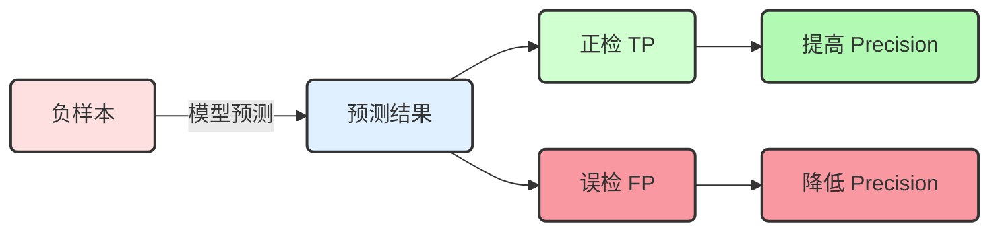
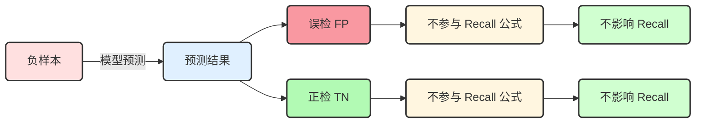
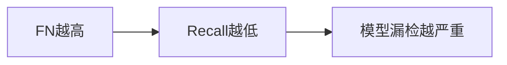
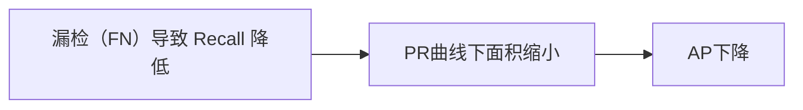
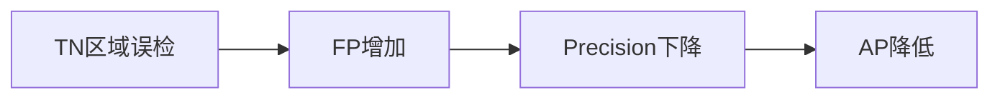


<center><b><font size=16>目标检测模型性能衡量指标、MS COCO 数据集的评价标准以及不同指标的选择推荐</font></b></center>

# 1. 引言

## 1.1. COCO 数据集评价指标

<div align=center>
	
</div>

目标检测模型通过 pycocotools 在验证集上会得到 COCO 的评价列表，具体参数的含义是什么呢？

## 1.2. 目标检测领域常用的公开数据集

1. [PASCAL VOC](http://host.robots.ox.ac.uk/pascal/VOC/)
2. [Microsoft COCO（MS COCO）](https://cocodataset.org/)

在 MS COCO 数据集出来之前，目标检测基本上用的是 PASCAL VOC 数据集，现在 MS COCO 非常流行。这两个数据集均有自己的评判标准。

## 1.3. MS COCO（Common Objects in Context，上下文中的常见对象）数据集简介

### 1.3.1. 介绍

MS COCO 数据集是一个可用于图像检测（Image Detection），语义分割（Semantic Segmentation）和图像标题生成（Image Captioning）的**大规模数据集**。它有超过 330K 张图像（其中 220K 张是有标注的图像），包含
+ 150 万个目标
+ 80 个目标类别（object categories：行人、汽车、大象等）
+ 91 种材料类别（stuff categoris：草、墙、天空等）
+ 每张图像包含五句图像的语句描述
+ 250, 000 个带关键点标注的行人

> MS COCO官网：https://cocodataset.org/#home

### 1.3.2. MS COCO 可以应用的任务

1. **目标检测（object detection）**：使用 bounding box 或者 object segmentation (也称为instance segmentation)将不同的目标进行标定。

2. **Densepose（密集姿势估计）**：DensePose 任务涉及同时检测人、分割他们的身体并将属于人体的所有图像像素映射到身体的3D表面。用于不可控条件下的密集人体姿态	估计。
   
	<div align=center>
		
   </div>
   
3. **Key-points detection（关键点检测）**：在任意姿态下对人物的关键点进行定位，该任务包含检测行人及定位到行人的关键点。
	
	<div align=center>
		
	</div>
	
4. **Stuff Segmentation（材料细分）**：语义分割中针对 stuff class 类的分割（草，墙壁，天空等）
	
	<div align=center>
		
	</div>
	
5. **Panoptic Segmentation（全景分割）**：其目的是生成丰富且完整的连贯场景分割，这是实现自主驾驶或增强现实等真实世界视觉系统的重要一步。
	
	<div align=center>
		
	</div>
	
6. **image captioning（图像标题生成）**：根据图像生成一段文字。
	
	<div align=center>
		
	</div>

### 1.3.3. COCO 的 80 个类别

<div align=center>
	
	
</div>

| 编号 | 英文名称 | 中文名称 | 编号 | 英文名称 | 中文名称 | 编号 | 英文名称 | 中文名称 |
| :--: | :-----------------: | :--------------: | :--: | :-----------------: | :--------------: | :--: | :-----------------: | :--------------: |
| 1 | person | 人 | 28 | boat | 船 | 55 | cup | 杯子 |
| 2 | bicycle | 自行车 | 29 | traffic light | 交通灯 | 56 | fork | 叉子 |
| 3 | car | 汽车 | 30 | fire hydrant | 消防栓 | 57 | knife | 刀 |
| 4 | motorcycle | 摩托车 | 31 | stop sign | 停车标志 | 58 | spoon | 勺子 |
| 5 | airplane | 飞机 | 32 | parking meter | 停车计时器 | 59 | bowl | 碗 |
| 6 | bus | 公共汽车 | 33 | bench | 长凳 | 60 | banana | 香蕉 |
| 7 | train | 火车 | 34 | bird | 鸟 | 61 | apple | 苹果 |
| 8 | truck | 卡车 | 35 | cat | 猫 | 62 | sandwich | 三明治 |
| 9 | boat | 船 | 36 | dog | 狗 | 63 | orange | 橙子 |
| 10 | traffic light | 交通灯 | 37 | horse | 马 | 64 | broccoli | 西兰花 |
| 11 | fire hydrant | 消防栓 | 38 | sheep | 羊 | 65 | carrot | 胡萝卜 |
| 12 | stop sign | 停车标志 | 39 | cow | 牛 | 66 | hot dog | 热狗 |
| 13 | parking meter | 停车计时器 | 40 | elephant | 大象 | 67 | pizza | 披萨 |
| 14 | bench | 长凳 | 41 | bear | 熊 | 68 | donut | 甜甜圈 |
| 15 | bird | 鸟 | 42 | zebra | 斑马 | 69 | cake | 蛋糕 |
| 16 | cat | 猫 | 43 | giraffe | 长颈鹿 | 70 | chair | 椅子 |
| 17 | dog | 狗 | 44 | backpack | 背包 | 71 | couch | 沙发 |
| 18 | horse | 马 | 45 | umbrella | 雨伞 | 72 | potted plant | 盆栽 |
| 19 | sheep | 羊 | 46 | handbag | 手提包 | 73 | bed | 床 |
| 20 | cow | 牛 | 47 | tie | 领带 | 74 | dining table | 餐桌 |
| 21 | elephant | 大象 | 48 | suitcase | 行李箱 | 75 | toilet | 厕所 |
| 22 | bear | 熊 | 49 | frisbee | 飞盘 | 76 | tv monitor | 电视监视器 |
| 23 | zebra | 斑马 | 50 | skis | 滑雪板 | 77 | laptop | 笔记本电脑 |
| 24 | giraffe | 长颈鹿 | 51 | snowboard | 单板滑雪 | 78 | mouse | 鼠标 |
| 25 | backpack | 背包 | 52 | sports ball | 运动球 | 79 | remote | 遥控器 |
| 26 | umbrella | 雨伞 | 53 | kite | 风筝 | 80 | keyboard | 键盘 |
| 27 | tie | 领带 | 54 | baseball bat | 棒球棍 ||||

# 2. 目标检测中常见的指标

<div align=center>
	
</div>

对于这样一张图片（其中，绿色为 GT，红色为预测框），那么怎样才能算检测正确呢？我们需要考虑下面三点内容：

1. IoU 大于指定阈值？
2. 类别是否正确？
3. confidence 大于指定阈值？


## 2.1. TP、FP、FN

### 2.1.1. 定义

+ TP（True Positive）：预测正确的预测框数量 [**IoU > 阈值**]（同一个 GT 只计算一次）
+ FP（False Positive）：检测到是同一个 GT 的多余预测框的数量 [**IoU < 阈值**]（或者是检测到同一个 GT 的多余预测框的数量）
+ FN（False Negative）：没有检测到 GT 的预测框数量 [**漏检的数量**]

> + 阈值根据任务进行调整，一般选择 0.5（在YOLO中，IoU阈值默认为0.60，置信度阈值默认为0.25）
> + FP 就是“假阳性”，就是模型**误认为**是 TP（误检）

### 2.1.2. 例子说明 TP、FP、FN

举个例子理解 TP、FP、FN：

<div align=center>
	
</div>

在训练阶段，对于张图片来说，<font color='green'>绿色</font> 为 GT，<font color='red'>红色</font> 为模型预测框，IoU 阈值设置为 0.5。
+ 【中间这只猫】在 <font color='green'>绿色框（GT）</font> 中的 <font color='red'>预测框（红色）</font> 和 <font color='green'>绿色框</font> 的 IoU 肯定是 >0.5 的，所以它应该是一个 TP（预测对了目标且 IoU > 阈值）；而对于  <font color='red'>偏左的预测框</font>  来说，它和 GT 的 IoU 肯定是不足 0.5 的，加之因为有 TP 的存在，所以它是 FP。
+ 【右下角的猫】GT 是有的，但模型并没有给出对应的预测框，因此模型对于这只猫来说，漏检了，故 FN 的数量为 1。

## 2.2. AP（Average Precision，平均精度）

### 2.2.1. Precision

$$
\mathrm{Precision = \frac{TP}{TP + FP}}
$$

**解释**：模型预测的所有目标（Object）中，预测正确的比例	-> ==查准率==

> 模型认为正确的目标 中 确实预测对了多少

那么仅仅通过 Precision 这个指标能不能全面衡量模型的检测能力呢？举个例子进行说明：

<div align=center>
	
</div>

> 同样的，绿色的为 Ground Truth，红色的为 预测框。

上面这张图片有 5 个目标，但是网络只针对猫 ① 给出了预测框（红色的），剩下的猫都没有检测出来。这里的 TP=1，FP=0。所以此时的 Precision 为：

$$
\begin{aligned}
\mathrm{Precision} & = \mathrm{\frac{TP}{TP+FP}} \\
				   & = \frac{1}{1 + 0} \\
				   & = 1\\
				   & = 100\%
\end{aligned}
$$

很明显对于这张图片网络漏检了 4 个目标，但 Precision 又显示结果是非常好的。因此我们就可以知道了，仅仅通过 Precision 无法评判检测网络的性能。为了解决这个问题，引入了另外一个指标 —— Recall。

### 2.2.2. Recall

$$
\mathrm{Recall = \frac{TP}{TP + FN}}
$$

**解释**：所有真实目标中，模型预测正确的比例	-> ==查全率==

> 本应该检测对的，模型检测对了多少

那么我们只使用 Recall 这个指标来判定模型的好坏吗？举个例子说明：

<div align=center>
	
</div>

这张图片和上一张图片类似，网络总共预测出了 50 个预测框（即 50 个目标）。这 50 个预测框中包括了所有要检测的目标，那么该网络针对这张图片的 Recall 为：

$$
\begin{aligned}
\mathrm{Recall} & = \mathrm{\frac{TP}{TP+FN}} \\
				& = \frac{1}{1 + 0} \\
				& = 1\\
				& = 100\%
\end{aligned}
$$

很明显，单单使用 Recall 无法评判模型的好坏。所以我们需要同时使用 Precision 和 Recall 这两个指标来进行网络性能的评判，即引入 —— AP。

### 2.2.3. AP —— P-R 曲线下面积

AP（Average Precision，平均精度）就是P-R曲线下方的面积，而 P-R 分别为 Precision 和 Recall。假设模型已经训练完毕，验证集为下面 3 张图片：

<div align=center>
	
</div>
#### 2.2.3.1. 第一张图片

<div align=center>
	
</div>

首先判断该图片中有几个目标（GT）？很明显绿色的框有两个，所以有两个 GT，即 

$$
\mathrm{num_{obj}} = 0 + 2 = 2。
$$

接下来同一个列表统计网络所检测到的目标信息：


|GT id|Confidence|Oobject (IoU=0.5)|
|:-:|:-:|:-:|
|<font color='orange'>1</font>|<font color='orange'>0.98</font>|<font color='orange'>True</font>|
|<font color='orange'>1</font>|<font color='orange'>0.61</font>|<font color='orange'>False</font>|

<kbd>Note</kbd>:

+ **GT id** 为 预测框匹配的 GT 的 id；**Confidence** 为预测框的置信度（是此类别的概率）；**Object** 为判断该预测框是否是 TP。
+ 该表从上到下的顺序是根据 **Confidence** 降序排列的
+ 对于 **GT id = 2**，网络并没有给出预测框，所以表中没有相关信息

#### 2.2.3.2. 第二张图片

<div align=center>
	
</div>

这张图片中目标的个数（绿色的框）有 1 个，所以累积目标个数：

$$
\mathrm{num_{obj}} = 2 + 1 = 3。
$$

表也需更新：


|GT id|Confidence|Object (IoU=0.5)|
|:-:|:-:|:-:|
|1|0.98|True|
|<font color='orange'>3</font>|<font color='orange'>0.89</font>|<font color='orange'>True</font>|
|<font color='orange'>3</font>|<font color='orange'>0.66</font>|<font color='orange'>False</font>|
|1|0.61|False|

#### 2.2.3.3. 第三张图片

<div align=center>
	
</div>

累积目标个数：

$$
\mathrm{num_{obj}} = 3 + 4 = 7。
$$

更新表：


|GT id|Confidence|Object(IoU=0.5)|
|:-:|:-:|:-:|
|1|0.98|True|
|3|0.89|True|
|<font color='orange'>6</font>|<font color='orange'>0.88</font>|<font color='orange'>True</font>|
|<font color='orange'>7</font>|<font color='orange'>0.78</font>|<font color='orange'>True</font>|
|3|0.66|False|
|1|0.61|False|
|<font color='orange'>4</font>|<font color='orange'>0.52</font>|<font color='orange'>True</font>|

#### 2.2.3.4. 计算 AP

得到表以后，我们计算针对不同 Confidence（即取不同 Confidence 阈值）得到的 Precision 和 Recall 的信息）。


|GT id|Confidence|Object (IoU=0.5)|
|:-:|:-:|:-:|
|1|0.98|True|
|3|0.89|True|
|6|0.88|True|
|7|0.78|True|
|3|0.66|False|
|1|0.61|False|
|4|0.52|True|

1. 首先将 Confidence 的阈值设置为 0.98（Confidence ≥ 0.98 的目标才算匹配正确），只有一个预测框符合条件（表中的第一行）。
	+ TP = 1; FP = 0; FN = 6
	> 💡在 Confidence≥0.98 的条件下，TP=1 没什么问题；FP=0 是因为阈值的存在；FN=6 是因为累积目标个数 num_ob=7，所以 $\mathrm{FN=num\_ob - TP} = 7 - 1 = 6$。因此我们可以得到$\mathrm{Precision = \frac{TP}{TP + FP} = \frac{1}{1+0}=1}$和$\mathrm{Recall = \frac{TP}{TP + FN} = \frac{1}{1+6}=0.14}$
	> <kbd>Note</kbd>：这个TP; FP; FN是看那个表，就不区分什么第几张图片了，看表就可以。

2. 将 Confidence 阈值设置为 0.89
	+ 此条件下，TP = 2; FP = 0; FN = num_ob - TP = 7 - 2 = 5，我们可以得到 Precision 和 Recall

3. ... 
4. 将 Confidence 阈值设置为 0.66
	+ 此条件下，TP=4; FP=1; FN=num_ob-TP=7-4=3，我们可以得到$\mathrm{Precision = \frac{TP}{TP + FP} = \frac{4}{4+1}=0.80}$和$\mathrm{Recall = \frac{TP}{TP + FN} = \frac{4}{4+3}=0.57}$
5. ... 

全部计算完毕后，结果如下表所示。


|Rank|Precision|Recall|
|:-:|:-:|:-:|
|1|1.0|0.14|
|2|1.0|0.28|
|3|1.0|0.42|
|4|1.0|0.57|
|5|0.80|0.57|
|6|0.66|0.57|
|7|0.71|0.71|

我们可以根据求得的一系列的 Precision 和 Recall 绘制 P-R 曲线。以 Recall 为横坐标，Precision 为纵坐标得到 P-R 曲线，如下图所示。

<div align=center>
	
</div>
**在绘制 P-R 曲线时需注意**：对于 Recall（横坐标）需要滤除一些重复数据（图中用框框住的即为参与计算的点，有两个点没有被框，它俩不参与 AP 的计算）。根据表中的数据可知，Recall=0.57 有 3 个值，此时需保留 Precision 最大的值，即：


|Rank|Precision|Recall|
|--|--|--|
|1|1.0|0.14|
|2|1.0|0.28|
|3|1.0|0.42|
|4|1.0|0.57|
|~~5~~|~~0.80~~ |~~0.57~~|
|~~6~~|~~0.66~~|~~0.57~~|
|7|0.71|0.71|

图中阴影部分的面积就是 AP，计算如下（重复的 Recall 已经滤除）：


|Rank|Precision|Recall|
|--|--|--|
|1|1.0|0.14|
|2|1.0|0.28|
|3|1.0|0.42|
|4|1.0|0.57|
|6|0.71|0.71|

$$
\begin{aligned}
\mathrm{Recall} & = \sum_{i=1}^{\mathrm{Rank}} (\mathrm{Recall}_i -\mathrm{Recall}_{i-1}) \times \max(\mathrm{Precision}_{ i, ..., \mathrm{Rank}}) \\
\mathrm{Recall} & = \sum_{i=本行}^{\mathrm{Rank}} (\mathrm{Recall}_{本行} -\mathrm{Recall}_{上一行}) \times 本行及以下最大的\mathrm{Precision}
\end{aligned}
$$

根据公式可以求得阴影的面积，即 AP 为：

$$
\begin{aligned}
\mathrm{Recall} & = (0.14 - 0) \times 1.0 + (0.28 - 0.14) \times 1.0 + (0.42 - 0.28) \times 1.0 + (0.57 - 0.42) \times 1.0 + (0.71 - 0.57) \times 0.71 \\
& = 0.6694
\end{aligned}
$$

了解完 AP 后我们就可以进一步得到一个新的指标 —— mAP。

## 2.3. mAP(mean Average Precision，即各类别 AP 的平均值)

mAP 就是各类别 AP 的平均值，计算公式如下：

$$
\mathrm{mAP = \frac{1}{nc}\sum^{nc}_{i=1}AP_i}
$$

其中 $nc$ 为类别数。

## 2.4. 注意事项

以上的 TP、FP、FN 都是经过 NMS 处理后得到的预测框。

# 3. MS COCO 评价指标中每条数据的含义

<div align=center>
	
</div>

**MS COCO 官网说明**：[https://cocodataset.org/#detection-eval](https://cocodataset.org/#detection-eval)

<div align=center>
	
</div>
<kbd>Note</kbd>：图片中虽然写的是 AP，但实际上表示的是 mAP。

## 3.1. Average Precision (AP)


1. $\mathrm{AP}$：MS COCO 的主要评价指标，设置的 IoU 阈值为 `IoU = range(0.5, 1.00, 0.05)` 共 10 个 IoU 的 mAP 的**均值**，计算公式如下：

$$
\mathrm{AP = \frac{1}{10}(mAP^{IoU=0.5} + mAP^{IoU=0.55} + mAP^{IoU=0.60} + mAP^{IoU=0.65} + mAP^{IoU=0.70}} \\ 
\mathrm{+ mAP^{IoU=0.75} + mAP^{IoU=0.80}mAP^{IoU=0.85} + mAP^{IoU=0.9} + mAP^{IoU=0.95})}
$$

2. $\mathrm{AP^{IoU}=0.50}$：将 IoU 阈值设置为 0.5 得到的 mAP 值（就是上面我们举的例子），这个取值也是 PASCAL VOC 的评价指标。

3. $\mathrm{AP^{IoU}=0.75}$：是更加严格的标准（因为 IoU 的阈值越大，说明网络预测框与 GT 重合度越来越高 -> 目标的定位越来越准，这对网络来说是很难的）。

## 3.2. Across Scales

1. **AP^small^**：<kbd>mAP 针对小目标</kbd> 若检测目标（GT）的像素面积小于 $32^2$，则将其归为小目标 ——衡量网络对于小目标的平均查准率
2. **AP^medium^**：<kbd>mAP 针对中目标</kbd> 若检测目标（GT）的像素面积在 $[32^2, 96^2]$ 之间，则将其归为中目标 ——衡量网络对于中等目标的平均查准率
3. **AP^large^**：<kbd>mAP 针对大目标</kbd> 若检测目标（GT）的像素面积大于 $96^2$，则将其归为大目标 ——衡量网络对于大目标的平均查准率

通过这三个指标可以看出该目标检测网络对于不同尺度目标的检测效果。如果我们的任务需要检测的目标都是较小的，我们应该更加关注与 $\mathrm{AP^{small}}$ 参数而不是 $\mathrm{AP^{large}}$。

## 3.3. Average Recall (AR)

对于目标检测网络，在代码部分会限制每张图片最终预测框的数量，这里的 max 就是这个数量。如 max=100，即每张图片最终预测 100 个预测框。而这里的 $\mathrm{AR^{max}=100}$ 就表示在每张图片预测框阈值为 100 的情况下，平均的查全率（Recall）是多少。

1. $\mathrm{AR^{max}=1}$：在每张图片预测框数量阈值为 1 的情况下，平均的查全率（Recall）是多少
2. $\mathrm{AR^{max}=10}$：在每张图片预测框数量阈值为 10 的情况下，平均的查全率（Recall）是多少
3. $\mathrm{AR^{max}=100}$：在每张图片预测框数量阈值为 100 的情况下，平均的查全率（Recall）是多少

<div align=center>
	
</div>

从上图可以看到，$\mathrm{AR^{max}=100}=64\%$，$\mathrm{AR^{max}=10}=63.3\%$，$\mathrm{AR^{max}=1}=45.2\%$。这说明 max 取 100 和取 10 相差不大，进一步说明了，模型训练时使用的数据集**每张图片**中目标（GT）的数目并不是很多，基本上在 10 左右；而当预测框数量限制在 1 时，它的 AR 仅为 45.2%，说明每张图片的目标个数一般是 >1 的。

## 3.4. AR Across Scales

与 AP、AP across scales 类似，AR across scales 表示对应**不同目标尺度的 AR**。

1. $\mathrm{AR^{small}}$：<kbd>AR 针对小目标</kbd> 若检测目标（GT）的像素面积小于 $32^2$，则将其归为小目标 ——衡量网络对于小目标的平均查全率（Recall）
2. $\mathrm{AR^{medium}}$：<kbd>AR 针对中目标</kbd> 若检测目标（GT）的像素面积在 $[32^2, 96^2]$ 之间，则将其归为中目标 ——衡量网络对于中等目标的平均查全率（Recall）
3. $\mathrm{AR^{large}}$：<kbd>AR 针对大目标</kbd> 若检测目标（GT）的像素面积大于 $96^2$，则将其归为大目标 ——衡量网络对于大目标的平均查全率（Recall）

# 4. 各种指标的选择 —— 基于不同的任务

不同的任务需要使用不同的指标。

<div align=center>
	
</div>
## 4.1. mAP

+ 于 PASCAL VOC 的 mAP 来说，$\mathrm{AP^{IoU}=0.50}$ 是要看的，因为它是 PASCAL VOC 的主要评价指标。
+ 对于 MS COCO 数据集来说，$\mathrm{AP}$（第一行，**10 个 mAP 的平均**）是要看的，因为它是 MS COCO 的主要评价指标。
+ 如果我们对 **目标框定位精度要求较高** 的话，我们可以关注 $\mathrm{AP^{IoU}=0.75}$
+ 如果我们对 **小目标检测要求比较高** 的话，我们可以关注 $\mathrm{AP^{small}}$，通过这个值可以了解网络对于小目标检测的平均查准率（整体情况）
+ 如果我们对 **中目标检测要求比较高** 的话，我们可以关注 $\mathrm{AP^{medium}}$
+ 如果我们对 **大目标检测要求比较高** 的话，我们可以关注 $\mathrm{AP^{large}}$

## 4.2. AR

主要关注下面两个指标：

1. $\mathrm{AR^{max}=10}$
2. $\mathrm{AR^{max}=100}$

如果它俩 **AR**（平均查全率）相差很小的话， 可以减少网络预测框的个数，从而提高目标检测的效率。

# 5. 负样本对指标的影响

在目标检测中，一张图片的标注信息（Ground Truth, GT）中**没有包含任何目标实例**，这种图片通常被称为：

1.  **背景图片**（background）
2.  **负样本图片**（negatives）

这类图片是否参与指标计算，取决于具体计算的是哪个指标，下面我们对不同指标进行分析。
$$
\mathrm{Precision = \frac{TP}{TP + FP}} \tag{1}
$$

$$
\mathrm{Recall = \frac{TP}{TP + FN}} \tag{2}
$$


## 5.1. 精确率 (Precision)

$\mathrm{Precision = \frac{TP}{TP + FP}}$，其分母（TP  + FP）是模型预测为某个类别的**所有检测框总数**。如果模型错误地预测了负样本，就会产生FP从而**增加 Precision 的分母**，进而导致 Precision 下降。因此，负样本**会间接影响 Precision**。



## 5.2. 召回率 (Recall)

$\mathrm{Recall = \frac{TP}{TP + FN}}$，其分母是某个类别的**所有 GT 实例总数**。负样本没有该类的 GT 实例，因此**不会增加 Recall 的分母**。所以模型在负样本上的预测（无论对错）**不会产生TP**。因此负样本**本身不直接影响 Recall 的计算**（不改变分母）。Recall 只关心在有 GT 实例的图片上，模型找出了多少真正的目标。




## 5.3. 平均精度 (Average Precision, AP) / Mean Average Precision (mAP)

 AP 的计算是针对**单个类别**进行的。计算过程如下：

1. 模型对该类别在所有图片（包括负样本）上产生的检测结果（边界框和置信度）进行排序。
2. 计算不同置信度阈值下的 Precision 和 Recall。

从上面对Precision和Recall的说明，我们可以知道，对于负样本而言：

*   如果模型<font color='red'><b>误检</b></font>了一个框（FP）：
	*   Precision由于分母变大，因此指标会下降。
	*   Recall由于分母不变，因此指标没有影响。
*   如果模型<font color='green'><b>正检</b></font>（即没有预测任何该类别的框）：对当前类别的 AP 计算**没有任何影响**（不产生 TP/FP/FN）。

综上所述，负样本本身不会贡献 GT 实例（不影响 Recall 分母），但模型在上面产生的**任何误检（FP）都会对该类别的 Precision 产生负面影响，从而影响最终的 AP/mAP。**

## 5.4. 平均召回率 (Average Recall, AR)

AR 的计算方式（尤其是在 COCO 评估中）通常是在不同的 IoU 阈值或每个 GT 实例的检测数量限制下计算 Recall，然后取平均。与 Recall 一样，AR 的分母也是 GT 实例的总数。因此负样本**不直接影响 AR 的计算**（不改变分母）。AR 也只关注在有 GT 实例的图片上模型召回目标的能力。

## 5.5. 📊总结：负样本在目标检测评估指标中的影响

|    指标类别     |    是否参与计算     | 说明                                                         |
| :-------------: | :-----------------: | ------------------------------------------------------------ |
|  **Precision**  |  参与（作为分母）   | Precision = TP / (TP + FP)，负样本上产生的 FP 会增加分母，从而直接<font color='red'><b>降低 Precision 分数</b></font>。 |
| **Recall / AR** |       不参与        | Recall 和平均召回率（AR）基于 TP / (TP + FN)，而负样本中没有 GT 实例，因此不会产生 TP 或 FN，<font color='green'><b>对 Recall 类指标无影响</b></font>。 |
|  **AP / mAP**   | 部分参与（通过 FP） | 负样本图片本身不包含 GT 实例，因此不会直接贡献 AP/mAP 的分母。但模型在其上的误检（FP）会影响 Precision 曲线，从而降低 AP/mAP 值。<font color='blue'><b>负样本是产生 FP 的主要来源之一</b></font>。 |

## 5.6. Tips

在标准的评估协议（如 PASCAL VOC 或MS COCO）中，负样本是**包含在测试集**中的。评估时，模型会在**所有**测试图片（包括负样本）上进行推理。忽略负样本会导致评估结果过于乐观，因为模型在容易产生误检的场景（即没有任何目标的场景）没有被测试到。包含它们对于评估模型区分目标和背景的能力（即降低FP）至关重要。**负样本上的假阳性是衡量模型鲁棒性的关键指标。**

# 6. FAQ

## 6.1. 🤔负样本在pycocotools中的GT需要转换吗？

在使用 pycocotools 计算目标检测指标时，**负样本（空标签）的处理至关重要**。GT对应的JSON文件中<font color='red'><b>必须包含负样本图片</b></font>，这是因为：

1. 所有测试集中的图片（包括负样本图片）都需要记录在 `.json` 文件中

2. 即使图片没有对应的 `.txt` 文件（或 `.txt` 文件为空），也需要在 JSON 中表示

关键点说明：

- 在 `images` 数组中包含所有图片（包括负样本）
- 在 `annotations` 数组中**只包含正样本图片的标注**
- **负样本图片在 `annotations` 中没有对应的标注条目**

JSON文件示例：
```json
{
  "images": [
    {
      "id": 0,
      "file_name": "image0.jpg",
      "width": 640,
      "height": 480
    },
    {
      "id": 1,
      "file_name": "negative_image.jpg",
      "width": 640,
      "height": 480
    }
  ],
  "annotations": [
    // 只包含正样本图片的标注
    {
      "id": 0,
      "image_id": 0,
      "category_id": 0,
      "bbox": [x,y,width,height],
      "area": ...,
      "iscrowd": 0
    }
  ],
  "categories": [
    {
      "id": 0,
      "name": "class_name"
    }
  ]
}
```

|   处理对象   | 是否包含负样本图片 |   JSON 中的位置    |      必要性      |
| :----------: | :----------------: | :----------------: | :--------------: |
| **GT 标注**  |         ✓          |   `images` 数组    |     **必须**     |
|              |         ✗          | `annotations` 数组 |  不添加任何标注  |
| **预测结果** |         ✓          |      预测列表      | 仅当有预测时添加 |

**务必包含负样本图片**在 GT JSON 的 `images` 数组中，但不在 `annotations` 中添加任何标注。这样 pycocotools 才能：

1. 正确计算 Precision/AP（惩罚在负样本上的误检）
2. 保持 Recall/AR 不受影响
3. 获得真实反映模型性能的指标

## 6.2. 🤔模型预测结果必须包含置信度吗？

在目标检测中使用 pycocotools 计算指标时，**模型预测结果必须包含置信度（confidence score）**。没有置信度就无法正确计算 AP、AR 等核心指标。原因如下：

1. **排序需求**：
   - 计算 AP 需要绘制 Precision-Recall 曲线（P-R曲线）
   - 绘制 PR 曲线需要将预测结果按置信度**从高到低排序**
   - 没有置信度就无法确定预测结果的排序顺序

2. **阈值变化**：
   - 评估过程需要动态调整置信度阈值
   - 在不同阈值下计算 Precision 和 Recall
   - 没有置信度就无法实现这一过程

3. **匹配优先级**：
   - 当多个预测框匹配同一个 GT 时
   - 高置信度的预测框优先匹配
   - 没有置信度就无法确定匹配优先级

4. 预测结果 JSON 格式要求：pycocotools 要求每个预测结果必须包含以下字段：

```json
[
  {
    "image_id": int,     // 图片ID
    "category_id": int,  // 类别ID
    "bbox": [x,y,w,h],   // 边界框（绝对坐标）
    "score": float       // 置信度（0-1之间）
  },
  // ...其他预测
]
```

| 情况                                       | 能否计算指标       | 解决方案       |
| ------------------------------------------ | ------------------ | -------------- |
| <font color='green'><b>有置信度</b></font> | ✓ 可以计算所有指标 | 直接使用       |
| <font color='red'><b>无置信度</b></font>   | ✗ **无法计算 AP**  | 必须添加置信度 |

## 6.3. 🤔在指标计算中，FN参与计算了吗？在真实业务场景中，FN意味着什么？

在目标检测指标计算中，**假阴性（False Negative, FN）是核心评估要素，直接参与关键指标的计算**。其在业务场景中的意义往往比假阳性（FP）更严重。以下是详细解析。
$$
\mathrm{Recall = \frac{TP}{TP + FN}} \tag{2}
$$



### 6.3.1. AP（Average Precision）

AP 是不同 Recall 点下 Precision 的平均值，**FN 通过降低 Recall 影响 AP**：  



### 6.3.2. AR（Average Recall）

AR 计算在不同 IoU 阈值下的平均召回率，**FN 是 AR 的分母核心**。
$$
\mathrm{AR} = \frac{1}{\abs{\mathrm{IoU_{thresholds}}}}\sum\frac{\mathrm{TP}}{\mathrm{TP + FN}}
$$

---

### 6.3.3. FN 与 FP 的业务代价对比

| **指标** |     业务含义      |          典型代价          |    优化方向    |
| :------: | :---------------: | :------------------------: | :------------: |
|  **FN**  | 漏检真实威胁/目标 | **高代价** (安全/生命损失) | 提高模型灵敏度 |
|  **FP**  | 误报背景/安全对象 |  **中低代价** (效率损失)   | 提高模型特异性 |

**关键结论**：  在安全敏感领域（医疗/自动驾驶/安防），**FN 的代价通常远高于 FP**。例如特斯拉 Autopilot 的「幽灵刹车」（FP）代价是用户体验下降，而「漏检行人」（FN）代价是致命事故。

在关键场景中，**宁可接受更多FP（误报）也要将FN压到接近零**，这是目标检测系统的生存法则。

## 6.4. 🤔在指标计算中，TN参与计算了吗？在真实业务场景中，TN意味着什么？

在视频监控领域的目标检测任务中，**真阴性（True Negative, TN）是一个需要特别理解的概念**。与分类任务不同，目标检测中的 TN 定义更为复杂，但在监控场景中具有关键业务意义。

### 6.4.1. 目标检测中 TN 的特殊性

在目标检测领域，==TN 没有标准的计算方式==，这是因为：

1. **空间维度无限性**：图像中每个非目标区域理论上都是潜在 TN，但无法穷尽统计
2. **评估协议设计**：主流指标（AP/mAP）聚焦于目标出现的区域（正样本）的检测质量

**技术定义**：TN = 模型在**没有目标的区域**且**没有产生任何检测框**的位置

#### 6.4.1.1. **空间无限性挑战**

   - 在图像中，**每个非目标像素**理论上都是潜在TN
   - 但无法穷举统计所有"非目标位置"，因为：
	- 图像空间是连续的（无限潜在位置）
	- 非目标区域远大于目标区域（>99.9%像素）

#### 6.4.1.2. **评估协议设计**

   目标检测指标聚焦于：

   - **目标出现的位置**（GT框区域）
   - **模型预测的位置**（检测框）
   - **两者的交互关系**（IoU匹配）

### 6.4.2. TN 在标准指标中的参与方式

#### 6.4.2.1. **Precision（精确率）**

$$
\mathrm{Precision = \frac{TP}{TP + FP}}
$$

- TN不直接参与计算
- 但**FP（假阳性）本质是TN区域的误判**，即FP = 模型在TN区域生成的错误检测框数量
- **间接参与**：FP的分母效应体现TN区域的质量

#### 6.4.2.2. **Recall（召回率）**

$$
\mathrm{Recall = \frac{TP}{TP + FN}}
$$

TN完全不参与（Recall只关注正样本区域）。

#### 6.4.2.3. **AP（Average Precision）**

$$
\mathrm{AP = Precision和Recall曲线围成的面积}
$$


TN影响路径：



#### 6.4.2.4. **AR（Average Recall）**

完全不受TN影响（仅依赖正样本）

### 6.4.3. 视频监控领域的 TN 业务价值

在监控场景中，TN 代表 **系统正确保持静默的时刻**，其价值体现在：

#### 6.4.3.1. 运维效率提升

   - **典型场景**：城市级监控系统每天产生数亿帧图像
   - **TN 价值**： 
     
     ```python
     # 计算每日无效告警减少量
     daily_fp = 10e6 * fppi  # 假设1000万帧，fppi=每帧误报数
     saved_manhours = daily_fp * 0.1  # 每次误警平均耗时6分钟核查
     ```
     **结果**：当 FPPI（每帧误报数）从 0.5 降到 0.1 → 每日节省 **4000人时**

#### 6.4.3.2. 系统可信度建立

   - **用户心理模型**：  
     $$
     \mathrm{可信度 = \frac{TN次数}{TN次数+FP次数(误报)}}
     $$
     
   - **临界点**：  
     
     - 可信度 < 90% → 保安开始忽略告警
     - 可信度 > 99% → 形成操作员条件反射

### 6.4.4. 三、pycocotools 如何处理 TN

pycocotools **不直接统计TN**，而是通过以下机制间接处理：

#### 6.4.4.1. **FP 作为 TN 的代理指标**

   ```python
   # pycocotools 源码核心逻辑 (cocoeval.py)
   for img_id in image_ids:
       # 获取该图片所有GT框
       gt_anns = self._gts[img_id, cat_id]  
       
       # 获取该图片所有预测框 (按置信度排序)
       dt_anns = self._dts[img_id, cat_id]
       
       # 匹配预测框与GT框 (基于IoU)
       matched = set()
       for d_idx, dt in enumerate(dt_anns):
           matched_gt = None
           for g_idx, gt in enumerate(gt_anns):
               iou = calc_iou(dt['bbox'], gt['bbox'])
               if iou > iou_thresh:
                   matched_gt = g_idx
                   break
                   
           if matched_gt is not None:
               # 记录为TP (真阳性)
               tp[d_idx] = 1  
               matched.add(matched_gt)
           else:
               # 记录为FP (假阳性) → 本质是TN区域的误判!
               fp[d_idx] = 1  
   ```
**关键点**：所有未匹配GT的预测都被标记为FP → 这些FP发生在**本应是TN的区域**

#### 6.4.4.2. **负样本图片的特殊处理**

对于GT完全为空的图片（纯TN区域）：
- 该图片所有预测都被记为FP
- 通过`images`数组包含这些图片确保FP被统计

   ```python
   # 在evaluate()中会处理所有图片
   self.evalImgs = [self.evaluateImg(imgId, catId) 
                    for imgId in p.imgIds
                    for catId in catIds]  # 包含空GT图片
   ```

#### 6.4.4.3. **输出指标中的TN痕迹**
 虽然不直接输出TN，但以下指标反映TN质量：
| 输出指标   | 含义                  | 与TN的关系               |
| ---------- | --------------------- | ------------------------ |
| `stats[1]` | 平均每图FP数量 (FPPI) | **直接衡量TN区域误检率** |
| `stats[2]` | 所有图片的FP总数      | TN区域总误检量           |

### 6.4.5. 四、为什么标准工具不直接统计TN

#### 6.4.5.1. **技术不可行性**
   - 统计真实TN需要标注所有"无目标"区域 → 标注成本无限大
   - 示例：1080P图像有200万像素，每个像素都可视为潜在TN

#### 6.4.5.2. **评估效率考量**

COCO数据集的评估速度对比：

| 方法       | 计算复杂度    | 1万张图耗时 |
| ---------- | ------------- | ----------- |
| 标准AP计算 | $O(N\log{N})$ | 3秒         |
| 全图TN统计 | $O(像素数×N)$ | >24小时     |

#### 6.4.5.3. **业务意义不足**
   - 在安防监控中，关注重点依次为：
     ```mermaid
     pie title "监控系统关键指标优先级"
         "漏检真实威胁 (FN)" : 45
         "背景误报 (FP)" : 35
         "静态区域正确静默 (TN)" : 20
     ```

### 6.4.6. 结论

在目标检测领域，**TN不直接参与Precision/Recall/AP/AR的计算**，但通过FP指标间接体现其价值。

# 7. 参考

1. [目标检测mAP计算以及coco评价标准](https://www.bilibili.com/video/BV1ez4y1X7g2)
2. [COCO数据集介绍](https://blog.csdn.net/qq_44554428/article/details/122597358)
