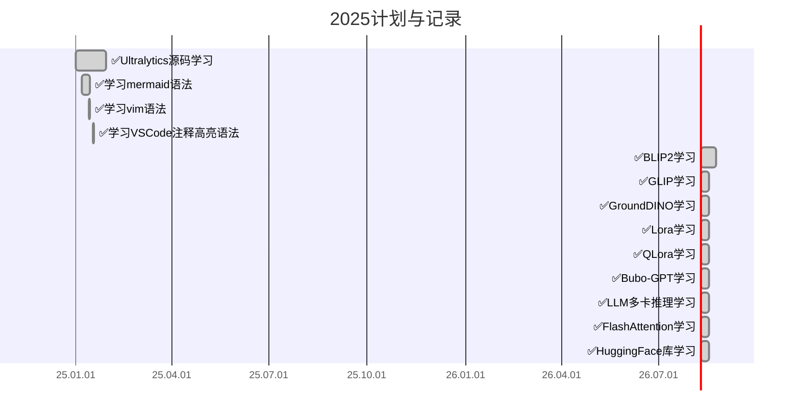
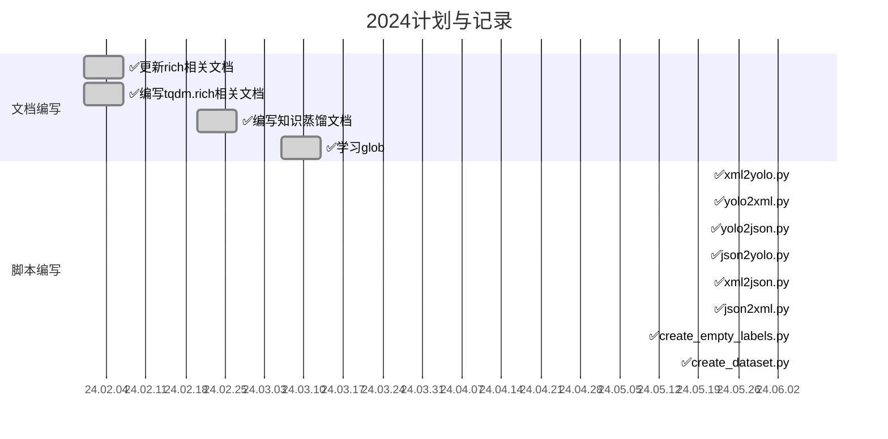

# 📚 KnowledgeHub 知识库

> 这个仓库存放了我日常的学习笔记，欢迎大家来访！如果你有疑问请 [联系我](#联系我) 😊 如果对你有帮助，请 ⭐ 一下

## 📋 目录导航

<strong>点击展开目录</strong>

- [1. 计划与完成情况](#1-计划与完成情况)
  - [1.1. 2025](#11-2025)
  - [1.2. 2024](#12-2024)
- [2. 简介](#2-简介)
- [3. 仓库结构](#3-仓库结构)
  - [3.1. Writing 与写作相关](#31-writing--与写作相关的)
  - [3.2. Dataset 数据集](#32-dataset-数据集)
  - [3.3. Linux Linux相关](#33-linux--linux-相关)
  - [3.4. ObjectDetection 目标检测](#34-objectdetection--目标检测相关)
  - [3.5. Python Python相关](#35-python--python-相关)
  - [3.6. PyTorch PyTorch相关](#36-pytorch--pytorch-相关)
  - [3.7. SemanticSegmentation 语义分割](#37-semanticsegmentation--语义分割相关)
  - [3.8. Windows Windows相关](#38-windows--windows-相关)
  - [3.9. ONNX ONNX相关](#39-onnx--onnx-相关)
  - [3.10. Classification 分类Backbone](#310-classification--分类backbone相关)
- [4. 其他说明](#4-其他说明)
- [5. 联系我](#5-联系我)

## 1. 计划与完成情况

### 1.1. 2025

### 1.2. 2024

## 2. 简介

这个仓库存放了日常的学习笔记，内容涵盖：

- 🤖 深度学习框架 (PyTorch)
- 👁️ 计算机视觉 (目标检测、语义分割、图像分类)
- 🐍 Python 编程技巧
- 🐧 Linux 系统操作
- 🪟 Windows 使用技巧
- 📦 模型部署 (ONNX)

更多内容请见：
- 📖 [CSDN 博客-Le0v1n](https://blog.csdn.net/weixin_44878336)：这里有很多有趣的内容
- 🎬 [Bilibili 视频-L0o0v1N](https://space.bilibili.com/13187602)：这里有视频版内容

## 3. 仓库结构

### 3.1. Writing → 与写作相关的

<strong>点击展开详细内容</strong>

1. [LaTex公式常用语法.md](./LaTex-and-Markdown/LaTex公式常用语法.md)：LaTex 公式相关命令
2. [Markdown常用语法.md](./LaTex-and-Markdown/Markdown常用语法.md)：Markdown 相关命令
3. [Office/Office.md](./Writing/Office/Office.md)：Office 技巧 | [📚对应博客](https://blog.csdn.net/weixin_44878336/article/details/133986172)
4. [Office/论文模板.docx](./Writing/Office/论文模板.docx)：大论文模板
5. [计算机视觉领域(CV)论文中"圈加"、"圈乘"和"点乘"的解释以及代码示例.md](./Writing/计算机视觉领域(CV)论文中"圈加"、"圈乘"和"点乘"的解释以及代码示例.md)：⊕、⊙、⊗ 的解释 | [📚对应博客](https://blog.csdn.net/weixin_44878336/article/details/124501040)

### 3.2. Dataset → 数据集

<strong>点击展开详细内容</strong>

1. [📂VOCdevkit](./Datasets/VOCdevkit)：Lite 版 VOC 2012 | [📚对应博客](https://blog.csdn.net/weixin_44878336/article/details/124540069)
2. [📂Web](./Datasets/Web)：用于 ONNX 推理测试的数据集
3. [📂coco128](./Datasets/coco128)：修改后的 COCO 128 数据集
4. [📂imagenet_classes_indices.csv](./Datasets/imagenet_classes_indices.csv)：ImageNet 数据集 1000 个类别的中英文翻译

### 3.3. Linux → Linux相关

<strong>点击展开详细内容</strong>

1. [配置Anaconda.md](./Linux/配置Anaconda.md)：Linux 中下载、安装、配置 Anaconda | [📚对应博客](https://blog.csdn.net/weixin_44878336/article/details/133967607)
2. [Linux常用命令.md](./Linux/Linux常用命令.md)：Linux 常用命令
3. [📂shell](./Linux/shell)：shell脚本基础语法 | [📚对应博客](https://blog.csdn.net/weixin_44878336/article/details/136059003)
4. [📂Git](./Linux/Git)：Git 教程
   - [Part1]Git基础教程 | [📚对应博客](https://blog.csdn.net/weixin_44878336/article/details/122470219)
   - [Part2]Git进阶教程：分支 | [📚对应博客](https://blog.csdn.net/weixin_44878336/article/details/122481847)
   - [Part3]Git实战教程：本地仓库、远程仓库 | [📚对应博客](https://blog.csdn.net/weixin_44878336/article/details/122484071)

### 3.4. ObjectDetection → 目标检测相关

<strong>点击展开详细内容</strong>

#### YOLOv5
1. [📂YOLOv5](./ObjectDetection/YOLOv5/)：YOLOv5 相关内容
2. [YOLOv5-参数说明.md](./ObjectDetection/YOLOv5/YOLOv5-参数说明.md)
3. [YOLOv5-模型转换.md](./ObjectDetection/YOLOv5/YOLOv5-模型转换.md)
4. [YOLOv5-理论部分.md](./ObjectDetection/YOLOv5/YOLOv5-理论部分.md) | [📚对应博客](https://blog.csdn.net/weixin_44878336/article/details/133901265)
5. [YOLOv5-训练自己的VOC格式数据集.md](./ObjectDetection/YOLOv5/YOLOv5-训练自己的VOC格式数据集.md) | [📚对应博客](https://blog.csdn.net/weixin_44878336/article/details/133915488)
6. [YOLOv5：原理+源码分析 Part1](./ObjectDetection/YOLOv5/Part1YOLOv5：原理+源码分析.md) | [📚对应博客](https://blog.csdn.net/weixin_44878336/article/details/136025658)
7. [YOLOv5：原理+源码分析 Part2](./ObjectDetection/YOLOv5/Part2YOLOv5：原理+源码分析.md) | [📚对应博客](https://blog.csdn.net/weixin_44878336/article/details/136207890)
8. [YOLOv5：原理+源码分析 Part3](./ObjectDetection/YOLOv5/Part3YOLOv5：原理+源码分析.md)

#### YOLOv8
1. [📂YOLOv8](./ObjectDetection/YOLOv8)：YOLOv8相关内容
2. [YOLOv8初学者手册.md](./ObjectDetection/YOLOv8/YOLOv8初学者手册.md)

#### 其他
- [目标检测模型性能衡量指标、MS COCO数据集的评价标准以及不同指标的选择推荐.md](./ObjectDetection/目标检测模型性能衡量指标、MS%20COCO数据集的评价标准以及不同指标的选择推荐.md) | [📚对应博客](https://blog.csdn.net/weixin_44878336/article/details/124650328)

### 3.5. Python → Python相关

<strong>点击展开详细内容</strong>

1. [📂Registry](./Python/Registry)：Python注册机制 | [📚对应博客](https://blog.csdn.net/weixin_44878336/article/details/133887655)
2. [📂Rich-美化](./Python/Rich-美化)：Rich库的相关内容
3. [📂resolve_import_methods](./Python/resolve_import_methods)：Python import 问题解决
4. [logging.md](./Python/logging.md)：Python 日志 | [📚对应博客](https://blog.csdn.net/weixin_44878336/article/details/133868928)
5. [配置JupyterNotebook.md](./Python/配置JupyterNotebook.md)
6. [requirements.txt](./Python/requirements.txt)：Python 第三方库集合
7. [Matplotlib.md](./Python/Matplotlib.md)
8. [RGB 颜色大全](./Python/color_list.md) | [📚对应博客](https://blog.csdn.net/weixin_44878336/article/details/135003274)
9. [labelImg 修改不同类别的颜色](./Python/labelImg修改不同类别的颜色.md) | [📚对应博客](https://blog.csdn.net/weixin_44878336/article/details/135002957)
10. [如何在VSCode中带有参数的Debug.md](./Python/如何在VSCode中带有参数的Debug.md) | [📚对应博客](https://blog.csdn.net/weixin_44878336/article/details/136252019)
11. [Python中的os模块和sys模块](./Python/Python中的os模块和sys模块.md) | [📚对应博客](https://blog.csdn.net/weixin_44878336/article/details/124625088)
12. [Python中的pathlib和Path](./Python/Python中的pathlib和Path.md) | [📚对应博客](https://blog.csdn.net/weixin_44878336/article/details/139494419)
13. [argparse常用语法解析与示例代码](./Python/argparse/argparse.md) | [📚对应博客](https://blog.csdn.net/weixin_44878336/article/details/140094639)

### 3.6. PyTorch → PyTorch相关

<strong>点击展开详细内容</strong>

1. [mmcv_Registry.md](./PyTorch/mmcv_Registry)：MMCV 的注册机制
2. [PyTorch的hook函数.md](./PyTorch/PyTorch的hook函数.md) | [📚对应博客](https://blog.csdn.net/weixin_44878336/article/details/133859089)
3. [AMP训练.md](./PyTorch/AMP训练.md) | [📚对应博客](https://blog.csdn.net/weixin_44878336/article/details/136071842)

### 3.7. SemanticSegmentation → 语义分割相关

<strong>点击展开详细内容</strong>

- [PP-LiteSeg.md](./SemanticSegmentation/PP-LiteSeg.md)：PP-LiteSeg（百度飞桨）| [📚对应博客](https://blog.csdn.net/weixin_44878336/article/details/132211283) | 🎥对应视频：[1.理论](https://www.bilibili.com/video/BV1Xr4y1d7Y2)；[2.代码](https://www.bilibili.com/video/BV18p4y1P7dG)

### 3.8. Windows → Windows相关

<strong>点击展开详细内容</strong>

1. [KMS.md](./Windows/KMS.md)：KMS 主机配置 | [📚对应博客](https://blog.csdn.net/weixin_44878336/article/details/133934093)
2. [WSL2.md](./Windows/WSL2.md)：WSL2 的安装 | [📚对应博客](https://blog.csdn.net/weixin_44878336/article/details/133967607)
3. [自用软件 + VSCode插件集合](./Windows/自用软件%20+%20VSCode插件集合（持续更新...）.md) | [📚对应博客](https://blog.csdn.net/weixin_44878336/article/details/133272093)

### 3.9. ONNX → ONNX相关

<strong>点击展开详细内容</strong>

1. [onnx基础.md](./ONNX/onnx基础.md) | [📚对应博客](https://blog.csdn.net/weixin_44878336/article/details/135820896)
2. [PyTorch2ONNX-分类模型.md](./ONNX/PyTorch2ONNX-分类模型.md) | [📚对应博客](https://blog.csdn.net/weixin_44878336/article/details/135915692)
3. [📂code](./ONNX/code)：存放相关代码

### 3.10. Classification → 分类(Backbone)相关

<strong>点击展开详细内容</strong>

- [MnasNet.md](./Classification/MnasNet.md)：MnasNet 介绍 | [📚对应博客](https://blog.csdn.net/weixin_44878336/article/details/124449479)

### 3.11. LargeModel → 大模型相关

<strong>点击展开详细内容</strong>

- [📂nanobot](./LargeModel/nanobot/nanobot)：nanobot 相关内容
- [📂projects](./LargeModel/nanobot/projects)：项目相关

### 3.12. 常用配置文件

<strong>点击展开详细内容</strong>

1. [PotPlayerMini64.reg](./常用配置文件/PotPlayerMini64.reg)：PotPlayer 配置文件
2. [JPEGView.ini](./常用配置文件/JPEGView.ini)：JPEGView 配置文件
3. [KeyMap.txt.default](./常用配置文件/KeyMap.txt.default)：JPEGView 键盘映射
4. [搜狗输入法-PhraseEdit.txt](./常用配置文件/搜狗输入法-PhraseEdit.txt)：搜狗输入法自定义短语

## 4. 其他说明

1. 因为 Github 仓库有最大容量限制，所以部分文章的图片引用来自 [我的 CSDN 博客](https://blog.csdn.net/weixin_44878336)。
2. 如果文章有问题（语法、链接错误、文字、版权等），请 [联系我](#联系我)。

---

## 5. 联系我 

| 联系方式 | 链接 |
|---------|------|
| 📧 发邮件 | [zjkljd@163.com](mailto:zjkljd@163.com) |
| 💬 CSDN私信 | [Le0v1n](https://blog.csdn.net/weixin_44878336) |
| ❓ 新建Issue | [GitHub Issues](https://github.com/Le0v1n/KnowledgeHub/issues/new/choose) |

---

⭐ Star me if you find this helpful!

