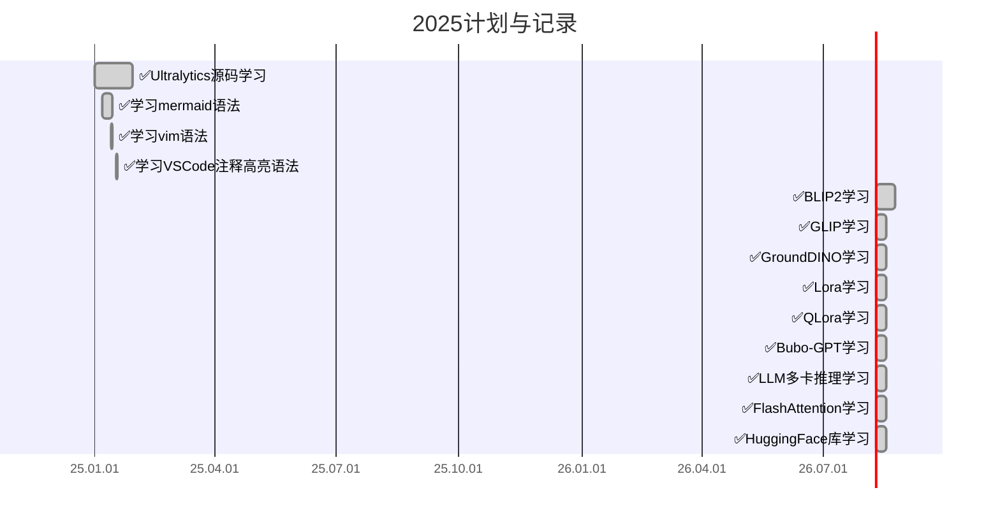
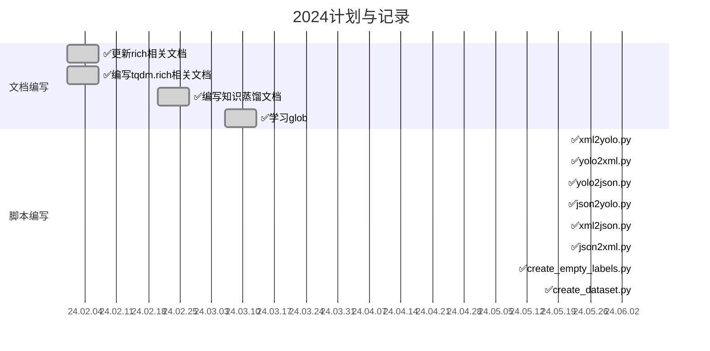

# 📚 KnowledgeHub 知识库

> 这个仓库存放了日常的学习笔记，欢迎大家来访！如果你有疑问请 [联系我](#5-联系我) 😊 如果对你有帮助，请 ⭐ 一下

## 📋 目录导航

<strong>点击展开目录</strong>

- [1. 计划与完成情况](#1-计划与完成情况)
- [2. 简介](#2-简介)
- [3. 仓库结构](#3-仓库结构)
- [4. 其他说明](#4-其他说明)
- [5. 联系我](#5-联系我)

## 1. 计划与完成情况

### 📅 2025

### 📅 2024

## 2. 简介

这个仓库存放了日常的学习笔记，内容涵盖：

| 领域 | 内容 |
|------|------|
| 🤖 大模型 | LangChain、RAG、Prompt工程、Transformer |
| 👁️ 计算机视觉 | 目标检测、语义分割、图像分类、人脸识别、人体姿态估计 |
| 🧠 深度学习 | PyTorch、模型部署、模型量化 |
| 🐍 Python 编程 | 编程技巧、常用库 |
| 🐧 Linux 系统 | Shell脚本、Git |
| 📦 模型部署 | ONNX、模型转换 |

更多内容请见：
- 📖 [CSDN 博客-Le0v1n](https://blog.csdn.net/weixin_44878336)：这里有很多有趣的内容
- 🎬 [Bilibili 视频-L0o0v1N](https://space.bilibili.com/13187602)：这里有视频版内容

## 3. 仓库结构

### 3.1. LargeModel → 大模型相关

<strong>点击展开详细内容</strong>

- [📂nanobot](./LargeModel/nanobot/nanobot)：nanobot 相关内容
- [📂RAG](./LargeModel/RAG)：RAG 学习笔记
- [📂Transformer](./LargeModel/Transformer)：Transformer 相关内容
- [📂code](./LargeModel/code)：代码实现
- [📂CLI](./LargeModel/CLI)：命令行工具
- [📂CLIP](./LargeModel/CLIP)：CLIP 模型相关

### 3.2. ObjectDetection → 目标检测相关

<strong>点击展开详细内容</strong>

- [📂YOLOv5](./ObjectDetection/YOLOv5/)：YOLOv5 相关内容
- [📂YOLO-World](./ObjectDetection/YOLO-World)：YOLO-World
- [📂DETR](./ObjectDetection/DETR)：DETR 相关
- [📂Ultralytics](./ObjectDetection/Ultralytics)：Ultralytics 源码学习
- [📂Metrics](./ObjectDetection/Metrics)：评价指标

### 3.3. SemanticSegmentation → 语义分割相关

<strong>点击展开详细内容</strong>

- [📂Fast-SCNN](./SemanticSegmentation/Fast-SCNN)：Fast-SCNN 相关内容

### 3.4. Classification → 图像分类相关

<strong>点击展开详细内容</strong>

- [📂ViT](./Classification/ViT)：Vision Transformer 相关

### 3.5. CLIP → CLIP模型

<strong>点击展开详细内容</strong>

- [📂clip](./CLIP/clip)：CLIP 模型代码
- [📂notebooks](./CLIP/notebooks)：Jupyter notebooks

### 3.6. FaceRecognition → 人脸识别

<strong>点击展开详细内容</strong>

- 人脸识别相关学习笔记

### 3.7. HumanPoseEstimation → 人体姿态估计

<strong>点击展开详细内容</strong>

- 人体姿态估计相关学习笔记

### 3.8. Papers → 论文阅读

<strong>点击展开详细内容</strong>

- 论文阅读笔记

### 3.9. Quantization → 模型量化

<strong>点击展开详细内容</strong>

- 模型量化相关学习内容

### 3.10. PyTorch → PyTorch相关

<strong>点击展开详细内容</strong>

- PyTorch 相关学习笔记
- [如何精确统计模型推理时间](./PyTorch/如何精确统计模型推理时间)

### 3.11. Python → Python相关

<strong>点击展开详细内容</strong>

- [📂Registry](./Python/Registry)：Python注册机制
- [📂Rich-美化](./Python/Rich-美化)：Rich库相关内容
- [📂resolve_import_methods](./Python/resolve_import_methods)：import 问题解决
- [📂多线程与多进程](./Python/多线程与多进程)
- [📂正则表达式](./Python/正则表达式)
- [📂code](./Python/code)：代码实现

### 3.12. ONNX → ONNX相关

<strong>点击展开详细内容</strong>

- [📂code](./ONNX/code)：ONNX 相关代码

### 3.13. Linux → Linux相关

<strong>点击展开详细内容</strong>

- [📂shell](./Linux/shell)：Shell 脚本
- [📂Git](./Linux/Git)：Git 教程

### 3.14. Windows → Windows相关

<strong>点击展开详细内容</strong>

- Windows 使用技巧

### 3.15. Writing → 与写作相关的

<strong>点击展开详细内容</strong>

- [📂Office](./Writing/Office)：Office 技巧
- [📂code](./Writing/code)：写作相关代码

### 3.16. Datasets → 数据集

<strong>点击展开详细内容</strong>

- [📂VOCdevkit](./Datasets/VOCdevkit)：VOC 数据集
- [📂coco128](./Datasets/coco128)：COCO 128 数据集
- [📂Web](./Datasets/Web)：Web 数据集

### 3.17. Configs → 配置文件

<strong>点击展开详细内容</strong>

- [📂Typora Themes](./Configs/Typora Themes)：Typora 主题
- 各类配置文件

### 3.18. utils → 工具函数

<strong>点击展开详细内容</strong>

- [📂dataset](./utils/dataset)：数据集处理工具
- [📂data_processing](./utils/data_processing)：数据处理工具
- [📂onnx](./utils/onnx)：ONNX 工具
- [📂pdf](./utils/pdf)：PDF 工具

### 3.19. scirpts → 脚本工具

<strong>点击展开详细内容</strong>

- [📂data_process](./scirpts/data_process)：数据处理脚本

---

## 4. 其他说明

1. 因为 Github 仓库有最大容量限制，所以部分文章的图片引用来自 [我的 CSDN 博客](https://blog.csdn.net/weixin_44878336)。
2. 如果文章有问题（语法、链接错误、文字、版权等），请 [联系我](#5-联系我)。

---

## 5. 联系我

| 联系方式 | 链接 |
|---------|------|
| 📧 发邮件 | [zjkljd@163.com](mailto:zjkljd@163.com) |
| 💬 CSDN私信 | [Le0v1n](https://blog.csdn.net/weixin_44878336) |
| ❓ 新建Issue | [GitHub Issues](https://github.com/Le0v1n/KnowledgeHub/issues/new/choose) |

---

⭐ Star me if you find this helpful!

